Statistical analysis allows us to derive valuable insights from the data at hand. A sound grasp of the important statistical concepts and techniques is absolutely essential to analyze the data using various tools. This article deals with some fundamental statistical concepts that every data science enthusiast must know. Code snippets in python have also been included, wherever required, for better understanding.

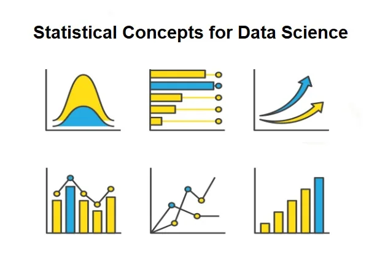

Before we go into the details, let’s take a look at the topics covered in this article:

- *Descriptive vs. Inferential Statistics*
- *Data Types*
- *Probability & Bayes’ Theorem*
- *Measures of Central Tendency*
- *Measures of Dispersion*
- *Covariance*
- *Correlation*
- *Probability Distributions*
- *Normal Distribution*
- Log-Normal *Distribution*

**Descriptive vs. Inferential Statistics**
Statistics as a whole deal with the collection, organization, analysis, interpretation, and presentation of data. Within statistics, there are two main branches:

1. **Descriptive Statistics:**This involves describing the features of the data, organizing and presenting the data either visually through charts/graphs or through numerical calculations using measures of central tendency, variability, and distribution. One noteworthy point is that conclusions are drawn based on already known data.
2. **Inferential Statistics**: This involves drawing inferences and making generalizations about larger populations using samples taken from them. Hence, more complex calculations are required. The final results are produced using techniques like hypothesis testing, correlation, and regression analysis. Predicted future outcomes and conclusions drawn go beyond the level of available data.

**Data Types**

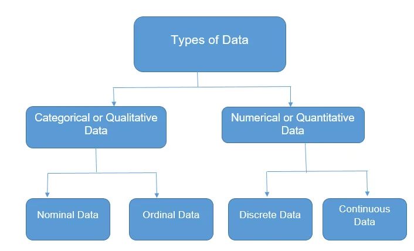

To perform proper Exploratory Data Analysis(EDA) applying the most appropriate statistical techniques, we need to understand what type of data we are working on.

1. **Categorical Data**

Categorical data represents qualitative variables like an individual’s gender, blood group, mother tongue, etc. Categorical data also be in the form of numerical values without any mathematical meaning. For example, if gender is the variable, a female can be represented by 1 and a male by 0.

- **Nominal data**: Values label the variables and there is no defined hierarchy between the categories, i.e., there is no order or direction. For example, religion, gender, etc. Nominal scales with only two categories are termed “dichotomous”.
- **Ordinal data**: Order or hierarchy exists, the categories. For example, quality ratings, education level, student letter grades, etc.

2. **Numerical Data**
Numerical data represents quantitative variables expressed only in terms of numbers. For example, an individual’s height, weight, etc.

- **Discrete data**: Values are countable and are integers (most often whole numbers). For example, the number of cars in a parking lot, the
- **tenuous data**: Observations can be measured but can’t be counted. Data assumes any value within a range. For example, weight, height, etc. Continuous data can be further divided into interval data(ordered values having the same differences between them but having no true zero)and ratio data (ordered values having the same differences between them and true zero exists).

**Probability & Bayes’ Theorem**
Probability is the measure of the likelihood that an event will occur.

- P(A) + P(A’) = 1
- P(A∪B) = P(A) + P(B) − P(A∩B)
- Independent Events: Two events are independent if the occurrence of one does not affect the probability of occurrence of the other. P(A∩B)=P(A)P(B) where P(A) != 0 and P(B) != 0.
- Mutually Exclusive Events: Two events are mutually exclusive or disjoint if they cannot both occur at the same time. P(A∩B)=0 and P(A∪B)=P(A)+P(B).
- **Conditional Probability**: Probability of an event A, given that another event B has already occurred. This is represented by P(A|B). P(A|B)=P(A∩B)/P(B), when P(B)>0.
- **Bayes’ Theorem**

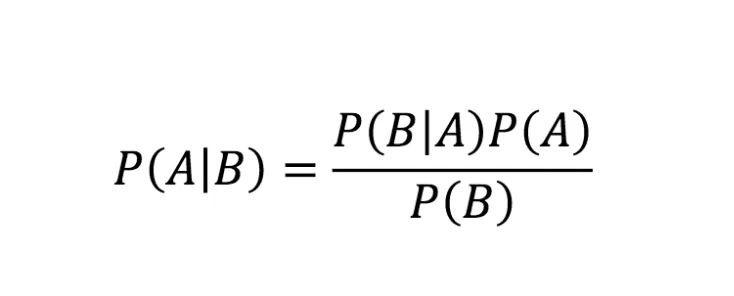

**Measures of Central Tendency**

It is used to describe the basic features of data that provide a summary of the given data set which can either represent the entire population or a sample of the population. It is derived from calculations that include:
 **Mean** Average value of the dataset.

```python
# MEan
df[['Age','Annual Income (k$)','Spending Score (1-100)']].mean()
```

```python
Age                       38.85
Annual Income (k$)        60.56
Spending Score (1-100)    50.20
dtype: float64
```

**Median**: Middle value of the dataset.

```python
# Median
df[['Age','Annual Income (k$)','Spending Score (1-100)']].median()
```

```python
Age                       36.0
Annual Income (k$)        61.5
Spending Score (1-100)    50.0
dtype: float64
```

**Mode**: Most frequent value in the datase

```python
# Mode
import statistics as st
for i in ['Age','Annual Income (k$)','Spending Score (1-100)']:
    print('mode of ',i,'is-->',st.mode(df[i]))
```

```python
mode of  Age is--> 32
mode of  Annual Income (k$) is--> 54
mode of  Spending Score (1-100) is--> 42
```

**Measures of Dispersion**

Describes the spread/scattering of data around a central value.

**Range:** The difference between the largest and the smallest value in the dataset.

**Quartile Deviation**: The quartiles of a data set divide the data into four equal parts-first quartiles, (Q1) is the middle number between the smallest number and the median of the data. The second quartile, (Q2) is the median of the data set. The third quartile, (Q3) is the middle number between the median and the largest number. Quartile deviation is **Q = ½ × (Q3 — Q1)**

**Interquartile Range: IQR = Q3 — Q1**

**Variance:** The average squared difference between each data point and the mean. Measures how spread out the dataset is relative to the mean

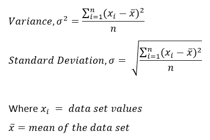

**Standard deviation:** Square root of variance.

```python
from sklearn.preprocessing import StandardScaler
std = StandardScaler()
std.fit_transform(df[['bp_before','bp_after']])
```

```python
array([[-1.18582775,  0.11627831],
       [ 0.57748489,  1.32037861],
       [-0.30417143,  1.17871975],
       [-0.30417143, -0.66284541],
       [-0.92133085, -0.73367484],
       [-0.56866833, -0.30869826],
       [ 2.51712879,  0.82457261]])
```

**Covariance**

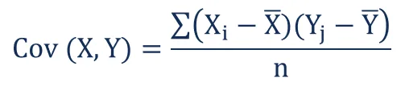

It is the relationship between a pair of random variables where a change in one variable causes change in another variable.

**Correlation**

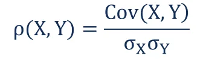

It shows whether and how strongly a pair of variables are related to each other.

```python
df = pd.read_csv('iris.csv',usecols=['SepalLengthCm','SepalWidthCm','PetalLengthCm','PetalWidthCm','Species'])
df.corr()
```

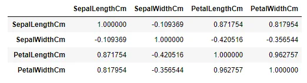

## Probability Distributions
There are two broad types of probability distributions — Discrete & Continuous probability distributions.

**Discrete Probability Distribution:**

- **Binomial Distribution**

Each trial is independent. There are only two possible outcomes in a trial- either a success or a failure. A total number of n identical trials are conducted. The probability of success and failure is the same for all trials. (Trials are identical.)

```python
from scipy.stats import binom
# By applying above formula we have k=3,4,5,n=5,p=0.75
prob_of_winning_series = binom.pmf(k=3,n=5,p=0.75)+binom.pmf(k=4,n=5,p=0.75)+binom.pmf(k=5,n=5,p=0.75)
print(f'probability of winning series is:{prob_of_winning_series}')
```

```python
Probability is greater than 0.5 ,hence team will win the series
```

- **Poisson Distribution**

Measures the probability of a given number of events happening in a specified time period.

```python
from scipy.stats import poisson
poisson.pmf(3,2)
```

```python
0.18044704431548356
```

There is 18% chance that company will sell 3 homes per day

**Normal Distribution**

The mean, median and mode of the distribution coincide. The curve of the distribution is bell-shaped and symmetrical about the line x=μ. The total area under the curve is 1. Exactly half of the values are to the left of the center and the other half to the right.

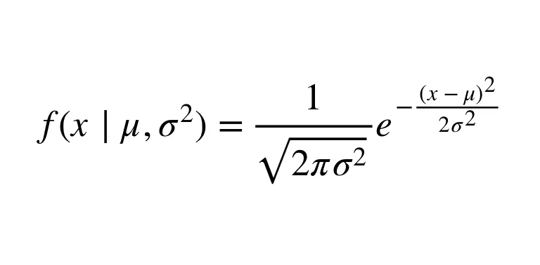

A normal distribution is highly different from Binomial Distribution. However, if the number of trials approaches infinity then the shapes will be quite similar.

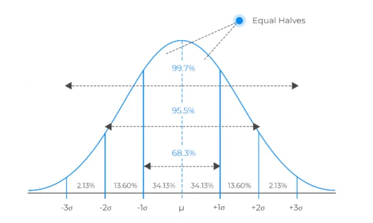

68% of data lies between (mean-1std,mean+1std)

95% of data lies between (mean-2std,mean+2std)

99.7% of data lies between (mean-3std,mean+3std)

```python
data = np.random.normal(5,2,1000)
sns.distplot(data)
```

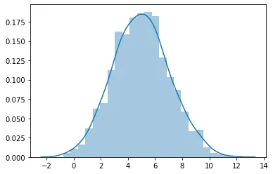

## Log Normal Distribution
The log-normal distribution is a right-skewed continuous probability distribution, meaning it has a long tail towards the right. It is used for modeling various natural phenomena such as income distributions, the length of chess games or the time to repair a maintainable system and more.

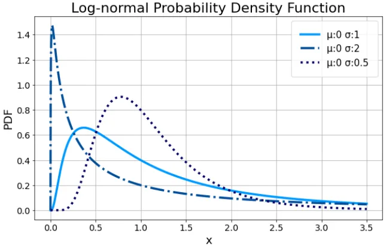

The probability density function for the log-normal is defined by the two parameters μ and σ, where x > 0

```python
from scipy.stats import skewnorm
x = skewnorm.rvs(6,size=10000)
sns.distplot(x)
```

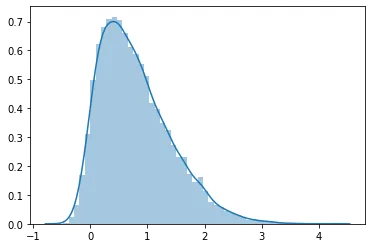

*Hope this helps!*

[Code description](https://github.com/mahmudmursi/Statistical-Concepts-for-Data-Science)
