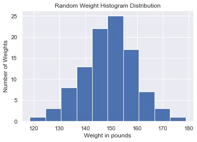
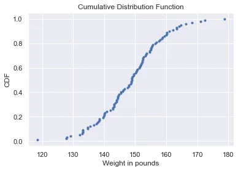
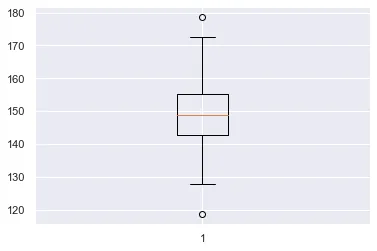
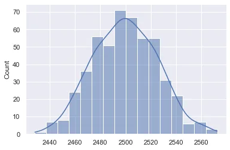
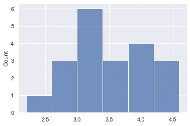
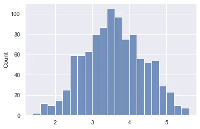
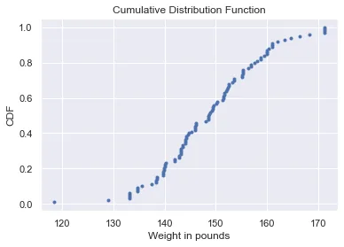

Data science is the field of study that combines domain expertise, programming skills, and knowledge of mathematics and statistics to extract meaningful insights from data. Statistical methods are a key part of data science. Without statistics, it will be difficult to understand and interpret data.

It is important to identify which kind of data types you are working with. The data type will dictate what kinds of summary statistics and visualizations make sense for your data. This is an important skill to master. For numerical data, such as the heights of students in a class, we can use summary statistics like mean, and plots like scatter plots, but these are not suitable for categorical data such as gender of students in a class. Bar charts and count plots are more suitable.

Therefore, to become a data scientist, you need to learn statistics and its concepts. In this blog, I will be discussing 10 fundamental statistical concepts that every data scientist needs to know.

1. Random variables

2. Measures of central tendency

3. Histogram

4. Cumulative Distribution Function

5. Measure of dispersion

6. Normal distribution

7. Binomial distribution

8. Central limit theorem

9. Total Probability Theorem

10. Bootstrap Sampling

Import the necessary python libraries under their usual alias

```python
import numpy as np
import pandas as pd
import matplotlib.pyplot as plt
import seaborn as sns
import statistics
```

**Random Variables**

A random variable is a variable whose possible values are numerical outcomes of a random phenomenon. There are two types of random variables, discrete and continuous.

A discrete random variable is one that may take on only a countable number of distinct values and thus can be quantified. For example, you can define a random variable X to be the outcome that comes up when you toss a coin. X can take values heads or tails

A continuous random variable is one that takes an infinite number of possible values. For example, you can define a random variable X to be the possible value of the temperature outside on any given day. Since the continuous random variable is defined over an interval of values, it is represented by the area under a curve.

Knowing the difference in random variables and their types of distribution is essential to interpreting datasets in data science.

**Measures of Central Tendency**

A measure of central tendency is a single value that attempts to describe a set of data by identifying the central position within that set of data. Here we will discuss three types of measure of centre, the mean, the median and mode.

**Mean**

The most basic estimate of location is the mean or average value. The mean is the sum of all values divided by the number of values. In python, we can use the pandas mean method to calculate the average in a dataset. Here I have created a dataframe with a dictionary of 10 random integers between 20 and 50.

```python
# Create a dataframe with a dictionary of 10 random integers between 20 and 50.
np.random.seed(12)
df= pd.DataFrame({'Age':np.random.randint(20,50,10)})
df
```

```python
# mean
print('The mean Age is: ', df.Age.mean()
```

output:

```python
The mean Age is:  32.6
```

**Median**

The median is the middle number on a sorted list of the data. If there is an even number of data values, the middle value is one that is not actually in the data set, but rather the average of the two values that divide the sorted data into upper and lower halves. With the dataframe above, we can find the median for age using the pandas median method.

```python
# median
print('The median Age is: ', df.Age.median())
```

output:

```python
The median Age is:  31.5
```

**Mode**

The mode is the data value that occurs the most frequently in the data. To find it, you count how often each data value occurs, and then determine which data value occurs most often. From the statistics module, we can use mode to see the most frequently occurring value in the dataset.

```python
# mode
print("The mode of Age is: ",statistics.mode(df.Age))
```

Output:

```python
The mode of Age is:  23
```

Now that we have examined the various ways to measure centre, how do we know which one to use? Let's look at an instance where we add a new row to the end of the dataframe df using the df.loc function. We add an outlier age value of 95. We take the mean and median of the new dataframe and compare it to the previous one above.

```python
# updated mean with outlier value
df.Age.agg([np.mean,np.median])
```

output:

```python
mean      38.272727
median    32.000000
Name: Age, dtype: float64
```

Now the mean has jumped from 32.6 to 38.3 while the median has changed from 31.5 to 32. This shows that if there are extreme values in the data, the median is a better measure of the centre than the mean. If there are no extreme values, the mean and the median will be similar so most people use the mean

**Histogram**

It is important to explore your data by organizing and plotting it. A histogram is a type of graph that indicates the frequency distribution. It is generally a graph that shows the number of observations between each interval. It is actually one of the best methods to represent the numerical data distribution. In python, we can matplotlib.pyplot module's hist function. For example, I have created a dataframe of weights from a dictionary of random distribution of mean 150, standard dev,10 and size = 100.

```python
# Create a dataframe with a dictionary of random distrubution of mean 150, standard dev,10 and size = 100
np.random.seed(12)
data=pd.DataFrame({"Weight in pounds": np.random.normal(150,10,100)})
data
```

Plot the weight column using the seaborn set function to make the plots nicely formatted.

```python
# plot histogram of the weight column
sns.set()
plt.hist(data['Weight in pounds'])
plt.xlabel('Weight in pounds')
plt.ylabel('Number of Weights')
plt.title("Random Weight Histogram Distribution")
plt.show()
```

Output: This shows most of the weights fall within the 150 to 155 weight bins.



**Cumulative Distribution Function**

The cumulative distribution function is used to describe the probability distribution of random variables. It can be used to describe the probability for a discrete, continuous or mixed variable. It is obtained by summing up the probability density function and getting the cumulative probability for a random variable.

We do this in python by creating a function that sorts the x-axis of the data and the y-axis is evenly spaced data points with a maximum of one, which we can generate using the NumPy arange function and then dividing by the total number of data points. Once we specify the x and y values, we plot the points.

```python
def cdf(data):
    x= np.sort(data)
    y= np.arange(1,len(x)+1)/len(x)
    plt.plot(x,y,marker='.', linestyle='none')
    plt.xlabel('Weight in pounds')
    plt.ylabel('CDF')
    plt.title('Cumulative Distribution Function')
    plt.show()
```

We find the cdf of the weight in pounds column of the data dataframe we created earlier.

```python
cdf(data['Weight in pounds'])
```

Result: From the cdf plot we can see that 60% of the weight in pounds column is less than or equal to 150.



**Measure of Dispersion**

The measure of Dispersion also known as the measure of spread describes how open apart or close together the data points are. Once we determine the centre of data, we can measure the amount of dispersion or spread of the data values from the central value. There are a few different measures of spread, variance, standard deviation, percentiles and interquartile range.

**Variance**

Variance measures the average distance from each data point to the data's mean. To calculate the variance, we start by calculating the distance between each point and the mean, so we get one number for every data point. We then square each distance and then add them all together. Finally, we divide the sum of squared distances by the number of data points minus 1, giving us the variance. It is important to note that the units of variance are squared. The higher the variance the more spread out the data is. In python, we can use the numpy variance function to easily calculate the variance of the data. Using the Weight in pounds data we created earlier, we can calculate the variance.

```python
# variance
variance=np.var(data['Weight in pounds'])
print('The variance of weight is: ', variance)
```

Output:

```python
The variance of weight is:  109.40124282755109
```

**Standard Deviation**

The standard deviation is another measure of spread, calculated by taking the square root of the variance. In python, we can do this with the numpy standard deviation function.

```python
# Standardd deviation
std= np.std(data['Weight in pounds'])
print('The standard deviation of weight is: ', std)
```

**Percentiles**

Percentiles split up the data into some number of equal parts. Using the numpy percentile function and pass the column name of the data followed by the percentile value. For example, if we want to split the data into two equal parts, we pass 50 as the second argument to the percentile function. This is the same as the median. If we want to split the data into five parts we can pass a list of 0,20,40,60,80,100

```python
#Percentiles
percentile_50th= np.percentile(data['Weight in pounds'],50)
print(percentile_50th)
percentile= np.percentile(data['Weight in pounds'],[0,20,40,60,80,100])
```

output:

```python
50th percentile is :  148.89608871938955
Out[78]:
array([118.52583478, 139.97286434, 145.76714186, 151.41931589,        156.48170111, 178.71819395])
```

**The Interquartile Range**

The interquartile range, or IQR, is another measure of spread. It's the distance between the 25th and 75th percentile, which is also the height of the box in a boxplot. We can calculate it using the numpy percentile function

```python
#Interquartile Range
iqr=np.percentile(data['Weight in pounds'],75) - np.percentile(data['Weight in pounds'],25)
iqr
```

Output

```python
the interquartile is :  12.433529267546618
```

Plotting the data with a boxplot shows the interquartile range(IQR) where the lower end of the box represents the first quartile(Q1), the red line in the box represents the second or the median and the higher end of the box is the third quartile. The IQR is the distance from the first to the third quartile(Q3). Outliers are data points that are substantially different from the others. But how do we know what a substantial difference is? A rule that's often used is that any data point that is: Q1 - 1.5 \* IQR or Q3 + 1.5 \* IQR. The outliers are represented by the two circles in the plot.

```python
# Outliers
lower_outlier= np.percentile(data['Weight in pounds'],25) - 1.5 * iqr
upper_outlier= np.percentile(data['Weight in pounds'],75) + 1.5 * iqr
print('outliers are : ',[lower_outlier,upper_outlier])
```

Output:

```python
outliers are :  [123.9602745048105, 173.69439157499698]
```



**Normal Distribution**

A normal or Gaussian distribution is a type of continuous probability distribution for a real-valued random variable.it is one of the most important probability distributions that countless statistical methods rely on. A graphical representation of a normal distribution is sometimes called a bell curve because of its shape. The normal distribution has a few important properties. First, it is symmetrical, so the left side is a mirror image of the right. Second, just like any continuous distribution, the area beneath the curve is 1. The normal distribution is described by its mean and standard deviation.

For example, An audit firm has collected the income of people working in an aluminium manufacturing industry. The income appears to be normally distributed with a mean of 2500 and a standard deviation of 25. Using the scipy.stats library import norm.rvs to sample 500.

```python
from scipy.stats import norm
sample_500 = norm.rvs(2500,25,size=500)
sns.histplot(sample_500,kde=True)
```



**Binomial Distribution**

The binomial distribution describes the probability of the number of successes in a sequence of independent trials. Central to understanding the binomial distribution is the idea of a set of trials, each trial having two possible outcomes with definite probabilities. The binomial distribution is the frequency distribution of the number of successes (x) in a given number of trials (n) with a specified probability (p) of success in each trial.

for example, in a manufacturing rubber plant, the probability of hiring a male worker is 0.82 out of 50 surveys. From scipy.stats, we import binom

binom.pmf calculates the probability of getting exactly x number of males,binom.cdf calculates the probability of getting x number of males or less and binom.sf calculates the probability of getting x number of males or more.

```python
from scipy.stats import binom
prob_35_men= binom.pmf(35,50,0.82)
print(prob_98_men)

prob_25_or_less_men = binom.cdf(42,50,0.82)
print(prob_25_or_less_men)

prob_39_or_more_men = binom.sf(39,50,0.82)
print(prob_39_or_more_men)
```

Result:

```python
0.014618911028809582
0.6995890740896223
0.7187428925621797
```

**Central Limit Theorem**

The tendency of the sampling distribution to take on a normal shape as sample size rises. It's important to note that the central limit theorem only applies when samples are taken randomly and are independent. As the sample size gets bigger and bigger, the mean of the sample will get closer to the actual population mean. If the sample size is small, the actual distribution of the data may or may not be normal, but as the sample size gets bigger, it can be approximated by a normal distribution.

We have a series of numbers from one to 6 called a die. we stimulate rolling the die 10 times by sampling with replacement. We pass in the Series we want to sample from, the size of the sample and set replace to True. This gives us the results of 10 rolls.

We create a function to sample the die rolls

```python
 def cal_sample_mean(series, sample_size,n_rolls):
    """appends a list of sample means from pandas series
     Args:
     pandas series, sample_size, n_rolls as the number of
     times sampling was made
     Returns:
     list of sample_means
    """
    sample_means = []
    for i in range(n_rolls):
        sample_means.append(np.mean(die.sample(5, replace=True)))
    return sample_means
```

Let's repeat the 10 roll dies 20 times and plot to see the distribution

```python
sample_20_times =cal_sample_mean(die,10,20)
sns.histplot(sample_20_times)
```



Let's repeat the 10 roll dies 1000 times and plot to see the distribution

```python
sample_1000_times =cal_sample_mean(die,10,1000)
sns.histplot(sample_1000_times)
```



We see the 1000 sample means distribution looks more like a normal distribution. Hence as the number of sampling trials increases, the sampling distribution will approach the normal distribution.

**Total Probability Law**

The total probability law state that the probability of an event in a non-overlapping partitioned space is the sum of the probabilities of such an event in each partition. For example, if in a data entry job, the probability of completing work on time with fast internet speed and slow internet speed are 0.91 and 0.39 respectively. The probability that there is fast internet speed and slow internet speed are 0.77 and 0.23. What will be the probability of completing the job on time?

We sum the probability of finishing the job with fast internet given the probability of having fast internet with the probability of finishing the job with slow internet given the probability of having slow internet.

The formula for total Probability

P(A) = P(C1)P(A| C1) + P(C2)P(A|C2) + P(C3)P(A| C3) + . . . . . + P(Cn)P(A| Cn)

```python
prob_job_fast_internet = 0.91
prob_job_slow_internet = 0.39
prob_fast_internet = 0.77
prob_slow_internet = 0.23

prob_finish_job = prob_job_fast_internet * prob_fast_internet + prob_job_slow_internet*prob_slow_internet
print("The probability of fishing job on time is : ",prob_finish_job)
```

Result:

```python
The probability of fishing job on time is :  0.7904
```

**Bootstrap Sampling**

Bootstrap Sampling is a method that involves drawing sample data repeatedly with replacement from a data source to estimate a population parameter. We simply replace each observation after each draw; that is, we sample with replacement. In this way, we effectively create an infinite population in which the probability of an element being drawn remains unchanged from draw to draw. We do this n times, where n is the total number of measurements, five in this case. We then have a resampled array of data. Using this new resampled array, we compute the summary statistic and store the result. Each resampled array is called a bootstrap sample and the value of the summary statistics calculated from the bootstrap sample is called a bootstrap replicate.

```python
# creating a bootstrap sample from the data['Weights in pounds'] dataframe.
# use the numpy random choice function to select with replacement from the dataframe.
# A for loop to acquire 100 bootstrap samples of the data.
for _ in range(100):
    bs_sample= np.random.choice(data['Weight in pounds'], size=len(data['Weight in pounds']))
print('The bootstrap sample mean is: ',np.mean(bs_sample))
print('The bootstrap sample median is: ',np.median(bs_sample))
print('The bootstrap sample standard deviation is: ',np.std(bs_sample))
```

Result: summary statistics of the bootstrap sample

```python
The bootstrap sample mean is:  148.85679358638035
The bootstrap sample median is:  148.68217457647427
The bootstrap sample standard deviation is:  10.053324800872536
```

Plot the CDF of the bootstrap sample using the cdf function we created earlier

```python
# plotting the cdf of the bootstrap sample
cdf(bs_sample)
cdf(data['Weight in pounds'])
```



**Conclusion**

These are some of the fundamental statistical concepts in data science. There are so much more statistics that were not covered in this blog. Hopefully, once you slowly master the basics from this blog you can move on to more advanced concepts.

References:

[Probability Distributions with Python (Implemented Examples) - AskPython](https://www.askpython.com/python/examples/probability-distributions)

[Probability Distributions in Python Tutorial - DataCamp](https://www.datacamp.com/community/tutorials/probability-distributions-python)

[Courses - DataCamp Learn](https://app.datacamp.com/learn/courses/introduction-to-statistics-in-python)

The notebook for the blog was written on my [GitHub](https://github.com/Storerun/Statistical_concepts_for_data_scientists/blob/main/Statistical_concepts_for%20_Data_Science.ipynb)

This is a data insight data science assignment

Cover [photo](https://unsplash.com/photos/dBI_My696Rk?utm_source=unsplash&utm_medium=referral&utm_content=creditShareLink)
