**What is statistics?**

The field of statistics is the practice and study of collecting and analyzing data. Statistics is the summary of data.

**What can statistics do?**

How likely is someone to purchase a product? Are people more likely to purchase it if they can use a different payment system?

How many occupants will your hotel have? How can you optimize occupancy?

How many sizes of jeans need to be manufactured so they can fit 95% of the population?

Should the same number of each size be produced?

```python
“Statistics is the science about how, not being able to think and understand, make the figures do it for yourself”
Vasily Klyuchevsky
```

In this blog, we will be looking at 10 Staictial Concepts required for data science. For this blog, we will be looking into the voting result of the 2008 election result from all states. Here, is a glimpse of what the dataset looks like:

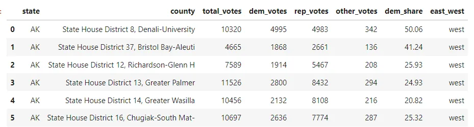

#### 1. Descriptive Statistics
It is used to describe the basic features of data that provide a summary of the given data set which can either represent the entire population or a sample of the population. It is derived from calculations that include:

**Mean**: It is the central value which is commonly known as arithmetic average.

**Mode**: It refers to the value that appears most often in a data set.

**Median**: It is the middle value of the ordered set that divides it in exactly half.

```python
# mean
import numpy as np
mean = np.mean(all_states['total_votes'])
print("Mean:", mean)

# median
median = np.median(all_states['total_votes'])
print("Median:", median)

# mode
mode = all_states['total_votes'].value_counts()
print("Mode:", mode)
```

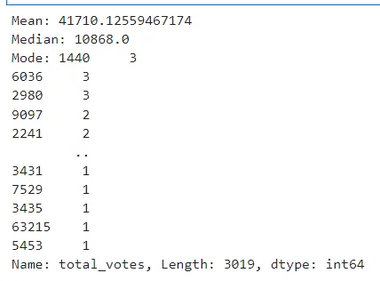

#### 2. Variability
Variability includes the following parameters:

**i. Standard Deviation**: It is a statistic that calculates the dispersion of a
 data set as compared to its mean.

```python
#standard deviation
sd = np.std(all_states['total_votes'], ddof=1)
print("Standard Deviation:", sd)
```

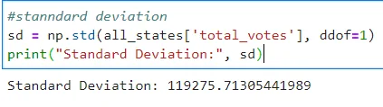

**ii. Variance:** It refers to a statistical measure of the spread between the
 numbers in a data set. In general terms, it means the
 difference from the mean.

```python
# Using np.var() for variance
var_ddof = np.var(all_states['total_votes'], ddof=1)
print("Variance with ddof:", var_ddof)

# Without ddof=1 , population variance is calculated instead of sample variance:
var_noddof = np.var(all_states['total_votes'])
print("Variance with ddof:", var_noddof)
```

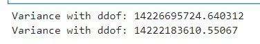

**iii. Quartile:** It is defined as the value that divides the data points into
 quarters.

```python
qua = np.quantile(all_states['dem_share'], [0, 0.25, 0.5, 0.75, 1])
print("Quartile:", qua)

# Boxplots use quartiles
import matplotlib.pyplot as plt
plt.boxplot(all_states['dem_share'])
plt.show()
```

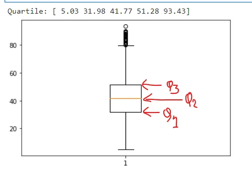

**iv. Interquartile Range(IQR):** It measures the middle half of your data. In
 general terms, it is the middle 50% of the
 dataset.

```python
# Interquartile Range(IQR):
from scipy.stats import iqr
iqrange =iqr(all_states['total_votes'])
print("Interquartile Range(IQR)", iqrange)
```

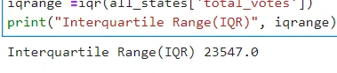

#### 3. Normal Distribution
Normal is used to define the probability density function for a continuous random variable in a system. The standard normal distribution has two parameters – mean and standard deviation that are discussed above. When the distribution of random variables is unknown, the normal distribution is used. The central limit theorem justifies why normal distribution is used in such cases.

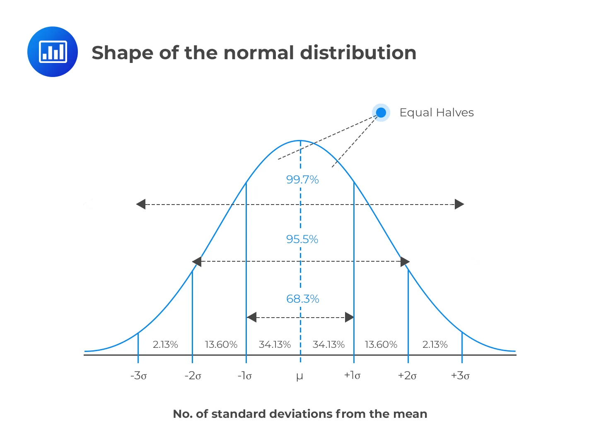

```python
all_states['dem_share'].hist(bins=10)
plt.show()

# What percent vote Obama got in a single country(dem_share) is less than 74.43?
from scipy.stats import norm
less = norm.cdf(74.43, 80.0, 5)
print("Less than 74.43:", less)

# What percent vote Obama got in a single country(dem_share) is more than 38.62?
from scipy.stats import norm
more = 1 - norm.cdf(38.62, 80.0, 5)
print("More than 38.62:", more)

# What percent vote Obama got in a single country(dem_share) are 74.43 - 38.62?
both = norm.cdf(74.43, 80.0, 5) - norm.cdf(38.62, 80.0, 5)
print("between 74.43 - 38.62:", both)
```

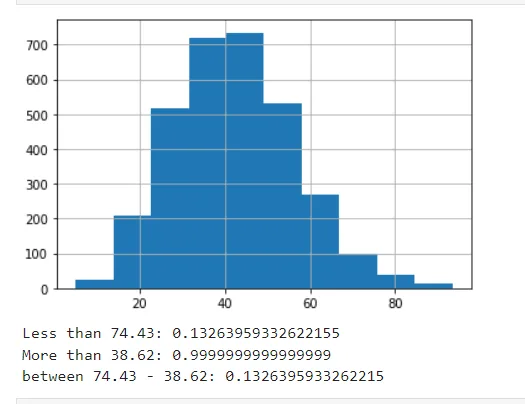

#### 4. The Central Limit Theorem
The central limit theorem states that a sampling distribution of a sample statistic approaches the normal distribution as you take more samples, no matter the original distribution being sampled from.

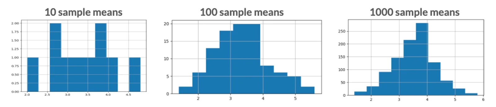

```python
all_states['dem_share'].hist()
plt.show()

# Set seed to 104
np.random.seed(104)
# Sample 20 num_users with replacement from amir_deals
samp_20 = all_states['dem_share'].sample(20, replace = True)

# Take mean of samp_20
print(np.mean(samp_20))
```

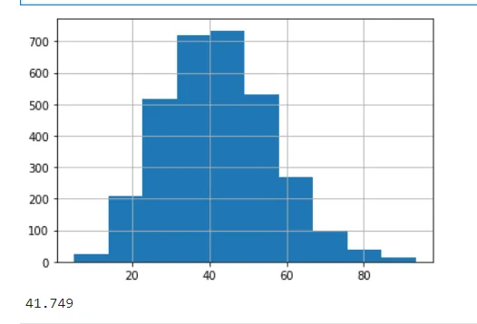

```python
Repeat this 100 times using a for loop and store as sample_means. This will take 100 different samples and calculate the mean of each.
# Set seed to 104
np.random.seed(104)

# Sample 20 num_users with replacement from amir_deals and take mean
samp_20 = all_states['dem_share'].sample(20, replace=True)
np.mean(samp_20)

sample_means = []
# Loop 100 times
for i in range(100):
  # Take sample of 20 num_users
  samp_20 = all_states['dem_share'].sample(20, replace = True)
  # Calculate mean of samp_20
  samp_20_mean = np.mean(samp_20)
  # Append samp_20_mean to sample_means
  sample_means.append(samp_20_mean)

print(sample_means)
```

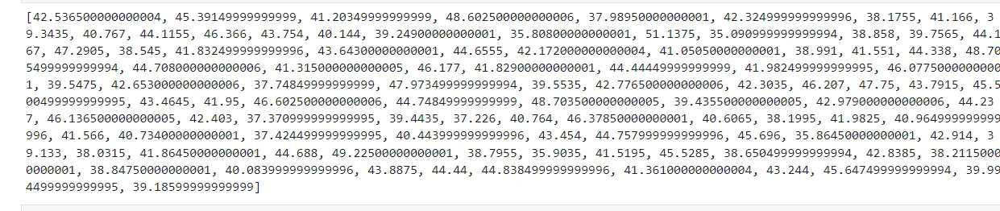

```python
Convert sample_means into a pd.Series, create a histogram of the sample_means, and show the plot.
# Set seed to 104
np.random.seed(104)

sample_means = []
# Loop 100 times
for i in range(100):
  # Take sample of 20 num_users
  samp_20 = all_states['dem_share'].sample(20, replace=True)
  # Calculate mean of samp_20
  samp_20_mean = np.mean(samp_20)
  # Append samp_20_mean to sample_means
  sample_means.append(samp_20_mean)

# Convert to Series and plot histogram
sample_means_series = pd.Series(sample_means)
sample_means_series.hist()
# Show plot
plt.show()
```

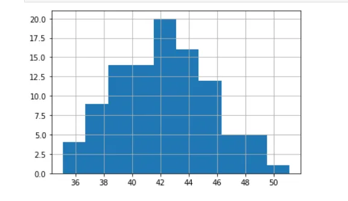

#### 5. The Poisson Distribution
Probability of some # of events occurring over a, fixed period of time

**Poisson processes**

- Events appear to happen at a certain rate, but completely at random

- Examples:

i. Number of animals adopted from an animal shelter per week

ii. Number of people arriving at a restaurant per hour

- Time unit is irrelevant, as long as you use the same unit when talking about the same situation

**Lambda (λ)**

λ = average number of events per time interval

Lambda is the distribution peak

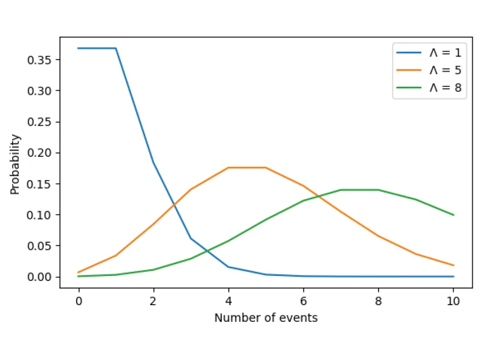

```python
# Import poisson from scipy.stats and calculate the probability that Obama gets 55 votes in each country, given that he has an average of 40 votes.
# Import poisson from scipy.stats
from scipy.stats import poisson

# Probability of 55 votes
prob_5 = poisson.pmf(55, 45)
print("Probability of 55 votes: ",prob_5)

# #Probability that Obama's competitor have an average of 350 votes. What is the probability thatthey have 500 vote ?
# # Probability of 500 responses
prob_competitor = poisson.pmf(500, 350)
print("Probability have 500 votes: ",prob_competitor)
```

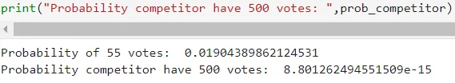

#### 6. Correlation
It is one of the major statistical techniques that measure the relationship between two variables. The correlation coefficient indicates the strength of the linear relationship between two variables.

- A correlation coefficient that is more than zero indicates a positive relationship.
- A correlation coefficient that is less than zero indicates a negative relationship.
- Correlation coefficient zero indicates that there is no relationship between the two variables.

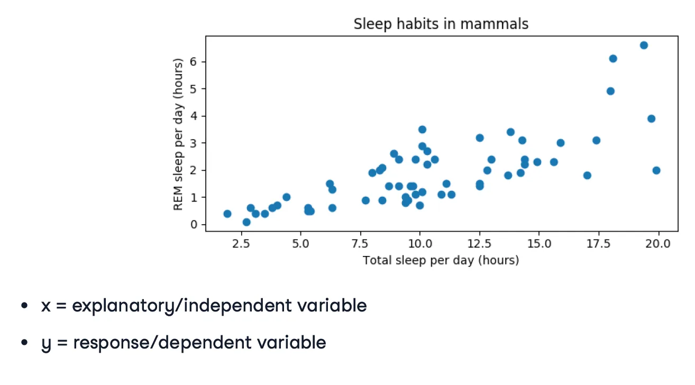

```python
# Correlation
import seaborn as sns
sns.scatterplot(y="total_votes", x="dem_share", data=all_states)
plt.show()

first = all_states['total_votes'].corr(all_states['dem_share'])
print("Total Votes vs Dem share:", first)

sec = all_states['dem_share'].corr(all_states['total_votes'])
print("Dem share vs Total Votes:", sec)
```

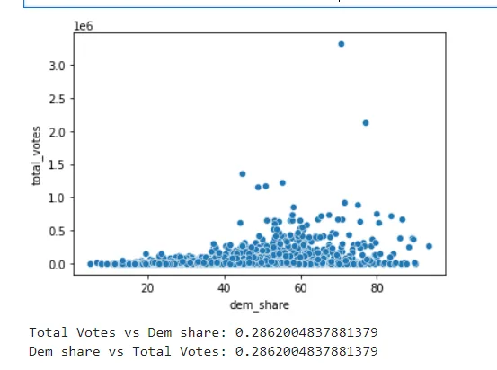

#### 7. Regression
It is a method that is used to determine the relationship between one or more independent variables and a dependent variable. Regression is mainly of two types:

- **Linear regression:** It is used to fit the regression model that explains the relationship between a numeric predictor variable and one or more predictor variables.
- **Logistic regression:** It is used to fit a regression model that explains the relationship between the binary response variable and one or more predictor variables.

```python
# Linear regression by least squares
# Least squares :The process of finding the parameter for which the sum of the square is minimal
import numpy as np
slope, intercept = np.polyfit(all_states["total_votes"], all_states['dem_share'], 1)
print("Slope:",slope)
print("Interept", intercept)
```

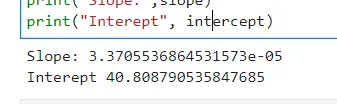

#### 8. P-value

The probability of obtaining a value of the test statistic that is at least as extreme as what was observed, under the assumption the null hypothesis is true.

**What is a null hypothesis?**

All statistical tests have a null hypothesis. For most tests, the null hypothesis is that there is no relationship between your variables of interest or that there is no difference among groups.

For example, in a two-tailed t-test, the null hypothesis is that the difference between two groups is zero.

For the p-value, we will be taking Michelon's speed of light dataset, since we have will be having to hypothesis made that is an alternative and null hypothesis.

**Null hypothesis:** there is no difference in longevity between the two groups.

**Alternative hypothesis:** there is a difference in longevity between the two groups.

The dataset looks like this:

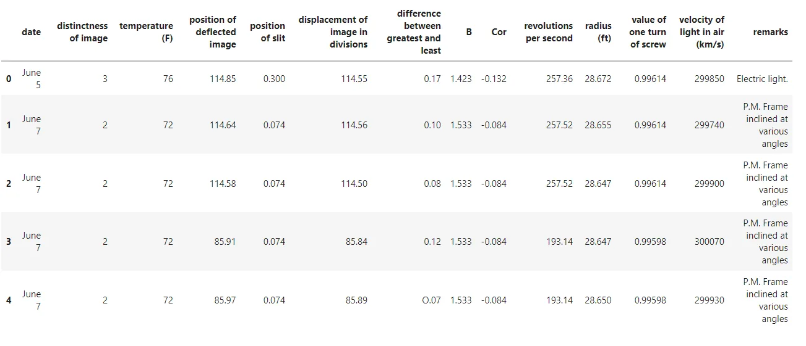

Michelson and Newcomb were speed of light pioneers.

According to Michelson, the speed of light is 299,852 km/s

According to Newcomb, the speed of light is 299,860 km/s

Null hypothesis

The true mean speed of light in Michelson’s experiments was

actually Newcomb's reported value

#### 9. Probability Distributions

Probability refers to the likelihood that an event will randomly occur. In data science, this is typically quantified in the range of 0 to 1, where 0 means the event will not occur and 1 indicates certainty that it will. The higher an event’s probability, the higher the chances are of it actually occurring. Therefore, a probability distribution is a function that represents the likelihood of obtaining the possible values that a random variable can assume. They are used to indicate the likelihood of an event or outcome.

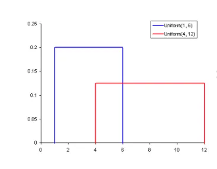

#### 10. Population and Sample
A **population** is an entire group that we want to draw conclusions about.

Example- Let’s consider we have a list consisting of the name of all the teachers in a school, It is nothing but a population. Out of which each teacher will be considered as an elementary unit.

A **sample** is a specific group that we will collect data from. The size of the sample is always less than the total size of the population

Example-Imagine a company that has around 30k employees. To do some analysis based on the information of these employees, It is practically difficult for researchers concerning time and money with all of 30k employees. The best possible way is to select 5k people (or any random number) from this population and collect the data from these employees to do the analysis. This random count of employees selected from the entire population is called Sample. This data analysis will be done by the researchers on a hypothesis that whatever inferences they get from these 5k people will apply to the entire population itself.

In research, a population doesn’t always refer to people. It can mean a group containing elements of anything you want to study, such as objects, events, organizations, countries, species, organisms, etc.

We have looked into 10 different statistical concepts used in data science. There are many more concepts to learn and explore. Statistics is the core is machine learning so it is a very important topic for every aspiring and professional data scientist.

**References:**

1. Datacamp course: Introduction to Statistics
2. Datacamp course: Statistical Thinking in Python (Part 1)
3. Geek for Geek: 7 Basic Statistics Concepts For Data Science
4. Scribbr
