*Statistics is a building block for data science*


Data Science is the field of study that combines domain expertise, programming skills and knowledge of statistics to extract meaningful insights from data.

Statistics helps us explain the data.

We use descriptive statistics to describe and extract insights from the data.

We use inferential statistics to infer or make predictive models on the data.

In simple terms, one need to have knowledge of statistics to be a hard core Data Scientist.

In this blog post, I will hold your hands through 10 fundamental concepts in statistics as far as Data Science is concern.

**. . .**

**1 T-test and P- value**

T-test is a type of inferential statistics which is used to determine if there's a significance difference between the means of two groups which maybe related in certain features.

We have one-sample t-test and two-sample t-test. two-sample t-test is beyond the scope of this post.

```python
import numpy as np
import seaborn as sns

iris_df = sns.load_dataset('iris')
iris_df.head()
```

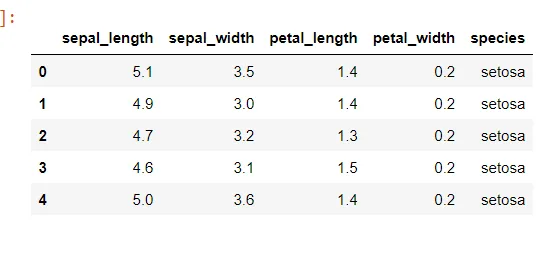

We will assume that the 'sepal_width' is the population, hence we will compute it's mean, draw samples from the 'sepal_width' and compute it's mean to see if there is any significance difference.

**Null Hypothesis**

In a statistical test, the hypothesis that there is no significance difference between specified populations is called a null hypothesis.

Our null hypothesis here is that: There is no difference between the sample mean and the population mean.

This leads us to another concept called p-value.

**P-value**

A p-value for a statistical model is the probability that when

the null hypothesis is true, the statistical summary is equal to or

greater than the actual observed results., also termed as 'asymptotic

significance'.

In simple terms, we use the p-value to validate our null hypothesis.

when the p-value is less than the threshold (0.05) the null hypothesis is rejected, else the null hypothesis is accepted.

```python
sepal_width_arr = np.array(iris_df['sepal_width'])
sepal_width_mean = np.mean(sepal_width_arr)

print(sepal_width_mean) # 3.0573333333333337

sample_size = 50
sepal_width_sample = np.random.choice(sepal_width_arr, sample_size)

from scipy.stats import ttest_1samp
_, p_value = ttest_1samp(sepal_width_sample, 3)

print(p_value)
```

From the numpy module we used the choice function to generate samples from the population array.

The hard coded 3 in the ttest_1samp() denotes the expected value in null hypothesis, remember, in the null hypothesis, we made the

assumption that the sample mean and the population mean are the same.

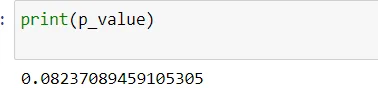

The null hypothesis is accepted as the p-value is greater than the threshold.

**. . .**

**2 Central Limit Theorem**

In central limit theorem, we draw a lot of samples from a population

mean and plot these samples, as the samples get larger, they approach

a normal distribution.

Why does it need to get close to normal distribution ?

Normal distribution is described in terms of mean and standard deviation which can easily be calculated.

And if we know the mean and standard deviation of a normal distribution, we can compute pretty much everything about it .

```python
population = np.random.normal(1_000_000)
_ = sns.distplot(x, kde=False)
plt.show()
```

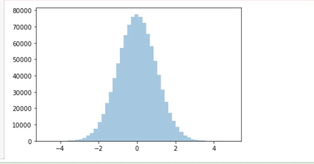

We generated a random normal distribution population and plotted using the seaborn library, from this population, we will draw samples, compute the mean and plot to see how the sample mean approach a normal distribution.

```python
def sample_mean_cal(population, sample_size, n_samples):
    sample_means = []

    for i in range(n_samples):
        sample = (np.random.choice(
             population, size=sample_size, replace=True )
             )
        sample_mean = np.mean(sample)
        sample_means.append(sample_mean)
    return sample_means
```

In simple terms, the function with signature 'sample_mean_cal' literally take's in the population array, draw random samples from it with replacement and compute the mean which is added to the sample_mean list and returned by the function.

```python
_ = sns.distplot(sample_mean_cal(x, 10, 1000), kde=False)
plt.show()
```

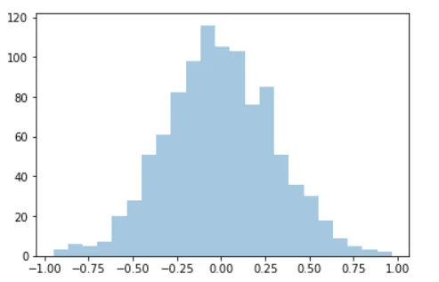

As seen above, 1000 samples were drawn from the population and their means plotted, when we keep drawing more and more samples from the population and keep computing their means, their distribution will be normal as seen with the prior distribution, this is called the Central Limit Theorem

**. . .**

**3 Covariance and Correlation**

Covariance indicates the relationship of two variables whenever one variable changes. If an increase in one variable results in an increase in the other variable, both variables are said to have a positive covariance. Decreases in one variable also cause a decrease in the other. Both variables move together in the same direction when they change. Decreases in one variable resulting in the opposite change in the other variable are referred to as negative covariance.

Let's take a look at the covariance matrix of the iris dataset.

```python
_ = sns.heatmap(iris_df.cov(), cmap='gnuplot_r')
plt.show()
```

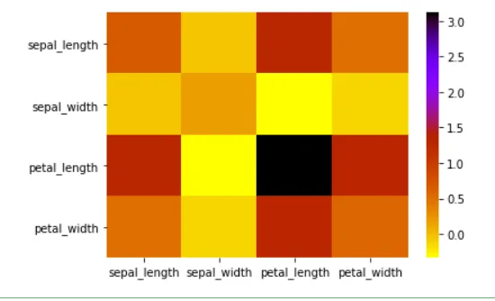

**Correlation**

Correlation is used to describe the linear relationship between two continuous variables.

we will like to know the relationship between the sepal_length and the petal_width of the iris dataset.

```python
_ = (plt.scatter(x=iris_df['sepal_length'],
                 y=iris_df['petal_length']))
_ = plt.xlabel('Sepal Length')
_ = plt.ylabel('Petal Length')
_ = plt.title('Scatter Plot OF Sepal and Petal Length')
plt.show()
```

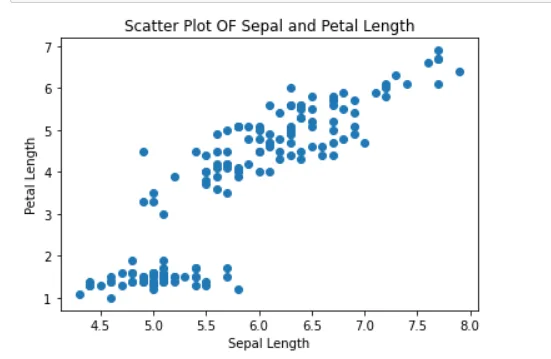

```python
iris_df['sepal_length'].corr(iris_df['petal_length'])

# 0.8717537758865831
```

There is a high correlation between the sepal and petal length, we get a value as high as 0.87 which shows that both continuous variables are positively correlated.

Let's take a look at the correlation matrix.

```python
_ = sns.heatmap(iris_df.corr(), cmap='gnuplot_r')
plt.show()
```

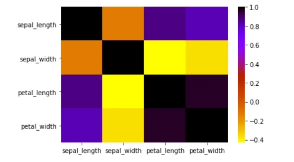

The matrix show's us which pair of continuous variables are correlated.

**. . .**

**4 Measure's Of Dispersion**

Measures of dispersion describe the spread of the data. They include the range, interquartile range, standard deviation and variance.

**(i) Range**

It is the simplest method of measurement of dispersion and defines the difference between the largest and the smallest item in a given distribution. If Y max and Y min are the two ultimate items, then

Range = Y max – Y min

**(ii) Standard deviation**

Standard deviation is the square root of the arithmetic average of the square of the deviations measured from the mean. The standard deviation is given as,

σ = [(Σi (yi – ȳ) ⁄ n] ½ = [(Σ i yi 2 ⁄ n) – ȳ 2] ½

Apart from a numerical value, graphics methods are also applied for estimating dispersion.

**(iii) Interquartile Range**

It is defined as the difference between the Upper Quartile and Lower Quartile of a given distribution.

Interquartile Range = Upper Quartile (Q3)–Lower Quartile(Q1)

**(iv) Variance**

Unlike range and interquartile range, variance is a measure of dispersion that takes into account the spread of all data points in a data set. It’s the measure of dispersion the most often used, along with the standard deviation, which is simply the square root of the variance. The variance is mean squared difference between each data point and the centre of the distribution measured by the mean.

**. . .**

**5 Baye's Theorem**

In statistics and probability theory, the Bayes’ theorem (also known as the Bayes’ rule) is a mathematical formula used to determine the conditional probability of events.

Essentially, the Bayes’ theorem describes the [probability](https://corporatefinanceinstitute.com/resources/knowledge/other/total-probability-rule/) of an event based on prior knowledge of the conditions that might be relevant to the event.

### Formula for Bayes’ Theorem

The Bayes’ theorem is expressed in the following formula:

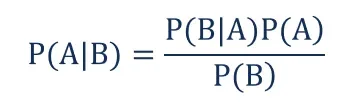

Where:

- P(A|B) – the probability of event A occurring, given event B has occurred
- P(B|A) – the probability of event B occurring, given event A has occurred
- P(A) – the probability of event A
- P(B) – the probability of event B

Note that events A and B are independent events (i.e., the probability of the outcome of event A does not depend on the probability of the outcome of event B).

A special case of the Bayes’ theorem is when event A is a binary variable. In such a case, the theorem is expressed in the following way:

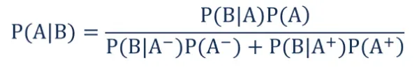

Where:

- P(B|A–) – the probability of event B occurring given that event A– has occurred
- P(B|A+) – the probability of event B occurring given that event A+ has occurred

In the special case above, events A– and A+ are mutually exclusive outcomes of event A.

**. . .**

**6 Cumulative Distribution Function**

One way to describe the distribution of a continuous variable is using histograms, however, histograms are not the best for a large datasets due to binning bias. A condition where we get different representations of the same data as we change the number of bins to plot.

One of the best way to describe a distribution of a continuous variable is to use cumulative distribution function (cdf).

apart from solving the problem with bining biase, it can also be defined for any kind of random variable (discrete, continuous, and mixed)

we will create a function to plot the cdf of sepal width from the iris datasets we used earlier on.

```python
def cdf(df):
    x = np.sort(df)
    y = np.arange(len(df)) / float(len(df))

    # plotting x and y
    plt.plot(x, y, marker='o', linestyle='none')
    plt.xlabel('Sepal Width')
    plt.ylabel('Probabilities')
    plt.title('Cumulative Distribution Function')

    plt.show()
```

```python
cdf(iris_df['sepal_width'])
```

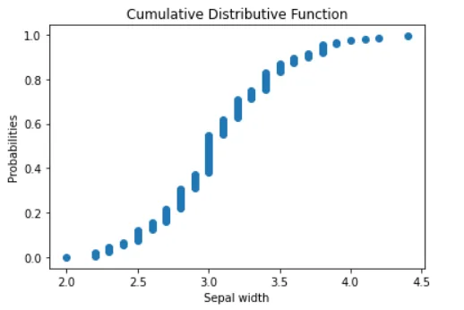

The cdf above tell's us that, 20% of the sepal_width is equal or less than 2.6-2.7.

As seen, the cdf give's us good information about the distribution of the dataset .

**. . .**

**7 Multiple Regression**

Multiple regression is a statistical technique that uses several explanatory variables to predict the outcome of a response variable. The goal of multiple regression is to model the linear relationship between the explanatory (independent) variables and response (dependent) variables.

Below is the formular for computing multiple regression

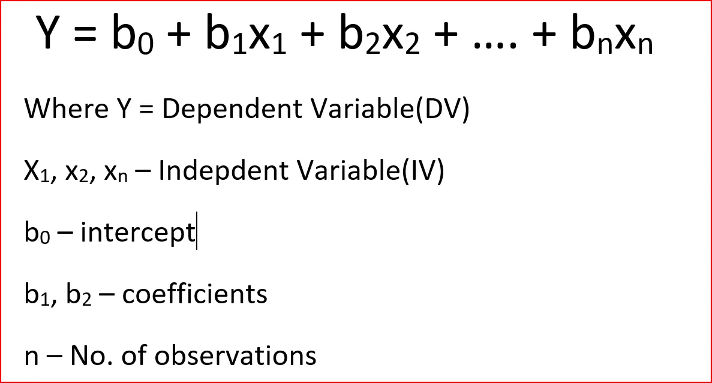

Multiple regression is a key technique as it's been used to perform predictive modelling, predicting the prize of stocks market is one of many examples.

**. . .**

**8 Statistical Sampling**

statistical sampling is a method for drawing elements from a population such that all possible elements in the population have a known and specified probability of being drawn and such that the set of chosen elements has approximately the same distribution of characteristics as the population from which it was drawn.

it provides an objective, acceptable methodology to determine the sample size for the population.

The sample is randomly selected from the population so that each meter making up the population group has the same chance of selection and the probability of selection is known.

**. . .**

**9 Confidence Interval**

A confidence interval is the mean of your estimate plus and minus the variation in that estimate. This is the range of values you expect your estimate to fall between if you redo your test, within a certain level of confidence.

Confidence, in statistics, is another way to describe probability. For example, if you construct a confidence interval with a 95% confidence level, you are confident that 95 out of 100 times the estimate will fall between the upper and lower values specified by the confidence interval.

The image below show's how confidence interval is computed

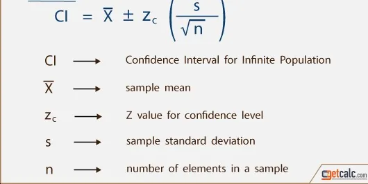

**. . .**

**10 Bias**

Statistical bias is anything that leads to a systematic difference between the true parameters of a population and the statistics used to estimate those parameters.

In other words, bias refers to a flaw in the experiment design or data collection process, which generates results that don’t accurately represent the population.

Below are some examples of bias, however, we won't go into details as it's beyond the scope of this post.

1. Sampling bias
2. Bias in Assignment
3. Self-serving bias

**. . .**

**CONCLUSION**

We have covered some of the basic statistical concepts in Data Science.

There is much more to learn about statistics, once the basics are clear,

you can delve deeper into more advance topics.

Thank you for reading.
