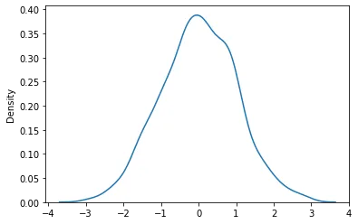
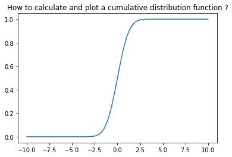
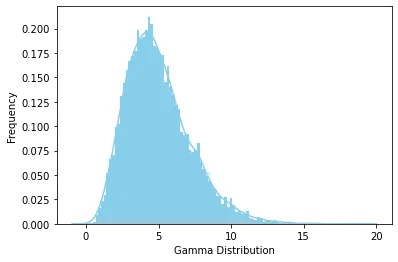
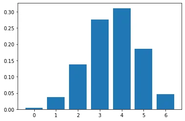
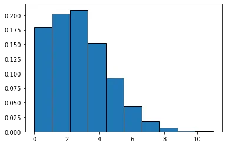
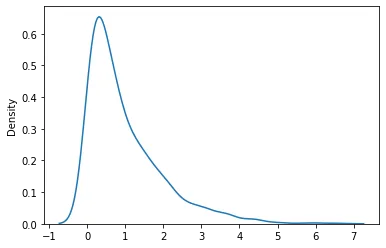

## Introduction
Data science is a huge field of study. The basic building blocks of data science are statistics. Without a good statistical knowledge, it would be highly difficult to understand the behavior of the data.

Statistics help us explain and express the data. We use statistics to display the results about a population based on a sample drawn from that population. Furthermore AI, machine learning and statistics have a lot of overlaps.

So we need to study and learn statistics and its concepts to become a data scientist. In this article, I will explain some fundamental concepts.

## 1.** **Measuring Central Tendency

A measure of central tendency is a single value that describes a set of data by identifying the central position within that set of data. The valid measures of central tendency are median, mean and mode.

- **Mean:**  is the sum of all the values in the data set divided by the number of values in the data set.
- **Median:**  is the middle score for a set of data that has been arranged in order of magnitude.
- **Mode:**  is the most frequent score in our data set.

So to calculate these values in python we will use pandas library as in the following code:

```python
import pandas as pd
#Create a Dictionary of series
df= {'Name':pd.Series(['Tom','James','Ricky','Vin','Steve','Smith','Jack',
   'Lee','Chanchal','Gasper','Naviya','Andres']),
   'Age':pd.Series([25,26,25,23,30,29,23,34,40,30,51,46]),
   'Rating':pd.Series([4.23,3.24,3.98,2.56,3.20,4.6,3.8,3.78,2.98,4.80,4.10,3.65])}

#Create a DataFrame
df = pd.DataFrame(df)
print ("Mean Values in the Distribution")
print (df.mean())
print ("*******************************")
print ("Median Values in the Distribution")
print (df.median())
print (df.mode())
```

## 2.** **Measures of Dispersion

An absolute measure of dispersion contains the same unit as the original data set. including variance and standard division.

**Variance:** a measure of dispersion that takes into account the spread of all data points in a data set.

**Standard Division:**  is the square root of the variance, variance is the average of all data points within a group.

and for this we can use Statistics Library to calculate them.

```python
from dataclasses import dataclass
import pandas as pd
import statistics
#Create a Dictionary of series
data= [4.23,3.24,3.98,2.56,3.20,4.6,3.8,3.78,2.98,4.80,4.10,3.65]
print(statistics.variance(data))
print(statistics.stdev(data))
```

the output:

```python
0.437751515151515
0.6616279280316959
```

## 3. Normal Distribution

Normal distribution (Gaussian distribution) is a probability distribution that is symmetric about the mean, showing that data near the mean are more frequent in occurrence than data far from the mean.

the following show how we can display normal distribution within Seaborn Library:

```python
from numpy import random
import matplotlib.pyplot as plt
import seaborn as sns

sns.distplot(random.normal(size=1000), hist=False)

plt.show()
```

The output:



## 4. Central Limit Theorem
is that distribution of sample means approximates a normal distribution as the sample size gets larger, regardless of the population's distribution.

the CLT code in python :

```python
import numpy
import matplotlib.pyplot as plt

# number of sample
num = [1, 10, 50, 100]
# list of sample means
means = []

# Generating 1, 10, 30, 100 random numbers from -40 to 40
# taking their mean and appending it to list means.
for j in num:
  # Generating seed so that we can get same result
  # every time the loop is run...
  numpy.random.seed(1)
  x = [numpy.mean(
    numpy.random.randint(
      -40, 40, j)) for _i in range(1000)]
  means.append(x)
k = 0

# plotting all the means in one figure
fig, ax = plt.subplots(2, 2, figsize =(8, 8))
for i in range(0, 2):
  for j in range(0, 2):
    # Histogram for each x stored in means
    ax[i, j].hist(means[k], 10, density = True)
    ax[i, j].set_title(label = num[k])
    k = k + 1
plt.show()
```

the output:


## 5. Cumulative Distribution Function
The *cumulative distribution function* (CDF) of a random variable is another method to describe the distribution of random variables.

we can plot CDF by using scipy as following:

```python
import numpy as np
from scipy.stats import norm

x = np.linspace(-10,10,100)
y = norm.cdf(x)

plt.plot(x, y)

plt.title('How to calculate and plot a cumulative distribution function ?')

plt.savefig("cumulative_density_distribution_04.png", bbox_inches='tight')

plt.show()
```

the output:



## 6.Gamma Distribution
Gamma Distribution is a Continuous Probability Distribution that is widely used in different fields of science to model continuous variables that are always positive and have skewed distributions.

so we can also use scipy library to plot Gamma distribution as following:

```python
import seaborn as sns
from scipy.stats import gamma
data_gamma = gamma.rvs(a=5, size=10000)
ax = sns.distplot(data_gamma,
                  kde=True,
                  bins=100,
                  color='skyblue',
                  hist_kws={"linewidth": 15,'alpha':1})
ax.set(xlabel='Gamma Distribution', ylabel='Frequency')
[Text(0,0.5,u'Frequency'), Text(0.5,0,u'Gamma Distribution')]
```

the output:



## 7. B****inomial Distribution
A **binomial distribution** can be thought of as simply the probability of a SUCCESS or FAILURE outcome in an experiment or survey that is repeated multiple times.

the following code explains how we can calcualte and plot it in python:

```python
from scipy.stats import binom
# setting the values
# of n and p
n = 6
p = 0.6
# defining the list of r values
r_values = list(range(n + 1))
# obtaining the mean and variance
mean, var = binom.stats(n, p)
# list of pmf values
dist = [binom.pmf(r, n, p) for r in r_values ]
# printing the table
print("r\tp(r)")
for i in range(n + 1):
    print(str(r_values[i]) + "\t" + str(dist[i]))
# printing mean and variance
print("mean = "+str(mean))
print("variance = "+str(var))
```

the output:

```python
r	p(r)
0	0.004096000000000002
1	0.03686400000000005
2	0.13824000000000003
3	0.2764800000000001
4	0.31104
5	0.18662400000000007
6	0.04665599999999999
mean = 3.5999999999999996
variance = 1.44
```

```python
import matplotlib.pyplot as plt
# setting the values
# of n and p
n = 6
p = 0.6
# defining list of r values
r_values = list(range(n + 1))
# list of pmf values
dist = [binom.pmf(r, n, p) for r in r_values ]
# plotting the graph
plt.bar(r_values, dist)
plt.show()
```

the output:



## 8. Poisson Distribution
**Poisson Distribution** is a probability distribution that is used to show how many times an event is likely to occur over a specified period.

the python code:

```python
from scipy.stats import poisson
import matplotlib.pyplot as plt

#generate Poisson distribution with and mean=3 sample size 10000
x = poisson.rvs(mu=3, size=10000)

#create plot of Poisson distribution
plt.hist(x, density=True, edgecolor='black')
```

the output:



## 9. Exponential Distribution

The *exponential distribution* is often concerned with the amount of time until some specific event occurs.

the python code:

```python
from numpy import random
import matplotlib.pyplot as plt
import seaborn as sns

sns.distplot(random.exponential(size=1000), hist=False)

plt.show()
```

The ouput:



## 10. P-value
A *p*-*value* is a measure of the probability that an observed difference could have occurred just by random chance.

for example as in this code:

```python
import scipy.stats
#find p-value
scipy.stats.t.sf(abs(-.77), df=15)
```

the output:

```python
0.2266283049085413
```

**Conclusion**

We have covered some basic fundamental of statistical concepts. There is, of course, much more to learn about statistics. Once you understand the basics, you can easily find your way up to advanced topics. Thank you for reading. Please let me know if you have any feedback.

My Notebook code is available on my [Github](https://github.com/tahanijaber/Statistical-Concepts-in-Data-Science)
