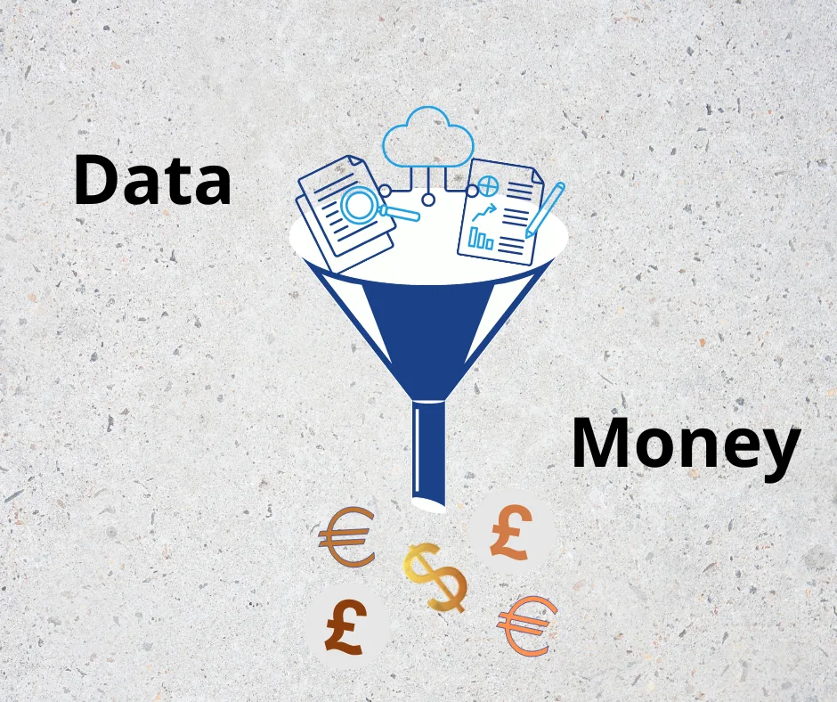

It is not uncommon to see data being referred to as the new oil by many professionals. Yes, data has some key similarities to oil, but data has even some unique values that are not inherent in oil. For example, data does not deplete like oil. You use it and still have it. It also is non-rivalrous, that is several people can use the same data simultaneously unlike oil. In a nutshell, data is a rich resource that many businesses can tap into to make money and that is one of the reasons for the recent growth in the field of infonomics and many businesses looking for ways to monetize their data assets.

In this article, we will share 10 different methods, both direct and indirect, that businesses can use to monetize their data. While the ideas listed here are not exhaustive or holistic, they can serve as a baseline for designing a data-monetizing strategy.

**1. Improving Customer Acquisition and Retention**

Data, being transformative, can be used to make a sort of simulation of customer profiles from existing data through machine learning. This pseudo data can then be matched with the original data to track potential customers for lead generation. By also combining social media data with existing data, businesses can find patterns in users’ shopping activities in other related products/services and then use the knowledge to predict their behavior to optimize search results and marketing campaigns. Data generally can help businesses stay proactive in that they can be used to have a sense of future market trends and thus afford them the time to prepare.

**2. Enabling Competitive Advantage**

With data, businesses can understand consumer threshold pricing better and the price-quality compromise that consumers from different geography and demography are willing to make. Another way to enable competitive advantage is to improve offerings by designing a solution that is deeply embedded in complex production processes and cannot be easily copied. Cross-learning from and cross-selling to customers is another way businesses can turn things around instead of just suggesting the same products and services that a customer has a history of purchasing.

**3. Creating New Business Line**

Sentiment analysis does not only help businesses have a good grasp of their customers’ perception of their products and services but also provide clues on new areas that could be explored. A/B testing is another method to experiment with data at almost no cost to uncover new opportunities. Customer data can also be leveraged to create a bridge that connects consumers to what they need from other businesses via a platform business model.

**4. Breaking into New Markets**:

Businesses that have data can enter new markets by offering analytics-powered applications as a service to other businesses, regardless of industry, that are not data-driven. Digital data streams can be used with existing dataset to understand, evaluate, and adapt what other businesses are doing. Data can also be used to carry out thorough market research so as to discover uncharted territories that could be broken into.

**5. Bartering for Goods and Services**

Businesses can barter their data assets for goods and services from partners and suppliers. That way, they do not have to dip into their revenue nor even lose the data exchanged. Sometimes even old datasets are useful resources for other companies and thus be used to barter for monetary values. Sometimes too the regulatory restrictions of money make data a more viable currency.

**6. Bartering for Favorable Terms and Conditions**

Bartering for favorable terms and conditions is an indirect method of data monetization and one that holds a lot of potential for revenue generation. For instance, bartering is tantamount to being transparent, a trait that encourages other businesses to want to transact with you. There’s also the advantage of putting any litigation issues and expenses at bay since both parties involved in bartering are always fully aware of what they are signing up for. Bartering also gives businesses access to vital information that could be instrumental to not just revenue generation but also survival in the market.

**7. Reducing Cost Overruns**

Enabling operational efficiency in internal and external processes is another way companies can monetize their data indirectly. Data can be used to automate many repetitive tasks that would otherwise lead to cost overruns. Building early warning systems can also help detect problems in time and so avoid the financial risk that comes with sudden problems in business. Mining project documentation and communications for leading indicators of project issues is another good way businesses can reduce overrun cost.

**8. Offsetting the Cost of Data Management**

Data mining is an important concept here. It can be used to improve data quality by simplifying and downsizing data warehouses, thus cutting the budget for managing the data environment. Licensing data to partners can also be used to share the cost of data management. Digital transformation technologies can also be used to revive old data to more useful state, particularly image and video data. Charge-back as a service and funding initiatives for future values of data is another method to defray cost of information management and thus save money.

**9. Creating Additional Streams of Revenue**

Data can be monetized directly by selling it to other businesses through brokers or by generating insights for third parties who cannot ordinarily access the data on their own. Users’ data on products can also be used to attract advertisers on websites. Suppliers most times do not relate with consumers directly but would still need to know how their product is fairing through the partner enterprise they work with. So creating an information bridge here generates additional revenue.

**10. Improving the Lives of Citizens**

Businesses can reduce manual labour when data is leveraged appropriately and less labour translates to healthier workforce. In turn, a healthier workforce cuts the cost from health insurance claims and expenses. Delaying gratification to first help communities solve pressing problems with available data resources can help companies build brand loyalty. Meanwhile, helping the government to catalyze the use of its data to make strategic public decisions can be beneficial through reduced tax rate and contracts. Generally, maximizing data resources results in growth, giving businesses the power to hire more people and thus improving the lives of citizens.

Thanks for reading.

Kindly follow me on [Twitter](https://twitter.com/AjibolaSalami2) and [LinkedIn](https://www.linkedin.com/in/salami-ajibola/)
