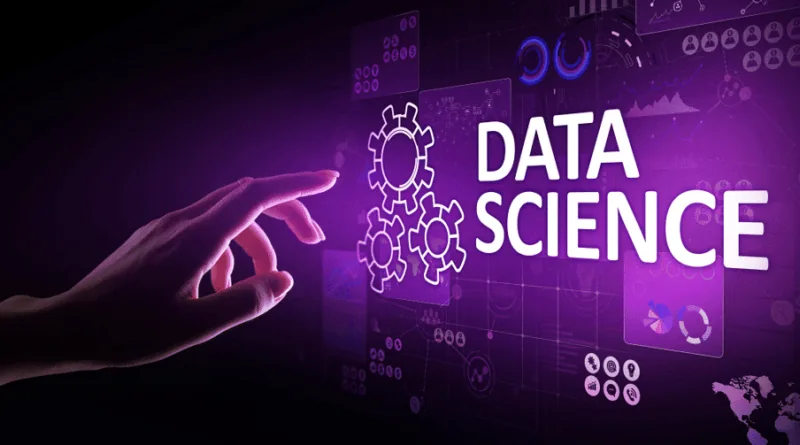

Data Insight is accepting new applications for her fully funded [Data Scientist Program](https://www.datainsightonline.com/data-scientist-program). From September 2021, the next cohort will commence their training towards being the next generation of Data Scientists. The vision of this program is to adequately educate and develop intelligent yet economically marginalized young people around the world who have defied all odds and have shown a great deal of resilience and academic excellence.

**Program Overview**

A Data Scientist employs programming, statistical and machine learning techniques to gain insight from data. Data Insight's Data Scientist Program is a comprehensive online data science training that covers all that you need to begin your journey towards becoming a Data Scientist. Over a period of 1 year, you will develop the technical skills to program in Python and learn how to use this powerful tool to collect, analyze and interpret complex data and to build predictive machine learning models.

**Course Highlight**

Courses in the Data Scientist Program are developed by data science experts in industry and academia. They will help you to develop both programming and data science skills.

- Programming in Python
- Python for Data Science
- Shell for Data Science
- Git/GitHub for Data Science
- Data Science Toolbox
- Importing Data in Python
- Cleaning Data in Python
- Pandas Foundations
- Manipulating Data with Pandas
- Analyzing Data in Python
- Visualizing Data in Python
- SQL for Data Science
- Statistical Thinking in Python
- Introduction to Machine Learning
- Supervised Learning in Python
- Unsupervised Learning in Python
- Deep Learning in Python
- Neural Networks in Python

**Projects**

The projects in the Data Scientist Program will equip you with hands-on experience for solving real-world problems while building your data science portfolio.

- 8 Practical course-based projects
- 2 Applied data science capstone projects

**Time Commitment**

Each participant must be ready to put in at least 20 hours every week.

**Program Duration**

1 Year : September 1, 2021 to August 31, 2022.

​

**Certification**

You will receive a professional certificate from Data Insight recognizing your proficiency in data science if and only if you complete ALL program requirements including courses and projects.

**Scholarship Requirements**

In order to participate in Data Insight's Data Scientist Program, you must be a recipient of one of the Data Insight Scholarships.

There are over 100 scholarships to be awarded, and each scholarship covers the tuition fee, application fee, management fee and the certificate. To compete for one of these scholarships, you must be able to show in writing and orally that you are interested in data science and that you do not have the financial means to obtain a solid data science education. In addition, you must demonstrate that in spite of financial constraints in the past, you were able to pull through with excellent academic performance.

[APPLY NOW for Data Insight Scholarship to participate in the Data Scientist Program.](https://www.datainsightonline.com/data-scientist-program)

**Application Deadline**

The last day to submit all application forms is August 15, 2021. Evaluation of applications will start August 15, 2021, and will continue until positions are filled. List of successful applicants will be posted on this web page on or before August 30, 2021. All successful applicants will be notified via email.
