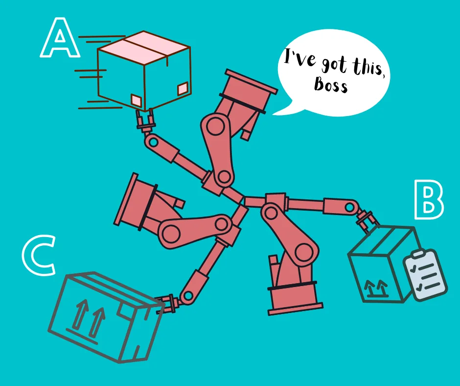

It is no more news that artificial intelligence, together with other Fourth Industrial Revolution technologies, is changing the way we do many things, and one of the industries enjoying this application is the retailing industry. While there are several areas in which artificial intelligence has impacted how buying and selling is done, this article will pick out just three: sorting and arrangement, autonomous delivery, and smart checkout.

## Sorting and Arrangement
Repetitive tasks are one of the banes of the retail industry. Well, in many cases they also have a multiplier effect on revenue. But do repetitive processes still have to remain a challenge in this age and time when AI is at our beck and call?

Now, one such repetitiveness common in retailing is sorting and arrangement, and it happens in different scenarios. For instance, production often involves producing bits and pieces that make up a product and then coupling them together in an orderly process. Already produced items too oftentimes need to be sorted efficiently either within warehouses for easy access or sorted during loading for wholesale purposes.

When these tasks are apportioned to humans, companies do not only run the risk of amassing labor cost but also generating for themselves a truckload of wasted time and resources that could have been channeled to better use. But with AI, the advantages are countless.

AI sorting robots are gaining more ground today in the retailing world. A good example is [Alibaba sorting robots](https://www.youtube.com/watch?v=jwu9SX3YPSk) used in an automated warehouse for loading cargoes. These AI robots, countless of them by the way, collect products from humans, automatically identify the product, search for their appropriate positions and place them there. They process about 18,000 parcels every hour. [Amazon smart warehouse](https://www.youtube.com/watch?v=IMPbKVb8y8s) houses a myriad of robots that carry out various tasks to enable the retail giant to effectively meet its teeming customers’ demand. Also worth mentioning are the thousands of [Ocado’s grocery packing robots](https://www.youtube.com/watch?v=4DKrcpa8Z_E) that are used to pack up to 65,000 grocery orders per week. They bring crates of products to pick stations for robots/humans to assemble the orders.

This is a fast and very efficient method of sorting products with 100 percent accuracy and accountability guaranteed.

## Autonomous Delivery
News about drones and other robotic innovations for fast and efficient delivery of orders is another area where artificial intelligence has proved really beneficial to the retail industry. Starship uses robots to deliver foods and drinks to customers within and outside campuses autonomously. Once a customer places an order on the app and indicates their location, they get an estimated time it will take the robot to arrive. Once the customer places the order, the kitchen receives a notification for the order and the available robot also moves from its staging area to the kitchen. The kitchen then places the meal in the robot and dispatches it to the customer, who must have received a notification that the robot is en route. A similar solution is Kiwibot delivery robot and Kiwitrike, the latter being a semi-autonomous but bigger robot that has a larger capacity and covers a farther distance.

Unlike ordering and getting a number of items delivered, RoboMart, a self-driving bot, brings the whole store down to customers’ destination. That is, customers can hail a bevy of grocery products from their phone to where they desire, pick what they want without passing through the hassle of carts and checkouts, as everything has been automated with intelligence. TeleRetail delivery robot on the other hand aims to solve the logistic problems of SME by helping them deliver their products faster and more efficiently with the help of its robots. All these and other fascinating solutions from other retail giants can be found [here](https://www.youtube.com/watch?v=dagjQW_jgtE).

## Smart Checkout
For those who would rather visit a retail store to get their stuff, paying for items bought can sometimes be a tiring process when they have to join a queue or when different items are bought and have to be scanned one after the other by the store cashier. is one one thing that usually takes time. Many retail outlets are now adopting the power of artificial intelligence and other technologies to make buying memorable. Customers only pick the items they want and they are automatically recorded and added up.

No doubt that smart checkout is just one of the many possibilities in the growing trends in smart retail solutions; the list of similar interesting innovations is long and worth checking to see how artificial intelligence, in addition to other technologies, is reinventing the retail sector.

Are you still in doubt of the wonders of artificial intelligence? Follow this space.
