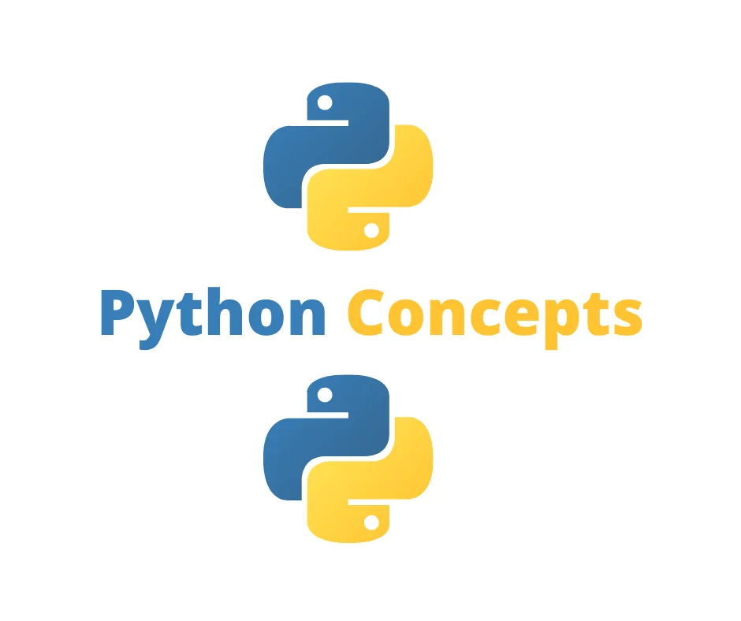
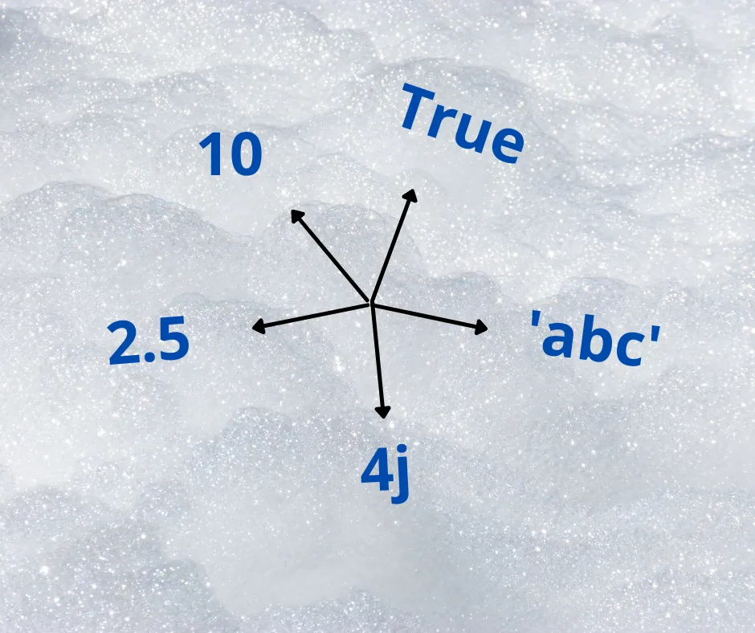
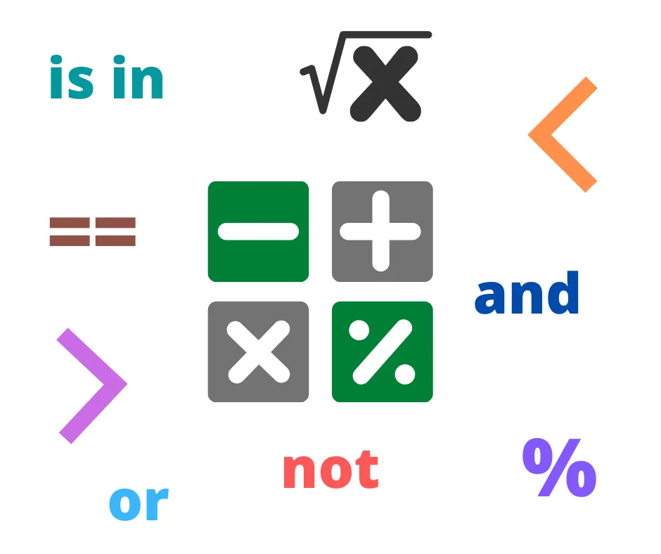
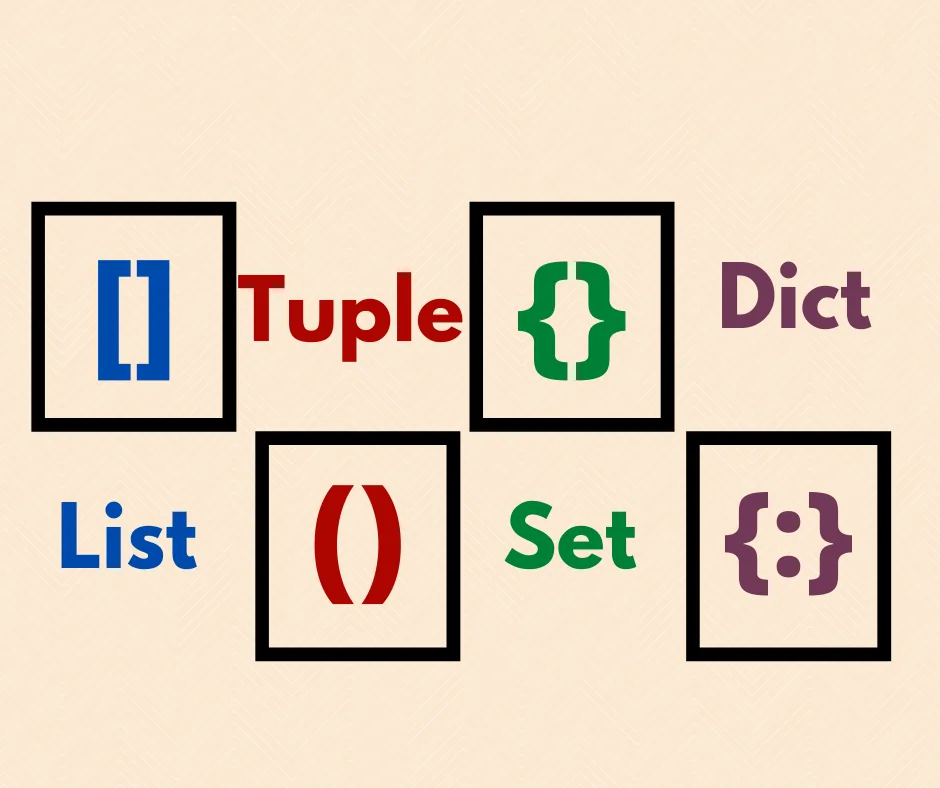
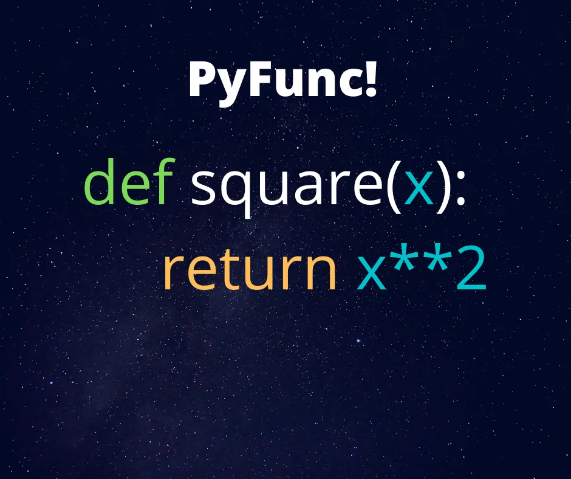

About a decade ago, Python was probably not the top tool for doing Data Science. But the pace it has picked ever since has been really magnificent and the rest is history.

Python’s standard library alone contains a vast array of modules for working with data. Now add the extensive community efforts in the form of third-party libraries to make Python much more robust and you have a wide range of functionalities at your beck and call.

In this article, however, we will explore 40 concepts in the standard library for 40 different Python concepts that beginners need to know to propel their Data Science career.

Note that this is by no means an exhaustive list of the useful and commonly used Python concepts; the concepts listed here are as many as we have written about on this platform.

## The Concepts List
To make the list a little easier to follow, we group the concepts into six categories, based on how closely related their use cases are. We also arrange them in the order in which they are to be learnt. Lastly, you can click the name of the concept to link to a short code example of how the concepts can be used.

The groups of concepts are: **data types**, **operators**, **data structures**, **control flow**, **functions**, and others generally useful concepts.

> *Click the concept name to view a code example*

### Data Types
Since all we do in data science is about data, a thorough knowledge of data types, and not just mere recognition, is needed to be good in Python. Below is a list of the basic data types in Python.

1.[**Integers and Floats**](https://www.datainsightonline.com/post/python-data-types-1): These data types are used for numeric

values. Integer works for discrete values while float works for

decimal values. They are both used extensively for computing and

the only way you can escape them is probably not to code at all

2.[**Strings**](https://www.datainsightonline.com/post/python-concepts-for-data-science-introduction-to-strings): Strings represent text values and, if I had mentioned earlier
 that you can’t escape numeric data types, note that it’s even more
 serious with strings. Aside from using them as the data type we are
 operating on, strings are widely used for adding messages and
 formatting our results for better understanding. Because of its
 extensive use, it comes with a flurry of methods that can help us with
 manipulations. There is also a concentration that deals with strict
 formatting and can be found in the first link below.

3. [**Boolean**](https://www.datainsightonline.com/post/python-concept-boolean): Evaluating whether expressions or conditions are true or
 false is a common thing when coding, and having a good knowledge of
 the Boolean data type will significantly add to your Python arsenal.

## Operators
These are Python concepts used for performing operations on variables and values

4. **Arithmetic**: These are used for doing common mathematical
 operations. From simple addition down to modulus and exponentiation,
 these function would make your mathematical use of Python easy.

5. [**Assignment**](https://www.datainsightonline.com/post/python-logical-operators): It is tempting to think that the = sign is the only
 operator that is used for assigning values to variables. But delve a little
 deeper and you would see you can use it alongside some other
 symbols, particularly when you want to both assign and do some
 arithmetic simultaneously.

6. [**Comparison**](https://www.datainsightonline.com/post/python-logical-operators): As the name rightly suggests, these operators are
 used for comparing values and it is worth knowing if you are a beginner
 in Python.

7. [**Logical**](https://www.datainsightonline.com/post/python-logical-operators): As you proceed in your learning, you will definitely need to
 work with conditional statements in order to tell the program what you
 want and do not want. In this case, you will obviously need the power
 of logical operators like and and or. Find useful use cases in the links
 provided.

8. **Identity**: Though similar to comparison operators, these operators
 pay more attention to the object type of the values in question. With the
 is and is not, you can tell whether or a variable is same as another
 object-wise.

9.[**Membership**](https://www.datainsightonline.com/post/python-logical-operators): This helps us to check if a value or sequence of
 values are present in a given object. It uses the syntaxes *in* and *not in*.

## Data Structures
These are data containers and are used for ordering and grouping different data types together.

10. [**List**](https://www.datainsightonline.com/post/a-quick-introduction-to-list)**s**: These are probably the most common Python data
 container. They can hold different data types together. The elements in
 a list are ordered, changeable, and can be duplicated. Python has
 several built-in methods for manipulating lists. It is definitely a container
 every data professional cannot do without.

11. [**Tuple**](https://www.datainsightonline.com/post/understanding-python-tuples)**s**: Tuples are similar to list, only that their elements are
 unchangeable. Plus, they are often used to store related data types.
 They are also useful for doing multiple variable assignments.

12. [**Set**](https://www.datainsightonline.com/post/why-sets-are-a-great-data-structure)**s**: These are data container for mutable, unordered collections
 of unique items. The unordered nature of sets allow for flexibility when
 storing and retrieving data. And like a list, a set has many methods that
 make working with it easy and intuitive.

13.[**Dictionar**](https://www.datainsightonline.com/post/dictionaries-in-python)**ies**: Unlike other data containers, dictionaries use a key-
 value pair for storing data. Dictionaries also come in very handy when
 you need to create compound data structures. What more, it is another
 way you can better comprehend json data format, which is one of the
 common data format data scientists work with.

## Control Flow
These concepts build logic into codes by determining the sequence with which part of the code runs and which does not.

14.[**Conditional If Statement**](https://www.datainsightonline.com/post/python-techniques-the-condition-expression-also-known-as-if-else-statement): This is used to specify whether to run or
 skip a block of code given a set condition is true or false. It is usually
 used with operators. It works with two optional clauses, elif and else.
 This is one of the most common control flow tools in Python. It simply
 checks if a condition is True and evaluates. If the condition is False,
 however, it evaluates based on the alternative preset route.

15. [**Boolean Expression**](https://www.datainsightonline.com/post/python-concept-for-data-science-conditional-statements): This is useful for case when you need more
 than one condition or need a mixture of operators and calculations in
 the if statement. In other words, it is employed for cases where we
 have complicated conditions.

16.[**For loop**](https://www.datainsightonline.com/post/python-for-loops): This is used for iterating over data containers or iterables
 such as list, tuple, dictionary, etc., in a predefined number of times. It is
 a widely used concept and a sort of swiss knife you would need as a
 beginner.

17. [**While loop**](https://www.datainsightonline.com/post/python-concepts-loops-1): Though similar to For loop, while loop does not use the
 definite iteration process. Instead it continues looping over an iterable
 for an unknown number of times until the preset condition is met.
 Instead a condition is set, and while the condition holds true, the
 statement under the while loop is executed.

18.[**Break, Continue, and Pass**](https://www.datainsightonline.com/post/python-break-and-continue-statements): There are times too when we need
 more control over a loop, like when it should end, skip certain
 iterations, or rather not even execute any iteration at all. The break,
 continue, and pass keywords serve these purposes respectively and
 can be a very handy collection of concepts in your day to day
 programming.

19. [**Zip and Enumerate**](https://www.datainsightonline.com/post/python-concepts-loops): The zip and enumerate functions are also
 very useful for control flow in Python. With zip, you can output an
 iterator that combines more than one iterable into a sequence of
 tuples. In order words, instead of doing, say, three for loops on three
 different iterables, you can do for loop once by zipping the iterables
 together. After you’re done, you can then unzip each to the respective
 container as necessary. Also, there are times when you may also need
 the index of every item in your iterable alongside the value, then
 enumerate is what you need. The link provided contains the code to
 achieve that.

20. [**List comprehension**](https://www.datainsightonline.com/post/list-comprehensions-simply-explained): This is simply a one-liner version of the for
 loop. With list comprehension, you can quickly create lists from
 iterables. Another impressive thing about list comprehension is that,
 even though a one-liner, you can still add conditional statements just
 as in for loop.

## Functions
These are the concepts that allow us carry out any form operation imaginable in Python. They are usually put in a holder and can be used repeatedly. Below are a few but useful examples for beginners.

21.[**User-defined function**](https://www.datainsightonline.com/post/functions-of-a-python-function): The DRY principle of coding, (Don’t
 Repeat Yourself), is a critical part of writing effective code that will not
 just ease your work as a programmer but also the works of others with
 whom you collaborate with. While there are quite a number of ways to
 achieve this, Python function is one sure bet. With it you can create a
 single function or many functions wrapped up as a module and call it
 whenever it is needed. In addition, functions break down our work into
 smaller, organized and easy-to-manage chunks.

22.[**Lambda Function**](https://www.datainsightonline.com/blog/page/5): When you are looking at a small, anonymous
 function that can be used as an expression instead of a statement,
 then what you actually need is a lambda function. Also it is better for
 cases where you are not really likely to need to reuse the function, like
 a quick fix. It can be used with other functions like map, reduce, and
 filter to do even more important things. The provided link takes you
 through how to use lambda with practical examples.

23. [**Map**](https://www.datainsightonline.com/post/what-is-python-s-map-function): Just returning iterators from an iterable may not be enough
 and you may want to apply some function to them first. Python map
 function is what you need. All you need is pass the function and
 iterable into the map function as arguments and you have your result.
 The provided link also gives an example where the map function can
 be more optimal than a for loop.

24. [**Eval**](https://www.datainsightonline.com/post/python-concepts-for-data-science-the-eval-and-exec-functions): This function is simply used for carrying out mathematical
 operations on integers and floats. One particularly important aspect of
 this function is that it can be used to execute formulas that are stored
 in a string. It is super useful for beginners who wants some
 mathematical powers in Python

25. [**Range**](https://www.datainsightonline.com/post/python-concepts-loops): The range function returns a sequence of numbers starting
 from zero. On its own it may not look particularly useful, but when used
 alongside other functions/concepts then its usefulness becomes bare.
 For example, it is usually employed when looping over an iterable.

26. [**Input**](https://www.datainsightonline.com/post/read-a-list-as-input-and-sort-it-with-python): This function prompts users for input. It provides the
 simplest form of interactivity between your code and its users. It can
 bring out some sheer excitement in a beginner to see their not just
 communicating with a user but also producing the intended result!

## Other Useful Concepts
The set of concepts do not have similar uses but cut across various parts of programming in Python and thus are generally useful.

27.[**\*Args and \*\*Kwargs**](https://www.datainsightonline.com/post/python-args-and-kwargs): There are times when defining a function
 that you may not be sure of the number of arguments that are needed.
 Just add an asterisk before the parameter name in the function
 definition and voila!. Or if you are dealing with key arguments, just use
 double asterisk. You can go through the provided link to get more
 insight.

28. [**Classes**](https://www.datainsightonline.com/post/python-concepts-classes): Python is an object-oriented programming language and
 knowing how to create your own object, however simple, is definitely a
 step towards being a self-reliant user of the language. The knowledge
 you are likely to gather defining your own attributes and methods and
 initiating instances of your class object will no doubt make your use of
 other built-in Python packages much more easier.

29. [**Inheritance**](https://www.datainsightonline.com/post/python-inheritance): This is a concept that saves you the stress of having
 to create classes that have similar attributes and methods. Having
 created just one such class, you can make a new class just inherit the
 methods and properties of the first created class.

30.[**Iterators and**](https://www.datainsightonline.com/post/python-concepts-for-data-science-iterators)[**Generators**](https://www.datainsightonline.com/post/generators): Iterator is an object that can return data
 values one at a time and can start where it left off each time it is called
 and can be obtained from iterables like lists and tuples. However you
 may need to create a custom iterator directly and that’s where
 generators come. While these concepts may not be immediately
 needed by a beginner, having a prerequisite introduction to it isn’t a
 bad idea.

31. [**Local and Global Variables**](https://www.datainsightonline.com/post/what-are-local-and-global-scope): because it is likely that you would
 use certain variables repeatedly, it is important to understand how the
 region or scope of the variable determines its availability in the course
 of your coding. The provided link will also take you through the
 essence of paying attention to the name you give variables when
 working between a local and a global scope.

32. [**Modules**](https://www.datainsightonline.com/post/python-modules): Once you are familiar with creating user-defined
 functions, you can extend your knowledge to modules. Just put those
 functions in a .py file and you can easily import and use them in
 another program, unlike functions that you can only use in the same
 programming environment. It’s definitely a handy and easy tool to
 master.

33. [**Date and Time**](https://www.datainsightonline.com/post/python-concept-for-data-science-python-date-time): Working with Date and time requires another set
 of technical know-how since this data has its own type away from the
 ones earlier discussed. Besides, it is common to have datasets that
 contain date and time and having this in your toolkit as a Python
 beginner is a big plus.

34. [**Regular Expression**](https://www.datainsightonline.com/post/manipulating-data-patterns-regex-python): When you work with strings, you would very
 likely need to parse certain words, phrases, and other important texts.
 Regular expressions, or RegEx for short, is the method of using
 sequences of characters to form a search pattern that will help you
 achieve this. It is a very useful concept that will ease your task with
 string data types.

35.[**Errors and Exceptions**](https://www.datainsightonline.com/post/exception-handling-in-python): You will have to debug errors. Did I just
 say will? You must debug errors. That’s just the life of a programmer.
 And having a knowledge of some of the most common errors and how
 to handle them will go a long way to make your Python journey
 smoother. Reduce the rate at which errors delay your work with the
 helpful links provided.

36. [**String Formatting**](https://www.datainsightonline.com/post/string-formatting-in-python): To make sure string variables run as expected,
 particularly when embedding non-string data types within and between
 them, this concept is a must-know. It is a very important concept in
 Python and used especially for making our output much more intuitive.

37. [**Indexing and Slicing**](https://www.datainsightonline.com/post/indexing-and-slicing): It is not every time we want to work with the
 whole dataset and sometimes we may just want to check or manipulate
 a subset of the data. That’s where indexing and slicing come in. They
 are a very common concept in Python for accessing elements of
 iterables such as list, tuple, string, etc. It is definitely a concept you
 need in your learning journey.

38. [**Reading/Importing**](https://www.datainsightonline.com/post/data-importing-in-python) **File**: As data is usually one of the first things in
 any Data Science project, having a method for reading data into your
 Python workspace is as essential as the word essential can go. From
 common file formats like txt, csv, xlsx, xml, html, json, pdf, hdf5 to
 software-based files from applications like Matlab, Sas, Strata, Python
 provides simple but effective methods for reading data in few lines of
 codes. The link above gives examples of how different data file formats
 can be imported in Python.

39.[**Writing file**](https://www.datainsightonline.com/post/file-handling-in-python): Aside from reading an existing file, you can also write
 to an existing file, probably for some modification or update, and
 Python write() function does this seamlessly.

40. [**PIP**](https://www.datainsightonline.com/post/packaging-and-publishing-a-python-program): Well, you can see this as a bonus concept, but it is worth
 knowing if you want to extend your knowledge of Python to third-party
 packages.

Happy Coding!
