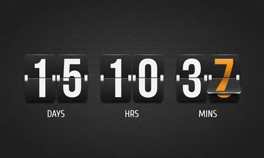
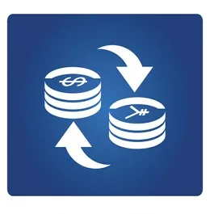
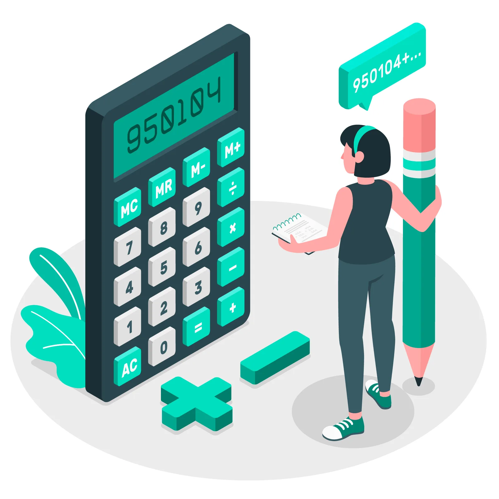
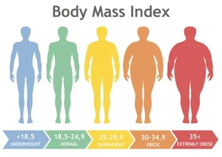
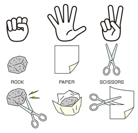

It’s no news that Python is one of the programming languages making the whole tech community buzz with excitement. Among the many reasons for its growing dominance are its versatility and simple syntax. That is, it is a sort of programming swiss knife that is yet easy to learn. From software engineering to web development to data science, Python gives everyone the license to build solutions that ease their day to day activities.

Image source: tenor.com

However, to enjoy the vast possibilities of Python, tutorials and learning is not enough. You have to get busy coding useful applications.

Why? Practicing accelerates your learning journey since you are likely to make mistakes and learn from them. Learning from these mistakes builds your confidence to experiment and attempt even tougher things as you know will end up debugging and finding solutions. Building projects also gives you an idea of what a complete project life cycle looks like: ideation, implementation, testing and deployment. And with that you are on your way to becoming a master of the tool.

## Beginners python Project
At Data Insight, core among our aims is to democratize Python skills. To achieve this, we daily publish Python projects that anyone can use to become professional. In this article, we will be looking at some of these Python projects that beginners can play with to become better. For ease of following through the long list, these projects are divided into six categories based on their functions: **simplifiers**, **converters**, **generators**, **checkers**, **calculators**, and **games**.

Let’s delve in and check them out!

> *Click the project name to view the source code*

### Simplifiers
[Simple AI Greeter](https://www.datainsightonline.com/post/ai-greeter-using-datetime-and-string-formatting)

[Countdown Timer](https://www.datainsightonline.com/post/countdown-timer-in-python)

[Song Picker](https://www.datainsightonline.com/post/palindrome-or-not)

[Website Blocker](https://www.datainsightonline.com/post/python-focus-a-simple-website-blocker-app)

[Binary Search Algorithm](https://www.datainsightonline.com/post/binary-search-algorithm-using-python)

[Temperature sensor](https://www.datainsightonline.com/post/temperature-sensor-in-python)

[Email Splitter](https://www.datainsightonline.com/post/email-splitter-for-separating-the-username-and-domain-name-2)

[Character Counter](https://www.datainsightonline.com/post/character-count)

These are Python beginner projects that can simplify some of our daily activities. Below is a brief explanation of each.

**1.** [**Simple AI Greeter**](https://www.datainsightonline.com/post/ai-greeter-using-datetime-and-string-formatting)
Are you the very busy type that almost always forget what time of the day it is and what you ought to be doing at the time? And wouldn’t your Python journey be more interesting if you could use it to solve your own problem?

Yes! Python got you covered with its datetime library as you can set up a personal AI assistant to greet you and keep you alert. In addition, this simple but useful project will expose you to playing with Python string methods depending on how you want your fancy AI assistant to greet you: hello, lunch time… It’s 2:20pm. Let’s get to the gym, Betty.

**2.** [**Countdown Timer**](https://www.datainsightonline.com/post/countdown-timer-in-python)
You can add to the AI greeter to gradually build a collection of productivity tools. You’ve got to end your stay at the gym and get on to something else, code your way out with a countdown timer.

With a few lines of code, you will have a timer that takes in an integer as seconds and counts down to zero, or however you choose to customize. Build this project on your desktop computer and everyone around you would probably want to have the same on theirs.

**3.** [**Song Picker**](https://www.datainsightonline.com/post/song-picker-program)
How about using Python to make something handy for music lovers? Perhaps someone will dance to your codes! Folders within folders is sometimes the journey it takes to get to a certain genre of music on our devices. With this project, a user can just type in the name of the particular genre of music they wish to listen to and, boom, a song from the genre starts blaring.

The beauty of this is that you have control over what kind of music goes into what genre and don’t have to keep racking your head about where to find a particular song if you are the type that concerns yourself more with the harmony of songs than genre. Another good thing about the project is that it requires nothing more than the Python random module, data containers and conditional statements. Voila!

**4.** [**Website Blocker**](https://www.datainsightonline.com/post/python-focus-a-simple-website-blocker-app)

This is a project that will definitely catch the interest of many who are trying to keep online and social media distractions at bay.
What this minor Python project does is write the list of selected websites to be blocked to host.txt file (an operating system file used to map an IP address to domain names) and redirect the path of the host for a specified period of time. Once this period elapses the website can load again. Having this type of project on your portfolio would most likely make employers smack their lips at your ingenuity.

**5.** [**Binary Search Algorithm**](https://www.datainsightonline.com/post/binary-search-algorithm-using-python)
This is another very useful project a beginner can use to test the water with Python, particularly win control flow. Binary search is a very useful method when it comes to searching for an item in an ordered array. Think of a dictionary where you’re looking for a word that starts with the letter P. You open it halfway, say at letter L. You know then that the left half of the dictionary is no more useful and so you discard it and treat the remainder as a whole dictionary and open halfway again and continue the process. This is the intuition behind the binary search and can be easily employed to search in a vast array of data for any element you want quickly.

**6.** [**Temperature sensor**](https://www.datainsightonline.com/post/temperature-sensor-in-python)
Ever seen your smartphone on a hot sunny day display an image of a thermometer and warn that your phone is overheated? Or your pressing iron automatically breaking from the electrical circuit at a certain degree of hotness? That is because there is a built-in temperature sensor that is programmed to not only sense temperature but also give off signals when the temperature reaches a predefined point.

This project will most likely test your use of Python function since it involves a couple of interactions between converting voltage value (which is in the form of an analog signal) to a digital signal and then converting this to the actual temperature value.

**7.** [**Email Splitter**](https://www.datainsightonline.com/post/email-splitter-for-separating-the-username-and-domain-name-2)
This is a rather simple but handy project that is used to separate username from domain name in an email address. It basically involves splitting strings of alphabets with respect to the @ character. Yes simple but perhaps may be your first step into Python for natural language processing.

**8.** [**Character Counter**](https://www.datainsightonline.com/post/character-count)
Today we live in a world where we get bombarded every minute with information. From news articles to social media handles and notifications, an average smartphone user has to do a lot of skipping and skimming through to get the information they deem vital to staying updated as well as sane. That’s why we see some blog post platforms and social media networks limiting their posts to certain word or character count. This is obviously a project you want to try out.

### Converters
[Currency Converter](https://www.datainsightonline.com/post/creating-currency-converter-with-the-help-of-tkinter-python-gui)

[Temperature Converter](https://www.datainsightonline.com/post/temperature-conversions)

[Speed Converter](https://www.datainsightonline.com/post/speed-converter)

[Seconds to Year Converter](https://www.datainsightonline.com/post/how-to-convert-seconds-to-years-with-python)

[Binary to Decimal Converter](https://www.datainsightonline.com/post/python-program-to-convert-binary-number-to-decimal)

[Number to Word Converter](https://www.datainsightonline.com/post/number-to-word-converter)

[Roman Numerals to Decimal Converter](https://www.datainsightonline.com/post/convert-roman-numbers-to-a-decimal-using-python)

This set of Python projects are used for converting from one unit of measurement or data type to another. These projects are very useful in real life situations.

**9.** [**Currency Converter**](https://www.datainsightonline.com/post/creating-currency-converter-with-the-help-of-tkinter-python-gui)

This project collects units of a currency and outputs units of another currency. This would be better with a GUI where there is a dropdown of currencies for both the input and the output options. The Python currency converter package can help with historical rates of currencies.

**10.** [**Temperature Scale Converter**](https://www.datainsightonline.com/post/temperature-conversions)
Temperature is measured in different units and each unit has its own use. Making a project where users can easily convert from one unit of temperature to another will be a great idea. Another interesting part of this project is that it will test your understanding of doing arithmetic operations in Python since there are certain formulas you need to code for the conversion to work.

**11.** [**Speed Converter**](https://www.datainsightonline.com/post/speed-converter)
This project provides vice versa conversion of speed in its various units of measurement. Like the case of the temperature converter above, all you need to correctly is code the formulas correctly and your project is done.

**12.** [**Seconds to Year Converter**](https://www.datainsightonline.com/post/how-to-convert-seconds-to-years-with-python)
Though simple on the surface, this project may be a little tricky. If you ever read the nursery rhyme that says, 60 seconds make one minute, 60 minutes make one hour, 24 hours make one day… you will quickly realize that there are quite a number of hurdles to cross between a second and a year.

However, with the Python datetime module and a knowledge of the mathematics needed to move between time concepts, you’re good to go.

**13.** [**Binary to Decimal Converter**](https://www.datainsightonline.com/post/python-program-to-convert-binary-number-to-decimal)
If you have passed through this topic in high school mathematics, you probably wouldn’t mind having a program that can easily provide you an answer in one click. Yes, it's simple, but requires a bit of carefulness not to make mistakes in the arrangement of the binary digits or in applying exponentiation to them.

All said, you could be the hero of some high school students if you create this project and share it with them. You could also make it a full solution by creating a reversed converter.

**14.** [**Number to Word Converter**](https://www.datainsightonline.com/post/number-to-word-converter)
If you need a project that will test your logical reasoning, here is one. First and foremost, it requires that you do some partitioning with respect to place value. This partitioning can then be extended to arrays of words. Once this is done, you can carry on with a series of conditional statements that will check the place value of a digit in a number and print the corresponding word form. This is definitely a portfolio booster.

**15.** [**Roman Numeral to Decimal Converter**](https://www.datainsightonline.com/post/convert-roman-numbers-to-a-decimal-using-python)
Rounding up the converter Python project ideas is the Roman numeral to decimal converter. This project involves assigning the correct values to each of the seven alphabets that make up the Roman numeral. Then bulk of the remaining work is writing codes that carry out either addition or subtraction on adjacent letters depending on their positions.

### Generators
[QR Code Generator](https://www.datainsightonline.com/post/personal-info-to-qr-code-encoder)

[Acronym Generator](https://www.datainsightonline.com/post/generate-easy-acronyms-with-python)

[Random Password Generator](https://www.datainsightonline.com/post/random-password-generator-using-python)

[Fibonacci Sequence Generator](https://www.datainsightonline.com/post/fibonacci-sequence)

You can generate values with these Python projects:

**16.** [**QR Code Generator**](https://www.datainsightonline.com/post/personal-info-to-qr-code-encoder)

With Python qrcode library, you can encode different information in a QR code. Once the qrcode method is called on the provided information, a QR code is generated and you can just save it. The link provided encodes personal data; you can go further to encode documents, products, etc.

**17.** [**Acronym Generator**](https://www.datainsightonline.com/post/generate-easy-acronyms-with-python)
Acronyms are cool ways of making long, weary words shorter and pronounceable in a breath. How cool! Perhaps it would be cooler if you take this idea and implement it with your own words. The code in the link uses just the initial letter of each word to generate the acronyms. You could play with the first two initial letters of each word or invent another pattern entirely. It’s your code!

**18.** [**Random Password Generator**](https://www.datainsightonline.com/post/random-password-generator-using-python)
Passwords are a combination of alpha-numeric and special characters used to confirm identity and secure data. While this project is quite straightforward, its usefulness cannot be overemphasized.

In fact if you do not wish to do it for learning purposes, just do it for your own personal use so you can easily generate secure passwords for your many activities on the internet. This is a highly recommended Python project.

**19.** [**Fibonacci Sequence Generator**](https://www.datainsightonline.com/post/fibonacci-sequence)
Generating a Fibonacci sequence with Python is as easy as understanding how the sequence works itself. You don’t need any extra library or module; all you need is to translate the formula into codes and control it with a loop.

### Checkers
[Anagram Checker](https://www.datainsightonline.com/post/the-anagram)

[Armstrong Number Checker](https://www.datainsightonline.com/post/armstrong-number-checker-app)

[Email Address Validity Checker](https://www.datainsightonline.com/post/email-checker)

[Palindrome Checker](https://www.datainsightonline.com/post/palindrome-or-not)

[Prime Number Checker](https://www.datainsightonline.com/post/checking-the-number-if-it-is-prime-or-not)

[Leap Year Checker](https://www.datainsightonline.com/post/leap-year-checker)

Have you been looking for projects that check whether or not your input has certain features and return a Boolean value or other string values as deemed fit? Look no further. You simply are looking for checkers Python projects. Browse what we have on our list here for inspiration and start coding away:

**20.** [**Anagram Checker**](https://www.datainsightonline.com/post/the-anagram)
Anagram is any word formed by rearranging the letters of another word. The original word itself is called the subject of the anagram. The example link here allows users to simply input two different words of equal character length and then return a value that says whether or not they are anagram of each other. Make this project yours with some interesting tweaks. For instance, instead of entering two words, you could make it just one word and the output would be the corresponding anagram(s) or none (if it has none). You could even go as far as displaying the rearrangement of words with animation. Wouldn’t that be super cool?

**21.** [**Armstrong Number Checker**](https://www.datainsightonline.com/post/armstrong-number-checker-app)
Solving puzzles is one of the best ways to learn any programming language and an Armstrong number checker project with Python will afford you just that. To check if a number is an Armstrong number, all you need is a function that can tell you the number of digits that make up the number and another function that takes the sum of each digit raised to the power of the number of digits. Adding a GUI, like it is in the link provided, would make it even more elegant. You sure can do it!

**22.** [**Email Address Validity Checker**](https://www.datainsightonline.com/post/email-checker)

Checking if an email address is valid basically requires that you check the syntax rules for email address. There are four of them: the name, the @ character, the domain name, and the top-level domain name (.com, etc.) Once these rules are established, then you can employ Python regular expressions to create a pattern to match the rule. Finally, you set a conditional statement to produce the Boolean output or as you wish to customize when email addresses are tested. Easy-peasy!

**23.** [**Palindrome Checker**](https://www.datainsightonline.com/post/palindrome-or-not)
Another puzzle to play with, palindrome is a simple and fun project you would complete in a few lines of code. The reversed method of Python strings and a conditional statement should get it all rolling. Who knows, this might be the beginning of your adventure into creating a program that parses long texts and suggests possible word-unit palindromes that could replace some boring sentences. Crazy, right? Just keep coding!

**24.** [**Prime Number Checker**](https://www.datainsightonline.com/post/checking-the-number-if-it-is-prime-or-not)
This is another simple project you can use to test your logical reasoning. Perhaps not the type of project you want to boast of on your resume, but it will still keep you in the loop of better understanding your programming language. It’s worth playing with.

**25.** [**Leap Year Checker**](https://www.datainsightonline.com/post/leap-year-checker)
What is the essence of leap years? Perhaps this same question has once crossed your mind. Well, do a search on Google and you would likely pick up this project without hesitation. Maybe you can develop a better way to code this checker, but, personally, the link provided uses a method that looks more or less custom. Kindly be our generic solution!

### Calculators
[GPA Calculator](https://www.datainsightonline.com/post/gpa-calculator-implementation-using-python)

[Profit and Loss Calculator](https://www.datainsightonline.com/post/profit-and-loss-calculator)

[Simple Interest Calculator](https://www.datainsightonline.com/post/simple-interest-calculator)

[Body Mass Index Calculator](https://www.datainsightonline.com/post/body-mass-calculator-using-python)

[Factorial Calculator](https://www.datainsightonline.com/post/python-program-to-find-the-factorial-of-an-integer)

[Greatest Common Divisor Calculator](https://www.datainsightonline.com/post/greatest-common-divisor-calculation)

Every now and then we run into concepts that require us to do some arithmetic, so developing Python calculators is a necessity. Below are some calculators you want to try out:

**26.** [**GPA Calculator**](https://www.datainsightonline.com/post/gpa-calculator-implementation-using-python)
Want to become friends with all college students? Then build this app. Cheeky, right? Anyway, grade point average calculator for measuring students’ performance is a way to improve not only your Python skill but also to lay claim to solving real-life problems since GPA calculators are software used extensively in the educational industry.

Plus, you can make it more commercial by making it accommodate various scaling systems.

**27.** [**Factorial Calculator**](https://www.datainsightonline.com/post/python-program-to-find-the-factorial-of-an-integer)
Where are the mathematics gurus? Can you tell us what the factorial of 10 is? That would probably require some prior knowledge of the answer or a great deal of mental processing to give the answer quickly. That’s why you need a factorial calculator to brain it for you. But when coding this, don’t forget to set a limit so as not to exceed the integer value that can be stored in the IEEE 754 double-precision floating-point format and not send a user’s system reeling when the factorial of a large value is sought.

**28.** [**Profit and Loss Calculator**](https://www.datainsightonline.com/post/profit-and-loss-calculator)
Keeping track of how money goes in out of any venture is a serious business, and building a calculator to ease this task is a serious project too. All you need to get this calculator churning away numbers is just profit and loss formulas. The rest is history.

**29.** [**Simple Interest Calculator**](https://www.datainsightonline.com/post/simple-interest-calculator)
Still in the mood of business, you can go a step further and add a simple interest calculator to your list. Why? The financial world is hardly ever torpid and thus your project will most likely be used and appreciated. Give it a GUI and you are on your way to building even complex calculators.

**30.** [**Body Mass Index Calculator**](https://www.datainsightonline.com/post/body-mass-calculator-using-python)

This is a pretty straightforward project that involves dividing the weight of the body by the square of the body height. However you would need to specify the BMI category along with the result for better interpretation. Also, providing an option for different measurement units like kg(pounds) and feet(inches) would make it much more versatile.

**31.** [**Greatest Common Divisor Calculator**](https://www.datainsightonline.com/post/greatest-common-divisor-calculation)
Otherwise known as highest common factor, this calculator collects two numbers, checks if they are non-zero, then carry out some arithmetic to fish out the highest divisor common to both of them. Maybe the technical application is not obvious enough, but there are many simple ways of using GCD. For instance, it can be used for evenly distribution of items into their largest possible grouping. You can extend the idea to accommodate more than two numbers.

### Games
[Number Guessing Game](https://www.datainsightonline.com/post/guess-the-number-using-python)

[Tic Tac Toe Game](https://www.datainsightonline.com/post/simple-tic-tac-toe-game)

[Card Draw Game](https://www.datainsightonline.com/post/a-simple-cards-draw-game)

[Dice Rolling Game](https://www.datainsightonline.com/post/rolling-a-dice-randomly)

[Rock Paper Scissors Game](https://www.datainsightonline.com/post/rock-paper-scissors-the-game)

[Coin Toss Game](https://www.datainsightonline.com/post/simple-apps-with-python-coin-toss-game)

[Guess the Word Game](https://www.datainsightonline.com/post/guess-the-word-game)

[Hangman Game](https://www.datainsightonline.com/post/simple-app-using-python-hangman-game)

[Caesar Cipher Game](https://www.datainsightonline.com/post/caeser-cipher-game)

The last set of Python projects in this article are games. Yes, you can build games as part of your beginner projects. Check the list of games below to see the ones that catch your fancy:

**32.** [**Number Guessing Game**](https://www.datainsightonline.com/post/guess-the-number-using-python)
This program allows users to guess a number the computer has randomly chosen. If the user guesses correctly, they score points. If they guess wrongly, they get a clue, and for every clue given there’s a deduction in point. Certain rules have to be clearly displayed before the game starts so the user will be kept in the loop -- rules like the range of all possible random numbers to guess from and the maximum number of times to guess. It’s as fun a game as it is to code.

**33.** [**Tic Tac Toe Game**](https://www.datainsightonline.com/post/simple-tic-tac-toe-game)
Two players take turns to place patterns in a 3 by 3 square grid, and the first to create a horizontal, vertical, or diagonal stretch of their pattern wins the game. I always think the first player in this game has an unfair advantage; perhaps your code will check my assumption.

Away from that, the link provided uses tkinter, time, and the random library, but you can also use the Pygame library.

**34.** [**Card Draw Game**](https://www.datainsightonline.com/post/a-simple-cards-draw-game)
In this game, the user and computer will both draw cards by turns a number of times and whoever has cards with the larger sum wins the game. Just like in the number guessing game above, rules have to be stated. The link provides a clear idea of how to build this game, but experimenting is allowed.

**35.** [**Random Dice Rolling Game**](https://www.datainsightonline.com/post/rolling-a-dice-randomly)
If rolling dice isn’t a random experiment, this project is one that would probably lure gamblers over to see if there’s a way to throw a six every time a dice rolled. Unfortunately (for them, lol), this project basically shows users different ways of rolling dice randomly with no bias. However, one of the methods can be built on to play a dice rolling game. The Python package needed to build this is the random package.

**36.** [**Rock Paper Scissors Game**](https://www.datainsightonline.com/post/rock-paper-scissors-the-game)

This is a game played by two persons in which each player forms either a rock, a paper, or a scissors shape with an outstretched hand. There is a sort of categorization between these shapes that determines who wins and loses. The example link uses name strings to represent these shapes. You can improve on it by using visuals. Similar to other games, the Python random package and conditional statement should flesh out this idea.

**37.** [**Coin Toss Game**](https://www.datainsightonline.com/post/simple-apps-with-python-coin-toss-game)
Coin toss game is another interesting project you can sharpen your learning with. A two-man game, each player predicts the outcome of three consecutive coin tosses. The coin is then flipped until at least the prediction of one of the players matches the outcome of the toss.

**38.** [**Guess the Word Game**](https://www.datainsightonline.com/post/guess-the-word-game)
Want to help users improve their vocabulary? This is the project to pick up. Make a list of words to guess, create a variable that holds the number of times a user can guess, define a function that randomly selects a word to guess from the list created and you’re a few codes away from building a game for the user to guess away.

**39.** [**Hangman Game**](https://www.datainsightonline.com/post/simple-app-using-python-hangman-game)
If you successfully code the “guess the word” game above, then you should have no trouble coding this game as the both are very similar. The major difference is that hangman game is a type of paper-and-pencil game and you may need to flesh out that feel with a visual layout.

**40.** [**Caesar Cipher Game**](https://www.datainsightonline.com/post/caeser-cipher-game)
Finally, give Caesar what belongs to Caesar by trying your hand on the Caesar Cipher game. If you’ve ever had to encrypt or decrypt a message, or better still ever needed to send secure messages, then this Python project would make that process even much more fun. With a predefined number of left or right shifts of alphabets, you would be able to represent each letter with another letter (its cipher) and go back and forth between each letter when writing. You don’t want to miss out on this game!

## FAQ
What a long list! Now the ultimate questions:

**Do I have to attempt all the Python projects?**

No, you don’t have to attempt it all. That’s why we’ve provided a long list for you to choose from. Scroll through, check the example links provided for better understanding and pick the ones that appeal the most to you. Just make sure you code!

**Which of the projects are best for my portfolio?**

There’s no one that cannot be used in your portfolio. Just make sure your code follows best practices and solves a problem.

**What platform is best suited for outputting these projects?**

You can explore the web option so that anyone with internet connection can access your applications. You can also try building a desktop app, which leaves you with less worries about the front-end of your app. Either way is fine.

Thank you for reading!
