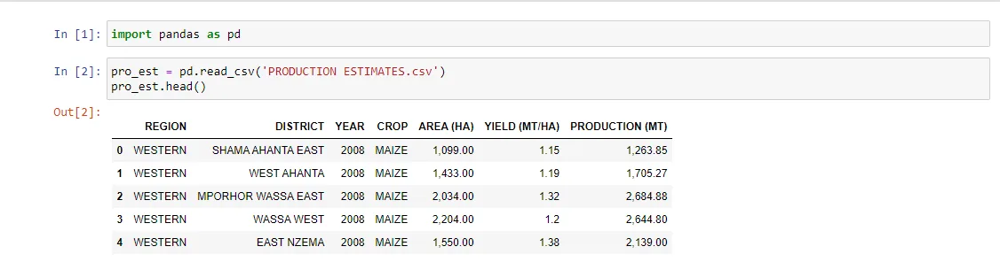
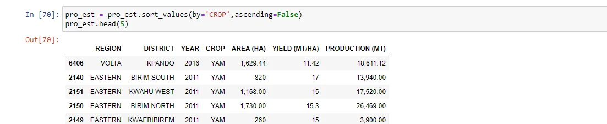
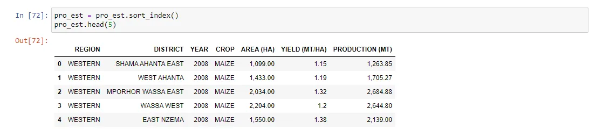
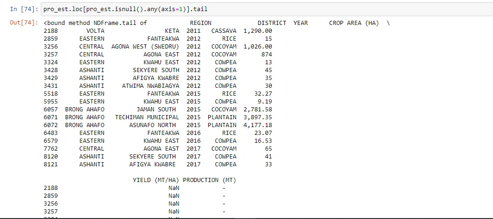
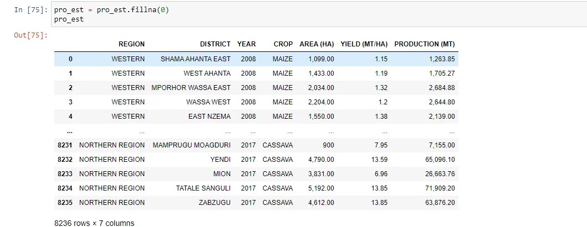
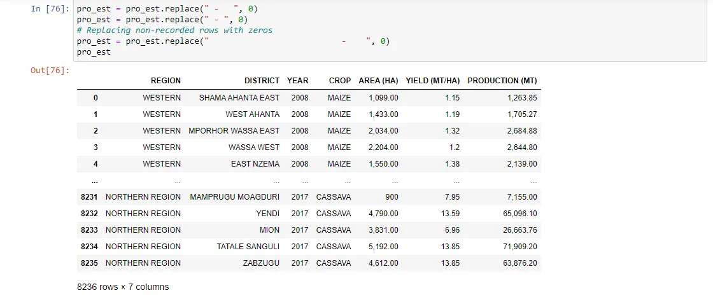
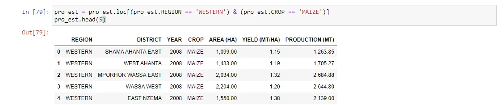

Python is one of the most valuable skill needed for a data science career.
Though it hasn’t always been, Python is the programming language that data scientists consider top notch. Python provides the greater ecosystem of a programming language and the base of good scientific computation libraries.

Real-world data is messy. That brings about the existence of libraries like pandas, which are so valuable. Pandas is an open-source python library that implements easy, high-performance data structures and data analysis tools. The name "Pandas" comes from the term ‘panel data’, which relates to multidimensional data sets found in statistics and econometrics.

Using pandas, you can take the pain out of data manipulation by extracting, filtering, and transforming data in DataFrames, clearing a path for quick and reliable data. With that in mind now, let's consider five useful pandas techniques in python for data Manipulation. We will be using a data frame to explain these techniques and the data frame we'll use is called 'Production Estimates'.

But before you proceed, don't forget the necessary thing every data scientist must do before anything else. Do you know?

Yeah, you are right, we have to import the library first.

```python
import pandas as pd
```

Note, 0ne of the most familiar things that pandas is used for is reading in CSV(Comma Separated Values) files, using pd.read_csv. It is often the starting point for using pandas. pd.read_csv loads the data into a Data Frame. This can be considered as essentially a table or spreadsheet. Once loaded we can take a quick glimpse of the dataset by calling head() on the data frame.



Now we have our data set loaded, let's dive into out pandas techniques to manipulate data.

1. Sorting Data Frames:

Data in the real world is often messy, and if time not taken, one can feel lost in the immense data. Now, as you are a data scientist, you are a data detective. You'll have to investigate by looking closely at the various trends in the data. What better way to start than to sort the data in the data frame.

Let’s now see how we can perform sorting in pandas. Pandas support three kinds of sorting: sorting by index labels, sorting by column values, and sorting by a combination of both. Let’s now look at the different ways of sorting this dataset with some examples:





2. Inputting missing values in pandas:

Now we have sort the data frame, we have to check if there is any missing value, so we can easily manipulate through the data. How do we go about this? First, we call the .info() on our data frame to find information on the data set. Then we call isnull() with an axis = 1 to find all the null values in the data frame. When we are done, we then call the .fillna() function passing 0 to it to fill the null values with 0. It sounds confusing right, don't worry, look below to see how the code is written.

Besides using the .fillna(), our dataset has some values that are not needed.

```python
pro_est.loc[pro_est.isnull().any(axis=1)].tail
```



```python
pro_est = pro_est.fillna(0)
```



```python
pro_est = pro_est.replace(" - ",0)
pro_est = pro_est.replace(" -  ",0)
pro_est = pro_est.replace("                   -  ",0)
```



3. Converting a column from a one type of value to another:

Great, now as a detective, you have neatly arranged your data to be viewed. Wait a minute, did you check the values in the columns to see if their values corresponds to that of information given form the .info() we called earlier. Well, from the dataset "Production Estimates", columns such as area and yield have numeric data but from the .info(), they are considered as objects, in other words, categorical values. Can we do something about that. Yes, with the pandas library, almost everything is possible. Let's go through.

To convert one column from its initial data to another, we call pd.to_numeric() on those columns. Here is how it's done.

```python
pro_est['AREA (HA)'] = pd.to_numeric(pro_est['AREA (HA)'])
```

```python
pro_est['YIELD (MT/HA)'] = pd.to_numeric(pro_est['YIELD (HA)'])
```

```python
pro_est['PRODUCTION (MT)'] = pd.to_numeric(pro_est['PRODUCTION (HA)'])
```

4. Sub setting DataFrames in pandas:

Now, our data is well organized with the correct values. We can look closely at the data and interpret it. In pandas, we can sub set the data set looking closely at the various columns and relating them together to get the big picture behind the data set.

Taking our "Production Estimates" data set, let's consider the Western region with respect to the production of maize by sub setting the data frame.

```python
pro_est = pro_est.loc[(pro_est.REGION == 'WESTERN') & (pro_est.CROP == 'MAIZE')]
pro_est.head(5)
```



5. Using the groupby() function:

The “groupby()” function is very useful in data analysis, why, because it allows us to unveil the underlying relationships among different variables. We can then apply Aggregations as well on the groups with the “**agg()**” function and pass it with various aggregation operations such as mean, size, sum, std etc. We sub set the "Production Estimates" data set considering the region and the crop, we that let group by and find the mean.

```python
pro_est = pro_est.groupby('REGION')
```

```python
pro_est = pro_est.groupby('REGION').agg(np.mean)
```
