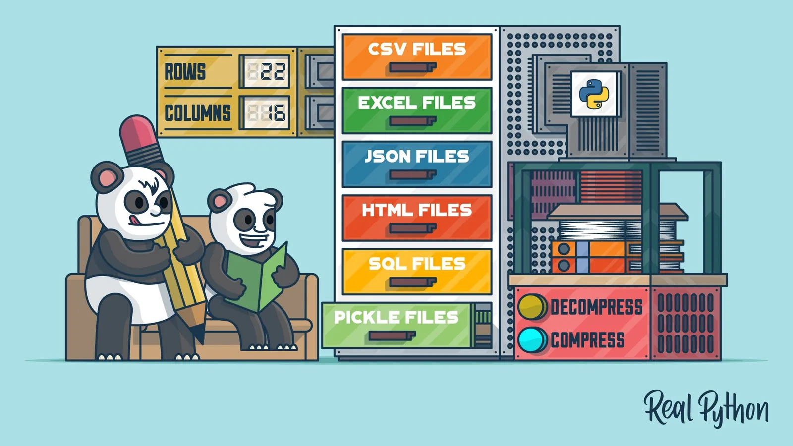

###### Photo Courtesy: [Real Python](https://realpython.com/)

## Introduction

Pandas is a python library commonly used to analyze data. Pandas functions can be very effective in analyzing large datasets and making decisions based on the analysis.

By using the pandas technique, we can clean untidy datasets and make them readable. We all know that data is a crucial factor in data science. In this article, I am going to discuss five pandas techniques that might come in handy in analyzing data. Topics to be discussed,

1. Series
2. Pivot Table
3. Boolean Indexing
4. Groupby
5. Iteration

If you wanna learn more about pandas check their official docs [here](https://pandas.pydata.org/docs/getting_started/index.html).

Let's get started.

## 1. Series

Pandas series is a single-dimensional array capable of holding every kind of data(int, float, String, etc. ). A pandas series can be created by using the following [constructors](https://pandas.pydata.org/docs/reference/api/pandas.Series.html).

```python
class pandas.Series(data=None, index=None, dtype=None, name=None, copy=False, fastpath=False)
```

According to an [article](https://towardsdatascience.com/pandas-series-dataframe-explained-a178f9748d46) of towards data science, The data parameter similar to Series can accept a broad range of data types such as a Series, a dictionary of Series, structured arrays, and NumPy arrays. In addition to being able to pass index labels to index, the DataFrame constructor can accept column names through columns.

Let's create an empty series by using pd.Series method.

```python
#import the pandas library and aliasing as pd
import pandas as pd
ser = pd.Series()
print(ser)
```

**Output**

```python
Series([], dtype: float64
```

We can create a ndarray series with the help of NumPy. For that, we need to import numpy aliasing as np.

```python
import numpy as np
data = np.array(['rubayat','tithi','smriti','sejyoti','robbert','danny'])
ser = pd.Series(data)
print(ser)
```

Output

```python
0    rubayat
1      tithi
2     smriti
3    sejyoti
4    robbert
5    danny
dtype: object
```

As we are not setting any index so by default index is starting from 0. We can set the index as we want. Let's see an example.

```python
ser = pd.Series(data,index=[10,11,12,13,14,15])
print(ser)
```

That was easy right? Just set the index with the numbers as per your wish and you are good to go! Well, let's check the output.

```python
10    rubayat
11      tithi
12     smriti
13    sejyoti
14    robbert
15      danny
dtype: object
```

Wow! that's nice though. Let me show you some other examples.

We have created a series of lists, some of you might be thinking about dictionaries too right?

```python
data = {'a' : 'tithi', 'b' : 'rubayat', 'c' : 'tamanna', 'd':3}
seriesDict = pd.Series(data)
seriesDict
```

```python
a      tithi
b    rubayat
c    tamanna
d          3
dtype: object
```

There you are!! Congratulations to you, you've just created a series of a dictionary.

## 2. Pivot Table

We all know about pivot tables in ms excel but what we might not know is pandas have a method named pivot table that is pretty similar to excel's pivot table. A pivot table is used to get full insight into a large dataset. We can get the sum, mean, median, max, min, and standard deviation of a dataset by using a pivot table. Let's check an example.

For the pivot table, I am using a dataset that can be downloaded from [here](https://www.dataquest.io/blog/pandas-pivot-table/). The dataset contains world happiness report.

```python
import pandas as pd
import numpy as np

data = pd.read_csv('/content/data.csv', index_col=0)
data.head()
```

Import necessary libraries and read the dataset using the pandas read_csv method.

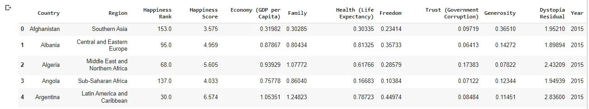

As I set the index to start from 0 so it started as it should. Remember head() prints the first 5 rows from the dataset.

To make a pivot table, we gonna need an index. Let's make the country column our index.

```python
pd.pivot_table(data,index=["Country"])
```

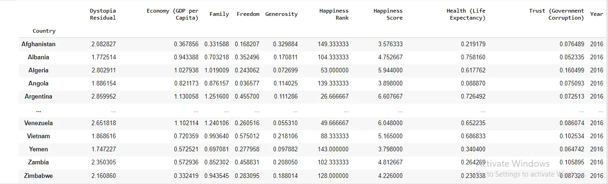

We have successfully set the country column as our index. Let's make a very simple pivot table. We are going to use multiple indexes for our pivot table.

```python
pd.pivot_table(data,index=["Country","Year"],values=["Happiness Rank"])
```

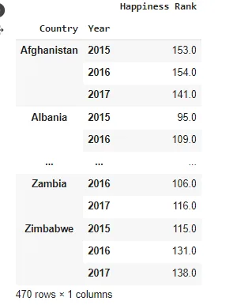

We can check the economy for every country by simply changing the value property.

```python
pd.(data,index=["Country","Year"],values=["Economy (GDP per Capita)"])
```

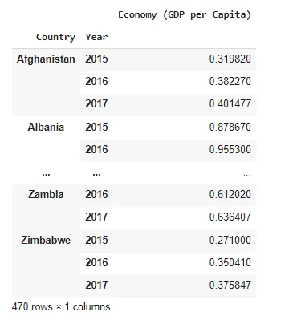

We can also use the aggfunc property to calculate the mean, median, std, and so on.

```python
pd.pivot_table(data,index=["Country","Year"],values=["Economy (GDP per Capita)"],aggfunc = np.mean)
```

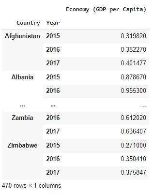

In the above output, nobody will understand the GDP per capita for each year. Well, I can solve the problem for you.

```python
pd.pivot_table(data,index="Country" , columns= "Year",values=["Economy (GDP per Capita)"],aggfunc=np.mean)
```

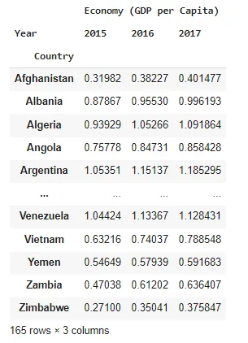

Now! It's pretty perfect. We can see GDP per capita each year.

Let's check the visual effect of this dataset.

```python
import matplotlib.pyplot as plt
import seaborn as sns
# use Seaborn styles
sns.set()
pd.pivot_table(data, index= 'Region', columns= 'Year', values= "Economy (GDP per Capita)").plot(kind= 'bar')
plt.xlabel('Regions')
plt.ylabel("GDP per Capita")
plt.title('Region vs Economy (GDP per Capita)')
```

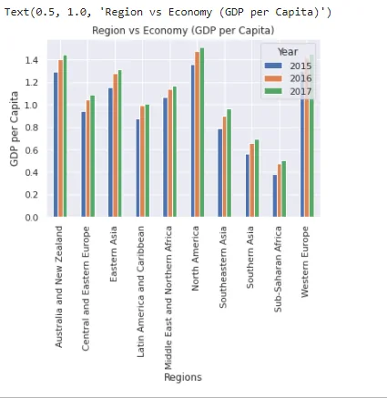

That's all for now. If you wanna know more about pandas pivot table check out their official [docs](https://pandas.pydata.org/docs/reference/api/pandas.DataFrame.pivot.html).

## 3. Boolean Indexing

Boolean indexing takes two values only either true or false. It can be used to filter data. Data can be filtered in four ways.

- Accessing a DataFrame with a boolean index
- Applying a boolean mask to a data frame
- Masking data based on column value
- Masking data based on an index value

If you want to access data by using boolean values, you can do that by using boolean indexing. For example,

```python
dict = {'name':["rubayat", "tithi", "tamanna", "trina"],
        'degree': ["MICT", "BCSE", "M.Tech", "MBA"],
        'score':[90, 40, 80, 98]}

df = pd.DataFrame(dict, index = [True, False, True, False])
df
```

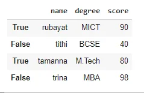

Now that, we have created a data frame with boolean index, a user can access this data frame by using 3 functions such as loc[], iloc[], and ix[]. Let's check examples one by one.

### Accessing dataset by using loc[]
We will be using the same dictionary that we have created earlier.

```python
df.loc[True]
```

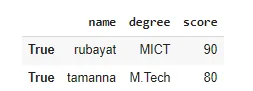

### Accessing dataset by using iloc[]
```python
df.iloc[True]
```

You might be thinking that the above piece of code will work. But you are wrong!

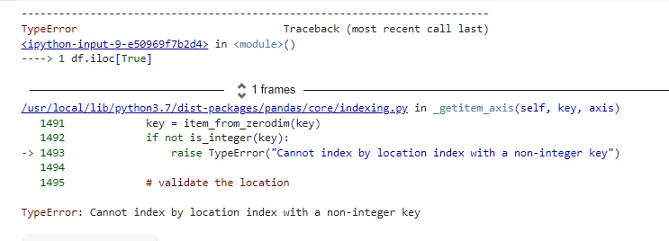

This should be written like below

```python
df.iloc[1]
```

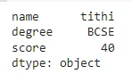

That's all for boolean indexing in this article. Check out [this](https://www.geeksforgeeks.org/boolean-indexing-in-pandas/) article from geeks for geeks for more details.

## 4. Groupby

A groupby operation involves some combination of splitting the object, applying a function, and combining the results. This can be used to group large amounts of data and compute operations on these groups.

Check out their official [documents](https://pandas.pydata.org/docs/reference/api/pandas.DataFrame.groupby.html).

Let's modify the dictionary a little bit.

```python
dict = {'name':["rubayat", "tithi", "tamanna", "tithi"],
        'degree': ["MICT", "BCSE", "M.Tech", "MBA"],
        'score':[90, 40, 80, 98]}
df = pd.DataFrame(dict)
```

Now groupby name key and check the mean value.

```python
df.groupby(['name']).mean()
```

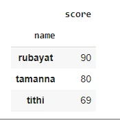

Check out their official docs for more details.

## 5. Iteration

The behavior of the iteration depends on the data type. To be very precise, if you are iterating a series then it behaves like an array. And other data types behave like dictionary type values(key and value).

There are 3 functions od iterations.

1. iteritems()
2. iterrows()
3. itertuples()

I will show only one example here. Because this article is getting big and it can be boring.

### Using Iteritems() method to access data in key, value** **pairs****.
```python
for key,value in df.iteritems():
print (key,value)
```

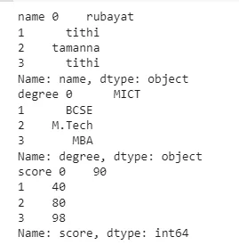

Well, Thanks for reading my article. You can check my other articles here on data insight online.

The full code of this article can be found [here](https://colab.research.google.com/drive/1o7p2-1-fw_L0DyJpQa-v06PuOf1pZlYv?usp=sharing).
