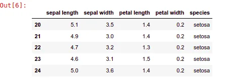
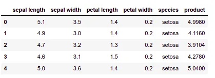
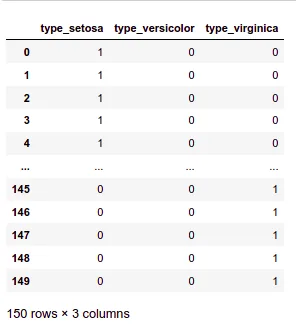
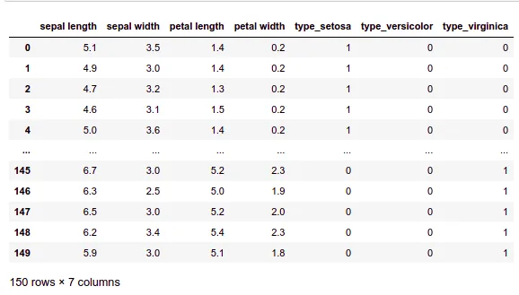

Did you come here thinking this article is actually about pandas? Am sorry, it's the Python Pandas library :(. But now that you're here, why not learn some techniques this library has to offer.

As described by its creators: "**pandas** is a fast, powerful, flexible and easy to use open-source data analysis and manipulation tool,

built on top of the [Python](https://www.python.org/) programming language." And to put it simply, I can't describe it any better than that. Every single word in that description is 100% true. Of course, am not saying pandas is the fastest library for data manipulation. But the ratio of available functions at the tips of your fingers with the use friendliness they offer against its speed. It's one hell of a bargain when deciding what library to use in your data-centered work.

As promised, I will present to you 5 techniques in pandas that you'll want to know when using this library. I'll keep this in a chronological order that fits a typical data exploiting pipeline.

The techniques are the following:

1. **Data importing to pandas**
2. **cleaning the data(imputing missing values)**
3. **data querying**
4. **applying functions to the whole dataset with one** **single function call(apply functions)**
5. **"One Hot Encoding" categorical data**

A disclaimer: A lot of outputs are not present in the articles because it's simply not esthetic at all. So to avoid any clutter, [The notebook](https://github.com/zqngetsu96/DataInsight_Assignments_and_projects/blob/main/Assignment%203/Python%20data%20manipulation%20techniques%20with%20Python.ipynb) uploaded contains all the outputs with different examples.

## 1- Data importing:

This is the first step you'll go through no matter the data-centered task you'll encounter. How will you analyze data without importing it?

When importing data you have to watch out for a few things regarding the structure of your file:

**"Does it have column names? How are the values separated? What about each row's ID? Is the file really big?"**

Answering these questions is quite important for your data analysis task as it can help you avoid random value offsets or reading the data the wrong way. In simple terms, just like in the English language, the placement of the comma can change the whole meaning, so why shouldn't it be the same for data?

First things first, let's read our flowers dataset file the usual way in which we only watch out for the separation and the header and display the first few lines.

```python
data_frame = pd.read_csv('flower.csv',delimiter=',',header=0)
data_frame.head()
```

As you can see, I've specified a few things: The file path, the fact that values in each row are delimited by a comma with the **delimiter** argument, and, finally, the fact that the first row contains the column names with the **header** argument. The value 0 means that the first row contains the names. Pandas can also infer this on their own if you don't pass the row's number.

Now let's, say in another context, we're loading a set of employees and they are indexed with numbers starting from 1000, not 0.

In this case, we must reindex our data to fit the ID column in a dataset or offset it manually ourselves if it's not present like this example.

```python
#Reindex the data
new_index = np.arange(20,len(data_frame)+20)
data_frame.index = new_index
data_frame.head()
```



Now we have the index starting with 20 instead of 0. Use this trick to your needs. Sometimes it's a simple as using an "ID" column in your data as an index.

Finally, let's say our dataset is huge and our PC is somewhat tiny :(. We all hate lag. And most importantly, we have OutOfMemory exceptions... The solution? Load the dataset as chunks

```python
data_frame2 = pd.read_csv('flower.csv',delimiter=',',header=0,chunksize=20)
for chunk in data_frame2:
    print(len(chunk))
    print('This is the index range of the first row of the chunk: {}'.format(chunk.index))
print("Once you iterate all the chunks, You have to reload the dataframe, Once used it\'s gone!")
```

Check the notebook linked at the end of this article for the output. That way we don't clutter the article. This method allows us to read the dataset in sets of 20 as specified in this function call. and will only load the chuck when it's called into the memory. One thing to watch out for is the fact that the dataset is loaded within an **Iterator object** which means once you go through it you'll have to reload it. it doesn't loop back to the start. In the notebook, take a close look at how the ranges are specified in the output you'll see how clean and efficient this method is.

### 2- Cleaning the data (imputing missing values)

Real-world data is messy. It can be full of missing values or intangible ones. There are many ways to clean our data whether manually or using pandas built-in functions. And given we care about the latter methods I'll be showing you the almighty "fillna function".
Let's say while visualizing your data you notice that a column 'A' has a lot of missing values (marked as NaN for example). Now the question is will I have to loop over the values and fill them out myself? Write loops and stuff? No. Just use the fillna function like this:

```python
df = pd.DataFrame([[np.nan, 2, np.nan, 0],
                   [3, 4, np.nan, 1],
                   [np.nan, np.nan, np.nan, 5],
                   [np.nan, 3, np.nan, 4]],
                  columns=["col_1","col_2","col_3","col_4"])
data_frame['A'] = data_frame['A'].fillna(0)
```

Okay, this will replace all the NaN values with 0. Quite boring and inflexible you'd say. What else can we do with this:
Fill values with the median of the column in question. Instead of 0 specify the median value of the column you calculated beforehand.

Instead of just showing that boring change, let's spice it up with another trick alongside it. Filling values are column-specific, so let's use a shortcut that helps us change the columns in question with only one call.

```python
median_col2 = df['col_2'].median()
values = {"col_1":0 , "col_2": median_col2, "col_3": 2, "col_4": 3}
df.fillna(values).head()
```

There are other methods to fill data such as forward filling and backward filling. But these are prone to some outliers. it can leave the first or last row empty and as a personal opinion, I find them quite unrealistic. Why use the value from another row as value for this one. It's better to do it in a more statistically accurate manner such as a **median or mean**. it'll help maintain the original distribution of the data. To get a better feeling for how these work and the outputs, check out the link to the notebook at the end of the article. Giving this is going to be a long article, I find it better to keep it clutter-free.

## 3- Data querying
Let's get one thing out of the way, getting the data the old-fashioned way is plain out boring and you have to watch out for so many things especially if you have complicated conditions. who wants to pass complicated boolean conditions through NumPy these days?... Even without NumPy, I don't like using pandas default slicing when the condition gets a bit tricky.

The SQL querying language has proven its worth for so many years now. It can handle complicated conditions with multiple columns easily. So, if we get that in pandas which is already super fast and ergonomic, why not use it to make life even easier. Let's see some examples.

```python
data_frame = pd.read_csv('flower.csv',delimiter=',',header=0)
data_frame.columns = ['sepal_length','sepal_width','petal_length','petal_width','species']
data_frame.query("species == 'setosa'").head()
```

First things first, you'll notice that I renamed the columns to add '_' of instead of spaces to avoid any complications in the statements later. Given that the query is in string form you can afford to have spaces in the column names else pandas will only consider that last word after the space like a column name (just like in Shell, spaces complicate life).

On the bright, asking for Setosa plants was a simple as the usual stuff. let's kick it up a notch, shall we?

```python
data_frame.query("sepal_length > 5 and petal_width < 0.5 and  1.5 <= petal_length <= 1.7 and petal_width == 0.4")
```

Look how specific that was. I'll leave it up to your imagination how hellish that statement would be if we used the usual subsetting syntax.

The only drawback of this method is that you'll need to take some time to learn the syntax of this querying method to use it at its full potential. But I believe that this method is so efficient compared to the classic subsetting using conventional slicing when it comes to user-friendliness.

## 4- Applying functions
Applying functions to column values is such a huge way of saving time which allows applying a function based on values in a column instead of iterating through the rows, getting the value, and processing it.
Also, it can be used to apply functions base on all the values in a given row. Let's say I want to multiply any column I want by 10

```python
def multiply_by_10(val):
    return val*10
data_frame['sepal length'] = data_frame['sepal length'].apply(multiply_by_10)
data_frame.head()
```

(Obviously, we can multiply the column by 10 simply using pandas Series, but this is kept simple just for the sake of the example, in the functions you have access to so much more, be it control statements, calling other functions, etc..). In this example, I'll simply create a new column that has the product of all the other columns.

For rows we have to **specify the axis argument as 1:**

```python
def product_of_vals(row):
    return row[0]*row[1]*row[2]*row[3]
data_frame['product'] = data_frame.apply(product_of_vals,axis=1)
data_frame.head()
```



## 5- One Hot Encoding
As a closure for this article, I'll present to you a technique that is one of the building blocks of a good dataset used in AI (which is quite frequent in Data science). AI models are quite sensitive to numbers. Let's say we have our categories of flowers and we want to assign them as numerical categories. if we categorize them ordinally (from 1 to 3) it can imply to the model that a feature is more important than the other. So, how do we go around this?
**The one agreed-upon way to categorize data indiscriminately is to encode them as binary lists where class N will have the index N-1 in the last set as 1 and the rest as zeros**. So instead of saying this is category 3 we describe it as [0,0,1], category 1 is [1,0,0] and category 2 is [0,1,0]. Okay, this might be confusing. Let's see an example!
To extract the one-hot encoding we simply use the "get_dummies" function in pandas.

```python
data_frame = pd.read_csv('flower.csv',delimiter=',',header=0)
col = pd.get_dummies(data_frame['species'], prefix='type')
col
```

The function will extract the **unique categories** and create columns based on them while adding the **prefix** "type" which contain 1 or 0.



All that is left is to add the columns to our original dataset which is done via concatenating our data frames and dropping the column we encoded to avoid redundant information.

```python
new_df = pd.concat([data_frame,col],axis=1).drop(['species'],axis=1)
```

The result is as follows:



This way, we create a dataset that is AI model friendly (Of course in the real-world application, you won't categorize the classes and give them to the model. you categorize features! this example is just for the convenience of using one dataset example.)

I hope you had fun reading this article and learned a thing or two. The notebook in [this link](https://github.com/zqngetsu96/DataInsight_Assignments_and_projects/blob/main/Assignment%203/Python%20data%20manipulation%20techniques%20with%20Python.ipynb) is for you to experiment more and view some outputs that avoided putting here.
