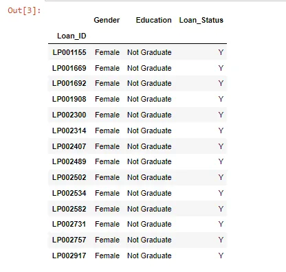
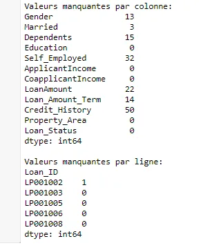
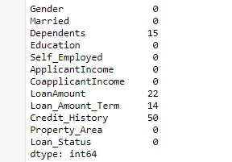
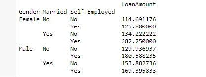
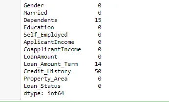

In this post, I will identify 5 useful pandas techniques in python to show its powerful tools. Each tool will be demonstrated with a brief definition and a simple code.

I started with importing the Pandas module and loading the data set into the Python environment as Pandas Dataframe:

```python
import pandas as pd
import numpy as np
data = pd.read_csv("C:/Users/asus/Desktop/train.csv", index_col="Loan_ID")
```

I will start with the first technique: Boolean indexing in pandas.

- **Boolean Indexing in Pandas**

In order to filter values of a column based on conditions from another set of columns from a Pandas Dataframe, I want to list all females who are: **not graduates** and **have a loan**.

Therefore I used Boolean indexing that can help as shown in the following code:

```python
data.loc[(data["Gender"]=="Female") & (data["Education"]=="Not Graduate") & (data["Loan_Status"]=="Y"), ["Gender","Education","Loan_Status"]]
```

This code gives the following result:



The second technique I used in this blog is Apply Function in pandas.

- **Apply Function in Pandas**

The function in Pandas returns the value after passing each row-column of a data frame after using one function or more. It can be default or user-defined. As shown in the code below:

```python
#Apply Function in Pandas
def num_missing(x):
    return sum(x.isnull())
print("Valeurs manquantes par colonne:")
print(data.apply(num_missing, axis=0))
print("\nValeurs manquantes par ligne:")
print(data.apply(num_missing, axis=1).head())
```

This code gives the following result:



The Third Technique is  **Imputing missing values using Pandas.**

- **Imputing missing values using Pandas**

This technique is used to update missing values with the overall mean/mode/median of the column. In the code below I worked on the **Gender, Married, and Self_Employed** columns with their modes.

As shown in the code below:

```python
#Imputing missing values using Pandas
from scipy.stats import mode
mode(data['Gender'])
data['Gender'].mode()[0]
data['Gender'].fillna(data['Gender'].mode().iloc[0], inplace=True)
data['Married'].fillna(data['Married'].mode().iloc[0], inplace=True)
data['Self_Employed'].fillna(data['Self_Employed'].mode().iloc[0], inplace=True)
print(data.apply(num_missing, axis=0))
```

This code gives the following result:



The 4th technique is the Pivot Table in Pandas

- **Pivot Table in Pandas**

Pandas also can be used to create pivot tables when a key column is '**LoanAmount'** that has missing values. impute it using the mean amount of each ‘**Gender’, ‘Married’ and ‘Self_Employed’ group**. The mean ‘**LoanAmount**’ of each group in Pandas data frame.

The code below shows how I implement it to determine a pivot table:

```python
#Pivot Table in Pandas
impute_grps = data.pivot_table(values=["LoanAmount"], index=["Gender","Married","Self_Employed"], aggfunc=np.mean)
print (impute_grps)
```

This code gives the following result:



The last technique is the Multi-Indexing in Pandas Dataframe

- **Multi-Indexing in Pandas Dataframe**

the Pandas index is made with a combination of 3 values called **Multi-Indexing**. It helps in performing operations and provides fast operations.

The values for each group have not been imputed.

I did it by using the various techniques from pandas learned till now.

As shown in the code below:

```python
#Multi-Indexing in Pandas Dataframe
for i,row in data.loc[data['LoanAmount'].isnull(),:].iterrows():
  ind = tuple([row['Gender'],row['Married'],row['Self_Employed']])
  data.loc[i,'LoanAmount'] = impute_grps.loc[ind].values[0]
print (data.apply(num_missing, axis=0))
```

This code gives the following result:


