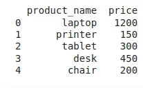
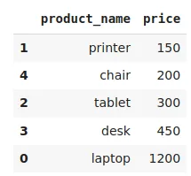
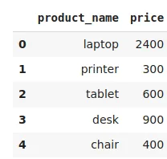
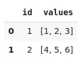
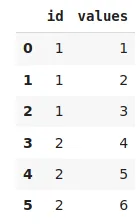
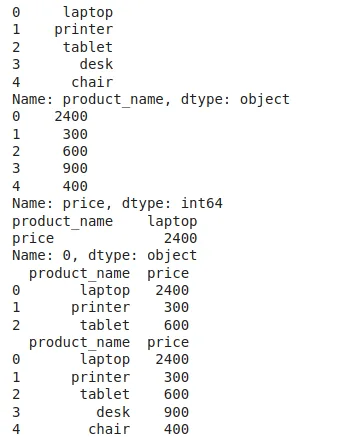

Pandas is a great library in Python that expedites the data analysis and exploration process. Pandas also is that it provides a variety of functions and methods for data manipulation. In this blog, I wanted to quickly discuss and show a few useful pandas methods/functions, which can come in handy during your daily work.

### Installation

To install pandas, you just need to run pip install pandas in your terminal . Then we can import pandas as pd.

```python
pip install pandas
```

to import it

```python
import pandas as pd
```

after installing and import our library now we can start our desired operations with pandas.

now we need to insert our Dataframe as following

```python
import pandas as pd
import numpy as np
data = {'product_name': ['laptop', 'printer', 'tablet', 'desk', 'chair'],
        'price': [1200, 150, 300, 450, 200]
        }

 df = pd.DataFrame(data)

print(df)
```



## 1.** **Sorting DataFrame
we can sort the data frame in ascending or descending in pandas and that by using function [sort_values()](https://www.geeksforgeeks.org/python-pandas-dataframe-sort_values-set-1/).

And we can applying as here

Input:

```python
df.sort_values(by=['price'], ascending=True)
```

output:



## 2. Apply Function

this function is used to apply a function along an axis of dataframe

whether it can be row as (axis=0) or column (axis=1).

input:

```python
def double(a):
    return 2*a

df['price'] = df['price'].apply(double)

# Reading Dataframe
df
```

Output:



## 3. Cut Function

The **cut() function** is used to bin values into discrete intervals. we use **cut** when you need to segment and sort data values into bins . it only works with arrays.

Input:

```python
pd.cut(np.array([2, 7, 5, 4, 6, 8]), 3)
```

Output:

```python
[(1.994, 4.0], (6.0, 8.0], (4.0, 6.0], (1.994, 4.0], (4.0, 6.0], (6.0, 8.0]]
Categories (3, interval[float64]): [(1.994, 4.0] < (4.0, 6.0] < (6.0, 8.0]]
```

## 4. Explode in Dataframe
**explode()** method I, t used to transform each element of a list-like to a row, replicating index values.

Input :

```python
df1 = pd.DataFrame(data={"id": [1, 2],
                        "values": [[1, 2, 3], [4, 5, 6]]})
df1
```

Output:



now we apply the explode in our dataframe

Input :

```python
df1.explode("values", ignore_index=True)
```

Output:



## 5. Indexing and Slicing

Here **.loc** is label base and **.iloc** is integer position based methods used for slicing and indexing of data.

we will apply on the same dataframe that we used in the first example.

Input:

```python
print(df.loc[0:4, 'product_name'])

# Printing all the rows with price column

print(df.loc[:, 'price'])

# Printing only first rows having name.
print(df.iloc[0, 0:2])

# Printing first 3 rows having product name and price .
print(df.iloc[0:3, 0:3])

# Printing all rows having  product name & price
print(df.iloc[:, 0:2])
```

Output



You can find the code used for this article on my [Github](https://github.com/tahanijaber/Manipulating-DataFrames-with-Pandas-). Thank you for reading. Please let me know if you have any feedback.
