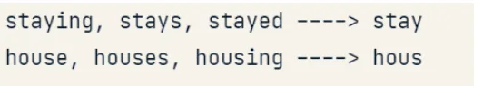
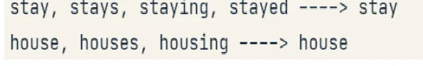
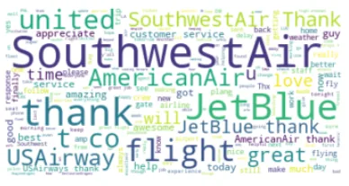

what is NLP:

Natural Language Processing or NLP is a component of AI that focuses on understanding human language as it is written and/or spoken.

in Email we use classification system based on some words or phrases to determine this email belongs to which section of email(spam, unwanted ,social)...etc

### Tokenization:

Tokenization is the process of divide text in words or tokens

```python
GoT = 'Never forget what you are, for surely the world will not. Make it your strength. Then it can never be your weakness. Armour yourself in it, and it will never be used to hurt you.'
```

```python
# Import the required function
from nltk import word_tokenize

# Transform the GoT string to word tokens
print(word_tokenize(GoT))
```

```python
['Never', 'forget', 'what', 'you', 'are', ',', 'for', 'surely', 'the', 'world', 'will', 'not', '.', 'Make', 'it', 'your', 'strength', '.', 'Then', 'it', 'can', 'never', 'be', 'your', 'weakness', '.', 'Armour', 'yourself', 'in', 'it', ',', 'and', 'it', 'will', 'never', 'be', 'used', 'to', 'hurt', 'you', '.']
```

### Stop Words :

if you have a text and you want to know what words its contain such that (enjoy, black, sad ,happy, dog ,cat) this words will help you in your process and words like this(am, is, the, this) you will not get help of it so every language has its stop words .by removing words that are in a pre-defined list

```python
wordswithoutStop = []
for word in words:
    if word not in stop_list:
        wordswithoutStop.append(word)
print(wordswithoutStop)
```

```python
['example', 'sentence', 'entered', 'john', 'house', 'front', 'door', 'front', 'door', 'referring', 'expression', 'bridging', 'relationship', 'identified', 'fact', 'door', 'referred', 'front', 'door', 'john', 'house', 'rather', 'structure', 'also', 'referred', 'discourse', 'analysis', 'rubric', 'includes', 'several', 'related', 'tasks', 'one', 'task', 'discourse', 'parsing', 'identifying', 'discourse', 'textual', 'entailment', 'given', 'two', 'text', 'fragments', 'determine', 'one', 'true', 'entails', 'entails', 'negation', 'allows', 'either', 'true', 'false', 'topic', 'segmentation', 'recognition', 'given', 'chunk', 'text', 'separate', 'segments', 'devoted', 'topic', 'identify', 'topic', 'segment', 'argument', 'mining', 'goal', 'argument', 'mining', 'automatic', 'extraction', 'identification', 'argumentative']
```

### Stemming

### Its another Technique in NLP which help you to get the root of the word and it is fast and efficient

### cooking--> cook

### cooked-->cook

### cooker-->cook



#### Lemmatization:

produce actual words and can depend on the part of speech



```python
# Import the required packages from nltk
from nltk.stem import PorterStemmer, WordNetLemmatizer
from nltk import word_tokenize

porter = PorterStemmer()
WNlemmatizer = WordNetLemmatizer()

# Tokenize the GoT string
tokens = word_tokenize(GoT)
```

```python
import time
# Log the start time
start_time = time.time()

# Build a stemmed list
stemmed_tokens = [porter.stem(token) for token in tokens]

# Log the end time
end_time = time.time()

print('Time taken for stemming in seconds: ', end_time - start_time)
print('Stemmed tokens: ', stemmed_tokens)
```

```python
Time taken for stemming in seconds:  0.0009989738464355469 Stemmed tokens:  ['never', 'forget', 'what', 'you', 'are', ',', 'for', 'sure', 'the', 'world', 'will', 'not', '.', 'make', 'it', 'your', 'strength', '.', 'then', 'it', 'can', 'never', 'be', 'your', 'weak', '.', 'armour', 'yourself', 'in', 'it', ',', 'and', 'it', 'will', 'never', 'be', 'use', 'to', 'hurt', 'you', '.']
```

```python
# Build a lemmatized list
lem_tokens = [WNlemmatizer.lemmatize(token) for token in tokens]

# Log the end time
end_time = time.time()

print('Time taken for lemmatizing in seconds: ', end_time - start_time)
print('Lemmatized tokens: ', lem_tokens)

Time taken for lemmatizing in seconds:  0.0009987354278564453
Lemmatized tokens:  ['Never', 'forget', 'what', 'you', 'are', ',', 'for', 'surely', 'the', 'world', 'will', 'not', '.', 'Make', 'it', 'your', 'strength', '.', 'Then', 'it', 'can', 'never', 'be', 'your', 'weakness', '.', 'Armour', 'yourself', 'in', 'it', ',', 'and', 'it', 'will', 'never', 'be', 'used', 'to', 'hurt', 'you', '.']
```

##### Word Cloud:

Get the most common words in text and if it bigger in size mean that it exist so many times

```python
 Import the word cloud function
from wordcloud import WordCloud

# Create and generate a word cloud image
my_cloud = WordCloud(background_color='white').generate(text_tweet)

# Display the generated wordcloud image
plt.imshow(my_cloud, interpolation='bilinear')
plt.axis("off")

# Don't forget to show the final image
plt.show()
```


