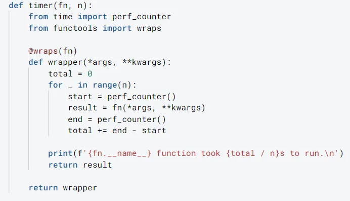
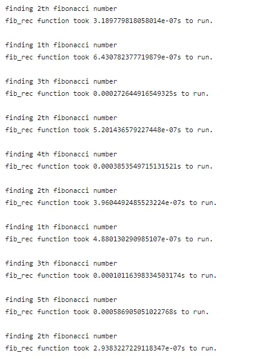
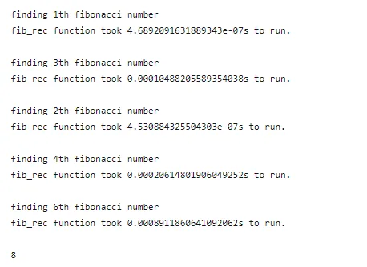
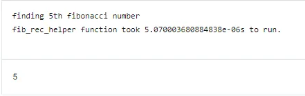
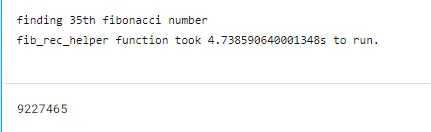
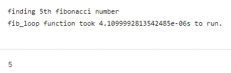
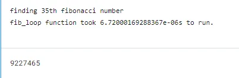

[Kanan Mahammadli](https://www.linkedin.com/in/kananmahammadli/)



## Introduction
Our primary purpose in this article is to give insights into the **Python Decorators**, but it is somehow an advanced topic in Python that requires background knowledge. Therefore, we will cover some essential points before talking about **Decorators**.

Let's first start by asking

### What is a decorator?

Decorators are used to wrap around another function to extend its functionality without explicitly changing its content. In more detail, decorators are just functions that take another function as an argument and have wrapped inner function that can use arguments of the passed function. Our decorator returns this wrapper function. The inner function with free variable (what is it? we will learn soon) is also called closure that we will also talk about later.

## Functions and Arguments
Functions are considered as first-class objects(citizens) in Python. We say that functions can be handled uniformly, but what do we understand from this definition? It means we can store the function in a variable, pass it as an argument to another function, use it inside that function, return the function, store the functions in different data structures. Now let's practice what we have mentioned above.

## Storing a function in a variable
```python
# function to greet people
def greet(name):
    return f'Hi, {name}'

# storing in a variable
my_var = greet
print(my_var('Kanan'))
```

```python
Output: 'Hi, Kanan'
```

### Passing a function as an argument
```python
from math import sqrt
# we will use first 2 functions as an argument
def sq_root(num):
    return sqrt(num)

def cube (num):
    return num ** 3

# after finding the result, functions uses arguments to give meaningful answer
def meaningful_func(func, num, message):
    res = func(num)
    return f'{message} of the {num} is the {res:.2f}'

print(meaningful_func(sq_root, 20, 'square root'))
nt(meaningful_func(cube, 5 , 'cube'))
```

```python
Output 1: 'square root of the 20 is the 4.47'
```

```python
Output 2: 'cube of the 5 is the 125.00'
```

Here we passed square root and cube functions into our last function as an argument and a message that explains what the passed functions do and returns an understandable result. We will talk about the returning functions inside a function while explaining nested functions in the closures part. We could also store the functions in data structures like lists, dictionaries, hash tables, etc. We will look at a straightforward case for practice.

### Storing functions in data structures
```python
from math import sqrt

# we will create 2 lambda functions and store them into a dictionary with boolean keys
bool_list = [True, False]
func1 = lambda x: x ** 2
func2 = lambda x: x ** 3
func_list = [func1, func2]
dic = dict(zip(bool_list, func_list))

# here we will use stored functions, if key is True
num = 10
for key, value in dic.items():
    if key:
        print(value(num))
```

```python
Output: 100
```

### Args and Kwargs
So far, we have defined several arguments while creating the functions. Therefore, Python will give an error if we have defined a function with two arguments but give more than two arguments while calling the function. However, sometimes we want to pass as many arguments as possible to the function and handle all of them. But at the creation process, we do not know how many arguments will be passed in the future. To handle this situation, Python has its syntax that we use when while defining function. It is called the unpacking operator - '*\**.' *We can use this asterisk sign in front of any argument, and then Python will put all the arguments passed after that step into the tuple with* the *name we have defined. Generally, we use* '*\**args,' as it is more understandable for us since we know that we will take non-keyword arguments here. If we need to pass arguments with default values, we use a double *asterisk*  - "*\*\**" before any argument. It is also called named arguments or keyword arguments; therefore, generally, we use '\*\*kwags.' But again, kwargs has no meaning for Python; we use any name. What Python needs to understand is that we need named arguments in the double-asterisksign.

### Using \*args
```python
# let's first look at the function with pre-defined number of arguments
def add(a, b):
    return a + b

print(add(1, 2, 3))
```

```python
TypeError: add() takes 2 positional arguments but 3 were given
```

As we see from the error, it says we have only two arguments defined, but we want to pass three, and Python does not know what to do with that 3rd variable. So let's have an 'add' function that can add any number of elements. In our case, the args variable will be a tuple of arguments that we will pass.

```python
def add(*args):
    print(args)
    return (sum(args))

print(add(1, 2, 3))
```

```python
Output 1: (1, 2, 3)
Output 2: 6
```

```python
# we can use non-keyword arguments after some predefined arguments
def func(first_argument, *args):
    print(f'{first_argument} is a predefined argument')
    print('Non-keyword arguments:')
    for i in args:
        print(i, end = ' ')

print(func('Python', 'Java', 'Julia', 'C++'))
```

```python
Python is a predefined argument
Non-keyword arguments:
Java Julia C++
```

As we see, the first passed argument is stored in the first argument variable, and the rest of the arguments we passed are stored in the args tuple.

### Using \*\*Kwargs
When we use keyword arguments, Python stores them into a dictionary where given variables become keys, and their values become dictionary values.

```python
def func(**kwargs):
    for key, value in kwargs.items():
        print(f'{value} has been stored at {key}')

print(func(argument1 = 'Python', argument2 = 'Java'))
```

```python
Python has been stored at argument1
Java has been stored at argument2
```

```python
# args and kwargs together
def func(*args, **kwargs):
    print('Non-keyword arguments:')
    for i in args:
        print(i)
    print('Keyword arguments:')
    for key, value in kwargs.items():
        print(f'{key}:{value}')

print(func(65, 80, 90, grade4=95, grade5=100))
```

```python
Non-keyword arguments:
65
80
90
Keyword arguments:
grade4:95
grade5:100
```

## Scopes
While working with the functions, we experience that Python doesn't recognize it when creating the variable inside the function. So we can ask how Python recognizes the variable inside of the function but not outside. To answer this question, we should first look at what happens when we create a variable and have a superficial knowledge of variables, bindings, namespaces, and, lastly, scopes. Let'sdoesn't''let's''" ''''let'sLet'sot mix everything and go through them one-by-one.

### Variables, Bindings, and Namespaces
```python
# let's create a variable and assign a value to it
my_var = 15
```

Python creates an object when we run the code, and our variable my_var points to that object. We say that our variable is bound to that object. Whenever we create a variable, it exists at some part of our code, and that portion of our code is called a scope. So variables belong to the scopes they exist inside; therefore, Python recognizes variables of our scope. Whenever we go outside, Python does not know what that variable is. We already know that variables exist in scopes, but they also need to be stored somewhere. The place variables, together with their bindings stored, are called namespaces. Each scope has its namespace.

### Global Scopes
Global scope is an entire file scope. The variable we create inside of our file (module) can be accessed anywhere in our file. But in Python, there is no user-defined global scope that works across the files. For example, if we have several files in one project, each file has its global scope, and they are not shared. There is only one exception which is Python's built-in global objects that can be used everywhere. (some built-in objects: True, False, print, list, dict, None, etc.). We can think of the scopes in this way: first, we have a built-in scope with its namespace, then inside, we have global scopes, each module we create has its scope and namespace. When we want to access the objects, i.e., call the variable name, it looks from inside to outside.

```python
print(None)
Output: None
```

Here, Python first looks at the global scope for print and None, but we have not defined them, so it looks to the built-in scope and finds them there and knows that print is a function and None is an object, and we print the value of that None object.

```python
# let's see what happens when we overwrite the built-in function
print = lambda x: f'hello, {x}'
```

```python
Output: hello, Kanan
```

Using two arguments:

```python
print('Python', 'Java')
TypeError: <lambda>() takes 1 positional argument but 2 were given
```

As we see above, when we assign something to built-in names, Python will first find them while calling. Therefore in our case, we will have a global print inside our module, which has become a lambda function with one argument, and we won't' be able to use the built-in print function in our module if we don't' delete it. So we should be aware of the built-in namespace in Python and avoid using them as variable names.

```python
# here is the list of the all built-in names predefined in Python
print(dir(__builtins__))
```

Let's delete the custom print function and continue.

```python
del print
```

```python
print('Python', 'Java')
Output: Python Java
```

### Scope of the loops
When we create a variable inside the loop, will it be global or local to that loop?

```python
for i in range(5):
    a = 3
print(a)
```

Output: 3

We don't have a particular scope for the loops; whatever we create inside these loops is global. But in other programming languages, if we do this, we will get an error: "a was not declared in this scope," where a is the variable we created inside the loop. The code below is the C++ version of the code we have written above:

```python
#include <iostream> using
std::cout;
int main() {
    for (int i = 0 ; i < 5; i++){
        int a =3;
    }
    cout << a << '\n';
}
```

### Local Scopes
When we create a function and call it, we also create a scope that belongs to that specific function. Inside of the global scope, we have local scopes for each function we create. The variables we create inside the functions exist only in that function's scope and don't exist outside. Since we only create a function and are binding in module scope while defining it, its scope(of course, and all the contents inside like variables) will not be created until the function is called. The reason behind it is that each time we call the function, we create a new local scope because we can pass different values to the function each time we call it. Therefore it should store them in different namespaces.

```python
# creating a local variable
def add(a, b):
    c = a + b
    return c
```

We just defined our add function with two arguments and assigned their sum to the variable c. These a, b and c variables are local to the add function. We haven't called the function yet, so it hasn't run. Therefore we haven't created a local scope. Still, during the compile-time, Python already recognizes these a, b, and c variables as local to that function and, during the runtime, actually creates a local space where these variables will exist.

```python
add(2, 3)
```

Output: 5

```python
print(c)
Output: NameError: name 'c' is not defined
```

As we see, after running the function, we go outside of the local scope, and we don't have a variable c any longer.

### Using a global variable inside a function
The variables we create inside the module are considered global, and we can use it inside as a function.

```python
a = 5
def multiply_a(x):
    return a * x

print(multiply_a(4))
```

Output: 20

As we see, without any error, we can use global variables inside the local scopes. But what will happen if want to change the value of that global variable inside the local scope? Let's code and analyze.

```python
a = 5
b = 3
def multiply_a(x):
    b = a * x
    return b

# input 1
print(multiply_a(4))

# input 2
print(b)
```

Output 1: 20

Output2: 3

From the code above, we can see that we have variable b in the local and global scope. Here is what happens at that cell. When we call the function, it looks for the a and x to multiply, and Python always works with the inside out principle while working with scopes. Therefore it looks for a local scope, doesn’t find it, looks at the global scope and finds there; then it looks for the x, a local variable passed as an argument and multiplied them together, and assigns it to the local variable b. When we return b, it looks at the local scope, and we have b there whose value is 20 in our case and return 20. But outside of the local scope (in global) value of b is still three since we assigned 20 to the local b, which doesn’t affect global b. So we see that even though we can use global variables inside the local scope, we cannot change their values locally, and global value stays the same. But what if we also want to change the global variable’s value inside a function? How do we do that? For this purpose, we should use the ‘global’ keyword to tell Python: ‘Okay, here is my global variable that I will use in this local scope, but I also want any changes made to this variable to stay outside of this local scope.’

### Using the 'global' keyword
```python
a = 5
def func():
    global a
    a = 20

func()
print(a)
```

Output: 20

During the compile-time, Python tries to identify the variables. Python will consider them local if we have variables with values assigned to them inside the local scope. But if we have a variable, but nothing has been assigned to it inside the local scope. Python will assume it is nonlocal, but until the runtime, Python doesn’t know what it is; it only knows this is not a local variable and will look for it in outside scopes only when the function is called. However, when we use a global keyword, we say to Python. This is a global variable during the compile-time. When we run the function, even if we execute and go outside of the local loop, the value of variable a will also be updated globally because of the global keyword.

### Tricky Part!
What will happen if we first approach the variable as global inside the local scope and then use it as local? How will Python recognize the variable? Let’s see.

```python
a = 10
def my_func():
    print(a)
    a = 3
    return a

print(my_func())
```

```python
UnboundLocalError: local variable 'a' referenced before assignment
```

If you remember, we said that Python would consider it a nonlocal variable if we directly use the variable without assigning any value to it. Still, if we assign value to the variable, Python will consider it a local variable. During the compile time, Python first sees print(a) and thinks it will be a nonlocal variable and but during the runtime, it sees an assignment, so it should be a local variable. Still, we also want to print the local variable before assigning a value to it. Therefore Python gives as an error that: "Hey, I am gonna consider this variable as local to my_func function, and you are printing variable a before assignment, therefore here is your error message, enjoy it."

### Nonlocal scopes
As we talked about above, functions are first-class objects. Therefore we can create an inner function inside some outer function and return that inner function from the outer. In this case, we will create a local scope inside another one, i.e.; we will have nested scopes. We call the outer local scope as enclosing scope for the inner local scope. When we discussed local scopes, we said that local scope has access to global scope to use its variables, but we can only change them locally, not globally, unless we use the global keyword. The same happens in nested scopes. The inner scope has access to the enclosing scope and can use variables defined there, but if we want to change the value stored there, it will happen only inside the inner local scope. We also have a particular keyword to change the outer local scope, but we will talk about it later. This enclosing scope is neither local to the inner function nor global; it is called a nonlocal scope. Let's not mix up everything and have some practice on nested scopes to understand in detail.

**Accessing to the global variable from inner local scope:**

```python
a = 10
def outer():
    def inner():
        print(a)
    inner()

print(outer())
```

Output: 10

What does Python does: look for variable inside the inner scope — not found — > look at the enclosing scope — not found -> look at the global scope — found!!! It is ten; print it out.

**Accessing to the nonlocal scope from the inner local scope:**

```python
def outer():
    a  = 10
    def inner():
        print(a)
    inner()

print(outer())
```

Output: 10

What does Python do: look for variable inside the inner scope — not found -> look at the enclosing scope — found!!! It is ten; print it out.

**Modifying global variable from enclosing scope:**

```python
a = 10
def outer():
    global a
    a = 5
    def inner():
        print(a)
    inner()

print(outer())
print(a)
```

Output 1: 5

Output 2: 5

Since we used the global keyword, changes apply everywhere.

**Modifying the global variable from inner local scope:**

```python
a = 10
def outer():
    def inner():
        global a
        a = 3
    inner()
    print(a)

print(outer())
print(a)
```

Output 1: 3

Output 2: 3

Again using the global keyword enabled us to change the value of the variable globally. So we can define a variable as global from both inner and outer local scopes. We can ask that okay, we have access to global variables from the local scope, and we can modify them with the global keyword. In the same way, we also have access to enclosing scope variables from the inner local scope in nested functions, but what will happen if we want to change their values?

**Let's try to change the value of a nonlocal variable from the inner local scope:**

```python
def outer():
    a = 10
    def inner():
        a = 3
        print(a)
    inner()
    print(a)

print(outer())
```

Output 1: 3

Output 2: 10

As we were only able to change the value of the global variable locally, inside the local scope, without affecting its global value if we haven't used a particular keyword (global in this case), we are also only able to change the value of the nonlocal variable inside the inner local scope. The nonlocal variable's value stays the same when outside, only modified in the inner local scope. To modify the nonlocal variable, we need another particular keyword — nonlocal. Python will understand it is nonlocal, and any change made inner local scope should affect the value of the original nonlocal variable.

**Modifying the nonlocal variable:**

```python
def outer():
    a = 10
    def inner():
        nonlocal a
        print(a)
        a = 3
        print(a)

    inner()
    print(a)

print(outer())
```

Output 1: 10

Output 2: 3

Output3: 3

As we see, inside the inner function, the value of the variable a is ten before the modification. Then we change it to 3, print it out, and check the value of variable an at enclosing scope, and we see that the value of nonlocal a has also changed.

### Trick again
```python
def outer():
    a = 10
    def inner():
        print(a)
        a = 3

    inner()
    print(a)

print(outer())
```

Output:

```python
UnboundLocalError: local variable 'a' referenced before assignment
```

Similar to the trick we did before, the same happens here. First, we want to print variable a, but Python sees an assignment during the runtime and considers the variable an as local to local inner function. Still, before we assign value to this variable, we have a print statement. Python considers a variable as an inner local variable; however, we haven’t assigned anything to it during the print, so Python gave an error that you are using a variable before assigning a value.

### Deep nested functions
We can also have a function inside of another one. In this case, the outer function's local scope will contain a nested local scope. Even accessing and modifying the global variables won't be a challenge since we can use a global keyword at any level of nested scope and change its value. It will also change the value of the global variable outside. But when we use nonlocal keywords, we should be cautious because when we use nonlocal at some local scope, it will refer to its enclosing scope. Still, in deeply nested function, this enclosing scope will also have its enclosing scope. If we use the same name for one variable in scopes, we should know which scope this variable will refer to. Let's start with modifying global variables and then dive into the nonlocal variables. We can also have a function inside of another one. In this case, the outer function's local scope will contain a nested local scope. Even accessing and modifying the global variables won't be a challenge since we can use a global keyword at any level of nested scope and change its value. It will also change the value of the global variable outside. But when we use a nonlocal keyword, we should be cautious because when we use a nonlocal at some local scope, it will refer to its enclosing scope. Still, in a deeply nested function, this enclosing scope will also have its enclosing scope. If we use the same name for one variable in scopes, we should know which scope this variable will refer to. Let's start with modifying global variables and then dive into the nonlocal variables.

**Modifying the global variable from the outer function's scope:**

```python
a = 10
def outer():
    global a
    a = 5
    def inner1():
        def inner2():
            print(a)
        inner2()
    inner1()
print(outer())
print(a)
```

Output 1: 5

Output 2: 5

**Modifying the global variable from the first nested scope:**

```python
a = 10
def outer():
    def inner1():
        global a
        a = 5
        def inner2():
            print(a)
        inner2()
    inner1()

print(outer())
print(a)
```

Output 1: 5

Output 2: 5

**Modifying the global variable from the second nested scope:**

```python
a = 10
def outer():
    def inner1():
        def inner2():
            global a
            a = 5
            print(a)
        inner2()
    inner1()

print(outer())
print(a)
```

Output 1: 5

Output 2: 5

As we see, we modify the original value no matter where we declare our variable is global in a deeply nested scope. But it is not that easy when it comes to nonlocal variables. The following examples will explain what I mean.

**Modifying a nonlocal variable in the outer function’s scope from the first nested scope:**

```python
def outer():
    a = 10
    def inner1():
        nonlocal a
        a = 5
        def inner2():
            print(a)
        inner2()
    inner1()
    print(a)

print(outer())
```

Output 1: 5

Output 2: 5

This is a simple example that resembles what we have done before. When we say variable a is nonlocal inside inner1, it looks like its enclosing scope, i.e., outer function’s scope, and finds it there. So when we assign a new value to variable a, it also affects the original. Therefore when we go outside the inner scope, we still have a modified value at variable a.

**We can do the same from the second nested scope:**

```python
def outer():
    a = 10
    def inner1():
        def inner2():
            nonlocal a
            a = 2
            print(a)
        inner2()
    inner1()
    print(a)

print(outer())
```

Output 1: 2

Output 2: 2

Until now, we only had one variable, and when we used the nonlocal keyword in inner1 and inner2 functions' scopes, it referred to the same object — the variable and in the outer function's scope. But if we have two variables with the same name in both outer and inner functions' scopes, then nonlocal will refer to the variable in enclosing scope, and we should be careful what we are referring to.

```python
# first we should be aware of using nonlocal keyword
# nonlocal means Python will only look at local scopes, not global
a = 10
def outer():
    def inner1():
        def inner2():
            nonlocal a
            a = 3
            print(a)
        inner2()
    inner1()

print(outer())
```

Output:

```python
SyntaxError: no binding for nonlocal 'a' found (<ipython-input-45-8a1647e220a2>, line 7)
```

First, Python looks at inner1 function's scope, doesn't find variable a, look at outer function's scope, doesn't find it, then we finish with local scopes, and next is the global scope, but we used nonlocal keyword. That means we say Python that looks only at local scopes; since there is no value assigned to variable an in local scopes, there is no object it is bound to. Therefore Python gives us a meaningful error.

**Having the same variable in both outer and inner local scopes:**

```python
def outer():
    a = 'Python'
    def inner1():
        a = 'Java'
        def inner2():
            nonlocal a
            a = 'C++'
        print('Before inner2:', a)
        inner2()
        print('After inner2:', a)

    inner1()
    print('Outer a:',  a)

print(outer())
```

Output 1: Before inner2: Java

Output 2: After inner2: C++

Output 3: Outer a: Python

Let's explain what happens here. During the runtime, we assign 'Python' to the variable a in the outer scope, and we call the inner1 so that Python will go to that function and here we assigned 'Java' to the variable a; therefore, Python will consider this as a local variable of inner1, then we print the value of the variable a before calling inner2. As we have a local variable a=’Java' there, before calling the inner2, we print Java. Then we call inner2; inside inner2, we declare the variable an as nonlocal. But which variable is it? As we know, Python looks from inside to outside. Therefore it will first look at enclosing the scope of the inner2, which is inner1's scope that has the local variable a. Now we modify the variable a to 'C++.' It will also affect the variable's value in inner1's scope, as we were pointing to the object that various be bound to. Therefore after calling the inner2, when we print the variable a, we will point to the variable in inner1's scope that has been changed to 'C++,' and we print 'C++.' We executed the inner1 and go outside of the nested scopes. Now we are again in the outer function's scope, and we print the value of the variable a, which we had assigned 'Python' to. The modification we made in inner2 only affected the variable in inner1 and did not affect the outer scope. Therefore the value is still 'Python,' and we print it.

**Using the nonlocal keyword in both nested scopes:**

```python
def outer():
    a = 'Python'
    def inner1():
        nonlocal a
        a = 'Java'
        def inner2():
            nonlocal a
            a = 'C++'
        print('Before inners:', a)
        inner2()
        print('After inner2:', a)

    inner1()
    print('outer:', a)

print(outer())
```

Output 1: Before inners: Java

Output 2: After inner2: C++

Output 3: outer: C++

Let's examine this example. First, we say that variable a in outer function's scope has value 'Python,' then we call inner1, and we say variable a is nonlocal, which point to the object that the variable a in outer function's scope is bound to. We change the value of the variable a to the 'Java.' So the variable a both in outer and inner1 functions' scope has value 'Java' now. Next, we print the value of the variable a that 'Java.' Then we cal the inner2, and inside it, we again say nonlocal, this will point to the object that the variable a in inner1's scope is bound to. So when we change the value of the variable a in inner2 to the 'C++,' it will also change the value of the variable in inner2's scope since we were pointing to it. But remember that in inner1's scope, the variable a was also pointing to the object that variable a, in outer function's scope, is bound to. Therefore, we also change the variable's value in the outer function's scope to the 'C++.'

**What if we also had a global variable with the same name?**

```python
a = 'Python'
def outer():
    a = 'Java'
    def inner1():
        nonlocal a
        a = 'C++'
        def inner2():
            global a
            a = 'Julia'
        print('Before inner2:', a)
        inner2()
        print('After inner2:', a)

    inner1()
    print('outer:', a)

print(outer())
print('global:', a)
```

Output 1: Before inner2: C++

Output 2: After inner2: C++

Output 3: outer: C++

Output 4: global: Julia

When we run the outer function, first, Python identifies local variable 'a' in outer function's scope that has value 'Java,' then we call the inner1. Inside inner1, we say the variable 'a' is nonlocal, so we will point to 'a' in the outer function's scope. Then we assign 'C++' to the variable a, and now the value of variable ‘a ’in both inner1 and outer functions' scopes are 'C++.' So before calling the inner2, when we print the value of the variable, it is 'C++.' When we call inner2, we say the variable a here is global, so we are pointing to the variable 'a' in global scope; therefore when we assign 'Julia' to the variable it will affect the variable ‘a ’ in the global scope and value of the variable ‘a ’ in inner1. Outer functions' scopes will stay the same. Therefore when we print the value of the variable after executing inner2 and go outside of the nested scopes and again print the value of the variable ‘a’ in the outer function's scope, they will have the same value — 'C++.' Lastly, we finish with the outer functions and go to the global scope and print the value of the variable a there, which we had changed to the 'Julia.'

## Closures
When we talked about the nested functions, we said that inside the inner function's scope, we have access to the variables in the outer function’s scope. In other words, we say that the variable in the outer function’s scope is a free variable. Whenever we use it in the inner function, we reference the one at the outer scope, even though it is not a direct reference that we will talk about about about later. This inner function with the free variable at the outer scope has closed the closure because the inner function encloses the free variable. Instead of calling the inner function inside the outer function, we will return the inner function itself.

```python
# a simple example of a closure
def outer():
    a = 10
    def inner():
        print(a)
    return inner

func = outer()
print(func())
```

Output: 10

Firstly, we call the outer function and assign it to the variable func. We can easily see that we return the inner function, storing the inner in the func variable. Then we call the func itself and print the value of the variable a. But the variable ‘a ’ in the inner function references the one at the outer scope, and we have already executed the outer function; its scope has gone. How does the Python know what is the variable a when we call the func? It is because of the closure. When we say func = outer(), we store the inner function together with the free variable at the outer scope to the variable func, i.e., we store the closure, not just the inner function itself. Therefore even after executing the outer function, Python knows what the variable a referencing. If you remember, we had said that this is not a direct reference. Let’s now explain how Python handles his situation in the background.

### Multi-scoped variables and Python cells
```python
# let's just write previous code to keep it simple
def outer():
    a = 10
    def inner():
        print(a)
    return inner

func = outer()
print(func())
```

Output: 10

In the code above, we have the same variable ‘a ’ in 2 different scopes. These variables are called multi-scoped variables; since multiple scopes share the same variable, the variable a in outer and inner functions’ scopes is the same. Let’s now look at how Python stores this shared variable with the inner function to access it even after executing the outer function. When we call the outer function, Python understands that we have a free variable and we cannot have a direct reference to the integer object that contains the memory address and value of our free variable a, because when the outer scope is gone, we will no longer have access to it. Therefore Python creates an intermediary object called cell that contains has a memory address and reference to the integer object we need. In our case, variable a both in outer and inner functions’ scopes reference the same cell and have the same memory address. This cell, in turn, references the integer object that contains its memory address and the value of our free variable (in this example, it is 10), and we call it an indirect reference. Once this cell is created, even if the outer scope is gone, the cell stays; therefore, after executing the outer function, we can still have access to the cell referencing the object our free variable bounded. In conclusion, we can think of closure as a function with an extended scope that contains a free variable.

**Looking at our free variables and closure:**

```python
def outer():
    a = 10
    x = 3
    def inner():
        x = 5
        print(a)
    return inner

func = outer()

# looking at the free variables
print(func.__code__.co_freevars)

# looing at the closure
print(func.__closure__)
```

Output 1:

```python
 ('a',)
```

Output 2:

```python
(<cell at 0x7f9dd568d6d0: int object at 0x7f9e08adc560>,)
```

If we look at the code above, we see two variables at the outer function’s scope. Still, only the variable ‘a ’ is a free variable since we assigned 5 to the variable x inside the inner function, so it is a local variable of the inner scope. We can use the properties of our func object to see our closure and free variables.

As we explained before, when we create a closure, we have an indirect reference to the value of the free variable. We can see that our free variable directs to the cell object at the memory address, given that references to the integer object, which contains the actual value of the free variable.

**Let’s look at the memory address of the free variable inside the local scopes:**

```python
def outer():
    a = 10
    x = 3
    print(hex(id(a)))
    def inner():
        x = 5
        print(hex(id(a)))
        print(a)
    return inner

func = outer()
print(func())
```

Output 1: 0x7f9e08adc560

Output 2: 0x7f9e08adc560

Output 3: 10

Even though we have an indirect reference, when we look at the memory address of the free variable inside the scopes, it returns the memory address of the integer object containing the value of the free variable. Python handles this indirect referencing itself in the background and hides the cell not to confuse us.

### Multiple instances of the closures and shared extended scopes

**Modifying our free variable:**

```python
def outer():
    c = 0
    def counter():
        nonlocal c
        c += 1
        return(c)
    return counter

func1 = outer()

# since our free variable is nonlocal, each time we call the func
# we will modify its current value, i.e add 1 to it
print(func1())
print(func1())

# now let's create a new closure
func2 = outer()
print(func2())
print(func2())

print(func1.__closure__)
print(func2.__closure__)
```

Output 1: 1

Output 2: 2

Output 3: 1

Output 4: 2

Output 5: (<cell at 0x7f9dd55bf210: int object at 0x7f9e08adc460>,)

Output 6:(<cell at 0x7f9dd55a9450: int object at 0x7f9e08adc460>,)

As we see when we called the outer function again, we started from 0. Because each time we call outer function, we create a new scope, new closure. These scopes are not shared; therefore, each starts from the predefined value inside the function. If we look at their cells, we will see that they are different, even though this cell references the same object containing the predefined value of the free variable.

**Creating a shared scope inside the outer function:**

```python
def outer():
    c = 0
    def counter1():
        nonlocal c
        c += 1
        return c

    def counter2():
        nonlocal c
        c += 1
        return c

    return counter1, counter2

func1, func2 = outer()

# let's first look at the closures of both functions
# and see the cell memory and free variable memory
print(func1.__closure__)
print(func2.__closure__)
```

Output 1: (<cell at 0x7f9dd566b890: int object at 0x7f9e08adc420>,)

Output 2: (<cell at 0x7f9dd566b890: int object at 0x7f9e08adc420>,)

As we created a shared extended scope, they have the same cell memory and reference the same object containing the value of the free variable.

```python
# let's call the func1 several times
print(func1())
print(func1())

# let's now look at the memory address of the free variable
print(func1.__closure__)
```

Output 1: 1

Output 2: 2

Output 3: (<cell at 0x7f9dd566b890: int object at 0x7f9e08adc460>,)

Before calling the func2, let’s think about what will happen? Both func1 and func2 reference the same free variable at the extended shared scope. It also references the integer object containing the value of that free variable. When we called func1 twice, we changed the value of the free variable, as we explicitly showed that the memory address of the integer object had been changed. When we call the func2, we refer to the cell that refers to the integer object containing memory address ‘0x955ce0’. Therefore we will start from 2 while calling the func2. We can prove that by printing the memory address of the integer object for func2’s closure.

```python
print(func2.__closure__)
Output: (<cell at 0x7f9dd566b890: int object at 0x7f9e08adc460>,)
```

We see that when we modify the value of the free variable by calling the func1, it also modifies the value for the func2 since they share the same extended scope. Let’s now call the func2 several times and look at the closures:

```python
print(func2())
print(func2())
# we can look at the memory addresses again
print(func1.__closure__)
print(func2.__closure__)
```

Output 1: 3

Output 2: 4

Output 3: (<cell at 0x7f9dd566b890: int object at 0x7f9e08adc4a0>,)

Output 4: (<cell at 0x7f9dd566b890: int object at 0x7f9e08adc4a0>,)

### Free variables as an argument
```python
def outer(n):
    def inner(x):
        return n + x
    return inner

func1 = outer(1)
print(func1.__code__.co_freevars)
```

Output: ('n',)

Here we have a free variable n passed as an argument. As we saw before, we can create different instances of closure that will be different.

```python
# creating 2 more closures with different arguments
func2 = outer(2)
func3 = outer(3)

print(func1(5))
print(func2(5))
print(func3(5))
```

Output 1: 6

Output 2: 7

Output 3: 8

What if want to create even more instances? Doing it manually would be annoying, but we can do it easily with the for loop, right?

```python
ls = []
for i in range(1, 9):
    ls.append(lambda x: x + i)

# Here our lambda function itself is a closure
# because it has a free variable i
# let's use the closures
print(ls[0](5))
print(ls[1](5))
print(ls[7](5))
```

Output 1: 13

Output 2: 13

Output 3: 13

Why do we get the same values? What happened? Let’s explain what is going on here. Our lambda function has the free variable ‘i ’and references the object we defined as a loop variable. At each iteration, our iteration variable changes since all the closures point to the same object this iteration variable is bound to. After the iteration is finished, they refer to the free variable i=8. Therefore when we pass 5, we get 13 for all closures. We should be careful that when we use the lambda function with the free variable as an iteration variable, it will be shared for all the closures. The value will be what the iteration variable is after the loop is finished.

### Warning!
Lambda expressions and closures are not the same things. Sometimes people assume that they are the same, but they are not. Lambda expression just creates a function. Like the functions created using ‘def,’ not all lambda expressions are closures. As we said, the function is considered a closure if it has a free variable(s). Therefore, if the function created with lambda expression has a free variable(s), it is also a closure. If not, then it is just a function. Besides, not all the closures are lambda expressions, of course. If we look at the example, we have written above. Our lambda expression has a free variable ‘i’. Therefore we called it closure, but it hasn’t to be closure(if it didn’t have a free variable); it is not a must.

## Nested closures
We talked about the nested scopes; we will get nested closures if we have a free variable at each nested scope.

```python
def outer(n):
    # inner1 + free variable n is a closure
    def inner1(x):
        current = x
        # inner2 + free variables current and n is a closure
        def inner2():
            nonlocal current
            current += n
            return current
        return inner2
    return inner1

inner1 = outer(10)
print(inner1.__code__.co_freevars)

inner2 = inner1(7)
print(inner2.__code__.co_freevars)
print(inner2())
print(inner2())
```

Output 1: ('n',)

Output 2: ('current', 'n')

Output 3: 17

Output 4: 27

We have first created a closure with the inner1 function, and the free variable ’n’ passed to the outer function. Then we created our second closure with the inner2 function and two free variables: ‘current ’from the inner1 function’s scope and ’n’ from the outer function's scope. When we call the inner2, it will return the sum of the current and n 7 and 10, respectively. So it will return 17, and our current variable will also be modified since we used a nonlocal keyword. The current will become 17, and the next time we call the function, it will become 27, print 27, etc.

## Decorators
At last, we can talk about the decorators. So far, we have learned how to give an arbitrary number of positional and keyword arguments to the function, pass a function as an argument, nested functions, and return a function inside another one. Now we can put together all of this knowledge to write a decorator. Let's first understand how its structure is. Decorators are just functions that take another function as an argument(there can be other arguments, we will talk about this later), wrap that function inside its inner function, add some features inside the inner function. Then the inner function returns the value by calling the passed function. Lastly, we return the inner function from the decorator function. We can write a simple blueprint like this:

```python
def decorator(fn, optional_arguments):
	def wrapper(*args, **kwargs):
		# do something
		return fn(*args, **kwargs)
	return wrapper
```

We pass arbitrary arguments to the wrapper function because we can use the same decorator for several functions to add new features. These functions can have a different number of arguments and can be both positional and keyword. Therefore we take an arbitrary number of arguments and pass them to the function.

**Creating a simple decorator that counts how many times a specific function is called, together with some other functions:**

```python
def counter(fn):
    c = 0
    def wrapper(*args, **kwargs):
        nonlocal c
        c += 1
        print(f'{fn.__name__} function is called {c} times.')
        return fn(*args, **kwargs)

    return wrapper

# let's create some functions to use them with decorator
def mult(a, b):
    return a * b

def add(a, b, c):
    return a + b + c
```

If we use the add and mult functions themselves, we will only get the result, but thanks to the counter decorator, together with the result, we will also see how many times the functions are called. Now it is time to test our decorator. But how do we use them? There are two ways of doing this. The first is to pass the function to the counter, assign the result to the variable with the same label as the original function, and then use created closure with relevant arguments. It is unnecessary to store the closure to the same label; if we use a different name and pass the arguments, everything will work fine. But we add some features to our function, and using a different name can be confusing. Therefore it is better to stick to the same label. We will now see that our second method uses this method automatically. Secondly, at the top of the function, we want to decorate, we can put the ‘@’ sign and write the decorator's name. It will automatically pass the function to the decorator and assign returned closure to the same label. We will use the function with relevant arguments, and it will be decorated.

### The first way
```python
mult = counter(mult)
add = counter(add)

print(mult(2, 3))
print(mult(3, 4))
print(add(1, 2, 3))
print(add(2, 3, 4))
print(mult(2, 7))
```

Output 1:

mult function is called one times.

6

Output 2:

mult function is called two times.

12

Output 3:

add function is called one times.

6

Output 4:

add function is called two times.

9

Output 5:

mult function is called three times.

14

If you remember from the closures, what we have done here is nothing, just creating multiple instances of the wrapper closure with free variables — integer ‘c’ and function ‘fn.’ Therefore, after calling the mult closure, when we call the add closure, we start counting from the predefined value the variable ‘c.’ Let’s look at their closures and free variables, we will see that for each function we have two cells, one for each free variable.

```python
print(mult.__closure__)
print(mult.__code__.co_freevars)
print(add.__closure__)
print(add.__code__.co_freevars)
```

Output 1:

(<cell at 0x7f9dd55a9b10: int object at 0x7f9e08adc480>, <cell at 0x7f9dd55a94d0: function object at 0x7f9dd55ca950>)

Output 2:

('c', 'fn')

Output 3:

(<cell at 0x7f9dd55a9150: int object at 0x7f9e08adc460>, <cell at 0x7f9dd55a9d90: function object at 0x7f9dd55ca9e0>)

Output 4:

('c', 'fn')

### The second way
Since mult and add functions are already decorated, we should define them again; otherwise, we will decorate them twice.

```python
@counter
def mult(a, b):
    return a * b

@counter
def add(a, b, c):
    return a + b + c

# now we can use them as we did before
print(mult(5, 4))
print(mult(3, 4))
print(add(3, 6, 8))
print(add(4, 1, 0))
print(mult(5, 3))
```

Output 1:

mult function is called one times.

20

Output 2:

mult function is called two times.

12

Output 3:

add function is called one times.

17

Output 4:

add function is called two times.

5

Output 5:

mult function is called three times.

15

We can again look at the closures and free variables:

```python
print(mult.__closure__)
print(mult.__code__.co_freevars)
print(add.__closure__)
print(add.__code__.co_freevars)
```

Output 1:

(<cell at 0x7f9dd55c3850: int object at 0x7f9e08adc480>, <cell at 0x7f9dd55c3190: function object at 0x7f9dd55cad40>)

Output 2:

('c', 'fn')

Output 3:

(<cell at 0x7f9dd55a94d0: int object at 0x7f9e08adc460>, <cell at 0x7f9dd55c3f50: function object at 0x7f9dd55ca950>)

Output 4:

('c', 'fn')

**Decorator to calculate runtime of a function**

```python
# timer decorator also shows which Fibonacci number we are calculating at that time
# it will be helpful in recursive Fibonacci function
def timer(fn):
    from time import perf_counter
    def wrapper(*args, **kwargs):
        start = perf_counter()
        result = fn(*args, **kwargs)
        end = perf_counter()
        print(f'finding {args[0]}th fibonacci number')
        print(f'{fn.__name__} function took {end - start}s to run.\n')
        return result

    return wrapper

# Let's write two different functions to find Fibonacci numbers, one with the recursion, another one with the loop.
# Here is the Fibonacci series if you don't know: 1, 1, 2, 3, 5, 8, 13, 21...
# First 2 Fibonacci numbers are one, and following Fibonacci numbers are the sum of the previous Fibonacci numbers.

# recursion
@timer
def fib_rec(n):
    if n <= 2:
        return 1
    return fib_rec(n-1) + fib_rec(n-2)

print(fib_rec(7))
```

Output:





When we look at the result, we see that there is a problem there. Since we wrote a recursive function, each time function is called, we pass it to the decorator, and it returns the run time of each recursion. But we want to see the final result. Therefore we will write our recursive function again and another function that will use recursive Fibonacci finder and return the result. We will decorate that second function to see the final result.

```python
def fib_rec(n):
    if n <= 2:
        return 1
    return fib_rec(n-1) + fib_rec(n-2)

@timer
def fib_rec_helper(n):
    return fib_rec(n)

print(fib_rec_helper(5))
print(fib_rec_helper(35))
```

Output 1:



Output 2:



We see that with a simple recursive function, even with the small number, it takes a long and if we give 100, it will not finish running. To understand the reason, we should look at the results when we decorated the fib_rec function. We see that we have calculated the same Fibonacci number again and again. Therefore it takes much longer when we increase the number a little. Now, let’s try the for loop and compare the results.

```python
# for loop
@timer
def fib_loop(n):
    prev = 1
    curr = 1
    for i in range(n-2):
        prev, curr = curr, prev + curr
    return curr

print(fib_loop(5))
print(fib_loop(35))
```

Output 1:



Output 2:



If we compare the result with 35, we see that solution with the loop is highly faster.

### Handling the losing metadata issue
When we decorate our function, we assign a closure to that label, and if we look at the function name, we will see that it has been changed to that inner function. Besides the name, we also lose the docstring and signature of the function if it exists. Let’s show practically what we mean and see the solutions to solve this problem.

```python
# let's write counter decorator again
def counter(fn):
    c = 0
    def wrapper(*args, **kwargs):
        nonlocal c
        c += 1
        print(f'{fn.__name__} function called {c} times.')
        return fn(*args, **kwargs)
    return wrapper

@counter
def greet(name):
    """
    this function greets people.
    """
    return f'Hi, {name}!'

print(greet('Kanan'))
# Let's look at the name and docstring of the function after decorating it
print(help(greet))
```

Output 1:

greet function called 1 times.

Hi, Kanan!

Output 2:

Help on function wrapper in module __main__:

wrapper(\*args, \*\*kwargs)

None

When we pass the greet to the decorator, we return the inner function — wrapper with free variables as a closure and assign it to the greet. Therefore name changes to the wrapper, and as we don’t have any docstring inside wrapper function, our current docstring is none. We can either hardcode the function name and docstring inside the decorator or use Python functools library.

```python
# writing decorator with hardcoded function name and docstring
def counter(fn):
    c = 0
    def wrapper(*args, **kwargs):
        nonlocal c
        c += 1
        print(f'{fn.__name__} function called {c} times.')
        return fn(*args, **kwargs)

    # overwriting the metadat of the inner function
    wrapper.__name__ = fn.__name__
    wrapper.__doc__ = fn.__doc__
    return wrapper

# we also need to write our function again as we had decorated it previously
# this time, let's also add a signature(showing data types of the objects) to our function
@counter
def greet(name:str) -> str:
    '''
    This function greets people.
    '''
    return f'Hi, {name}!'

print(greet('Kanan'))
print(help(greet))
```

Output 1:

greet function called 1 times.

Hi, Kanan!

Output 2:

Help on function greet in module __main__:

greet(\*args, \*\*kwargs)

This function greets people.

None

Now we can see the original name of the function and its docstring, but arguments passed to the greet is not clear. We know for sure that it has only one string argument, but help functions show arguments of the wrapper function of the decorator, not the original function itself. Overwriting the signature of the function inside the decorator manually is complicated. Therefore we can use the ‘wraps’ function from Python functools library to handle all the metadata so that we won’t worry about the function’s properties. This ‘wraps’ function itself is a decorator. The only difference is it is a parametrized decorator that we will talk about later. Like any decorator, the ‘wraps’ function can be used in 2 ways: manually passing a function to the decorator and using @ sign. Let’s do both and also look at the metadata of the function with the help. We should keep in mind that the ‘wraps’ decorator is parametrized. Therefore when we want to use it as a decorator, we should call it first with our primary function whose metadata will be used, then we pass our inner function — wrapper to overwrite the metadata to it.

```python
# using wrap function manually
# we import wrap from inside of the decorator
# so that whenever the decorator uses it will find wrap from enclosing scope
def counter(fn):
    c = 0
    from functools import wraps
    def wrapper(*args, **kwargs):
        nonlocal c
        c += 1
        print(f'{fn.__name__} function called {c} times.')
        return fn(*args, **kwargs)
    wrapper = wraps(fn)(wrapper)
    return wrapper

@counter
def greet(name:str) -> str:
    '''
    This function greets people.
    '''
    return f'Hi, {name}!'

print(greet('Kanan'))
print(help(greet))
```

Output 1:

greet function called 1 times.

Hi, Kanan!

Output 2:

Help on function greet in module __main__:

greet(name: str) -> str

This function greets people.

Now we see the name of the function, its signature, and docstring.

**Let’s do the same thing using @:**

```python
def counter(fn):
    c = 0
    from functools import wraps
    @wraps(fn)
    def wrapper(*args, **kwargs):
        nonlocal c
        c += 1
        print(f'{fn.__name__} function called {c} times.')
        return fn(*args, **kwargs)
    return wrapper

@counter
def greet(name:str) -> str:
    '''
    This function greets people.
    '''
    return f'Hi, {name}!'

print(greet('Kanan'))
print(help(greet))
```

Output 1:

greet function called 1 times.

Hi, Kanan!

Output 2:

Help on function greet in module __main__:

greet(name: str) -> str

This function greets people.

### Stacking the decorators
So far, we have used only one decorator for our function. But we can use more decorators to make our functions more beautiful, thanks to Python. Let's write two decorators: one indicates the date/time our function is called, and the other counters the decorator we wrote earlier. First, we will manually stack our decorators, and then we will do it with @ sign.

```python
def date_time(fn):
    from datetime import datetime
    from functools import wraps
    @wraps(fn)
    def wrapper(*args, **kwargs):
        print(f'{fn.__name__} function run on: {datetime.today().strftime("%Y-%m-%d %H:%M:%S")}')
        return fn(*args, **kwargs)
    return wrapper

def add(a:int, b:int)->int:
    return a + b

# applying time decorator
date_time = date_time(add)
# applying counter decorator
counter = counter(date_time)
# result
print(counter(2, 3))
```

Output :

add function called 1 times. add function run on:

2021-11-13 08:36:09

5

As we see, we could benefit from both decorators, but doing it manually is getting tedious and complex. Because when we assign a closure to the same label with the decorator, we lose the decorator for future use and have to write it again. If we use different names, assume we decorate many functions with several decorators and create a new variable for each closure. What a mess! Instead, we can stack the decorators at the top of the function we want to decorate with @ sign.

```python
# let's copy and paste our decorators
def counter(fn):
    c = 0
    from functools import wraps
    @wraps(fn)
    def wrapper(*args, **kwargs):
        nonlocal c
        c += 1
        print(f'{fn.__name__} function called {c} times.')
        return fn(*args, **kwargs)
    return wrapper

def date_time(fn):
    from datetime import datetime
    from functools import wraps
    @wraps(fn)
    def wrapper(*args, **kwargs):
        print(f'{fn.__name__} function run on: {datetime.today().strftime("%Y-%m-%d %H:%M:%S")}')
        return fn(*args, **kwargs)
    return wrapper

@counter
@date_time
def add(a:int, b:int)->int:
    return a + b

print(add(2, 3))
```

Output :

add function called 1 times.

add function run on: 2021-11-13 08:39:00

5

The result is the same, when we stack the decorators by using @ sign, Python first looks at just above the function and passes our function to that decorator — in our case, date_time decorator comes first. Then it returns the closure and passes it to the decorator one above, which is counter in our case. Now we can pass arguments to the function and see the double-decorated result.

**We can also check that after the double decorating, the function keeps its metadata:**

```python
print(help(add))
```

Output:

Help on function add in module __main__:

add(a: int, b: int) -> int

### Parametrzed decorators
When dealing with the function metadata, we used the ‘wraps’ decorator, which was different from the decorators we have created so far. We weren’t using ‘Wraps’ directly as a decorator, but we called ‘Wraps’ by passing an argument(in our case, it was a function) and then using the returned result as a parameter. Let’s write our timer decorator again, pass our function to the ‘Wraps,’ and then use this result as a decorator we are familiar with.

```python
def timer(fn):
    from time import perf_counter
    from functools import wraps
    # we will now create pass our fn function to wraps to create a decorator
    dec = wraps(fn)
    @dec
    def wrapper(*args, **kwargs):
        start = perf_counter()
        result = fn(*args, **kwargs)
        end = perf_counter()
        print(f'{fn.__name__} function took {end - start}s to run.\n')
        return result

    return wrapper

# writing fibonacci number finder function again
@timer
def fib_loop(n):
    prev = 1
    curr = 1
    for i in range(n-2):
        prev, curr = curr, prev + curr
    return curr

print(fib_loop(10))
print(help(fib_loop))
```

Output 1:
fib_loop function took 3.970009856857359e-06s to run.

55

Output 2:

Help on function fib_loop in module __main__:

fib_loop(n)

Everything works perfectly, and we have also used the ‘wraps’ function to overwrite the metadata correctly. We realize that the returned value from the ‘wraps’ is a decorator; therefore, when we use @ sign, we write ‘@wraps(fn)’ to pass the inner function to that returned decorator.

### Writing our own parametrized decorator
Before doing that, let’s modify our timer decorator to understand our motivation. We will run our pass ‘fn’ function inside the wrapper function several times, add elapsed times together, and print the average. But how many times should we run that function? If we hardcode the number, we should go back to the cell where we wrote our decorator and manually change it. This is what we don’t want to do. Therefore we need a parameter for how many times to run the function. But where should we put this parameter? Should we pass it to the decorator as a second argument together with the function? Let’s do it and see the result.

```python
# timer decorator with additional parameter
def timer(fn, n):
    from time import perf_counter
    from functools import wraps

    @wraps(fn)
    def wrapper(*args, **kwargs):
        total = 0
        for _ in range(n):
            start = perf_counter()
            result = fn(*args, **kwargs)
            end = perf_counter()
            total += end - start

        print(f'{fn.__name__} function took {total / n}s to run.\n')
        return result

    return wrapper

def fib_loop(n):
    prev = 1
    curr = 1
    for i in range(n-2):
        prev, curr = curr, prev + curr
    return curr
# now we can create our closure by passing 2 parameters to time decorator
dec = timer(fib_loop, 15)
print(dec(10))
```

Output:

fib_loop function took 1.5960647336517772e-06s to run.

55

So far, everything is fine, but how can we use this with @ method? We should use the passed parameter to some function and use the returned value from that function as a decorator. But here, we have two parameters that will not work. So we should return the decorator inside another function. For our timer decorator, we will write an outer function that will take a parameter representing how many times we should run the ‘fn’ function. We will put the timer decorator inside the scope of that outer function and return our decorator from that outer function. Let’s first write the blueprint of our parametrized decorator and then change names so that it will be more understandable:

```python
def outer(n):
    def timer(fn):
        from time import perf_counter
        from functools import wraps
        @wraps(fn)
        def wrapper(*args, **kwargs):
            total = 0
            for _ in range(n):
                start = perf_counter()
                result = fn(*args, **kwargs)
                end = perf_counter()
                total += end - start
                print(f'{fn.__name__} function took {total / n}s to\ run.\n')
                 return result
        return wrapper
    return timer
```

To explain the idea, we used outer, but it is not a meaningful name for our purposes. We should use the name that describes the purpose of our decorator. Therefore let’s call the outer function itself a timer and the actual decorator inside as dec. The reason we are doing this is we will only call the outer function, so it should have a meaningful name so that in the future we will understand what it is; we can call decorator inside whatever we want since we see it only when we look at our parametrized decorator and in future, we will quickly understand its purpose.

```python
def timer(n):
    def dec(fn):
        from time import perf_counter
        from functools import wraps

        @wraps(fn)
        def wrapper(*args, **kwargs):
            total = 0
            for _ in range(n):
                start = perf_counter()
                result = fn(*args, **kwargs)
                end = perf_counter()
                total += end - start

            print(f'{fn.__name__} function took {total / n}s to run.\n')
            return result

        return wrapper
    return dec

# Now we can use parametrized timer decorator both manually and by using the @ sign.
def fib_loop(n):
    prev = 1
    curr = 1
    for i in range(n-2):
        prev, curr = curr, prev + curr
    return curr

# we pass the parameter to create an actual decorator
dec = timer(15)
fib_loop = dec(fib_loop)
print(fib_loop(5))
```

Output:

fib_loop function took 1.3313333814342818e-06s to run.

5

**Using @ sign:**

```python
@timer(15)
def fib_loop(n):
    prev = 1
    curr = 1
    for i in range(n-2):
        prev, curr = curr, prev + curr
    return curr

print(fib_loop(5))
```

Output:

fib_loop function took 1.3519990413139264e-06s to run.

5

## Class decorators
So far, we have only used functions as decorators. But to decorate our functions, we can also use the classes. To do that, we will overwrite the ‘__ call__’ method so that object of the class will be callable, and we will decorate our function there. Like decorator functions, decorator classes can also be parameterized. So we can write a simple class decorator that will only take our function that will be decorated as a parameter, and we will decorate it inside the ‘__ call__’ method. To realize this method, we will path our function to the class during the initialization. Another way of creating class decorators has parametrized class decorators. In this case, we will path the parameters we want during the initialization and path our function that will be decorated to the ‘__ call__’ method. This time the ‘__ call__’ method will not just return the result of our function, but the ‘__ call__’ method itself will be a decorator function with wrapper function inside and will return that wrapper function.

**Non-parametrized class decorators:**

```python
# Passing the function that will be decorated during the initialization(non-parametrized class decorator)
class decorator:
    def __init__(self, fn):
        self.fn = fn

    def __call__(self, *args, **kwargs):
        print('Function decorated.')
        return self.fn(*args, **kwargs)

def add(a, b, c=9):
    return a + b + c

# manual decorating
# first we need to create our object by passing our function to the class
obj = decorator(add)
print(obj(1, 2))

# using @ sign
@decorator
def add(a, b, c=9):
    return a + b + c
print(add(1, 2))
```

Output 1:

Function decorated.

12

Output 2:

Function decorated.

12

Here we used our function during the initialization; therefore, while creating the object of the class, we needed to pass our function. But we can also pass our function to the ‘__ call__’ method and use any parameter we want during the initialization and create a parametrized class decorator. In this case, we will create our object with relevant parameters; then, we will pass our function while calling that object. The ‘__ call__’ method will be our decorator function written inside a class.

**Parametrized class decorator:**

```python
# let's write our parametrized timer decorator as parametrized class decorator
class class_timer:
    def __init__(self, n):
        self.n = n

    def __call__(self, fn):
        from time import perf_counter
        def wrapper(*args, **kwargs):
            total = 0
            for _ in range(self.n):
                start = perf_counter()
                result = fn(*args, **kwargs)
                end = perf_counter()
                total += end - start
            print(f'{fn.__name__} function took {total / self.n}s to run.')
            return result
        return wrapper

# manually using the parametrized timer class decorator on fibinacci number finder function
def fib_loop(n):
    prev = 1
    curr = 1
    for i in range(n-2):
        prev, curr = curr, prev + curr
    return curr

# first we need to create a callable object by passing a parameter
# this parameter represents how many times fib_loop function will run, then we pass our function to decorate
obj = class_timer(10)
fib_loop = obj(fib_loop)
print(fib_loop(5))

# using @ sign
# we will use object of a class as a decorator
@class_timer(10)
def fib_loop(n):
    prev = 1
    curr = 1
    for i in range(n-2):
        prev, curr = curr, prev + curr
    return curr
print(fib_loop(5))
```

Output 1:

fib_loop function took 1.4220000593923033e-06s to run.

5

Output 2:

fib_loop function took 1.4630990335717796e-06s to run.

5

## Conclusion
Let’s recap what we have learned. If you have reached this point, it means that you already know how to use a function, pass an arbitrary number of positional and keyword arguments, pass a function as a parameter, nest functions and return inner functions. You understand what is scope in Python and some differences with other programming languages, how we can modify variables that are outside the current scope, what closures are and how they are helpful. Lastly, you know how to work with non-parametrized and parametrized functions and class decorators, as well as how to preserve function’s metadata while decorating it.
