Prediction sometimes involves time series. Time series analysis can be both done via supervised and unsupervised machine learning. In supervised machine learning, we can do classification and regression-like tasks. What will be the weather like next month? What will be the exchange rate? We can do unsupervised examples such as which stocks can be bundled together, and with these clusters can we predict the future? Having laid this foundation it is possible suppose to think of other examples. Now consider the real estate prices over time with me.

```python
#Slicing the data
sales_df_ = sales_df.drop_duplicates()
sales_df_ = sales_df_.loc[(sales_df_['type'] == 'houses') & (sales_df_['type_'].isna())]
sales_df_.sort_values('ad_id').head(5)
```

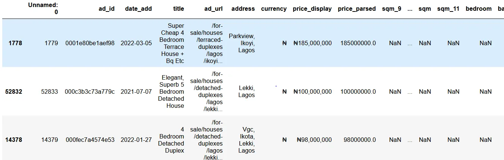

We slice the data to consider the houses and apartments. The data comprises a varied set of assets in the real estate market. The other assets give many outliers hence we need to filter out the unwanted by the above code.

```python
# Convert the price to a USD price
sales_df_.loc[sales_df_['currency'] == '₦', 'usd_price'] = sales_df_['price_parsed'] * 0.024
sales_df_.loc[sales_df_['currency'] !='₦', 'usd_price'] = sales_df_['price_parsed']
```

We can create a USD variable by converting the Nigerian currency. I figured out that changing would make the prices a bit stable.

```python
df = sales_df_[['date_add', 'usd_price']]
df = df.sort_values('date_add').groupby('date_add')['usd_price'].agg(mean = 'mean',
                                median = 'median',
                                            n = 'count', minimum = 'min', maximum = 'max')
df
```

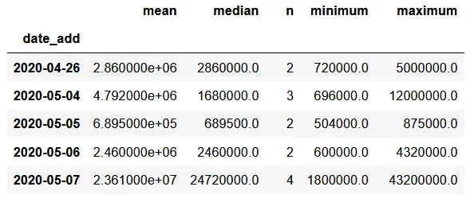

Different listings can be posted on a random day. We can get the central tendencies on that day and also the minimum and maximum. The above code also sorts the data from the start date to the last date, making it 711 days.

```python
import matplotlib.pyplot as plt
import seaborn as sns
sns.set_theme(style = 'darkgrid')
sns.set(rc={'figure.figsize':(11, 4)})
df['median'].plot(linewidth=0.5)
plt.show()
```

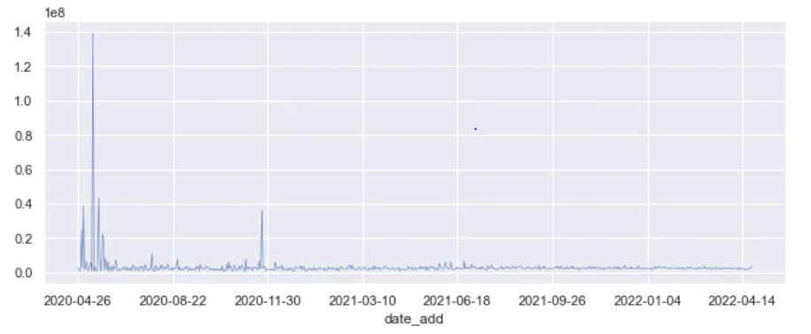

We can then plot the median value across the 2-year period. We can see that the data has outliers. On a certain date, the median price was $140 million.

```python
# Zoom in the data
zoom_in = df.loc[df['median'] < 0.1e8]
ax = zoom_in['median'].plot(linewidth=0.5)
ax.set_ylabel('Median Price')
ax.set_xlabel('Date')
ax.set_title('Median price for houses less than US$10 million')
plt.show()
```

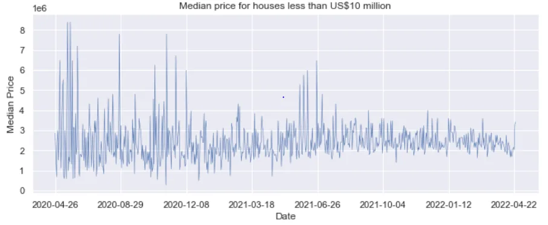

We can zoom in the data by filtering out the big numbers by looking at all houses less than $10 million

```python
# Number of listings
ax = df['n'].plot(linewidth=0.5)
ax.set_ylabel('Frequency')
ax.set_xlabel('Date')
ax.set_title('Number of listings')
plt.show()
```

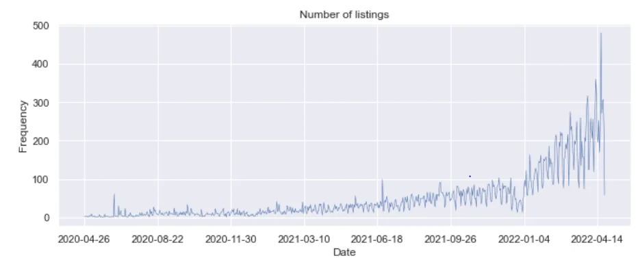

We can look at the number of houses on a daily basis being advertised. The listings have increased recently, perhaps more people have come to know of the website

```python
# Zoom in the data
zoom_in = sales_df_.loc[sales_df_['usd_price'] < 1e6]
zoom_in['date_add'] = pd.to_datetime(zoom_in['date_add'])
ax = sns.lineplot(x = 'date_add',
            y= 'usd_price',
            data = zoom_in)
ax.set_ylabel('House Price')
ax.set_xlabel('Date')
ax.set_title('Median price for houses less than US$1 million')
plt.show()
```

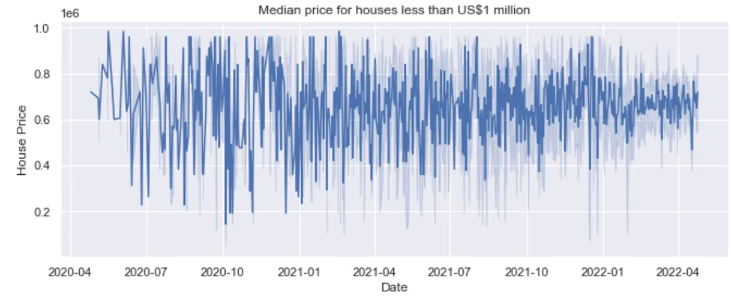

We can still see some outliers, well we can subset further the data to look at houses less than $1 million. The prices seem to be volatile averaging around $600 000.

```python
sales_df_.isna().sum()
```

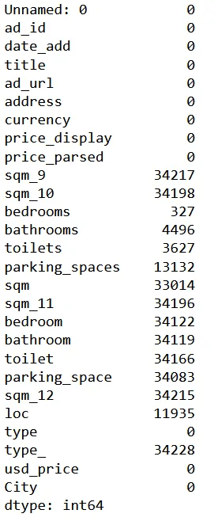

Most variables have missing values, due to the high number we will not consider these variables.

```python
#Identify the outliers and replacing with the median
def replace_outliers(series):
    absolute_differences_from_mean = np.abs(series- np.median) (series)) #Absolute difference
    this_mask = absolute_differences_from_mean > (np.std(series)*3)
    series[this_mask] = np.nanmedian(series)
    return series
house_prices = df.apply(replace_outliers)
ax = house_prices['median'].plot()
ax.set_ylabel('House median price')
ax.set_xlabel('Date')
plt.show()
```

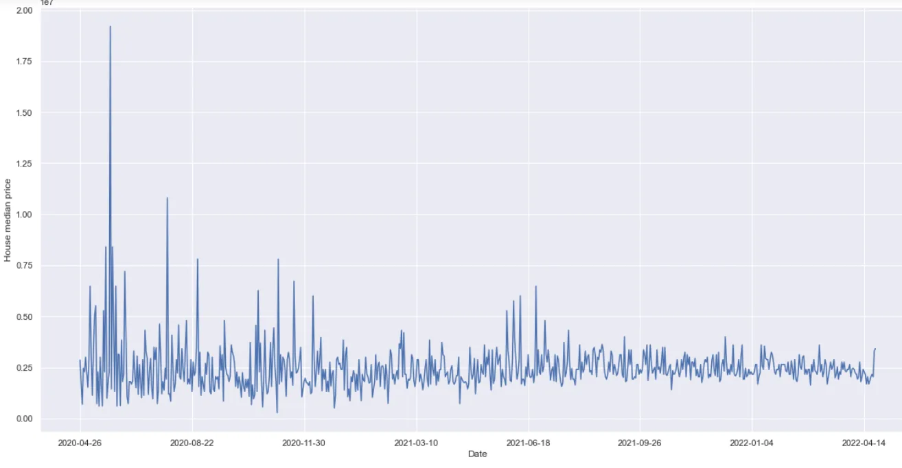

Okay, let's tackle the outlier problem by identifying the outlier and replacing the outlier with the mean of the time series. To do this we use a function above

```python
# Smoothing
def percent_change(series):
    previous_values = series[:-1]
    last_value = series[-1]
    percent_change = (last_value - np.mean(previous_values)/np.mean(previous_values))
    return percent_change
houses_smooth = house_prices.rolling(20).apply(percent_change)
ax = houses_smooth['median'].plot()
ax.set_title('Smoothed median prices')
ax.set_xlabel('Date')
ax.set_ylabel('Price')
plt.show()
```

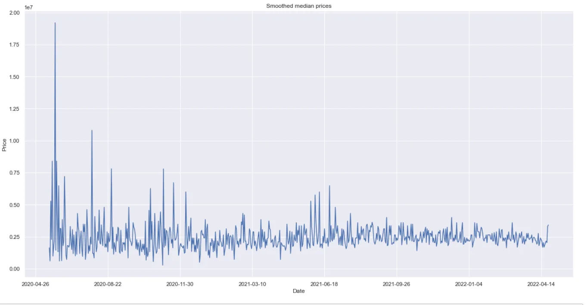

Let us also smoothen this series so that our model can fit well. We can apply our smoothening task over 20 data points at a time.

```python
# Time Delayed Features & Autoregressive Models
from sklearn.linear_model import Ridge
ridge = Ridge()
data = pd.Series(house_prices['median'])
data
shifts = [0,1,2,3,4,5,6,7]
many_shifts = {'lag_{}'.format(ii): data.shift(ii) for ii in shifts}
many_shifts = pd.DataFrame(many_shifts)
many_shifts

X = many_shifts.fillna(np.nanmedian(many_shifts))
#X = pd.concat([X, house_prices], axis=1)
y = data
ridge.fit(X,y)
fig, ax = plt.subplots()
ax.bar(X.columns, ridge.coef_)
ax.set(xlabel= 'Coefficient name',
      ylabel = 'coefficint value')
plt.setp(ax.get_xticklabels(),
         rotation=45,
         horizontalalignment = 'right')
```

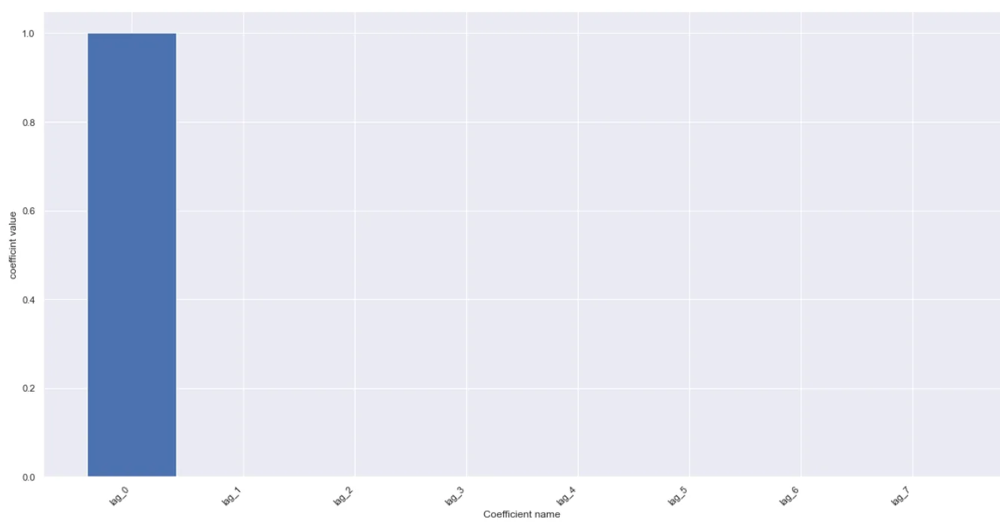

The smoothening can be augmented by the usage of time-delayed features. These time-delayed features are lags of the time series. We will consider 7-time lags and fill in these with the median values. We also fit the Ridge model and evaluate the fit

```python
X_p = house_prices[['mean', 'n', 'minimum', 'maximum', 'day']]
y_p = house_prices['median']
ridge.fit(X_p,y_p)

fig, ax = plt.subplots()
ax.bar(X_p.columns, ridge.coef_)
ax.set(xlabel= 'Coefficient name',
      ylabel = 'coefficint value')
plt.setp(ax.get_xticklabels(),
         #rotation=45,
         horizontalalignment = 'right')
```

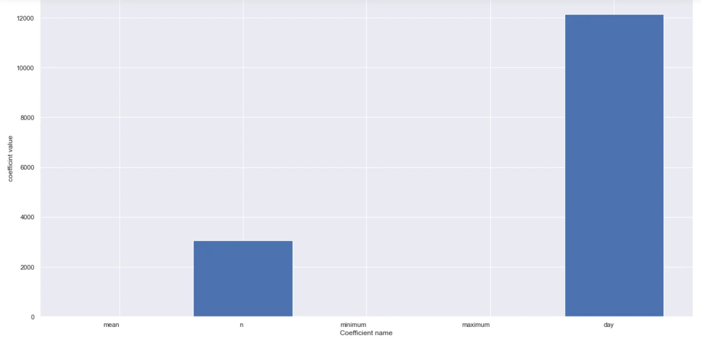

We can also look at the actual data with the mean, median, and minimum and maximum values. We can fit the ridge model and consider

```python
# Cross Validating the time series
from sklearn.model_selection import KFold
cv = KFold(n_splits = 10, shuffle= False)
results = []
for tr, tt in cv.split(X_p, y_p):
    ridge.fit(X_p[tr], y_p[tr])
    prediction = ridge.predict(X_p[tt])
    score = r2_score(y[tt], prediction)
    #results.append(prediction, score, tt)
score
```

contrary to the other train and test set splits in the sklearn, the time series data is best not split at random but split in a particular order. Across these cut options, we can evaluate our model

The Github code is [here](https://github.com/Matshisela/Time-Series-Analysis-Concepts)
