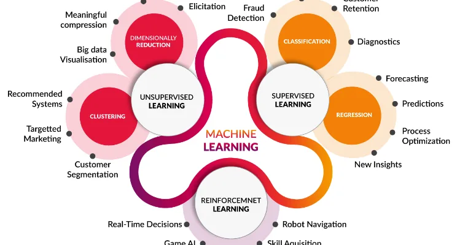
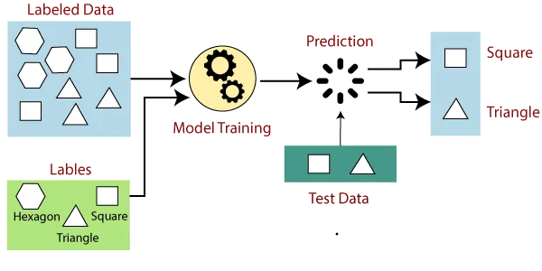
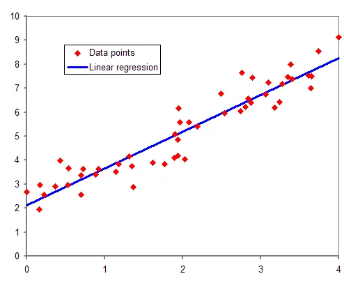
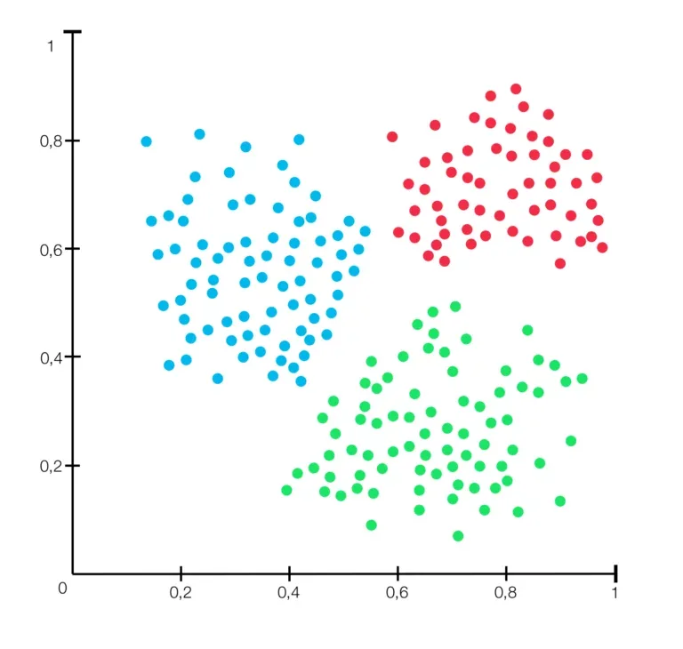

***Machine Learning***

Machine learning is a branch of artificial intelligence (AI) and computer science which focuses on the use of data and algorithms to imitate the way that humans learn, gradually improving its accuracy.

Machine learning has proved to be very helpful in solving challenging problems, being able to identify a tumour, self-driving cars to face recognition.

It all sounds like magic, but seriously, it's not, it's all built on foundations of mathematics and statistics developed over decades.

In recent years, we have witnessed a huge advancement in technology due to programming.

whiles programming involve defining a set of rules to be strictly followed by the computer or any electronic device, machine learning involves writing algorithms for the machine to use to derive its own rules based on a certain task it is made to solve.

Machine learning can be classified as follows:

1. Supervised Learning
2. Unsupervised Learning
3. Reinforcement Learning

In this post, we will learn about the two machine learning techniques which are widely used.

**. . .**

**Supervised Learning**

What is supervised learning?

Supervised learning is a type of machine learning technique in which machines are trained using 'labelled' training data and then predict the output based on that data. The labelled data indicates that the input data have already been tagged with the appropriate output.

The 'supervised' originates from the idea that training this type of algorithm is like having an instructor supervise the whole process.

The algorithm searches for patterns in the input data that correlate with the desired output data.

Supervised learning can be split into two categories:

1. Classification
2. Regression

**Classification**

In classification, we want to distinguish between two or more entities.

Say an apple from an orange, spam or not spam, cat or dog.

This is called a binary classification as it involves only two discrete outcomes, it can also be a multiclass entity we want to classify, a popular example is classifying handwritten digits (MNIST).

The schematic diagram show's a multiclass model.

A few popular classification algorithms are:

1. Linear Classifiers
2. Support Vector Machines
3. Decision Trees
4. K-Nearest Neighbor
5. Random Forest

**Regression**

Regression is a supervised learning technique that allows us to predict a continuous outcome variable (y) based on the value of one or multiple predictor variables (x).

The goal of this technique is to build a mathematical equation that defines y as a function of the x variables.

Below show's a simple linear regression model

Continous values like sales, income and test scores can be predicted using a regression model

The most common regression algorithms are:

1. Linear Regression
2. Logistic Regression
3. Polynomial Regression

**. . .**

**Unsupervised Learning**

In unsupervised learning, the algorithm is used to discover

hidded patterns in the input data and try to form clusters based on these

input data without human intervention, because the algorithm

is used to form clusters, there's no need for the output data.

This machine learning technique is employed in exploratory

data analysis.

some techniques of unsupervised learning include;

1.**clustering**

The technique of putting related elements together is known as "clustering." The purpose of this unsupervised machine learning technique is to look for commonalities in data points and group them together.

**. . .**

**conclusion**

In post, we learn about supervised and unsupervise learning and it's categories.

Thank you for reading
