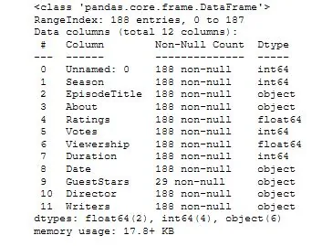
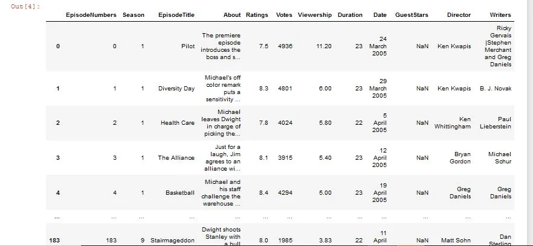
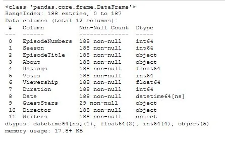
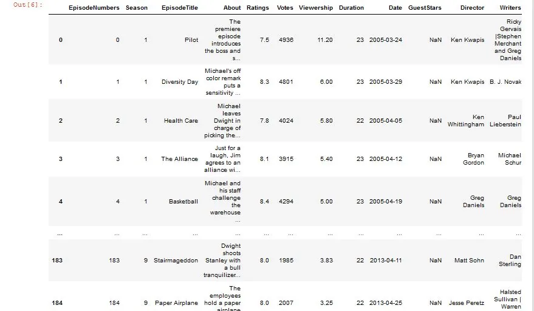
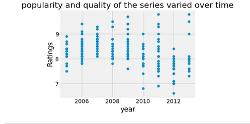
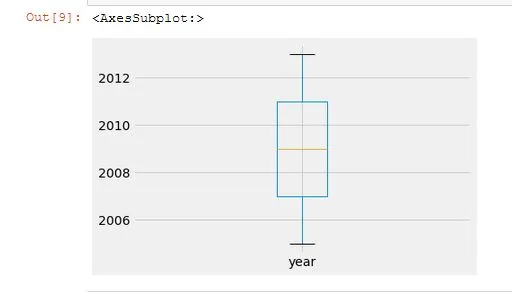
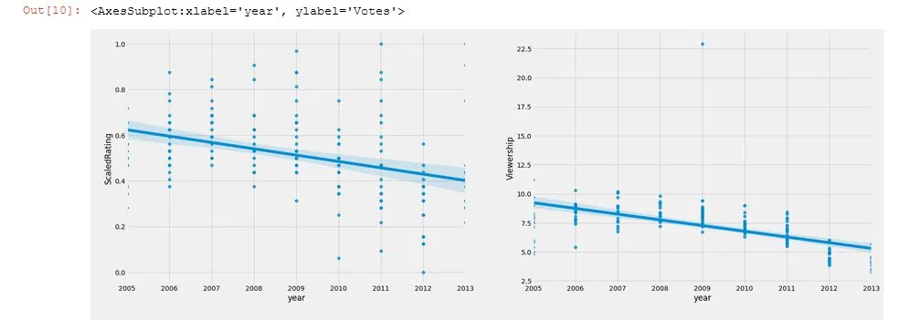
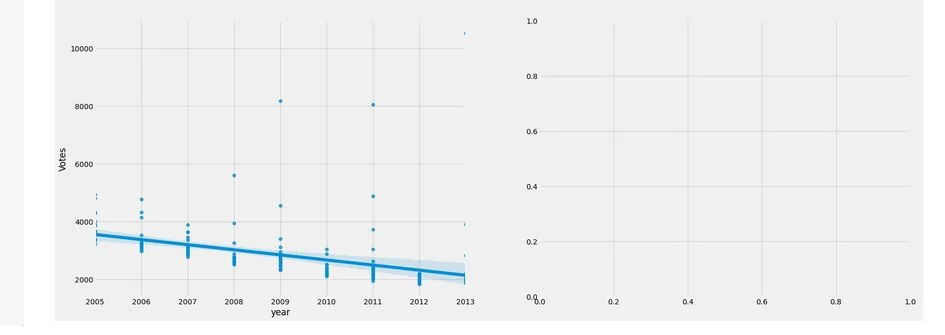

The Office is an American mockumentary sitcom television series that follows the daily life of office workers in the fictional Dunder Mifflin Paper Company's Scranton branch.
It ran for nine seasons and 201 episodes from March 24, 2005, to May 16, 2013, with a total of nine seasons and 201 episodes.


To imitate the look of a genuine documentary, the series was shot in a single-camera arrangement without a studio audience or a laugh track.
The Office's original cast was Steve Carell, Rainn Wilson, John Krasinski, Jenna Fischer, and B. J. Novak, with numerous other cast members appearing as guest stars during filming.

Today, we'll look at how the overall views of each episode of the show have changed over time, as well as the ratings for each episode.
The information on the shows may be found in the original Kaggle dataset [here](https://www.kaggle.com/nehaprabhavalkar/the-office-dataset).

The data set is named office episodes.csv and is available locally.

The data collection includes the following information about the show's episodes.

**office_episodes.csv**

- **episode_number:** Canonical episode number.
- **season:** Season in which the episode appeared.
- **episode_title:** Title of the episode.
- **description:** Description of the episode.
- **ratings:** Average IMDB rating.
- **votes:** Number of votes.
- **viewership_mil:** Number of US viewers in millions.
- **duration:** Duration in number of minutes.
- **release_date:** Airdate.
- **guest_stars:** Guest stars in the episode (if any).
- **director:** Director of the episode.
- **writers:** Writers of the episode.
- **has_guests:** True/False column for whether the episode contained guest stars.
- **scaled_ratings:** The ratings scaled from 0 (worst-reviewed) to 1 (best-reviewed).

To begin the analysis, we first import the necessary libraries.

```python
## REQUIRED LIBRARIES
import numpy as np
import pandas as pd

# For visualization
import matplotlib.pyplot as plt
%matplotlib inline
import seaborn as sns
```

We'll need pandas to load datasets, numpy to solve mathematical problems and arrays, and pyplot to visualize data.

To convert a.csv file to a Pandas DataFrame, we use the read csv() method.

```python
#Reading the_office_series.csv dataset and parse the date
office_df = pd.read_csv('the_office_series.csv')
#Print a concise summary of the dataframe
office_df.info()
```



We can check each column statistically for outliers, variable distribution, and so on.

We can see that the distribution of features isn't too awful just by looking at it.

According to the Analysis One Column is unnamed & and that's why we are changing the column name.

```python
#change the column index one from 'Unnamed: 0' to 'EpisodeNumbers'
office_df = office_df.rename(columns = {'Unnamed: 0': 'EpisodeNumbers'})
office_df
```



As our Analysis depends on the time, I need to work with the "Date" column data. And because of the Data Type being object, I am converting the Data Type & simplifying it.

```python
#Convert the Data Type of Date column to datetime64 for numerical analysis
office_df['Date'] = pd.to_datetime(office_df['Date'])
office_df.info()
```



To work with the Data I am creating a new Column Named 'Year'. For ease, the Date data format has been simplified by Converting it to Year Data only.

```python
#creating a column named "year"
office_df['year'] = office_df['Date'].dt.year
office_df
```



When we look at the Ratings column, we can see that each episode has a rating score that ranges from 0 to 10.

Each episode in The Office Series has a rating ranging from 6.6 to 9.8.

We want to be able to quickly check the data, so we convert the rating values to normalized rating values that range from 0 to 1 and save them in the ScaledRating column.

```python
# Scaling Rating column
def scaleFunc(col):
    minVal = min(col)
    maxVal = max(col)
    return [*map(lambda x: (x - minVal)/(maxVal - minVal), col)]

#call normalize Function
office_df['ScaledRating'] = scaleFunc(office_df['Ratings'])
```

Then I am applying an initial scatter plot to go through the popularity & quality status over time.

```python
fig = plt.figure()
#Style of Plot
plt.style.use('fivethirtyeight')

plt.scatter(x = office_df['year'],
            y = office_df['Ratings'])
plt.title('popularity and quality of the series varied over time')
plt.xlabel('year')
plt.ylabel("Ratings")
plt.show()
```



As the desired output depends on the Year data, I am identifying the outlier.

```python
#Plotting the boxplot for the year Column
office_df.boxplot('year')
```



Now, I am applying the Regression Analysis on the dependent Column data to reach on a decession.

```python
#Regression Plot
# Relations based on the continuous data attributes
fig, axarr = plt.subplots(2, 2, figsize=(25, 20))
sns.regplot(y='ScaledRating',x = 'year', data = office_df, ax=axarr[0][0])
sns.regplot(y='Viewership',x = 'year',  data = office_df , ax=axarr[0][1])
sns.regplot(y='Votes',x = 'year', data = office_df, ax=axarr[1][0])
```





According to my analysis on the dataset, I came up to the final outcome that, the popularity & quality has slightly decreased and gradually getting decreased on the basis of time.
