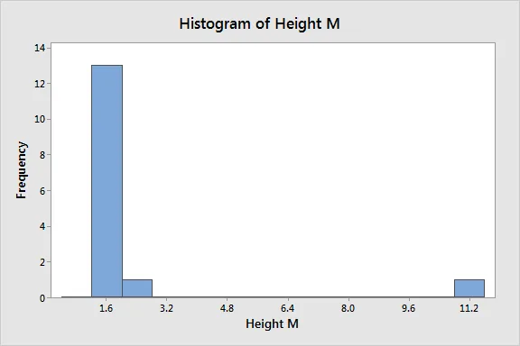

[#Machine](https://www.datainsightonline.com/blog/hashtags/Machine) Learning

Machine Learning has swept the world of data science; improvements in processing power, algorithms, and community practices have made it possible to use computers to ask questions that were previously unimaginable.

Because data can be too massive or complicated most of the time for humans to produce insights simply by looking at it, Machine Learning helps us to make smart predictions using data.

Machine learning shines in this area.

In the article, you will be introduced to how we can leverage this technique to analyze time-series data.

**Time-series Data**

Time series is simply data that changes over time and can take many different forms, below show's various kinds of time series data.

1. ***stock prices forecasting:*** *The past history of stock price,* and *regular and irregular shifts of stock market spikes can be used to gain insight* into *future market* behaviour
2. ***Demand and sales forecasting***
3. ***climate and weather prediction:*** climate and weather data are regularly collected which are time-based from numerous weather stations worldwide, the Machine Learning technique is used to analyze and interpret future forecasts based on statistical dynamics

A time-series data at least consist of the array of the data itself, and a time-stamp which can be in minutes, days of the week or months of the year.

**Step-by-step Process of Time-series Analysis With Machine Learning**

With all the above said and done, let's look at common practices in time-series forecasting using machine learning.

**Preparation Stage**

1. ***Data gathering and exploration:*** as far as machine learning is concerned, gathering quality data has a huge impact on the final model, as a result, care should be taken during this process. Exploring the data using charts and other time-series visuals will give a thorough understanding of the data and the kinds of algorithms that will prove the most efficient to model the data.
2. ***Data preparation and time series decomposition:*** experienced data scientists and machine learning practitioners should clean all involved data, gaining valuable insights and extracting proper variables, and these can be used for time series decomposition

**Modeling Stage**

1. **Model training:** pick a machine learning algorithm for time series, fit it and optimize using cross-validation to prevent overfitting
2. ***Models evaluation:*** after research and preparing the data, different time series algorithms are tested and evaluated in order to get the most efficient model.

**Testing Stage**

We run the model on known data, and the accuracy and performance metrics are calculated to access how good the model will perform in the real world

**Deployment Stage**

The model is deployed to the cloud, since time series forecasting is always iterative, meaning that, there will be multiple revisions and optimizations continuously to keep improving the model performance

**. . .**

**FEATURE ENGINEERING IN PYTHON**

“At the end of the day, some machine learning projects succeed and some fail. What makes the difference? Easily the most important factor is the features used.” - A statement made by Dr Pedro Domingos', A professor Emeritus of computer science and engineering at the University of Washington.

This inherently tells us that, a model's performance highly depends on the features used, can either be a really bad model or a better one.

Feature engineering can sometimes come out to be a really complex statement based on the experience of the individual, but at the heart of it, it focuses on a simple few topics

1. handling missing values
2. handling outliers
3. encoding categorical features
4. scaling numerical features
5. extracting parts of a date
6. binning numerical variables

**NB: Feature engineering is more than this**

we will handle some of the topics and understand the intuition behind them.

*Handling missing values*

In the data collection phase of the machine learning pipeline, sometimes the data can be corrupted or fail to record. These are the causes of missing values in data. and in the real world, there are a lot of missing values.

Handling missing values is very critical in the machine learning workflow as some algorithms aren't friendly with missing values.

There are some techniques we can implement to solve this problem,

1. Delete the rows or columns containing these missing values
2. Imputing the missing values

each technique can have an effect on the model performance, say, we have a data set of 500 rows, which is a small data set, if the mean of the missing values in the data happens to be more than 50% of the whole dataset, then, deleting this will be more harm than good.

This is where we can impute the missing values, if feature contains numerical values, we can compute statistics like mean and median to impute them, on the flip side, if they are categorical, we can use mode to compute them.

*Handling Outliers*

An outlier is an observation that lies an abnormal distance from other values in a random sample of a population.

this is how an outlier will affect a feature's distribution ...

The plot show's a histogram plot of height in meters. we can clearly see one data point 11.2m that lies at a far distance from the rest of the data. this is an outlier.

the simple and most efficient way is to remove them, we can use percentiles and strip the two end parts of the data points[0.25, 0.75] percentiles. this comes at a cost.

We can however use a more statistically sound approach to solve this.

we compute the mean and standard deviation of the feature, then we remove all data points which are three standard deviations away from the mean, a more efficient way to deal with outliers.

*Encoding categorical features*

Encoding categorical data is a process of converting categorical data into integer format so that the data with converted categorical values can be provided to a model.

it is a very important process because all machine learning models aren't friendly with categorical features, hence, they have to be converted.

*Scaling numerical features*

Some algorithms require feature scaling, eg. KNN, Neural networks, Linear Regression, Logistic regression etc.

hence if you happen to use some of these algorithms in your machine learning projects, then they need to be scaled else your model won't perform well.

some methods of feature scaling include

1. Standardization
2. Min-Max Scaling
3. Binarizing
4. Normalizing

**CONCLUSION**

this article is a guide to feature engineering and time-series analysis with machine learning, there is a lot to learn and get familiarised with, go out there and start.

[#DataScience](https://www.datainsightonline.com/blog/hashtags/DataScience) [#MachineLearning](https://www.datainsightonline.com/blog/hashtags/MachineLearning)

Thank you for reading!
