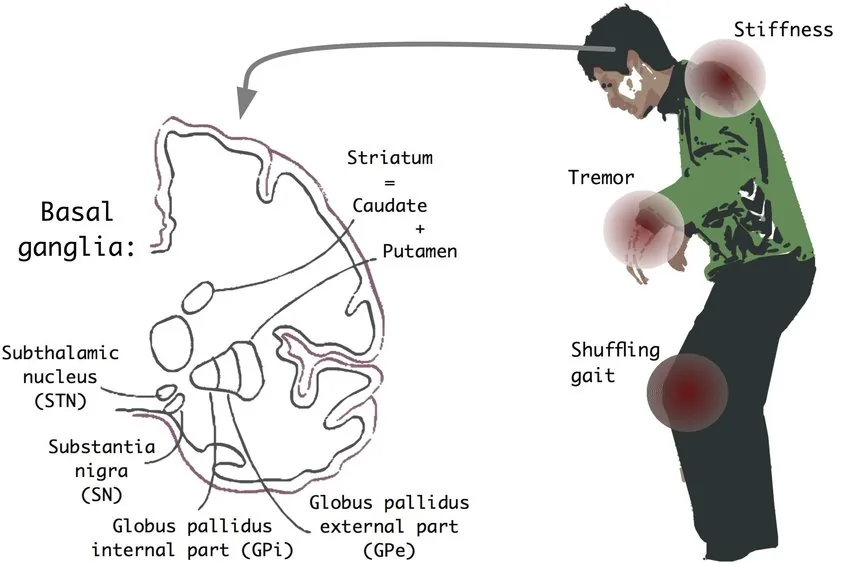
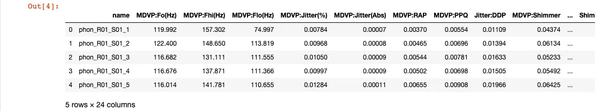
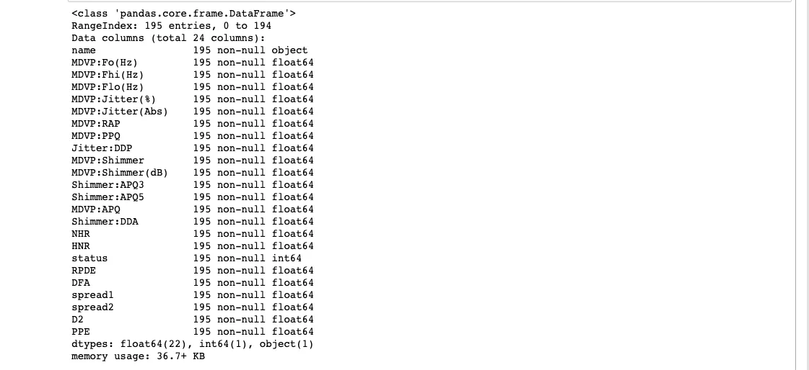
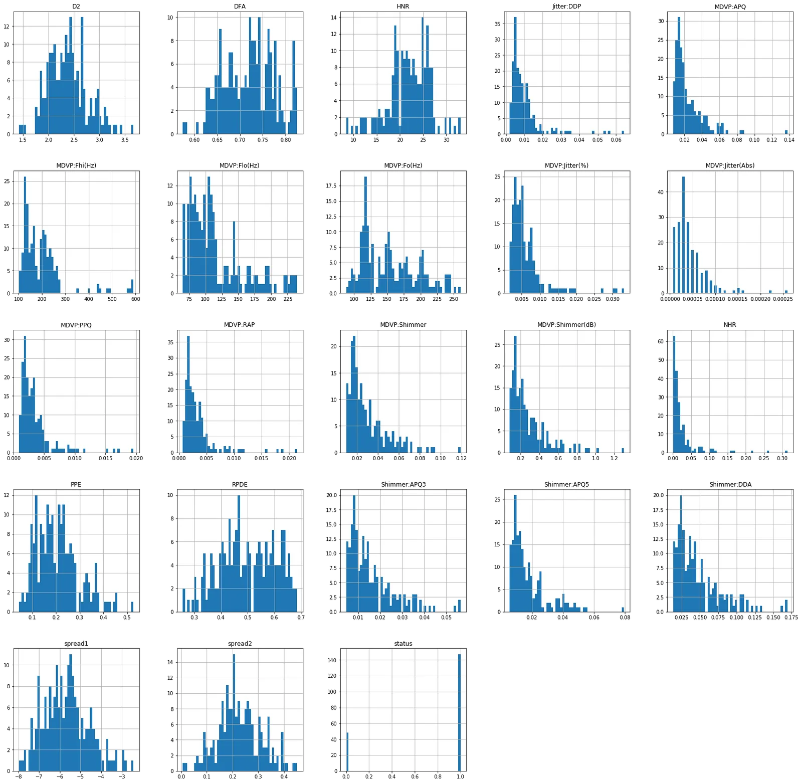
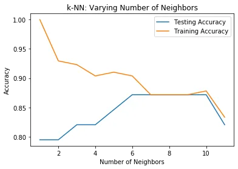
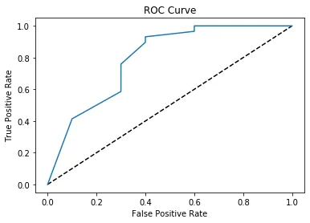

Neurodegenerative diseases are a heterogeneous group of disorders that are characterized by the progressive degeneration of the structure and function of the nervous system. They are incurable and debilitating conditions that cause problems with mental functioning also called dementias. This project aims to focus on Parkinson's disease and build a machine learning model that will be able to predict if a patient has Parkinson's disease or not.

**Data Set Information**

The dataset that we will be using is composed of a range of biomedical voice measurements from 31 people, 23 with Parkinson's disease (PD). Each column in the table is a particular voice measure, and each row corresponds to one of 195 voice recordings. The main aim of the data is to discriminate healthy people from those with PD, according to the "status" column which is set to 0 for healthy and 1 for PD. I have acquired the dataset from [The](https://archive.ics.uci.edu/ml/datasets/Parkinsons)[University of California Irvine](https://archive.ics.uci.edu/ml/datasets/Parkinsons)[Machine Learning Repository](https://archive.ics.uci.edu/ml/datasets/Parkinsons).

**Attribute Information of the Dataset**

Matrix column entries (attributes):

MDVP:Fo(Hz) - Average vocal fundamental frequency

MDVP:Fhi(Hz) - Maximum vocal fundamental frequency

MDVP:Flo(Hz) - Minimum vocal fundamental frequency MDVP:Jitter(%),MDVP:Jitter(Abs),MDVP:RAP,MDVP:PPQ,Jitter:DDP - Several measures of variation in fundamental frequency MDVP:Shimmer,MDVP:Shimmer(dB),Shimmer:APQ3,Shimmer:APQ5,MDVP:APQ,Shimmer:DDA - Several measures of variation in amplitude NHR,HNR - Two measures of the ratio of noise to tonal components in the voice status - The health status of the subject (one) - Parkinson's, (zero) - healthy RPDE, D2 - Two nonlinear dynamical complexity measures DFA - Signal fractal scaling exponent spread1,spread2, PPE - Three nonlinear measures of fundamental frequency variation.

We will start off by importing the necessary libraries for data manipulation and exploration.

```python
import numpy as np
import pandas as pd
import matplotlib.pyplot as plt
import seaborn as sns
```

We will now load the dataset as a pandas DataFrame.

```python
df = pd.read_csv('parkinsons.data')
```

**Data Exploration**

Let's have a sense of what our data looks like. We will do this by checking out the first five rows of the DataFrame.

```python
df.head()
```



Also, we can have a look at the columns information with the code snippet below.

```python
df.info()
```



The first question we'd like to ask is whether the data has missing values.

From the above, we clearly see that there are no missing values in the DataFrame which makes it ideal to train a machine learning model on it.

Let's do it a bit more visualization by generating correlation and plot histograms of columns.

```python
#correlation data
f,ax=plt.subplots(figsize=(14,14))
sns.heatmap(df.corr(),annot=True,ax=ax,fmt=".2f")
plt.xticks(rotation=90)
plt.show()
```


```python
df.hist(bins=50, figsize=(28,28))
```



The next question we'd like to ask is which machine learning method should we use on our data to help us with predictions on future unseen data. From the Data Set Information above we highlighted that the "status" column is set to 0 for healthy and 1 for PD which makes it suitable for binary classification problems. The image above corroborates this assertion.

**Building a Supervised Learning Model**

Let's assign the variable y to be our target variable.

```python
y =  df.status.values
```

We will now assign X as features variable by getting rid of the "name" and "status" columns which are not numeric.

```python
X = df.drop(['name', 'status'], axis=1)
```

Now that we have both the feature and target variables, we can start building our model by first importing KNeighborsClassifier class from Sklearn and train_test_split function from Sklearn model selection.

```python
from sklearn.neighbors import KNeighborsClassifier
from sklearn.model_selection import train_test_split
```

We will now split the dataset into training and testing sets with the help of the code snippet below.

```python
X_train, X_test, y_train, y_test = train_test_split(X, y, test_size=0.2, random_state=21, stratify=y)
```

Now instantiate a "k nearest neighbor" model with number or neighbors equal to 6.

```python
knn = KNeighborsClassifier(n_neighbors=6)
```

Let's now fit the model to the training set to be able to make predictions on future unseen data.

```python
knn.fit(X_train, y_train)
```

We will now use the model to predict the test data and print the test set prediction results.

```python
y_pred = knn.predict(X_test)
```

```python
print('Test set prediction: \n {}'.format(y_pred))
```

```python
Test set prediction:
 [1 0 1 1 1 1 1 1 1 1 1 0 1 1 1 1 1 1 1 0 0 0 1 1 1 1 1 0 1 1 0 1 1 1 1 1 1 1 1]
```

We can now ask the question; "How well did our model perform?". We can get the answer to this question by using the "score" method on our model to calculate the accuracy of our test data.

```python
knn.score(X_test, y_test) * 100
out[]: 87.17948717948718
```

From the above checking, we see that we have an accuracy score of 87%! But before getting comfortable with our model, we ought to check if there is a better number of neighbors we could use for the model. We will do this with the help of the code snippet below.

```python
# Setup arrays to store train and test accuracies
neighbors = np.arange(1, 12)
train_accuracy = np.empty(len(neighbors))
test_accuracy = np.empty(len(neighbors))

# Loop over different values of k
for i, k in enumerate(neighbors):
    # Setup a k-NN Classifier with k neighbors: knn
    knn = KNeighborsClassifier(n_neighbors=k)

    # Fit the classifier to the training data
    knn.fit(X_train, y_train)

    #Compute accuracy on the training set
    train_accuracy[i] = knn.score(X_train, y_train)

    #Compute accuracy on the testing set
    test_accuracy[i] = knn.score(X_test, y_test)

# Generate plot
plt.title('k-NN: Varying Number of Neighbors')
plt.plot(neighbors, test_accuracy, label = 'Testing Accuracy')
plt.plot(neighbors, train_accuracy, label = 'Training Accuracy')
plt.legend()
plt.xlabel('Number of Neighbors')
plt.ylabel('Accuracy')
plt.show()
```

And the above code generates the graph shown below.



From the above figure, we see that the test accuracy is highest using 6 through 10 neighbors. Thus, any value in this range will be a good value for the number of neighbors and we were lucky to have chosen 6 with our trial. Yaaay!

**Metrics for classification**

Above, we computed the accuracy of our metrics and got about an 87% accuracy score. But accuracy is not always an informative metric. This is why we have evaluated the performance of our model by computing the confusion matrics and generating the classification report.

We can achieve this by importing the classification_report and confusion_matrix from Scikit learn's metrics module and printing them to have a sense of what we are dealing with.

```python
from sklearn.metrics import classification_report, confusion_matrix
```

```python
print(confusion_matrix(y_test, y_pred))
out[]: [[ 6  4]
        [ 1 28]]
```

From the confusion matrix, we have 6 True Positives and 24 True Negatives!

```python
print(classification_report(y_test, y_pred))
              precision    recall  f1-score   support

           0       0.86      0.60      0.71        10
           1       0.88      0.97      0.92        29

    accuracy                           0.87        39
   macro avg       0.87      0.78      0.81        39
weighted avg       0.87      0.87      0.86        39
```

We see high f1-score and recall, this shows that our model performed well.

We will now plot an ROC curve to show the probability rate of True Positives against False Positives.

```python
# Import necessary modules
from sklearn.metrics import roc_curve

# Compute predicted probabilities: y_pred_prob
y_pred_prob = knn.predict_proba(X_test)[:,1]

# Generate ROC curve values: fpr, tpr, thresholds
fpr, tpr, thresholds = roc_curve(y_test, y_pred_prob)

# Plot ROC curve
plt.plot([0, 1], [0, 1], 'k--')
plt.plot(fpr, tpr)
plt.xlabel('False Positive Rate')
plt.ylabel('True Positive Rate')
plt.title('ROC Curve')
plt.show()
```



From the ROC Curve above, we see that there is a high probability for True Positives which is great in evaluating our model!

The complete code can be found on GitHub [here](https://github.com/siseebrima/Parkinson-Disease-Machine-Learning-Model/blob/master/Parkinson%20Disease%20Machine%20Learning%20Model.ipynb).
