***Part2: An example for visualization using seaborn here***

***We are going to simplify the example from*** [Data visualization in Python using Seaborn - LogRocket Blog](https://blog.logrocket.com/data-visualization-python-seaborn/) by exploring a pre-built in dataset of diamonds using seaborn package:

1. Histogram and KDE

2. Barplt and Countplot

3. Scatter plots

4. Pair plots

```python
diamonds = sns.load_dataset("diamonds")
diamonds.columns
Index(['carat', 'cut', 'color', 'clarity', 'depth', 'table', 'price', 'x', 'y',        'z'],       dtype='object')
diamonds.describe()
```

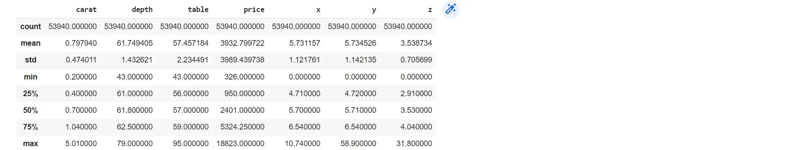

## Histograms plots:
```python
sns.histplot(diamonds["carat"])
```

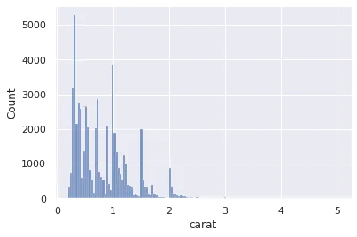

This is just a histogram to draw the counts of diamonds according to carat variable, Histogram divide into random number of equal-sized bins, here we can say that most diamonds weighs less than 1, we can do the same for other variables:

we can first work on sample from diamonds dataset because it has 53940 set of data -

```python
diamonds.shape : (53940, 10)
sample = diamonds.sample(3000)
sns.histplot(x=diamonds["price"])
```

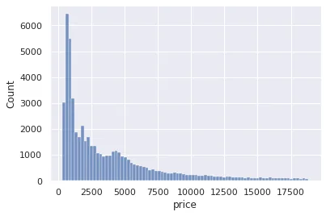

### Kernel Density estimate plot:

We use KDE to find the distribution of the probability as an estimation, KDE seems to give smoother figures.

```python
sns.kdeplot(sample["price"])
```

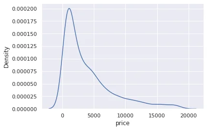

### Count plots:
```python
sns.countplot(sample["cut"])
```

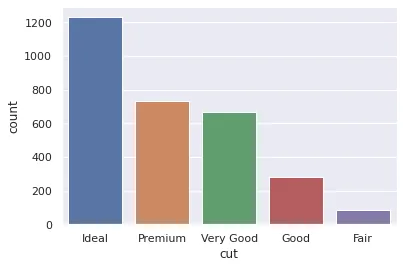

It seems that most of our cuts are ideal, count plot gives us what the name indicates : the count.

### Scatter plots -Bivariate analysis:

It gives us the relationship between two variables.

```python
sns.scatterplot(x=sample["carat"], y=sample["price"])
```

Each dot is a diamond, it seems heavier diamonds are more expensive.

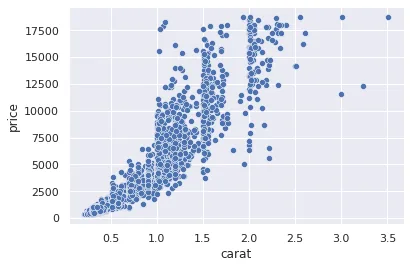

### Boxplots -Bivariate analysis:

Theses can gives us side by side characteristic of a variable.

```python
sns.boxplot(x=sample["color"], y=sample["price"])
```

Hereby, we see the distribution of each color, this plot is useful for categorical data, it is basically a percentile divided into minimum, maximum, and outliers which are the black dots.

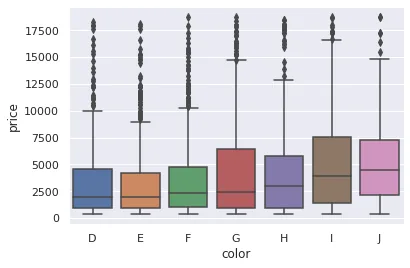

### Bair plots: Multivariable analysis:

```python
sns.pairplot(sample[["price", "carat", "table", "depth"]])
```

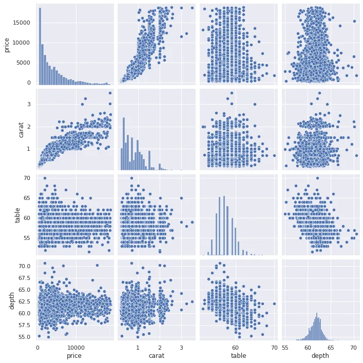

In pair plots it creates 4\*4 variations of plots because we have 4 variables. It is useful and concise to make us take a glimpse of what variables that have a clear relationship between each other, we might be able to draw some correlation primarily.

If we want to know exactly the percentage of correlation between them we could use the correlation coefficient, correlation maps which have a range between -1 to 1.

```python
correlation_matrix = diamonds.corr()
correlation_matrix
```

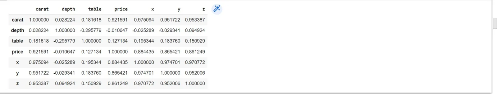

```python
correlation_matrix.shape
(7, 7)
```

We can draw a heatmap with annotation of colors and numbers that represents the variation in correlation range.

```python
sns.heatmap(correlation_matrix, square=True, annot=True, linewidths=3)
```

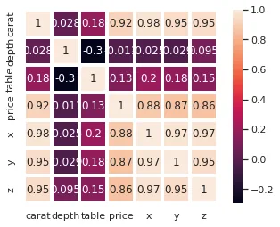

Another trick to make scatterplot a multivariate plot is to use more variables:

```python
sns.scatterplot(sample["carat"], sample["price"], hue=sample["cut"])
```

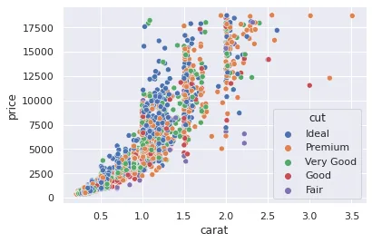

More can be explored in details by exploring all variables in details.

Thank you for reading up to this point, if you like it follow me on twitter @sanaomaro.
