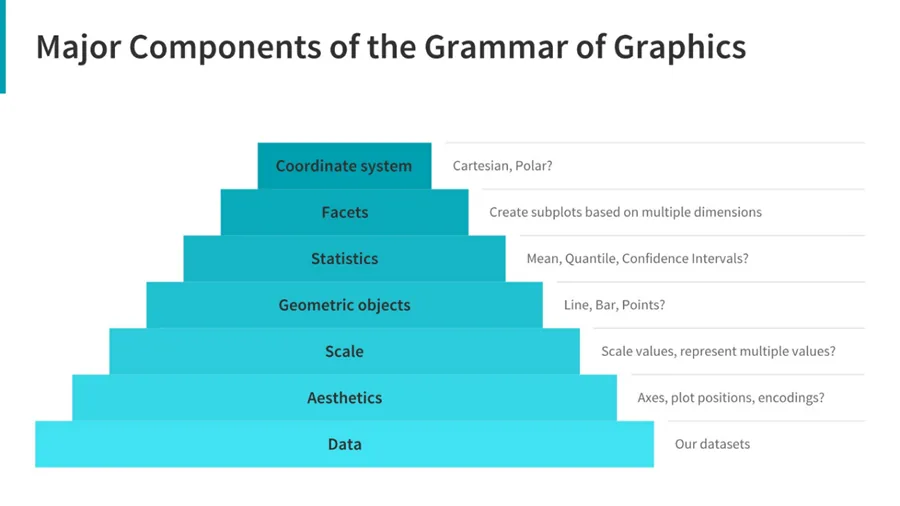

## Data visualization in python
Visualizing data is very important, it helps in discovering patterns and characteristics behavior over time in data, a good visualization in figures is better to understand the underlined relationships between data members better than words.

There are multiple libraries for visualizing data in python such as:

- [Matplotlib](https://mode.com/blog/python-data-visualization-libraries/#matplotlib)
- [Seaborn](https://mode.com/blog/python-data-visualization-libraries/#Seaborn)
- [Plotnine(ggplot)](https://mode.com/blog/python-data-visualization-libraries/#ggplot)
- [Bokeh](https://mode.com/blog/python-data-visualization-libraries/#Bokeh)
- [pygal](https://mode.com/blog/python-data-visualization-libraries/#pygal)
- [Plotly](https://mode.com/blog/python-data-visualization-libraries/#Plotly)
- [geoplotlib](https://mode.com/blog/python-data-visualization-libraries/#geoplotlib)
- [Gleam](https://mode.com/blog/python-data-visualization-libraries/#gleam)
- [missingno](https://mode.com/blog/python-data-visualization-libraries/#missingno)
- [Leather](https://mode.com/blog/python-data-visualization-libraries/#Leather)
- [Altair](https://mode.com/blog/python-data-visualization-libraries/#Streamgraph)
- [Folium](https://mode.com/blog/python-data-visualization-libraries/#Folium)

[Matplotlib](https://mode.com/blog/python-data-visualization-libraries/#matplotlib)

Matplotlib is the oldest one, as Moffitts says in his article [Overview of Python Visualization Tools - Practical Business Python (pbpython.com)](https://pbpython.com/visualization-tools-1.html) Matplotlib is the godfather of all visualization packages in python. It is a powerful library but the complexity in the lengthy code required to generate such amazing visualization in Matplotlib, thus another packages emerged such as seaborn and geoplotlib etc.

[Plotnine(ggplot)](https://mode.com/blog/python-data-visualization-libraries/#ggplot)

As said in the official website [A Grammar of Graphics for Python — plotnine 0.8.0 documentation](https://plotnine.readthedocs.io/en/stable/), It is an implementation to the grammar of visualization by mapping data into visual objects making the plot.

**Seaborn**

As written in the official website [seaborn: statistical data visualization — seaborn 0.11.2 documentation (pydata.org)](https://seaborn.pydata.org/) it is a data visualization library based on Matplotlib which provides highly detailed statistical visualization.

We borrow this example from the official documentation [An introduction to seaborn — seaborn 0.11.2 documentation (pydata.org)](https://seaborn.pydata.org/introduction.html):

```python
# Import seaborn
import seaborn as sns

# Apply the default theme
sns.set_theme()

# Load an example dataset
tips = sns.load_dataset("tips")

# Create a visualization
sns.relplot(
    data=tips,
    x="total_bill", y="tip", col="time",
    hue="smoker", style="smoker", size="size",
)
```

As we see first we imported seaborn library pointed to it as the abbreviation sns, then we applied a theme, these themes are predefined in seaborn library, then the most important step where we visualize the relationship between data variables, it is tips dataset loaded in examples and it represents here the total bill of either lunch or dinner where the costumers might be smokers or not, and the size of the bills is visualized by a fatter dots or Xs.

We here used relplot, relplot and scatter plot are mostly for descriptive analysis, where there is implot which is a regression plot visualization that can represents the uncertainty of the data.

There are another types of visualization plots such as distribution and categorical plots: sns.displot and sns.catplot.

-------------------------------------------------------------------------------------------------

After exploring some libraries, lets touch upon an important concept in the world of visualization, the rules of visualizing – **the grammar of graphics:**



This illustration by Sarkar [here](https://towardsdatascience.com/a-comprehensive-guide-to-the-grammar-of-graphics-for-effective-visualization-of-multi-dimensional-1f92b4ed4149) represents very well the important components of visualization, lets explore them more in details:

For any visualization we need:

1. **Data**: by default we need the data that we are going to visualize, and we need to decide variables to be visualize, which is dependent or not, discrete or not.
2. **Aesthetics**: Choosing data dimensions on the axes, the positions of various data points on the plot. Then add if there is a necessity for including size, shape, color and so on in the case of plotting multiple data dimensions.
3. **Scale:** Specify the range, and the need for scale.
4. **Geometric objects:** The ‘geoms’. This is the way we graph our data, should it be points, bars, lines and so on?
5. **Statistics:** In case we need to visualize any statistical measures such as the summary of data: the measures of central tendency, spread, confidence intervals?
6. **Facets:** more small plots or subplots depending on the nature of the data and the objective of the visualization.
7. **Coordinate system:** we know we have cartesian or polar coordinate systems, so which to choose.?

***Part2: An example for visualization using seaborn*** [***here***](https://www.datainsightonline.com/post/a-picture-is-worth-a-thousand-words-part-2)
