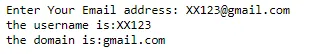
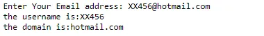

In this article, You will learn two ways to split an email address into username and domain . Before we go into the details of doing this let's first define the username and domain. The username appears to the left of the @ symbol, while the domain appears to the right. saf@gmail.com, for example, has the username 'saf', and gmail.com is the domain name.

**Method 1: using index() + slicing**

This method takes advantage of the fact that the @ symbol naturally separates the username from the domain. The python index () method is used to return the index of the @ symbol and then simple string slicing can be used to split the email into two parts as follows:

```python
# Email splitter for separating the username and domain
# Method 1

# intializing the email
email =input("Enter Your Email address: ").strip()

# separating the username and the domain name using slicing:
user= email[0:email.index('@')]
domain=email[email.index('@')+1:]

# printing the result :
print('the username is:' +str(user) )
print('the domain is:'+str (domain) )
```

Result :



**Method 2: split method**

The string split method is used to split the email on @, which results in a list. The first element in the obtained list is the username, while the second element is the domain.

```python
#Email splitter for separating the username and domain name
# Method 2
# intializing the email
email =input("Enter Your Email address: ").strip()

# separating the username and the domain name using split method :
user=email.split('@')[0]
domain=email.split('@')[1]

# printing the result :
print('the username is:' +str(user) )
print('the domain is:'+str (domain) )
```

Result :



The source code is available on [Github](https://github.com/safia-bashir/Email-Splitter).
