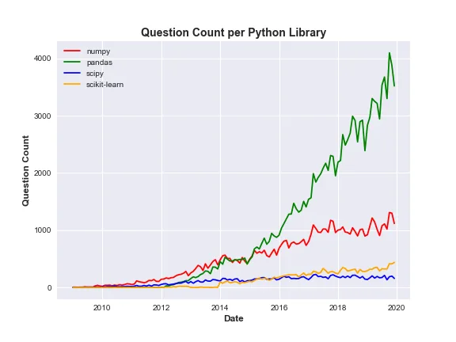
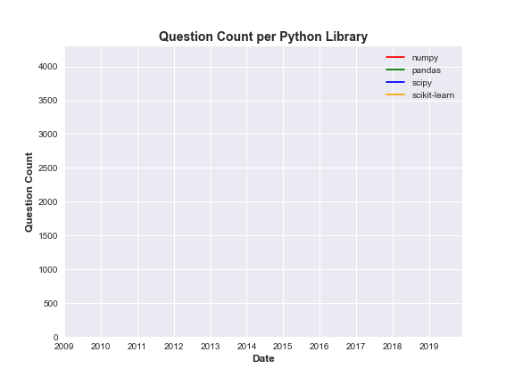
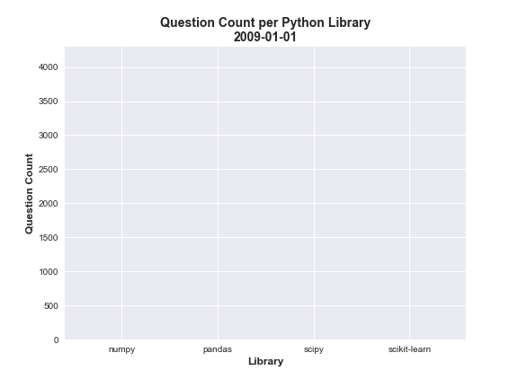

What would be the use of data science without visualizations and good presentations? You probably could guess: a world of nerds doing their data gibberish on one side and the sane world looking on in wonder on the other.

Fortunately, the world is otherwise a place where data scientists and analysts work with sane people and communicate their insights with good visualizations and both parties enjoying the vast possibilities inherent in the trade.

We all are probably familiar with static visualizations, the charts and graphs that glue to to our screen to say in few details what words and numbers would say for years. Invaluable resources they will always be.

However, there are times when we may need to add an extra layer to them as situations arise, and that's where animated visualizations could hop in.

A good example of when animated visualization may be useful is when you are dealing with time series data; you likely would want to see trends, and having a moving visualization could go a long way. Another instance where animated visualizations can come in handy is if your report has to be in a video or gif format.

In this article, we will be using Matplotlib to plot simple animated line and bar charts. The data to be used is a time series from [Kaggle](https://www.kaggle.com/aishu200023/stackindex). It contains information about the count of questions asked monthly about 80 different Machine Learning and Data Science concepts, tools, and libraries between January 2009 and December 2019 on StackOverflow.

## First Five Rows of Data
To make the animation easier to follow, we will be using a small subset of the data: four common Python libraries as shown below:

## Matplotlib Animated Line Plot
Creating animated plots in Matplotlib is not much different from creating the usual static Matplotlib plots. Why?

Animated visualizations are just bite-sized static plots that are displayed sequentially. Each of these mini static plots is called a frame. So unlike the usual static plot where the whole data is visualized once and for all, an animated plot takes a small chunk of the data, plots it, takes the next chunk, plots, and so on. Basically plotting sequential frames. Isn't that rather stylish?

To emphasize this relationship, we will first create a static line plot before adding the elements that will generate the corresponding animated version.

Below is the code that generates the static line plot

Which generates the graph below:

Now let's add the code for animation

## Code Explanation
1. In lines **1** and **2**, we import the Matplotlib base class for making animation and the FuncAnimation sub class that will repeatedly call the function that will generate the frames.
2. In line **6** we create empty containers that will be used to store sequential chunks of data.
3. Then we create the animation function. First, as seen from line **9** to **13**, the animation function collects data iteratively from each of the columns we want to plot and store the data in the empty containers.
4. To be sure each set of chunks does not encounter another preceding set on the axes, line **15** ensures the coast is kept clear.
5. As expected, we can then proceed to plot the frame as shown from line **17** to line **20** which, as stated earlier, is similar to the static plot except for the fact that we are using our container of chunks (***x*** and ***y***s).
6. Line **22** to **25** is also similar to what we have in the static plot, while **26** and **27** helps to set a limit on x and y axes as they are bound to change with every incoming data from our containers. This helps to control the distraction that could come with moving axes.
7. Now we may ask, what is the good of a function if it is not called? In other words, our ***animate*** function above will amount to nothing if it is not used. And this is where our FuncAnimation class comes in by repeatedly calling the function to generate frames for it to store. It contains a number of parameters and key among them are the **fig** and the **func.** They are used for setting the figure object and bedding the visualization frames respectively.
8. Finally, we can either show the ***animator*** variable or save the file as a gif. Note that a writer is needed for this. You can check the official[Matplotlib Doc](https://matplotlib.org/stable/api/animation_api.html#writer-classes) for the different writers that can be installed.

## Matplotlib Animated Bar Chart
Same idea as above can be extended to other types of charts and here we will quickly see a case of bar charts. Note, however, that we would not be plotting the static version of the bar chart as the format of our data does not expressly support a bar chart for the intended insight, and would require a bit of manipulation.

So below is the code for generating the bar chart:

In the next article, we will be exploring animation with another Python visualization library, and none other than the quintessential Plotly.
