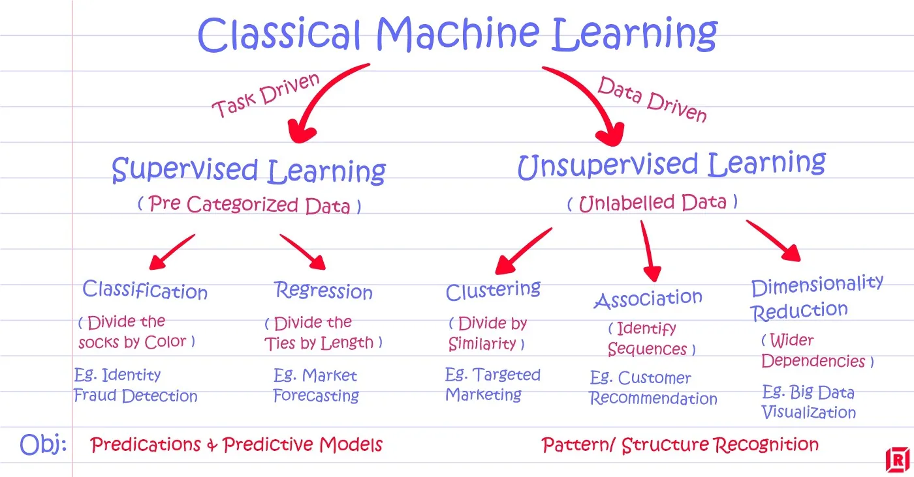

### What is machine learning?

Machine learning (ML) is a type of artificial intelligence (AI) that allows software applications to become more accurate at predicting outcomes without being explicitly programmed to do so. Machine learning algorithms use historical data as input to predict new output values.

## What is Unsupervised Learning?
Unsupervised learning is a machine learning technique, where you do not need to supervise the model. Instead, you need to allow the model to work on its own to discover information. It mainly deals with the unlabelled data.

### Types of Supervised Machine Learning Techniques.

### Regression:

Regression technique predicts a single output value using training data.

Example: You can use regression to predict the house price from training data. The input variables will be locality, size of a house, etc.

### Classification:

Classification means to group the output inside a class. If the algorithm tries to label input into two distinct classes, it is called binary classification. Selecting between more than two classes is referred to as multiclass classification.

## What is Unsupervised Learning?
Unsupervised learning is a machine learning technique, where you do not need to supervise the model. Instead, you need to allow the model to work on its own to discover information. It mainly deals with the unlabelled data.

## Types of Unsupervised Learning.
### Clustering
Clustering is an important concept when it comes to unsupervised learning. It mainly deals with finding a structure or pattern in a collection of uncategorized data.

### Association

Association rules allow you to establish associations amongst data objects inside large databases. This unsupervised technique is about discovering exciting relationships between variables in large databases.

## Supervised vs. Unsupervised Learning: What's the Difference****?
- In a supervised learning model, input and output variables will be given.
- In an unsupervised learning model, only input data will be given.
- Algorithms are trained using labeled data in Supervised Learning.
- Algorithms are used against data that is not labeled in Unsupervised Learning.
- A supervised learning model uses training data to learn a link between the input and the outputs.
- Unsupervised learning does not use output data.
