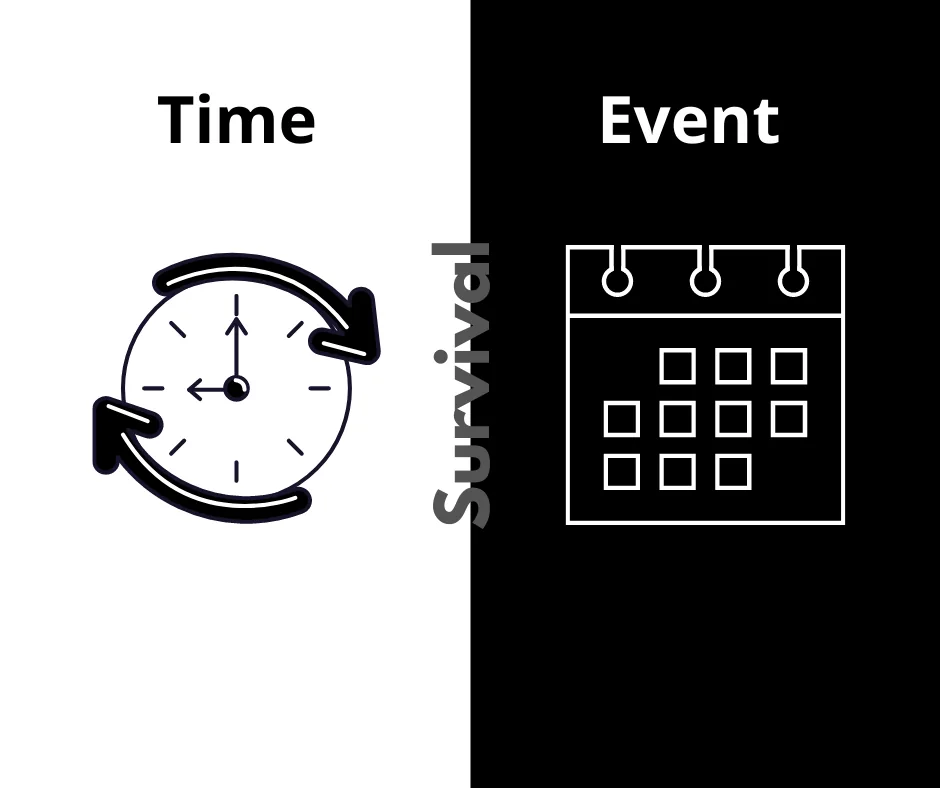

There are certain scenarios where we are interested in the duration it takes for some events to happen. A manufacturing company might want to measure the average time it takes for its new machines to develop fault. A businessman might be interested in how long he is able to retain his customers. To better prepare, a vehicle insurance company might want to study the time it takes before clients make an insurance claim. All these problems have two things in common: **time** and **event.**

Basically, any analysis that has to do with time-to-event is a form of survival analysis. And as shown above, time can take on different meanings. Time before fault, time of retainment, time until insurance claim, etc. Event too can take various meanings, depending on the interest of the study. It may mean death, failure, relapse into a state, etc.



> *Contrary to common misconceptions, survival analysis is not only used in the medical field; it is used in any field where time and event analysis are of importance*

**Some of the common questions asked in survival analysis are**:

1. What is the probability that a subject survives at least *t* years?
2. What is the probability of event *e* happening at time *t*?
3. What proportion of a given population would survive up to *t* years?
4. Are there any between-group differences in survival rate?
5. What factors affect the chances of survival of subjects?

**The statistical methods used in answering these questions are**:

1. Kaplan-Meier survival estimator
2. Nelson-Aalen hazard estimator
3. Log-rank difference in survival test
4. Cox proportional hazards regression analysis

## Breast Cancer Case Study
In this article, we will be exploring the case of breast cancer using Python. The data to be used is obtained from Lagos State University Teaching Hospital and has been cleaned so as to keep the focus on the analysis. The data can be accessed [here](https://data.world/jybeserac/cancer-data-nigeria).

We will be answering the following questions:

1. What is the probability that a patient would live for at least 3 years?
2. What is the probability of a patient dying in 6 years?
3. Are there any significant differences in survival with respect to how the cancer was diagnosed?

Let's get a view of the first ten rows of the data and also import the Python libraries that will be used for the analysis.

#### Definition of Time and Event
As stated earlier, survival analysis is time- and event-based, and as such we need a proper definition of both concepts.

First, our time here will be the duration from when the cancer was diagnosed to the time the patient was last attended to. And from the data above, that can be obtained by subtracting the column *date_of_incidence* from the column *date_last_checked.* On the other hand, our event is the death of the patient and will be generated by assigning 1 to patients who are dead and 0 to those alive or otherwise. The columns for the two concepts and the code are shown below:

#### Answer to Question 1
*What is the probability that a patient would live for at least 3 years?*

This is a case of measuring survival and as such we will be using the [Kaplan-Meier estimator](https://en.wikipedia.org/wiki/Kaplan%E2%80%93Meier_estimator). First, we will fit the model on our time and event columns using the fit method on the Kaplan-Meier estimator object. With this comes access to various functions to call.

In addition to the **survival function** which generates our desired estimates, two other functions are very crucial to our overall understanding of the problem and the answers. These two functions are the **event table** and the **confidence interval**. The three tables, which together form what is called **life table**, are shown below:

##### Understanding the Event Table
The event table gives a moving summary of the distribution of our event of interest with the following columns:

1. **At_risk**: This contains the number of patients currently being observed with respect to time.
2. **Entrance**: This is the number of new entrants into the study. Ideally, at_risk count reduces as time goes on and our patients die of breast cancer. And since survival analysis uses lifetime data, it is open to new entrants.
3. **Censored**: This stores the number of patients who are yet to die at a particular timeline of interest. In our data we have patients who were alive or otherwise during the entire timeline of the study, but not dead. So such patients go into the censored category.
4. **Observed**: This contains the number of patients that died during the study.
5. **Removed**: This accounts for patients that we are no more interested in. When a patient is censored or dead at a time point, they are removed from the study.

The survival estimates table above displays a different timeline (in days) and the probability of a patient living past that time. To answer our question, we can check the table for timeline 1095(equivalent to 3years). However that's not practicable enough. So instead we will just call the predict method on the Kaplan-Meier estimator object like this:

```python
kmf.predict(1095)
```

or with a little formatting to obtain the result in percentage:

```python
print("{}%".format(kmf.predict(1095).round(2)*100))
```

The confidence interval is simply a range within which we are statistically certain the exact probability value would be. The wider the confidence interval, the lesser our confidence in the estimate. The confidence interval is the shaded region around the survival estimate curve below. Also, the answer, shown below, estimates that *our patients are 72% likely to survive past 3 years from when they were diagnosed.*

#### Answer to Question 2
*What is the probability that a patient would die in their 6th year?*

Here, our interest has shifted from survival to hazard, so we will use the [Nelson-Aalen estimator](https://en.wikipedia.org/wiki/Nelson%E2%80%93Aalen_estimator). Since we already have an idea of the important tables, we will just go directly to the plot and result:

As can be seen from the curves, the hazard estimate moves in the opposite direction of the survival estimate. In other words, hazard increases with time as survival increases. So from the result, *our breast cancer patients are 89% likely to die 6 years from when the disease was diagnosed*.

#### Answer to Question 3
*Are there any significant differences in survival with respect to how the cancer was diagnosed?*

This is a problem of group comparison. We are trying to know if there is any significant difference in survival rate of the patients relative to how the disease was diagnosed in the first place. To achieve this, we would be using the [Log-rank test](https://en.wikipedia.org/wiki/Logrank_test). However, since there are four different groups of diagnosis, we would be using the multivariate log-rank test. But before that let's plot the survival curve for the different populations by diagnosis types.

The graph shows some apparent differences. For instance, while the probability of survival in the symptomatic group of patients decreases with time, the asymptomatic group shows consistent propensity to survive. We can get even more information by plotting each group separately as shown below:

Even though the graphs are quite tell-tale of significant difference among the groups, it is always a good practice to run a test. And the result of the analysis at *alpha = 0.05* corroborates our intuition.

Many questions could be asked and answered in survival analysis, but I hope this gives you an idea of how survival analysis can be employed.

Thanks for reading.
