Work as a data professional typically requires that you access your data from some sort of data storage, usually termed database, and one of such databases is a basic Google Account. Yes!

While it may not allow you to keep a humongous amount of data due to its limit of 15 gigabytes shared among its suite of products, it will still serve your purpose quite well if your daily task does not require more space. And once the storage size can no longer hold your data, you can always upgrade to the Google One account or subscribe to the complete Google Cloud package.

Now, the same way as a Python programmer that you can connect to databases like MySQL and PostgreSQL, you can also connect to Google Drive and Google Sheets to access your data without having to download to your local device. In this article, we will walk you through the steps needed to be able to access your Google Sheets data from your Python environment seamlessly.

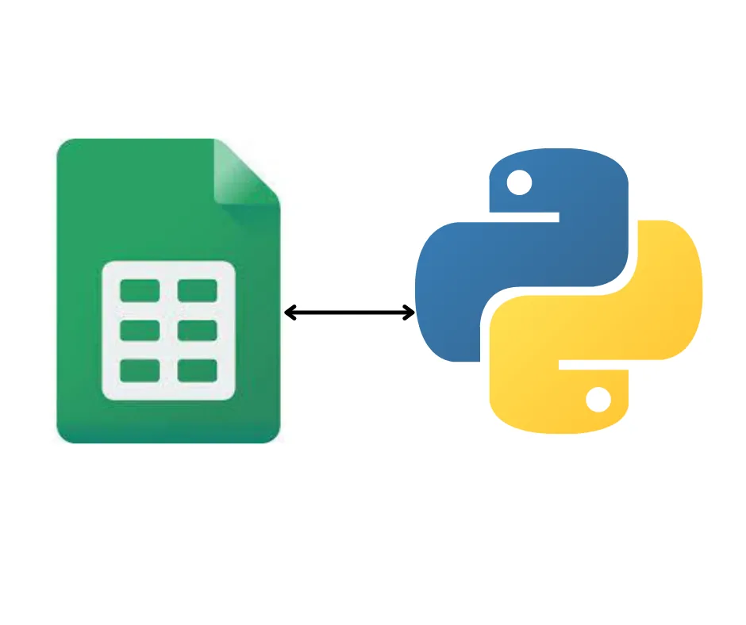

**Table of Content**:
*Create Google Service Account*

*Read Data from Google Sheets to Python Environment*

*Convert the Data to Pandas Dataframe*

## Create Google Service Account
So long you have a Google Account, the first thing to do in order to have access to your Google Sheets in Python is to have a Google Service Account. You may be curious as to the difference between the two accounts. A quick one: Google Account is simply the base account every user of Google products must have, and that’s why it is also referred to as User Account. Google Service Account on the other hand is an account that gives you access to making authorized API calls to Google Cloud Services. You can learn more about the two accounts [here](https://cloud.google.com/iam/docs/service-accounts).

Below are the steps for opening a Google Service Account:

1. Visit Google’s [developers console](https://console.developers.google.com/) and you will be taken to your

dashboard as shown below. Click the **CREATE PROJECT** button.

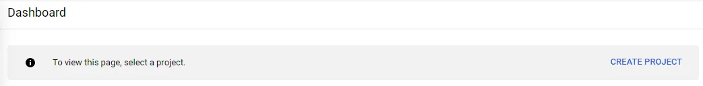

2. Enter your project name and click the **CREATE** button.

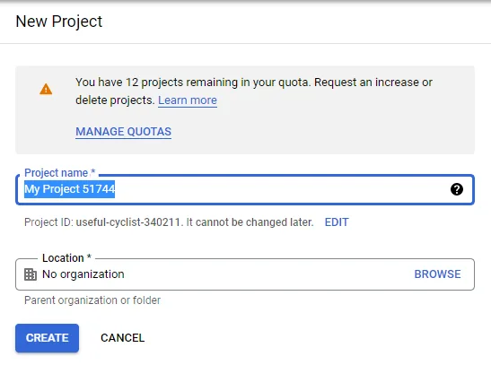

3. Click on **APIs & Services** on the menu list and and you will see the
 page below. Click **+** **ENABLE APIS AND SERVICES**.

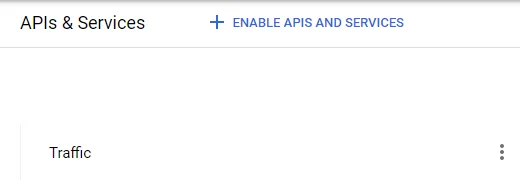

4. The next page is a search box where you type in the name of the API
 you need for your project.

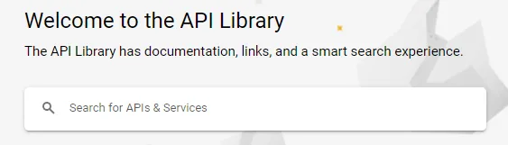

5. Click **ENABLE** to be able to read and modify the spreadsheet.

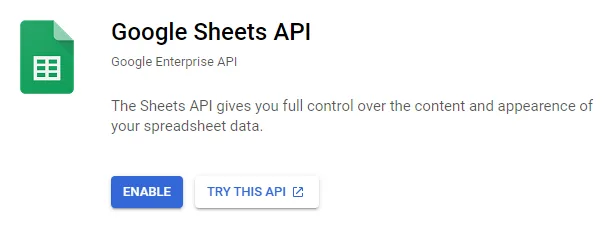

6. Repeat processes 4 and 5 for Google Drive.

7. After enabling these APIs, the next page that comes up is for you to
 create credentials.

8. Here choose **Google Drive** for the “Which API are you using?''

question. Also choose the option **Application Data**,except if the data
 to be used will be collected from users. After that choose **No, I’m not**
 **using them** and click the **NEXT** button.

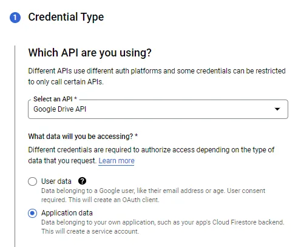

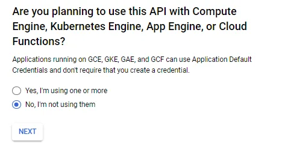

9. For your service account details, the first text box requires your service
 account name and automatically creates your service account ID. Then
 you can enter a brief description of what the service account is all
 about in the third box. Click **CREATE AND CONTINUE**.

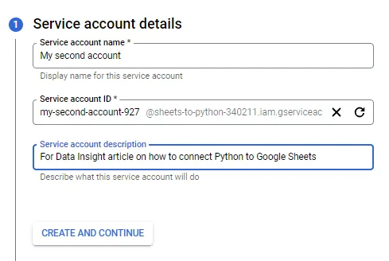

10. The next page is optional and it is for granting the service account
 access to the project we created earlier via roles. Then **CONTINUE**.

11. You can also grant users access to the service account via their email
 address. Click **DONE** to finish creating the credentials.

12. Scroll down to the **Service Accounts** section and click the first email.

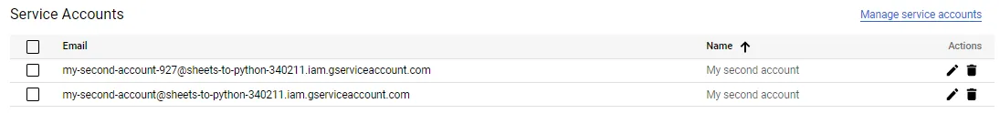

13. Click **KEYS** followed by the **ADD KEY**. Then **Create new key**.

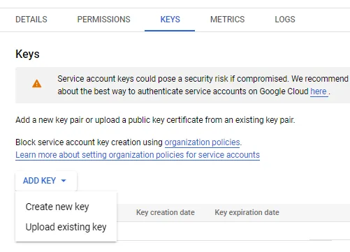

14. You will then see a pop-up asking you to create a private key for your
 account. This key is very important as you can see from the rider.
 Click the **CREATE** button to download the json file and save it in the
 folder where your project is stored on your local machine.

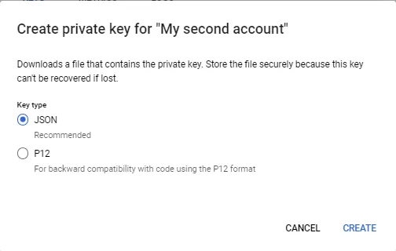

15. Finally, open the json file, look for the **client_email** line, and copy the
 email address. Then go to the Google Sheets and share it with the
 client email address.

## Read Data from Google Sheets to Python Environment
### Installations

Now that we have successfully created the Google Service Account, the next step is to read the data into our Python environment. To do this, we need to install an important library called **Gspread** in the working environment**.** With pip install gspread you’re good to go if pip is your preferred package manager. And if it’s conda, this will work: conda install -c conda-forge gspread. One other important library which will be automatically installed alongside is **Google-auth** with which we can access the OAuth 2.0 to authorize and authenticate our API calls to Google Cloud Services.

Lastly, since we intend to convert our sheet into a Pandas Dataframe, we will also install Pandas.

### Importing Libraries

```python
import pandas as pd
import gspread as gs
from google.oauth2 import service_account
```

### Accessing the API

Accessing the API requires that the scope of the application that we want to access is defined. In this case, we are interested in Google Sheets and Google Drive so we pass their API link to the scope variable. Then we add the json file with the credential to access the API before authorizing the connection via **Gspread**.

```python
SCOPES = [
'https://www.googleapis.com/auth/spreadsheets',
'https://www.googleapis.com/auth/drive'
]
SERVICE_ACCOUNT_FILE = 'C:\\Users\Ajibola\\Desktop\\Data12\\sheets-to-python-credential.json'

credentials = service_account.Credentials.from_service_account_file(
        SERVICE_ACCOUNT_FILE, scopes=SCOPES)

client = gs.authorize(credentials)
```

### Accessing the Sheets

To access the Google Sheets application, we will initialize an instance of the client object created earlier by passing the title sheet as the argument. We can use the method of the sheet instance to access the worksheet of interest. In this case we are accessing the first sheet with the index 0. Printing the *edutech_data* variable at this point will produce the instance id of the sheet (something like this: <Worksheet 'EDUTECH' id:1939344493>). Finally the *.get_all_records* method can be used to get actual data in the form a list of dictionaries as shown below the code

```python
sheet = client.open('EDUTECH')
edutech_data = sheet.get_worksheet(0)
edutech_data = edutech_data.get_all_records()
edutech_data
```

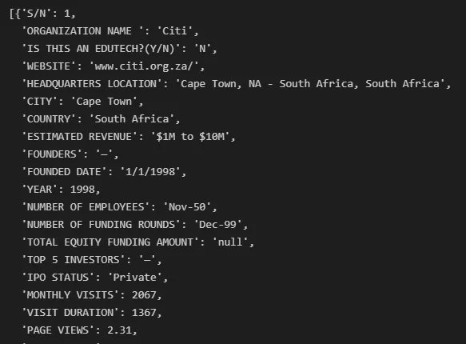

## Convert the Data to Pandas Dataframe
This can be done with a simple one-liner of Pandas, after which we print the first three rows:

```python
edutech_df = pd.DataFrame.from_dict(edutech_data)
edutech_df.head(3)
```

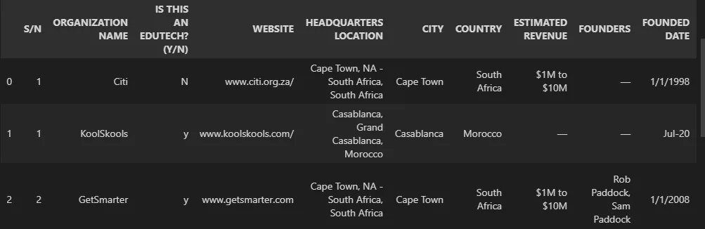

So this is simply how you can connect Python to your Google Sheets. You can further explore **Gspread** and **Gspread-pandas** to see the full capability of working with Google Sheets in Python.

Thanks for reading!

PS Kindly follow me on [LinkedIn](https://www.linkedin.com/in/salami-ajibola/) and [Twitter](https://twitter.com/AjibolaSalami2) for more contents.
