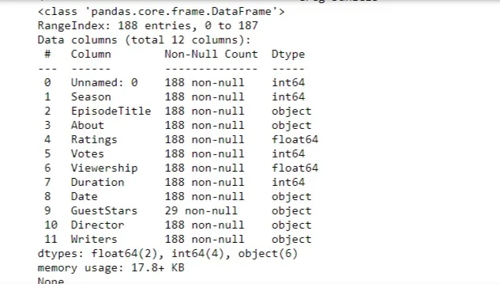
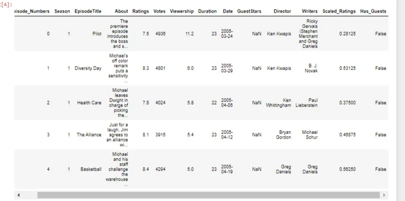
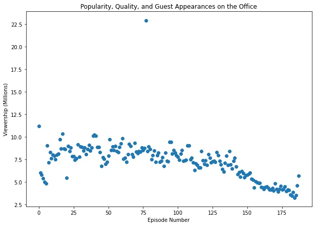
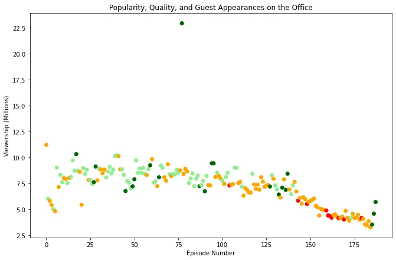
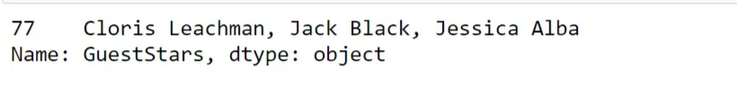
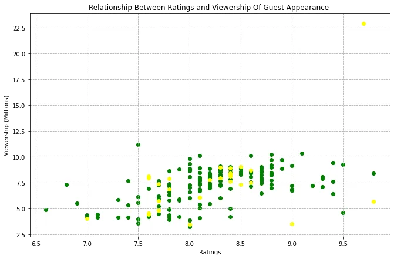

The Office! What started as a British mockumentary series about office culture in 2001 has since spawned ten other variants across the world, including an Israeli version (2010-13), a Hindi version (2019-), and even a French Canadian variant (2006-2007). Of all these iterations (including the original), the American series has been the longest-running, spanning 201 episodes over nine seasons.

In this blog, we will focus on the impact the appearance of guest stars had on the overall popularity and quality of the office television series.

This is a **DataCamp** project that was made available for the **Data Insight's Data Science Program.** The following dataset: datasets/office_episodes.csv, was downloaded from Kaggle [here](https://www.kaggle.com/nehaprabhavalkar/the-office-dataset).

**Importing Libraries**
Since we will be manipulating and analysing the office dataset, we need to import the necessary libraries.

```python
import pandas as pd
import matplotlib.pyplot as plt
from sklearn.preprocessing import MinMaxScaler
```

**Converting the CSV file into a pandas Dataframe**

Given any new dataset, we need to figure out what fields and what values those fields have. In order to do this, the CSV file is read as a DataFrame and store in the variable "office_df". We print the first five rows to figure out what it contains.


We also print out a concise summary of the DataFrame. This will print out the column names, non-null values and index data types. We realized from the output that the non-null value counts of all but Guest stars column are 188. This means the Guest stars column has rows where there were no guest stars. Also, the data type of the column “Date” is an object instead of a date type.



**Updating DataFrame**

We change the column name of the Unnamed column to Episode_Numbers. This is done by calling the pandas rename function on the office_df.

```python
office_df = office_df.rename(columns = {'Unnamed: 0': 'Episode_Numbers'})
```

We also change the data type of the Date column from object to datetime data type.

```python
office_df['Date']= pd.to_datetime(office_df['Date'])
```

Since the original dataset does not contain HasGuests column and Scaled_Ratings. There is a need for to create those columns.

We create a new column as HasGuests which is derived from calling the notna() method of the GuestStars column of office_df. This returns a boolean value of True when the GuestStars column contains a value, otherwise False.

```python
Office_df['Has_Guests'] = office_df['GuestStars'].notna()
```

The Scaled_Ratings column was created by scaling the values of the Ratings column between the range of 0 to 1. This was done by using the MinMaxScaler package from the sklearn.preprocessing.

```python
Scaler = MinMaxScaler()
office_df[['Scaled_Ratings']] = scaler.fit_transform(office_df[['Ratings']])
```

Then we return the first five rows, the output of the updated Data frame



**Data Exploration**

There was need to visualize the relationship of the number of episodes and their respective viewership. The Scatter Diagram was used to

check the correlation of the two respective columns.



From the diagram, most of the viewership ranges between 5 million views to 10 million views. Looking at the diagram, it is impossible to determine whether the Guest appearances had an impact on the popularity and quality of the office television series or not. It is necessary to further analyze the data frame.

There was a need to differentiate the scatter plot with different colours. A colour scheme is initiated using the Scaled_Rating Column, such that the colour is red when ratings are lesser than 0.25, orange when ratings are lesser than 0.5, light green when ratings are lesser than 0.75 and dark green when ratings are greater or equal to 0.75. This is done by assigning the variable colours to an empty list, then loop over the dataset to append the various once their conditions are met.

```python
colours=[]
for lab, row in office_df.iterrows():
    if row["Scaled_Ratings"] < 0.25:
        colours.append("red")
    elif row["Scaled_Ratings"] < 0.5:
        colours.append("orange")
    elif row["Scaled_Ratings"] < 0.75:
        colours.append("lightgreen")
    else:
        colours.append("darkgreen")
```

We then compute the colours list as the colour parameter in the scatter plot. The output is below.



Now we can easily identify the ratings of the various episodes. But there is still more work to be done. Looking at the graph, there is still more work to be done.

We now distinguish between episodes that have a guests and episodes that do not. A sizing system is put in place such that episodes with guest have a marker size of 250 and episodes without guest have marker size of 25. Then we plot the marker sizes of all the episodes.

```python
size=[]
for lab, row in office_df.iterrows():
    if row["Has_Guests"] == False:
        size.append(25)
    else:
        size.append(250)

plt.rcParams['figure.figsize'] = [11, 7]
plt.scatter(x=office_df['Episode_Numbers'],
           y=office_df['Viewership'],
           c=colours,
           s=size)
plt.title("Popularity, Quality, and Guest Appearances on the Office")
plt.xlabel("Episode Number")
plt.ylabel("Viewership (Millions)")
plt.show()
```

The output of the above is:


**Analyzing the Appearance of Guest Stars**
This was done by plotting two scatter plots. One for episodes with guests and the other for episodes with no guests. To do this we add two new columns to the office data frame from the colours list and the size list.

We then subset the data frame that have guest of the office data frame by equating the HasGuests column to the boolean value True. The opposite is done for with no guest. We differentiate the markers of the two scatter plots by assigning a '\*' to the has guest markers.

```python
office_df["Colours"]= colours
office_df["Size"]= size
non_guest_df=office_df[office_df["Has_Guests"]== False]
guest_df= office_df[office_df['Has_Guests']== True]

plt.rcParams['figure.figsize'] = [11, 7]
plt.scatter(x=non_guest_df['Episode_Numbers'],
           y=non_guest_df['Viewership'],
           c=non_guest_df['Colours'],
           s=non_guest_df['Size'])

plt.scatter(x=guest_df['Episode_Numbers'],
           y=guest_df['Viewership'],
           c=guest_df['Colours'],
           s=guest_df['Size'],
           marker='*')

plt.title("Popularity, Quality, and Guest Appearances on the Office")
plt.xlabel("Episode Number")
plt.ylabel("Viewership (Millions)")
plt.show()
```

This will result in the following output


From the graph, there is an episode with guest stars that has a scaled rating of 0.75 and above, with over 22.5 million views.

The episode has the following guest stars. We subset with this code.

```python
office_df[office_df['Viewership']>20]['GuestStars']
```

output:



### The relationship between ratings and viewership of Guest Stars
Using the no guest data frame and guest, we compare the two scatter plots of ratings versus viewership. Did the guest stars significantly influence the ratings and viewership of the show?

A scatter plot of both no guest and guest data frame of the ratings and viewership columns. We colour grade the markers as green and yellow respectively.

```python
plt.rcParams['figure.figsize'] = [11, 7]
plt.scatter(x=non_guest_df['Ratings'],
           y=non_guest_df['Viewership'],
           color='green')

plt.scatter(x=guest_df['Ratings'],
           y=guest_df['Viewership'],
           color='yellow')
plt.grid(linestyle='--')
plt.title("Relationship Between Ratings and Viewership Of Guest Appearance ")
plt.xlabel("Ratings")
plt.ylabel("Viewership (Millions)")
plt.show()
```



Apart from the outlier episode which had about 9.6 scaled rating and over 22.5 million views. Most of the episodes ranged between a scaled rating of 7.5 and 9.0, and a viewership of 5 to 10 million. It is hard to tell whether any of the guest appearances had a significant impact on the quality and the popularity.

Upon further research, the reason the outlier had that many views was because it aired after the Super Bowl XLIII, where the Steelers defeated the Cardinals by the score of 27–23. Some viewer from the Super Bowl transitioned into watching that particular episode.
