In some cases, if not most, data is untidy. It is difficult to work with, some analysts discard it, some redo experiments in order to get meaningful data. To help circumvent this obstacle the Python Pandas package helps in cleaning data so that data can be easily analysed.

This blog will walk you through some techniques that are used to clean data and make it, at the very least presentable. The blog will also try to use real datasets to adequately cement the relevance of pandas.

**Pivot Tables**

Most excel users use pivot tables to summarise data. The challenge with excel is that it may be tedious to work with large datasets, so software's like Python come in handy in taking a peak into the data. Let us examine how we can summarise a planets dataset found in the seaborn package. Well, first we load the packages

```python
 # Packages
import pandas as pd
import numpy as np
import seaborn as sns
```

Once loaded,

```python
# Getting planets data from sns package
df_planets = sns.load_dataset('planets')
df_planets.head(10)
```

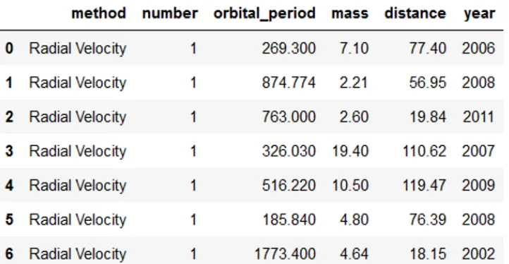

This is the dataset, showing the methods used and the various calculations based on method, number and year. First we try to summarise the average orbital period lengths by method. If you observe, we borrow an average numpy function to execute our task.

```python
#Pivoting by method
pd.pivot_table(df_planets, index= 'method', values = "orbital_period", aggfunc = np.mean)
```

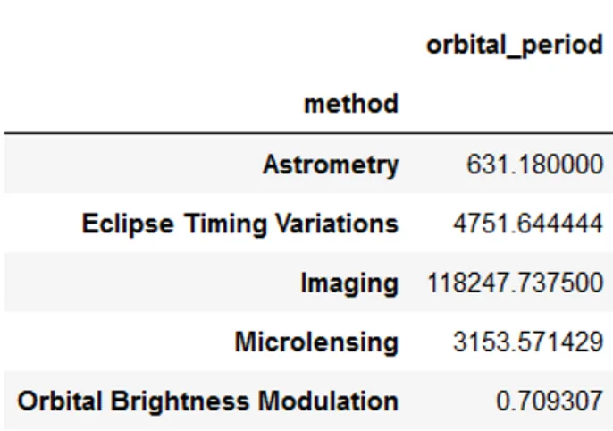

This code presents our information as expected. We could add a variable and put on the column as:

```python
# Calculating sum of Orbital Period
pd.pivot_table(df_planets, index= 'method', columns = "number", values = "orbital_period", aggfunc = np.mean)
```

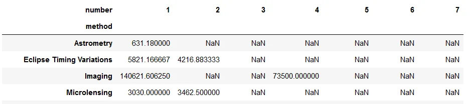

Lastly we could add a third variable say in he rows or column if you like as follows:

```python
#Adding year in the rows
pd.pivot_table(df_planets, index= ['method', 'year'], columns = "number", values = "orbital_period", aggfunc = np.mean)
```

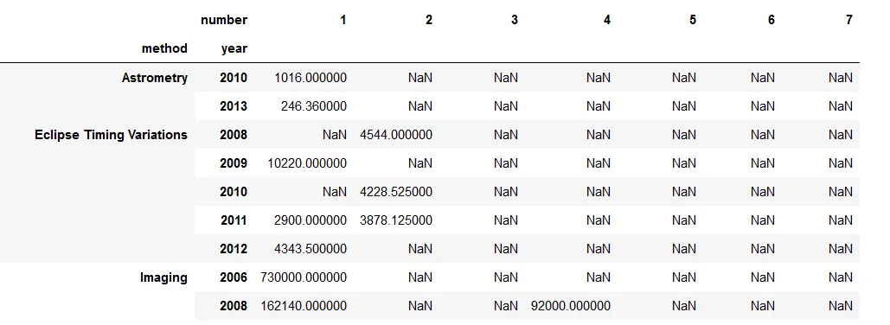

The Pivot table technique quickly turns data into information!

**Plotting**

Another useful technique is the plotting function. We will use the Iris dataset. The dataset and how to load it can be loaded:

```python
iris_df = pd.read_csv("https://gist.githubusercontent.com/netj/8836201/raw/6f9306ad21398ea43cba4f7d537619d0e07d5ae3/iris.csv")
iris_df.head(5)
```

The scatter plot command is a pandas command like:

```python
# Scatter plot
pd.plotting.scatter_matrix(iris_df[['sepal.length', 'sepal.width', 'petal.length', 'petal.width']], alpha=0.2)
```

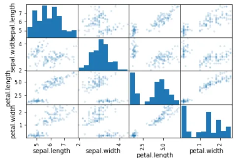

This picture is a quick snapshot of the numeric columns giving scatter plot and histogram. A histogram with horizontal lines can be also drawn with this command:

```python
# Box Plot
iris_df.boxplot(column=['sepal.length', 'sepal.width', 'petal.length', 'petal.width'])
```

Pandas has also some nice graphs like the Andrews curve

```python
# Andrews Curves
pd.plotting.andrews_curves(iris_df, 'variety')
```

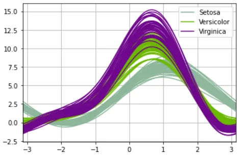

The curves help in differentiating the Iris species. Consider another graph that maybe most people do not know, that is the Rad-Viz graph. RadViz allow to project a N-dimensional data set into a 2D space where the influence of each dimension can be interpreted as a balance between the influence of all dimensions.

```python
# RadViz Diagram
pd.plotting.radviz(iris_df, 'variety')
```

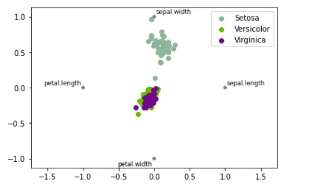

Again the graph is a fair way of differentiating the Iris data.

**Descriptive Statistics**

Again, sometimes it is important to quickly assess the descriptive statistics. Like column means:

```python
# Column means
iris_df.mean(0)
```

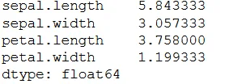

Or row means:

```python
# Row Means
iris_df.mean(1)
```

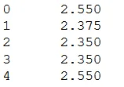

Well sometimes frequencies are important, Pandas documentation calls it histogramming:

```python
#Value counts (histogramming)
iris_df['petal.width'].value_counts()
```

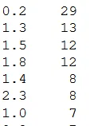

Pandas also allows us to add some features in the describe function, notice we have added 5% and 95% percentiles on top of the usual 25%, 50% and 75% descriptive stats.

```python
# Adding some Percentile features
iris_df.describe(percentiles=[0.05, 0.25, 0.75, 0.95])
```

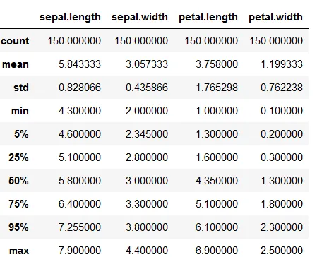

**Statistical Function**

```python
kidney_df = pd.read_csv("https://raw.githubusercontent.com/ArjunAnilPillai/Chronic-Kidney-Disease-dataset/main/kidney_disease.csv")
kidney_df.head(5)
```

Let us download a machine learning dataset and run some quick stats. We can get percentage change in age of the kidney disease patients. The first row is a NAN as there is no prior row before that.

```python
#Percentage change
kidney_df["age"].pct_change()
```

We can also get a covariance matrix of the numeric columns

```python
# Covariance
kidney_df[["sg", "al", "su"]].cov()
```

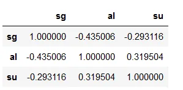

Similarly, we can get a correlation matrix, we can specify the correlation method, pearson being default, kendall and spearman.

```python
# Corelation
kidney_df[["sg", "al", "su"]].corr(method = "kendall")
```

## Group by: split-apply-combine

The last function is the group and filter function. Say after grouping you data, you are specifically interested in a certain group. Pandas can also assist in this regard

```python
#Group and filter
kidney_df.groupby(["pc", "htn"]).get_group(("normal", "yes")).head(3)
```

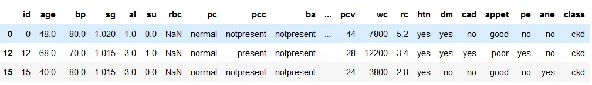

Only data filtered is the pc column which has the normal value, the htn column with the yes value.

**References**

<https://github.com/Matshisela/Pandas-Techniques-for-Data-Manipulation-in-Python>

<https://pandas.pydata.org/docs/user_guide/index.html>
