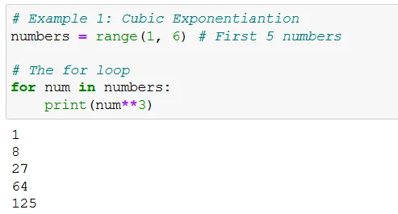
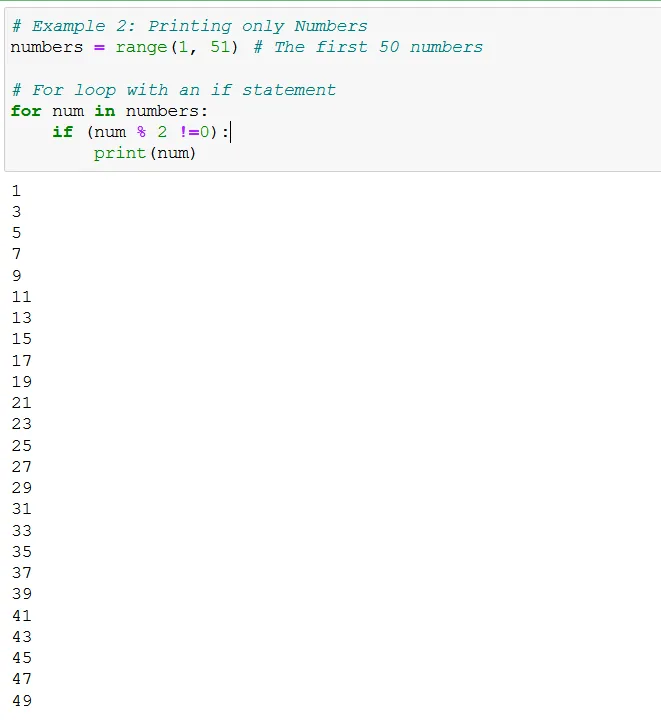
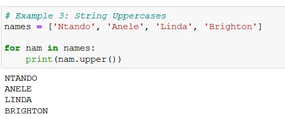
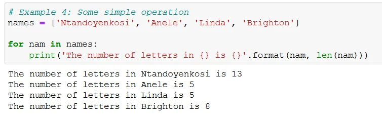
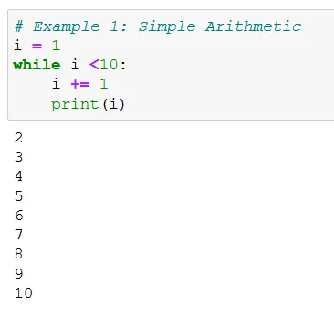
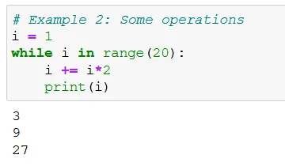
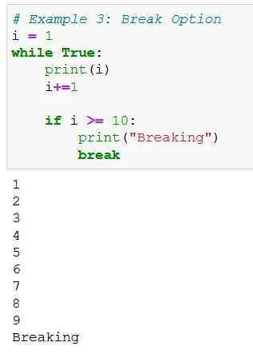
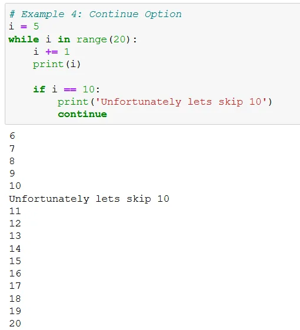
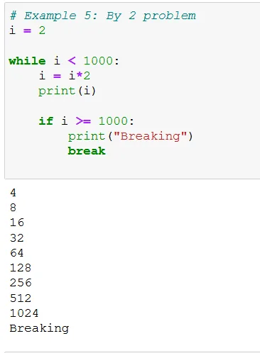

Imagine repeating any task in writing, speaking or calculating over and over again. The task will end up becoming daunting. Think of an elementary multiplication of Initializing a starting point of say 2, and multiplying 2 to each successive answer, when will you end? Will you not get tired of writing or performing the same task?

```python
2
2*2
2*2*2
2*2*2*2
2*2*2*2*2
2*2*2*2*2*2
2*2*2*2*2*2*2
2*2*2*2*2*2*2*2
```

The family of loops in Python like in any programming language performs such iterative processes. To address the above problem, we can use a while loop which will be shown later in this article. First, let us look at a for loop with some examples.

**For Loop**

A for loop is used for iterating over a sequence such as a list, tuple, dictionary, set and/or string. First let us loop over the first five numbers (1, 2, 3, 4, 5) and cube each value in the range. The code is shown below and its output (1, 8, 27, 64, 125).

```python
# Example 1: Cubic Exponentiantion
numbers = range(1, 6) # First 5 numbers

# The for loop
for num in numbers:
    print(num**3)
```

We basically looped through the first numbers and cubed each. We could further do other operations, the sky is the limit.



Let us look at a second example of say getting odd numbers from a range of the first 50 numbers. Remember, an odd number is a number which returns a remainder different from 0 when divided by 2. We use the if statement to subset only such numbers as given below

```python
# Example 2: Printing only Numbers
numbers = range(1, 51) # The first 50 numbers

# For loop with an if statement
for num in numbers:
    if (num % 2 !=0):
        print(num)
```

The following is the list of odd numbers in the given range



As stated before, for loops can work over strings too. Consider a list of names which we want to convert to an upper case. We could use the for loop to do this task, and remember Python has an .upper() case command which we can easily use.

```python
# Example 3: String Uppercases
names = ['Ntando', 'Anele', 'Linda', 'Brighton']

for nam in names:
    print(nam.upper())
```

The output is:



Lastly we can do operations on strings using for loops. A simple operation is getting the length of character in each of the elements of a set, dictionary or string etc.

```python
# Example 4: Some simple operation
names = ['Ntandoyenkosi', 'Anele', 'Linda', 'Brighton']

for nam in names:
    print('The number of letters in {} is {}'.format(nam,         len(nam)))
```

Here we observe the following output:



**While Loop**

Sometimes, we need to loop whilst constrained by a certain condition. This is where a while loop comes in.

Suppose we want to print all numbers from 1 till 10. That is add 1 to each number but stop at 9+1. We can do this using the while loop as:

```python
# Example 1: Simple Arithmetic
i = 1
while i <10:
    i += 1
    print(i)
```

The operation **i+=1** is short hand for **i=i+1**. When you really think about it that is why a 10 appears in the output below and not 11.



We could also use multiplication in the loop as the loop is not confined not only to addition.

```python
# Example 2: Some operations
i = 1
while i in range(20):
    i += i*2
    print(i)
```

Let us consider first number as 1, we multiply by 2 and add 1. We take the result of 3, we multiply by 2 to get 6 and add with the updated ***i*** of 3 we get 9. This successive updating of ***i***, is useful later in various data analysis dimensions. The output is:



We could insert a break to stop an iteration. This helps to iterate infinitely.

```python
# Example 3: Break Option
i = 1
while True:
    print(i)
    i+=1

    if i >= 10:
        print("Breaking")
        break
```

For this example we break at 10.



Converse to the breaking option we can use continue. That is we can iterate and pose/ execute at some point and continue

```python
# Example 4: Continue Option
i = 5
while i in range(20):
    i += 1
    print(i)

    if i == 10:
        print('Unfortunately lets skip 10')
        continue
```

Here we will skip 10 in adding all numbers by 1 from 5 to 19. The output is:



Now lets look at the multiplication problem

```python
# Example 5: By 2 problem
i = 2

while i < 1000:
    i = i*2
    print(i)

    if i >= 1000:
        print("Breaking")
        break
```

For this example we will limit ourselves to 9 iterations and then break



We have looked at the different types of loops and I am sure they will be handy for you in one way or the other.

To link up with the Github and/or me consider:

1. Github [link](https://github.com/Matshisela/Loop-examples)

2. LinkedIn [Link](https://www.linkedin.com/in/ntandoyenkosi-matshisela-8507876a/)
