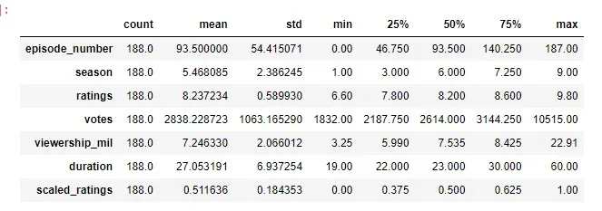
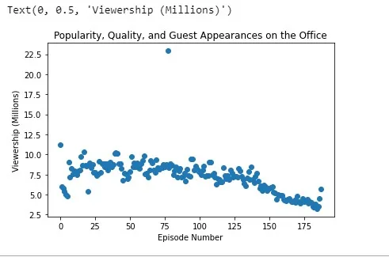
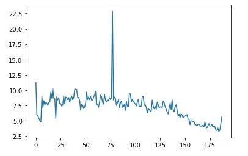
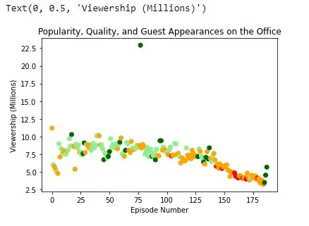
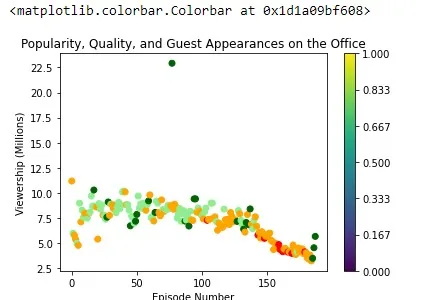
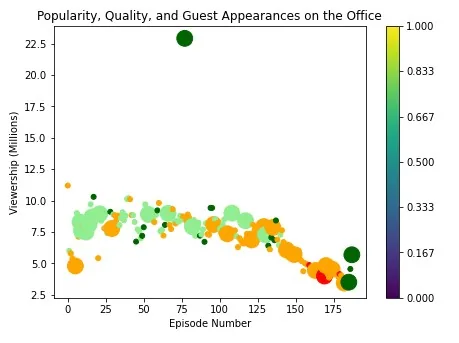
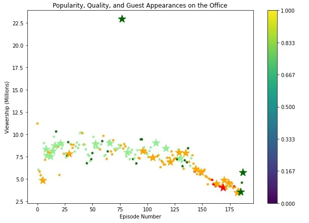

Today we will observe the change of The Office Series on various parameters. Mainly we will look at the viewership for each episode number. First of all let's recognize the dataset which we will work.

We are given 14 columns. Let's start looking at our dataset with code.

First we need to import necessary libraries.

We need to pandas for loading dataset, numpy for calculating mathematical problems and for array, pyplot for visualizing given data.

#### Loading data
We use read_csv() method for converting .csv file to Pandas DataFrame.

#### Perform statistical controls


Here we can check each column by statistically, for outlier, distrubution of variables and etc. Just by looking, we can say that the distribution of features is not so bad.

#### Creating figure
Now let's start to visualization. First of all, we have to define our figure.

We collect the whole image into one figure via **plt.figure()**. Additionally we use this function when we need to change size of visualization.

#### First visualizing
Now we will look at the simple visualization of 'Episode Number' on x axis and 'Popularity, Quality, and Guest Appearances on the Office' on the y axis.



We plot data with scatterplot and set title, xlabel and ylabel logically. Here we can see that viewership change in the range of 3.25 and 22.91 million, as 'The Office Series' get closer to the end, the number of views decreases.But whta if we want to see change of variables more sensitively. In this case we can use lineplot (plt.plot in pyplot, sns.lineplot in seaborn) and visually lineplot has nicer looking. Let's see how to code this.



As we see we have one outlier (In the first look). Also distance between values not so far.

#### Rank by scaled_ratings
In the first condition we are required to change the colors according to scaled_ratings.Additionally, as we see we have both ratings and scaled_ratings, scaled_ratings is a number of sequence which we limited between 0 and 1. It is more accurate for comparing (we will notice that with colorbar in the continuation of the blog). We can do this task by filling appropriate values.

• If scaled_ratings < 0.25 then colored "red"

• If scaled_ratings >= 0.25 and <0.50 then colored "orange"

• If scaled_ratings >= 0.50 and <0.75 then colored "lightgreen"

• If scaled_ratings >= 0.75 then colored "orange"

In this code snipped first we create empty object array (so we need to specify dtype to object). we do this by length of Dataframe, and we find the index of values which satisfy first condition after that we put 'red' string on this indexes in array (l) and this process done for each condition.

Now! let's look at visualiation again.



#### Applying colorbar
But as if something mised. We reach differentiate values by scaled_ratings but still we don't know which color represent which value. We can use colorbar to see that. **plt.colorbar()** function will help us in this case.

As we see it is pretty simple function, we pass sc (plt.scatter()) and ticks (on the colorbar will be displayed values which we define in the ticks argument ). I suppose we already know about **np.linspace()** it used for creating array in a given length and values lined up by given range. Let's see our Scatterplot.



#### Rank by size
And now we are asked to seperate values by size where if has guests size will be 250 if not will be 25. We do this same as colors.

Our scatterplot will be look like this:



Also, we can seperate values by different markers (default is circle).

For doing that we use **marker** argument.

As we see here we use rcParams to change size of scatterplot for better visualization.



#### Finding top star
In the secont task we are asked to find the name of one of the guest stars who has watched most in Office episode. First, let's look at code snipped.

We group our DataFrame by **guest_stars** to reach each guest stars seperately. After that, we calculate sum of each viewership_mil value and we are asked most watched that is why we sort our values by descending order and take one of them.

Our outpu will look like this:

```python
Top star: Cloris Leachman
```

**Conculusion:**

In this blog look at how to visualize in scatterplot and already we know that visualizing doesn't happen just with x and y axis we have s (size), c (collor), marker and etc. which gives our plot more dynamism. If you want to try this project on your own click [here](https://www.kaggle.com/nehaprabhavalkar/the-office-dataset) for dataset and if you have a acces to DataCamp click [here](https://projects.datacamp.com/projects/1170) for Unguided project. Also, if you want see whole code, you can find it in my [Github](https://github.com/Ibrahimbeu/Investigating-Netflix-Movies-and-Guest-Stars-in-The-Office).
