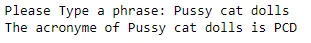
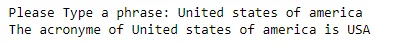

In this tutorial, you'll learn to create a simple **Acronym Generator using Python.**

## What is an acronym?
An *acronym* is a word formed from abbreviating a phrase by combining certain letters of the phrase (often the first letter of each word) into a single word.

*Note: Prepositions like* ***'of'*** *are usually not considered for acronyms.*

## How an acronym generator works?
An Acronym Generator will take a String as an input and for the output it will return the initials of all the words in the String.


### How to create acronym using python?

### Step 1: Get the user input.

First of all, we need to get the phrase from the user.

We can do it easily with the use of *input()* method, the user input will be stored in an *input_user* variable.

```python
#adding the user input
input_user = input("Please Type a phrase: ")
```

### Step 2: Ignore prepositions.

In the second step, we have to ignore ‘of’ from the user input .

```python
#ignore 'of'
clean_input = (input_user.replace('of', ''))
```

### Step 3: Create a list of words.

Next step, we need to extract the words from the *clean_input* string and to store them as a list in *phrase* variable.

```python
# Split words
phrase = clean_input.split()
```

### Step 4: Code the acronym generator's logic.

Then, we initilize an empty variable acronym .

```python
acronym = ""
```

we are going to extract the first letter of every word stored in *phrase* using slicing operator and adding it to *acronym* variable than capitalizing it with the use of *upper()* function. .

```python
for w in phrase:
    acronym = acronym + w[0].upper()
```

Finally, Let's add a print statement

```python
print('The acronyme of ' + input_user + ' is '+ acronym)
```

### Step 5: Run the code

let's try running our Code!





## Source Code
Thank you so much for reading! I hope you found this project useful.

You can find the complete source code of this project here ==> [**SourceCode**](https://github.com/LinaMeddeb/AcronymGeneratorWithPython.git)
