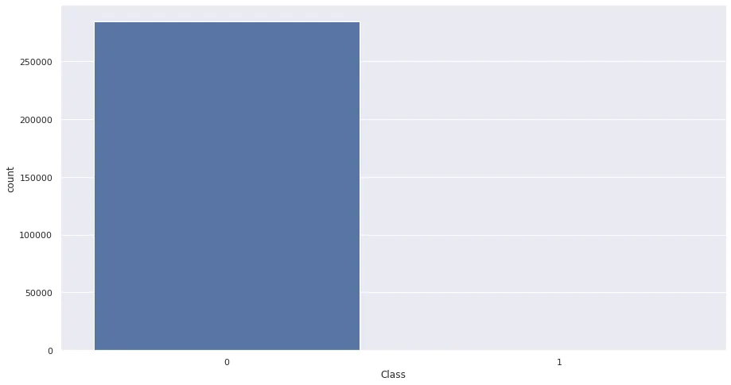
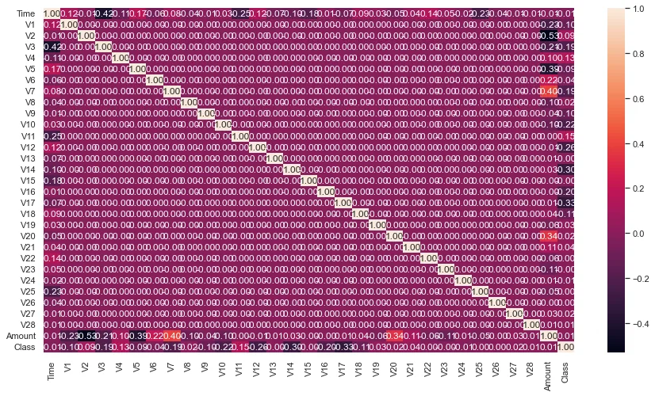
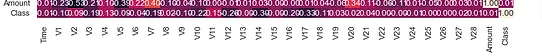
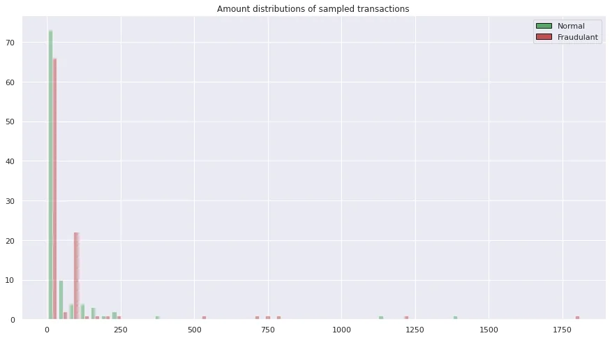
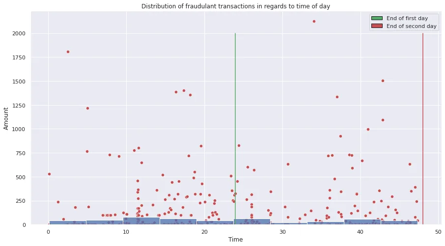

As the title said, this is an age where it would make a lot of sense to worry about our credit cards. Anything and everything can be a random credit phishing scam we fall for.

To our reassurance though, banks have been working on countermeasures for this. Some examples would be contesting transactions that you deem fraudulent, blocking your card if you think it might be used, and **fraudulent transactions' detection systems.**

In this post, we'll be getting some work done on a detection system. We'll be using a public dataset that has credit card transactions.

**Dataset's description:**

This description is already present on the dataset's page. But, for clarity purposes, I'll be highlighting the information that is of interest to our work.

"The dataset contains transactions made by credit cards in September 2013 by European cardholders.

This dataset presents transactions that occurred in two days, **where we have 492 frauds out of 284,807 transactions**. The dataset is highly unbalanced, the positive class (frauds) account for 0.172% of all transactions.

It contains only numerical input variables which are the result of a PCA transformation. Unfortunately, due to confidentiality issues, we cannot provide the original features and more background information about the data. **Features V1, V2, … V28 is the principal components obtained with PCA, the only features which have not been transformed with PCA are 'Time' and 'Amount'. Feature 'Time' contains the seconds elapsed between each transaction and the first transaction in the dataset.**"

Finally, they proceed to specify one of the most important facts in classification metrics! If you noticed earlier, they mentioned that the dataset is highly unbalanced, "**Given the class imbalance ratio, we recommend measuring the accuracy using the Area Under the Precision-Recall Curve (AUPRC)"**. Accuracy is not meaningful for unbalanced classification.". If this isn't pure facts, I don't know what would be.

Small note, The attached notebook that you'll find in the end of this post, is to be hosted on Google Colab for easier access to the Kaggle dataset (also, my poor machine can't handle more trainings). Make sure to create your own API key to download the data in your colab instance (follow this [guide](https://www.kaggle.com/general/74235)).

To work on our dataset, we'll start by loading, verifying and going through an EDA.

The first step is to use pandas to load our csv file and take a peak at the table's first rows.

```python
csv_path = "data/credit_card/creditcard.csv"
card_df = pd.read_csv(csv_path)
card_df.head()
```

Through the output method, we get to verify the "Time", "V1-V28", "Amount" and "class" columns.

```python
#Let's see if our dataset is squeaky clean!
card_df.isnull().sum()
#spoiler: it is o.o
```

And as we can see, they engineered the dataset amazingly. We have no empty values which allows to save up time on figuring out how to impute missing values. But hey, **always check your dataset for missing/outlier values**!

Because the V1-V28 columns are PCA outputs, we can't really make sense of them specially given the fact that we don't know the original columns (for privacy reasons.), you'll see more about this in the correlation heatmap that will be displayed later.

Our EDA will mainly revolve around the **Time, Amount, Class** columns.

First of all, let's check some key values for the amount column.

```python
card_df[['Amount']].describe()
```

- **count:** 284807.000000
- **mean:** 88.349619
- **std:** 250.120109
- **min:** 0.000000
- **25%:**  5.60000
- **50%:** 22.00
- **75%:** 77.165000
- **max:** 25691.160000

In the span of two days, the **average transaction around 88€ with a fairly large standard deviation**(which explains the max transaction of 25691€, someone maybe bought themselves a nice car?)

Let's take a look at how actually skewed the data is.

```python
sns.countplot(card_df['Class']) #Let's get a visualization of our class repartitions
plt.show()

print('Number of fraudulant transactions: ',sum(card_df['Class']==1))
print('Number of valid transactions: ',sum(card_df['Class']==0))
###OUTPUT###
Number of fraudulant transactions:  492
Number of valid transactions:  284315
```



492 vs 284315 class repartition, that explains why visually we basically see that there is no fraud transactions whatsoever. **That's a 577+ ratio.**

Which begs to remind us of the previous idea mentioned in the dataset description, **if a model relied on accuracy as a metric, it can get a 99%+ accuracy just by guessing that every transaction is a valid one.**

**Which of the V1-V28, Time, Amount columns correlate the most with the class of transactions.**

Before we dive in this section, I must remind you that correlation does not mean causation! The cause could be something else that is associated with the variables we're studying.

```python
corr = card_df.corr()
plt.figure(figsize=(30,15))
sns.heatmap(corr,annot=True,fmt='.2f')
plt.show()
```



This might look like a lot, but remember our V1-V28 variables result from PCA which means that **they are de-correlated**.

In summary, There are **2 rows/columns** where we can look for meaningful values. **"Amount"** and **"Class".**



At first glance, we can see that there are quite a few Vx variables that correlate with the class which is somewhat of a good sign. It indicates that these variables **can have an influence over the class of the transactions**(It's not a fact though! Remember, correlation and causation are different).

Some of the interesting variables, are V3, V7, V8, V12, V16, V17, and V27 (and a few more with lower correlation scores). In other cases(datasets), studying the origin of these variables can actually tell us if they would have an actual influence over the classification of the transaction.

What was a bit surprising to me was the 0.01 correlation between **class and amount.** I imagined that fraudulent transactions are more into the high end (go big or go home) but it seems they might be of all ranges. We'll dive more into this with our next graph.

```python
handles = [Rectangle((0,0),1,1,color=c,ec="k") for c in ['g','r']] ##create the legend
labels= ["Normal",'Fraudulant'] ##label the legends

class_0 = card_df[card_df['Class'] == 0][:100]
class_1 = card_df[card_df['Class'] == 1][:100]
plt.hist([class_0['Amount'],class_1['Amount']], color=['g','r'], alpha=0.5,bins=50)
plt.legend(handles, labels)
plt.title('Amount distributions of sampled transactions')
plt.show()
```

The resulting graph is:



First thing, Both fraudulent and legitimate transactions tend to skew toward the low end of transactions, which makes sense. How likely are you to wake up randomly and decide to buy something worth of over 1K$?

Transactions **around 100$, and 500+$** are more likely to be fraudulent according to the graph.

In the end, these are just observations that kind of don't help that much.

We can also investigate the relationship between the time of day and the amount spent.

For that, we'll use the following code

```python
handles = [Rectangle((0,0),1,1,color=c,ec="k") for c in ['g','r']]
labels= ["End of first day",'End of second day']
frauds = card_df[card_df['Class'] == 1]
frauds['Time'] = frauds['Time']/60/60 #we devide by 60*60 to get the hours in the axis.
sns.scatterplot(data=frauds,x='Time',y='Amount',color='r')
sns.histplot(frauds['Time'])
plt.plot([86400/60/60, 86400/60/60], [0, 2000],color='g')#End of first day
plt.plot([(86400*2-1)/60/60, (86400*2-1)/60/60], [0, 2000],color='r') #end of second day
plt.legend(handles,labels)
plt.title('Distribution of fraudulant transactions in regards to time of day')
plt.show()
```

The resulting graph is the following:



The first thing to (re)take note of, is that our dataset is **spread out** over **around 2 days(48 hours).**

This is where I feel like the dataset is missing a few things: Online or physical transactions. and the starting hour of the first day.

The graph shows that the spread is quite random **aside from the 2nd half of each day**. We can see that around those halves, there are more frequent fraudulent transactions.

This is my own interpretation, but the second half of the day is **most likely the nighttime**. Nonetheless, **timezones can play a huge factor considering that most fraudulent transactions** take place online due to phishing attacks on credit cards. (Free tip: always have 2 Auth validation for your transactions.)

So, our EDA in this case indicated that this problem is more delicate than one would think. Using the interpretable variables/features didn't help that much deduce a pattern to attack these fraudulent attacks.

But remember, this is why we have **29 other features some of which have shown interesting correlations towards the class of the transaction.**

What we can hope for now is that machine learning models can extract meaningful patterns out of these features.

First things first, let's learn about what's going to help us deal with the huge class unbalance issues we mentioned earlier.

We"ll be using an algorithm named **SMOTE (Synthetic Minority Oversampling Technique)**. One way of settling the imbalance issues with our dataset is to **make "synthetic"** data that fits the parameters of the **minority class.**

**Let's learn how SMOTE works in a few steps!**

In some literature, you'll find that it's described as a K-neighbours algorithm with more steps.

1. First, it'll locate the minority samples that sort of will act as the seeds (or cluster centers)
2. Next, it'll find their nearest K(it is usually 5) minority class neighbors.
3. After creating lines between the neighbors of the minority class, it creates a new synthetic sample along that line.

Code-wise, just installing **imblearn** and running the SMOTE algorithm witll take of this for us.

```python
y = card_df['Class']  #Get class in label vector
x = card_df.drop(['Time','Class'],axis=1) ##Remove unncessary features
X_train, X_test, y_train, y_test = train_test_split(x, y, test_size= 0.3, stratify=y)
print(X_train.shape)

scaler = StandardScaler()
X_train['Amount'] = scaler.fit_transform(X_train.Amount.values.reshape(-1,1))
X_test['Amount'] = scaler.transform(X_test.Amount.values.reshape(-1,1))

X_train,y_train = SMOTE().fit_resample(X_train,y_train) #Generate new fraudulant transactions based on the existing ones.
y_train.value_counts()

###-----OUTPUT------###
0    199020 1    199020 Name: Class, dtype: int64
```

First, let's get into figuring out the steps in this code before getting to the SMOTE call.

1. We **isolated the label** in a seperate vector for the training and removed it from our training data along with the "Time" variable as it's not needed in the dataset(it's **more of an id** in this dataset).
2. **train-test split** our dataset.
3. We **StandardScale our dataset** to achieve a mean of 0 and std of 1.
4. Finally, we call **SMOTE algorithm to generate the new synthetic** samples **based on our scaled data**.

Now we get to the fun part!

We'll be trying out two ML algorithms for this problem. It'll be **RandomForests and XGBoost**. Given that I've already written about these two bad boys. I'll refer to a [post of mine](https://www.datainsightonline.com/post/need-more-ml-models-we-got-you) ([and another one here](https://www.datainsightonline.com/post/we-learnt-a-lot-about-data-let-s-make-sure-our-models-are-working-well)) focused on machine learning models!

The next two code cells are written in a way that I've commented the GridSearch (I've written about them here! [check it out!](https://www.datainsightonline.com/post/yet-another-bite-sized-information-machine-learning-blog)) as they are super time consuming with 380k+ samples to train on. Feel free to run on colab and tell me which parameters worked best for you!

**Randomforests:**

```python
"""
### GRID SEARCH CODE FOR RANDOMFOREST MODEL###
rf_params = {
 'max_depth': [5,10,None],
 'min_samples_leaf': [2, 4],
 'min_samples_split': [2, 5, 10],
 'n_estimators': [50,100]}

rf = RandomForestClassifier()
rf_grid = GridSearchCV(estimator = rf, param_grid = rf_params,cv=3, verbose=2, n_jobs = -1,refit=True)
best_rf = rf_grid.fit(X_train,y_train)

rf_preds = best_rf.predict(X_test)
acc_rf,precision_rf,recall_rf = accuracy_score(y_test, rf_preds),precision_score(y_test,rf_preds),recall_score(y_test,rf_preds)
"""
rf = RandomForestClassifier(max_depth=10,n_estimators=100)

rf.fit(X_train,y_train)

rf_preds = rf.predict(X_test)

acc_rf,precision_rf,recall_rf = accuracy_score(y_test, rf_preds),precision_score(y_test,rf_preds),recall_score(y_test,rf_preds)
```

**XGBoost:**

```python
"""
### GRID SEARCH CODE FOR XGBOOST MODEL###
xg_params = {
        'min_child_weight': [1, 5],
        'gamma': [0.5, 1, 2],
        'subsample': [0.8, 1.0],
        'colsample_bytree': [ 0.8, 1.0],
        'max_depth': [3, 5]
        }

xg = xgboost.XGBClassifier()
xg_grid = GridSearchCV(estimator = xg, param_grid= xg_params,cv=3, verbose=2, n_jobs = -1,refit=True)
best_xg = xg_grid.fit(X_train,y_train)

xg_preds = best_xg.predict(X_test)
acc_xg,precision_xg,recall_xg = accuracy_score(y_test, xg_preds),precision_score(y_test,xg_preds),recall_score(y_test,xg_preds)
"""
xg = xgboost.XGBClassifier()
xg.fit(X_train,y_train)

xg_preds = xg.predict(X_test)

acc_xg,precision_xg,recall_xg = accuracy_score(y_test, xg_preds),precision_score(y_test,xg_preds),recall_score(y_test,xg_preds)
```

The metrics we'll be taking interest in mainly are the precision, recall and, auc_score.

For both models, we take the same approach:

1. Define the parameters' grid: The combination of features we want to test.
2. Create the estimator and GridSearch object that will run the trainings(notice the refit=True, as we want it to extract the best model.).
3. Test out the model and get the scores.

**Compare precision and recall:**

Wait, what are these two metrics?

> **"Precision":** Also known as **Positive Predictive Value,** This metric focuses on the rate at which the model **correctly** issues **positive** predictions.

> "**Recall"**: Also known as **Sensitivity/Hit Rate.** It measures the model's capability of detecting positive outcomes.

Where are these definitions taken from? Of course, none other of an [old post](https://www.datainsightonline.com/post/we-learnt-a-lot-about-data-let-s-make-sure-our-models-are-working-well) of mine ;) .

Based on the two definitions, we can tell that our interest lies in both the precision and recall. But, there will be trade off, **do I want to detect more fraudulant transactions whether they are false positives or not**? **Or do I want less detections but they are much more on point**? Given how rare fraudulant transactions are compared to legitimate ones, **personally, I'd give the edge to recall as I'd rather verify "suspecious" transactions in a second stage and make sure the bank's clients are happy.**

```python
print("Accuracy RandomForest vs XGBoost: {:.5f}%  vs {:.5f}%".format(acc_rf,acc_xg))
print("precision RandomForest vs XGBoost: {:.2f}%  vs {:.2f}%".format(precision_rf,precision_xg))
print("Recall RandomForest vs XGBoost: {:.2f}%  vs {:.2f}%".format(recall_rf,recall_xg))
### -------- OUTPUT -------- ###
Accuracy RandomForest vs XGBoost: 0.99854%  vs 0.98984% precision RandomForest vs XGBoost: 0.55%  vs 0.14% Recall RandomForest vs XGBoost: 0.85%  vs 0.92%
```

In the sense of the trade-off we defined earlier, **RandomForest, wins by a lot in the area of recall while trading off around 7% in the area of precision**. This is where I'd declare **RandomForest a more interesting model to work with in this case**. Of course, we have to **make sure that we exhausted the parameters in our gridsearch** and have a fair competition between the two models.

```python
rf_preds_prob = rf.predict_proba(X_test)[:,1]
xg_preds_prob = xg.predict_proba(X_test)[:,1]
auc_xg = roc_auc_score(y_test,xg_preds_prob)
auc_rf = roc_auc_score(y_test,rf_preds_prob)
print("AUC score RandomForest vs XGBoost: {:.5f}%  vs {:.5f}%".format(auc_rf,auc_xg))
# --------- OUTPUT -------- #
AUC score RandomForest vs XGBoost: 0.98045%  vs 0.97915%
```

The auc-score is still a super close one, just like the accuracy we witnessed above.

Another axis to explore, is the MLP network (Deep learning) and see if they can perform well with such data. I'll leave that to you belove reader to enjoy doing yourself!

As usual, I hope this article was worth reading and helped you learn something new! Personally, I learned how SMOTE works and it helped enrich my ML arsenal!

Check the [github link to get the notebook](https://github.com/zqngetsu96/DataInsight_Assignments_and_projects/blob/main/Capstone/Credit_card_fraud_EDA_and_prediction.ipynb) and play around with the code.

See you in the next post!
