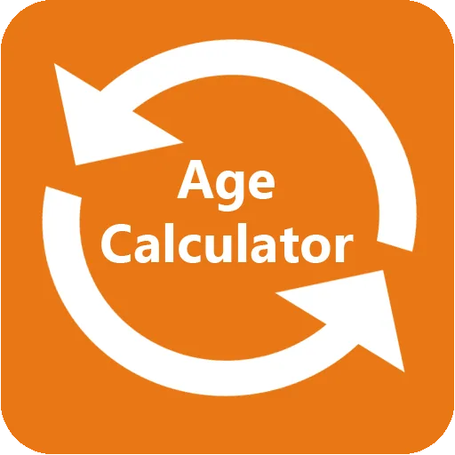

Age is an important concept of life. The age of an non-living or living thing is used to how old it is. Age is usually calculated using the time something begins to exist and current time/the time it stops existing.

This article contains a program that calculates the period of existence in years. From the date it begins to existence to the current date, given that the user provides the date it begins to exist.

The user has to provide the year, month and day, all in figures.

```python
year = int(input('Enter your year of birth(yyyy):'))
month = int(input('Enter your month of birth(mm):'))
day = int(input('Enter your day of birth(dd):'))
```

The program then subtracts the date provided by the user from the current date depending on their geographical location.

```python
current_date = dt.datetime.now()
start_date = dt.datetime(year,month, day)

years = (current_date - start_date)/365

years = str(years)
```

The age in years, is then displayed.
