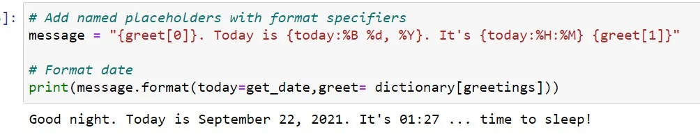

Ever wanted to have a personal AI greet you depending on what time it is? You can do it now with simple string formatting and little bit of python code!

We first import the necessary libraries!

```python
# Import datetime
from datetime import datetime
import datetime as dt
```

Then we assign the current date to the variable get_date

```python
# Assign date to get_date
get_date = datetime.now()
```

Now we have to map a dictionary for words our AI is going to say.
We also have to define the time limits of morning to evening!

```python
dictionary = {
    'morning':('Good morning','... time to work!'),
    'afternoon':('Good afternoon','... It is already afternoon!'),
    'evening':('Good evening','... Do you have plans this evening?'),
    'night':('Good night','... time to sleep!')
}

#morning
mornStart = dt.time(6, 0, 1)
mornEnd = dt.time(12, 0, 0)
#afternoon
aftStart = dt.time(12, 0, 1)
aftEnd = dt.time(18, 0, 0)
#evening
eveStart = dt.time(18, 0, 1)
eveEnd = dt.time(23, 0, 59)
#night
nightStart = dt.time(0, 0, 0)
nightEnd = dt.time(6, 0, 0)
```

We compare the date and time now to our defined limits earlue=

```python
time_now = get_date.time()

if time_now>=mornStart and time_now<mornEnd:
    greetings = ('morning')
elif time_now>=aftStart and time_now<aftEnd:
    greetings = ('afternoon')
elif time_now>=eveStart and time_now<=eveEnd:
    greetings = ('evening')
elif time_now>=nightStart and time_now<nightEnd:
    greetings = ('night')
```

We use string formatting to let the program know what to say!

```python
# Add named placeholders with format specifiers
message = "{greet[0]}. Today is {today:%B %d, %Y}. It's {today:%H:%M} {greet[1]}"

# Format date
print(message.format(today=get_date,greet= dictionary[greetings]))
```

And voila! The program just greeted us and yes It is indeed time to sleep!


