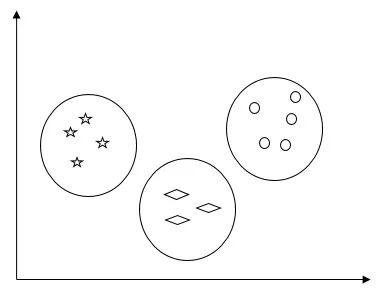
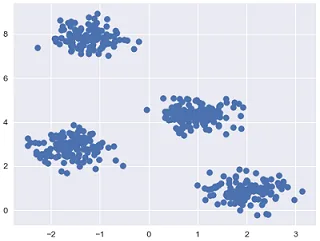
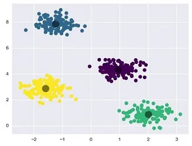
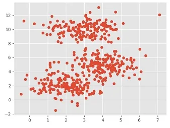
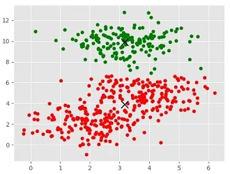

Unsupervised machine learning algorithms do not have any supervisor to provide any sort of guidance. That is why they are closely aligned with what some call true artificial intelligence.

In unsupervised learning, there would be no correct answer and no teacher for guidance. Algorithms need to discover interesting patterns in data for learning.

**What is Clustering?**

Basically, it is a type of unsupervised learning method and a common technique for statistical data analysis used in many fields. Clustering mainly is a task of dividing the set of observations into subsets, called clusters, in such a way that observations in the same cluster are similar in one sense and they are dissimilar to the observations in other clusters. In simple words, we can say that the main goal of clustering is to group the data on the basis of similarity and dissimilarity.

For example, the following diagram shows similar kinds of data in different clusters −



**Algorithms for Clustering the Data**

Following are a few common algorithms for clustering the data −

**K-Means algorithm**

K-means clustering algorithm is one of the well-known algorithms for clustering data. We need to assume that the numbers of clusters are already known. This is also called flat clustering. It is an iterative clustering algorithm. The steps are given below need to be followed for this algorithm −

**Step 1** − We need to specify the desired number of K subgroups.

**Step 2** − Fix the number of clusters and randomly assign each data point to a cluster. Or in other words, we need to classify our data based on the number of clusters.

In this step, cluster centroids should be computed.

As this is an iterative algorithm, we need to update the locations of K centroids with every iteration until we find the global optima or in other words the centroids reach their optimal locations.

The following code will help in implementing K-means clustering algorithm in Python. We are going, to use the Scikit-learn module.

Let us import the necessary packages −

```python
import matplotlib.pyplot as plt
import seaborn as sns; sns.set()import numpy as np
from sklearn.cluster import KMeans
```

The following line of code will help in generating the two-dimensional dataset, containing four blobs, by using **make_blob** from the **sklearn.dataset** package.

```python
from sklearn.datasets.samples_generator import make_blobs

X, y_true = make_blobs(n_samples = 500, centers = 4,
            cluster_std = 0.40, random_state = 0)
```

We can visualize the dataset by using the following code −

```python
plt.scatter(X[:, 0], X[:, 1], s = 50);
plt.show()
```



Here, we are initializing kmeans to be the KMeans algorithm, with the required parameter of how many clusters (n_clusters)

```python
kmeans = KMeans(n_clusters = 4)
```

We need to train the K-means model with the input data.

```python
kmeans.fit(X)
y_kmeans = kmeans.predict(X)
plt.scatter(X[:, 0], X[:, 1], c = y_kmeans, s = 50, cmap = 'viridis')

centers = kmeans.cluster_centers_
```

The code given below will help us plot and visualize the machine's findings based on our data, and the fitment according to the number of clusters that are to be found.

```python
plt.scatter(centers[:, 0], centers[:, 1], c = 'black', s = 200, alpha = 0.5);
plt.show()
```



**Mean Shift Algorithm**

It is another popular and powerful clustering algorithm used in unsupervised learning. It does not make any assumptions hence it is a non-parametric algorithm. It is also called hierarchical clustering or mean shift cluster analysis. The followings would be the basic steps of this algorithm −

- First of all, we need to start with the data points assigned to a cluster of their own.
- Now, it computes the centroids and updates the location of new centroids.
- By repeating this process, we move closer to the peak of the cluster i.e. towards the region of higher density.
- This algorithm stops at the stage where centroids do not move anymore.

With the help of the following code, we are implementing the Mean Shift clustering algorithm in Python. We are going to use Scikit-learn module.

Let us import the necessary packages −

```python
import numpy as np
from sklearn.cluster import MeanShiftimport matplotlib.pyplot as plt
from matplotlib import style
style.use("ggplot")
```

The following code will help in generating the two-dimensional dataset, containing four blobs, by using **make_blob** from the **sklearn.dataset** package.

```python
from sklearn.datasets.samples_generator import make_blobs
```

We can visualize the dataset with the following code

```python
centers = [[2,2],[4,5],[3,10]]
X, _ = make_blobs(n_samples = 500, centers = centers, cluster_std = 1)
plt.scatter(X[:,0],X[:,1])
plt.show()
```



Now, we need to train the Mean Shift cluster model with the input data.

```python
ms = MeanShift()
ms.fit(X)
labels = ms.labels_
cluster_centers = ms.cluster_centers_
```

The following code will print the cluster centres and the expected number of cluster as per the input data −

```python
print(cluster_centers)
n_clusters_ = len(np.unique(labels))print("Estimated clusters:", n_clusters_)[[ 3.23005036 3.84771893][ 3.02057451 9.88928991]]Estimated clusters: 2
```

The code given below will help plot and visualize the machine's findings based on our data, and the fitment according to the number of clusters that are to be found.

```python
colors = 10*['r.','g.','b.','c.','k.','y.','m.']for i in range(len(X)):
   plt.plot(X[i][0], X[i][1], colors[labels[i]], markersize = 10)
plt.scatter(cluster_centers[:,0],cluster_centers[:,1],
   marker = "x",color = 'k', s = 150, linewidths = 5, zorder = 10)
plt.show()
```


