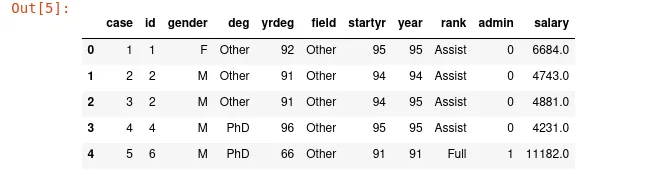

Data scientists have to deal with data that come from various sources. Indeed, data collected for data analysis can be in different formats. Thus, we have data in **a flat file, Excel file, SAS/Stata files, HDF5 files, Matlab files, JSON file, relational database,** and data from the web through API.

Pandas DataFrame is the most relevant data structure used to store data for analysis. In that case, we'll try to convert data imported into that type of data structure.

## 1. Importing flat file
A flat file, also known as a text database, is a type of database that stores data in a plain text format. There are multiple types of flat files: **Binary file, Delimited file, Plain Text file, CSV file.**  We will use Pandas library to import with ease CSV file. The data we are going to use is the **faculty salary** of the University of Washington.

```python
import pandas as pd
data = pd.read_csv('http://courses.washington.edu/b517/Datasets/SalaryData.csv')

data.head()
```



We have imported this data directly from the internet without downloading it to our computer. We can download it and in the first parameter of **pd.read_csv()** method, we put the path to that file. This is the basic knowledge to have about importing CSV files in python.

## 2. Import Excel file
Excel file is a type of file created by an Excel application developed and published by Microsoft. In most cases, data collected by a human is often stored in Excel files due to high readability. In that case, we must know how to import data from this popular format. In this section, we'll import QRS data come from the University of Washington dataset.

```python
import pandas as pd
data = pd.read_excel('http://courses.washington.edu/b517/Datasets/QRS.xlsx')
data.head()
```


**pd.read_excel()**  is an easy method offered in pandas library to read Excel files into pandas DataFrame. It supports many extensions (xls, xlsx, xlsm, xlsb, odf, ods and odt ) and gives us the possibility to read files from our local file system and remote server as we did in the previous example.

## 3. Import SAS file
SAS ( Statistical Analysis System) is the most important tool used in business analytics and biostatistics. The extension of SAS files is **.sas7bdat.**  The easy way to import it is to use **pd.read_sas()** method. To demonstrate how to import SAS files, we'll use sales data came from datacamp course "[Introduction to import data in python](https://www.datacamp.com/courses/introduction-to-importing-data-in-python)".

```python
import pandas as pd
data = pd.read_sas('https://assets.datacamp.com/production/repositories/487/datasets/0300d44b3ac77accc4b9706af86e33037bda6861/sales.sas7bdat')
data.head()
```


Another method to import SAS files is to use **sas7bdat** library. In this case, the normal installation of pandas doesn't come with this library. You need to install it.

```python
 pip install sas7bdat
```

Remark that this method didn't support remote files. We have downloaded this file to our local file system. To open the file, we use SAS7BDAT context manager.

```python
import pandas as pd
from sas7bdat import SAS7BDAT

file = 'sales.sas7bdat'
with SAS7BDAT(file) as file:
    df = file.to_data_frame()

df.head()
```

If you don't know what context manager in python is, feel free to follow this tutorial from [official python documentation](https://docs.python.org/3/library/contextlib.html) on this subject.

## 4. Import STATA file
Stata is a powerful statistical software used in biomedicine and academic social science research. The extension of this type of file is **.dta**  which is a proprietary binary format. Python pandas library offers a simple method to deal with this type of file and transform it in DataFrame**.**

```python
import pandas as pd
data = pd.read_stata('http://courses.washington.edu/b517/Datasets/prison.dta')
data.head()
```


It's extremely easy to import stata files in pandas to start our analysis.

## Conclusion
Throughout this article, we show you how to import data from the popular files format in python. We mainly used pandas library to deal with most of them. It's another proof of the powers of pandas library for data scientists. You can find the source code of this blog post [here](https://github.com/tderick/datainsightonelineprogram/tree/main/importing%20data%20in%20python). This article is written in part of the data insight online program, the free online data science training program.

**References:**

**datasets:** <http://courses.washington.edu/b517/Datasets/datasets.html>
