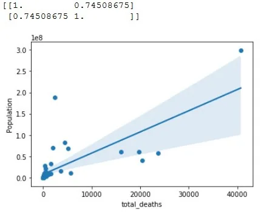
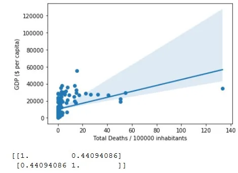
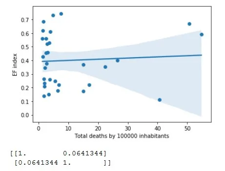

The Covid-19 pandemic has changed the world in great ways this year. It has pushed all human beings to focus and unite against one common enemy. It has also changed a lot in the ways we deal with daily life. Many countries have instigated curfews and confinements that have made our time indoors much longer. It is a strange time we live in.

Today I have tried to answer several questions that arose while exploring and combining datasets.

The datasets I have explored are the following :

- The ECDC dataset '[https://covid.ourworldindata.org/data/ecdc/full_data.csv'](https://covid.ourworldindata.org/data/ecdc/full_data.csv)

Which I used for the information it contains on mortality rates from covid-19 around the world.

- The countries of the world dataset from Kaggle: '[https://www.kaggle.com/fernandol/countries-of-the-world'](https://www.kaggle.com/fernandol/countries-of-the-world)

Which I used for the general information it contains on the countries of the world.

- The Historical Index of Ethnic Fractionalization Dataset (HIEF) from Harvard: '[https://dataverse.harvard.edu/api/access/datafile/3476857?format=original&gbrecs=true'](https://dataverse.harvard.edu/api/access/datafile/3476857?format=original&gbrecs=true%27)

Which I used to determine ethnic diversity in countries.

- The 'uncover' einstein clinical dataset from Kaggle: '[https://www.kaggle.com/roche-data-science-coalition/uncover'](https://www.kaggle.com/roche-data-science-coalition/uncover)

Which I used for bloodwork results from covid-19 and other patients.

The notebook can be found here: <https://github.com/FarahKa/covid_assignment>

This blog will follow the order of the answered questions while hopefully contributing insights on the Covid-19 pandemic and our world.

1) Which are the most hit countries, using total deaths?

2) Which are the most hit countries, using total deaths/100000 inhabitants?

3) Are more populous countries hit?

4) What is the correlation between total deaths, habitants and GDP?

5) What is the relationship between total deaths and how diverse a country is?

6) What is the difference between the bloodwork of people with covid and people without covid?

1) Which are the most hit countries, using total deaths?

We start by loading the datasets, then doing primary work to make it possible to merge them. Here we merge the latest coronavirus data with the population info of countries:

```python
recent.rename(columns = {'location':'Country'}, inplace = True)
recent['Country']=recent['Country'].str.strip()
pop['Country']=pop['Country'].str.strip()
df=pd.merge(recent, pop)
df=df.set_index('Country')
```

Which lets us determine the five most hit countries by total death count:

```python
df=df.sort_values('total_deaths', ascending=False)
print("Five most hit countries by total deaths:")
print(df.head()['total_deaths'])
```

Five most hit countries by total deaths:
Country
United States 40682
Italy 23660
Spain 20453
France 19718
United Kingdom 16060

2) Which are the most hit countries, using total deaths/100000 inhabitants?

However it seems unfair to judge smaller countries and bigger countries on the same scale, which takes us to dividing the death count by 100000 inhabitants. The result is as follows:

Five most hit countries by total deaths/100000 inhabitants:
Country
San Marino 133.328775
Belgium 54.754440
Spain 50.628942
Andorra 50.561088
Italy 40.699418

We can notice the difference in results, though knowing San Marino's proximity to Italy, it is not surprising.

This led me to the following question:

3) Are more populous countries hit by the coronavirus?

The more people, the bigger the risk, right? We tested the hypothesis as such:

```python
#3) Are more populous countries hit?
print(np.corrcoef(df_nozero.total_deaths, df_nozero.Population))
#it seems there is a slight positive correlation between population and total deaths when we consider all countries

df2=df_nozero.head(50)
print(np.corrcoef(df2.total_deaths, df2.Population))
#but when we consider the 50 most hit countries, the positive correlation spikes up to around 0.7

sns.scatterplot(df2['total_deaths'], df2['Population'])
plt.xlabel("Total Deaths")
plt.ylabel("Population")
sns.regplot(x='total_deaths', y='Population', data=df2)
plt.show()
```

When we consider the 50 most hit countries, the positive correlation spikes up to around 0.7.



The hypothesis might be correct.

Another question presents itself: Do poorer countries fare worse than richer countries? Or does the Coronavirus have the same kind of impact on countries regardless of GDP?

4) What is the correlation between total deaths, habitants and GDP?

Hypothesis: the lower the GDP, the more poorly a country fares.

```python
#Total deaths and GDP: for all countries with deaths:
sns.scatterplot(df_nozero.death_by_pop, df_nozero['GDP ($ per capita)'])
sns.regplot(df_nozero.death_by_pop, df_nozero['GDP ($ per capita)'])
plt.xlabel("Total Deaths / 100000 inhabitants")
plt.ylabel("GDP ($ per capita)")
plt.show()
print(np.corrcoef(df_nozero.death_by_pop, df_nozero['GDP ($ per capita)']))
```



A correlation of 0.4 is considered weak to moderate.
The hypothesis is disproved since the correlation is positive: Countries with bigger GDP seem to be more hit by the covid19 pandemic.

5) What is the relationship between total deaths and ethnic diversity in a country ?

The hypothesis is the following: If a country is more diverse, there would be more traveling to and from it, which would make it more at risk of a big spike of cases.

We have used the Historical Index of Ethnic Fractionalization Dataset. The Index is the probability that two randomly picked individuals from the population pool would be of different ethnicities.

First we have explored the dataset on its own:

```python
#Which are the most ethnically diverse countries in this dataset?
print("The most ethnically diverse countries in this dataset:")
print(ed_recent.sort_values('EFindex', ascending=False).head(10))

#And the least diverse?
print("The least ethnically diverse countries in this dataset:")
print(ed_recent.sort_values('EFindex').head(10))
```

The results are as follows:

The most ethnically diverse countries in this dataset:
 EFindex
Country
Liberia 0.889
Uganda 0.883
Togo 0.880
Nepal 0.860
South Africa 0.856
Chad 0.855
Kenya 0.855
Mali 0.852
Nigeria 0.850
Guinea-Bissau 0.808
The least ethnically diverse countries in this dataset:
 EFindex
Country
Japan 0.019
Democratic People's Republic of Korea 0.020
Bangladesh 0.025
Tunisia 0.034
Egypt 0.041
Jordan 0.044
Armenia 0.045
Comoros 0.054
Poland 0.069
Republic of Korea 0.095

We notice the interesting fact that most diverse countries are african.

We then combined the death rates and diversity data to see if there was any correlation. All combinations we did had this kind of appearance:



Which disproves our hypothesis: diversity is uncorrelated with death rate.

The last question comes from the exploration of another dataset containing clinical bloodwork of covid and non-covid patients:

6) What is the difference between the bloodwork of people with covid and people without covid?
The attempt is to find the variables in the bloodwork whose mean differs by more than 0.5 between covid patients and other patients.

First we did some exploration by separating sick and healthy patients who were tested for covid 19 (which meant the healthy ones presented the symptoms but did not have the sickness).

```python
sick=clinical.loc[clinical['sars_cov_2_exam_result'] == 'positive' ]
healthy=clinical.loc[clinical['sars_cov_2_exam_result'] == 'negative' ]

sick.describe()
healthy.describe()
```

Then we searched for variables in the bloodwork whose mean differs by more than 0.5 between covid patients and other patients.
patient_age_quantile 1.456424
platelets -0.818720
leukocytes -0.836818
eosinophils -0.558663
monocytes 0.571967
ionized_calcium -0.938920
segmented 0.642866
ferritin 0.641919
pco2_arterial_blood_gas_analysis -0.648399
ph_arterial_blood_gas_analysis 0.630072
po2_arterial_blood_gas_analysis 0.625503
arteiral_fio2 -0.624296
phosphor -0.561041
cto2_arterial_blood_gas_analysis 0.535281
It mignt be useful to consider these variables more closely in the proccess of understanding the disease and diagnosing it.

Insights:

We have learned through this analysis to find new questions to ask about a very important issue, and searching for ways to answer them.

These questions relied mostly on number of deaths which is a variable that does not depend on how much testing there was or whether a country reports accurately.

Hopefully the information gathered can help some understand this disease and where it stems from better.

Thank you for reading and stay safe.
