The disruption in social media has generated huge datasets which some businesses have leveraged perfectly. Websites, social networks etc contain opinions and ratings from users. These opinions help shape the firms, determine the stock prices, and affect prospective clients. Sentiment analysis has been of interest for many years. Companies and researchers employ state of the art algorithms to model these sentiments.

The task is to analyse words, that is, transform words into numbers and apply the normal statistics models among others. We will try to do this using the IMDB movie ratings dataset. The data can be obtained here <https://archive.ics.uci.edu/ml/datasets/Sentiment+Labelled+Sentences>. The blog revisits the analysis done by Kotzias et al (2015). Their which is entitled From Group to Individual Labels using Deep Features makes use of the Logistic Regression (LR) with bag of words, the LR with word embeddings and lastly the Group-Instance Cost Function (GICF). The LR with bag of words achieved an accuracy of 76.2%, while the LR with word embeddings achieved an accuracy of 57.9%. The best model was that of GICF which had 86%. For this blog we will try to replicate the LR with bag of words, to digress a bit we will use the LR with n-grams. We will also make use of the Multinomial Naïve Bayes Algorithm. Before we do so, let us do some feature engineering

Observe the structure of the dataset:

```python
# a quick view of the first 5 rows
imdb_data.head()
```

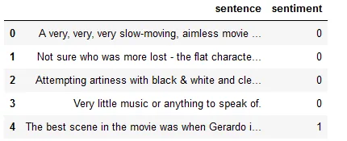

There are only 2 columns, the sentences and the sentiments. The data has 748 rows with the above seen columns

The first variable we will create is that of the length of the sentence which we use the code below

```python
# function to get word length per row
def word_count(string):
    # get the word split
    word = string.split()
    # get the length
    length = len(word)
    # return length of word
    return length
imdb_data['word_len'] = imdb_data['sentence'].apply(word_count)
imdb_data.head()
```

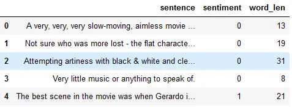

We get the number of characters using the following code

```python
# Number of characters feature
imdb_data['num_characters'] = imdb_data['sentence'].apply(len)
imdb_data.head()
```

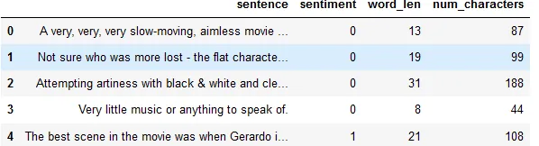

We can also get the average word length of each sentence by:

```python
# function to get the average word length
def avg_word_length(string):
    # get word lengths
    words = string.split()
    words_lengths = [len(word) for word in words]
    # get the average
    avg_word_length = sum(words_lengths)/len(words)
    return avg_word_length
imdb_data['avg_characters'] = imdb_data['sentence'].apply(avg_word_length)
imdb_data.head()
```

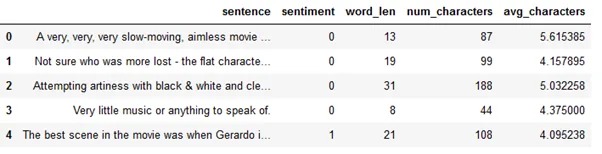

How many letters have capital letters?

```python
import re
# function to get number of words stating with capital letters
def capital_letters(string):
    # the capital words
    capital_word = r"[A-Z]"
    capital_words = re.findall(capital_word, string)
    number_words = len(capital_words)
    return number_words

imdb_data['num_capital_letters'] = imdb_data['sentence'].apply(capital_letters)
imdb_data.head()
```

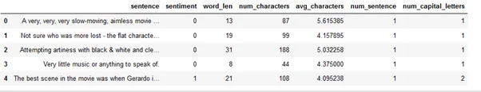

We do the following in getting the number of digits in each sentence:

```python
# function of getting number of digits
def digits(string):
    digits_sent = r"[0-9]"
    digits_ = re.findall(digits_sent, string)
    digits = len(digits_)
    return digits
imdb_data['num_digits'] = imdb_data['sentence'].apply(digits)
imdb_data.head()
```

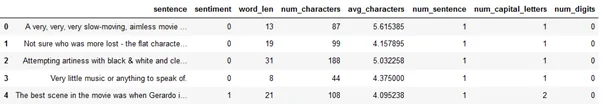

As can be seen the sky is the limit in creating the variables. So now let us move to machine learning modelling shall we

Perhaps we can employ the LR and the Naïve Bayes model on the data? What accuracy would we get?

```python
# Packages
from sklearn.linear_model import LogisticRegression
from sklearn.model_selection import train_test_split
from sklearn.naive_bayes import MultinomialNB
from sklearn.metrics import accuracy_score

# Models
linear_model = LogisticRegression()
gnb = MultinomialNB()

#Selecting data
imdb_data_train = imdb_data.drop(['sentiment', 'sentence'], axis=1)
target = imdb_data['sentiment']

# Split the data
X_train, X_test, y_train, y_test = train_test_split(imdb_data_train, target, test_size = 0.25)

# Fit and predict
y_pred_lr = linear_model.fit(X_train, y_train).predict(X_test)
y_pred_gnb = gnb.fit(X_train, y_train).predict(X_test)
accuracy_log_ = linear_model.score(X_test, y_test)
accuracy_gnb = gnb.score(X_test, y_test)

print("The Logistic Regression accuracy of the test set is %.2f."%(accuracy_log_))
print("The Multinomial Naive Bayes accuracy of the test set is %.2f."%(accuracy_gnb))
```

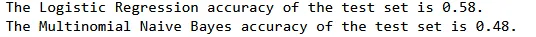

Turns out we get a very poor performance in terms of the accuracy metric.

**Bag of Words (BoW)**

What is this BoW? BoW is a technique of extracting features from text so that we can use them in modelling. First the model cleans the data, by removing English stop words then we make all words to be lower case. Generally, the words are not made lower case when modelling spam, since most spam messages/ emails contain a lot of capital words. Vectorization, the technique for cleaning, creates a data frame of the words, which are dummied or as it were, dichotomous (1,0). Indeed, as you may have thought the data frame becomes very big. Hink of words such as reduce, reducing and reduced, such words are brought to their root form and considered as one word. This process is called lemmatization and is done in this vectorization process.

Let us use the bag of words. We do this by:

```python
import time
from sklearn.feature_extraction.text import CountVectorizer
vectorizer = CountVectorizer(strip_accents ='ascii', stop_words='english', lowercase='True')

imd_train = imdb_data['sentence']
imd_test = imdb_data['sentiment']

# Split the data
X_train_, X_test_, y_train_, y_test_ = train_test_split(imd_train, imd_test, test_size = 0.25)

X_train_bow = vectorizer.fit_transform(X_train_)
X_test_bow = vectorizer.transform(X_test_)
clf = MultinomialNB()
start_time = time.time()
clf.fit(X_train_bow, y_train_)
accuracy_clf = clf.score(X_test_bow, y_test_)
print("The program took %.3f seconds to complete. The accuracy of the test set is %.2f."%(time.time()- start_time, accuracy_clf))
```

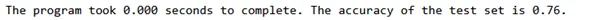

The Naïve Bayes Model Achieves an accuracy of 76% which is quite good.

We look at the LR with bag of words and get

```python
# Logistic Regression BoW
log_model = LogisticRegression()

start_time = time.time()
log_model.fit(X_train_bow, y_train_)
accuracy_log = log_model.score(X_test_bow, y_test_)
print("The program took %.3f seconds to complete. The accuracy of the test set is %.2f."%(time.time()- start_time, accuracy_log))
```

We improve the accuracy by 2%, getting 78%.

**N-Grams**

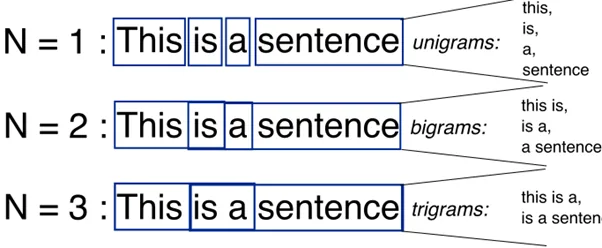

Suppose we use N-Grams? Would the model improve? But first what is an n-gram? As the figure above, extracted from the DeepAI website, n-grams is breaking sentence into chunks. N-gram of 2 means we are bunching words in groups of 2.

Let us use each n-gram and see what we get

```python
vectorizer_ng1 = CountVectorizer(ngram_range=(1,1))
X_train_ng1 = vectorizer_ng1.fit_transform(X_train_)
X_test_ng1 = vectorizer_ng1.transform(X_test_)
clf_ng1 = MultinomialNB()
start_time = time.time()
clf_ng1.fit(X_train_ng1, y_train_)
accuracy_clf_ng1 = clf_ng1.score(X_test_ng1, y_test_)
print("The program took %.3f seconds to complete. The accuracy of the test set is %.2f."%(time.time()- start_time,  accuracy_clf_ng1))
```

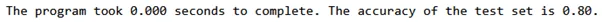

We realise an accuracy of 80% which is a 4% improvement for the Naïve Bayes Model

```python
vectorizer_ng1 = CountVectorizer(ngram_range=(1,1))

X_train_ng1 = vectorizer_ng1.fit_transform(X_train_)
X_test_ng1 = vectorizer_ng1.transform(X_test_)

lr_ng1  = LogisticRegression()

start_time = time.time()
lr_ng1.fit(X_train_ng1, y_train_)
accuracy_lr_ng1 = lr_ng1.score(X_test_ng1, y_test_)
print("The program took %.3f seconds to complete. The accuracy of the test set is %.2f."%(time.time()- start_time, accuracy_lr_ng1))
```

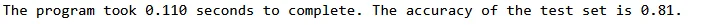

Not much is improved in the LR n-gram is realised as we achieve 81%. However, we have high computation time in the LR with N-grams.

In comparison to the Kotzias et al (2015) I believe we did well achieving an accuracy of 81%. The code for this blog is [here](https://github.com/Matshisela/Feature-Engineering-concepts). As always I am indebted to the DataCamp course which is [here](https://app.datacamp.com/learn/courses/feature-engineering-for-nlp-in-python)
