There was an Arab investor who decided to invest his money in North American countries, specifically in three countries: Canada, Mexico, and the United States But he didn't know in which industry he would invest all that money He decided to use a data analyst to help him make his decision The analyst realized that these countries use a system called the NAICS Classification Which depends on its definition of a given code for each industry in a hierarchical system This analyst started collecting data on this system from 1997 to 2018 Then the analysis began Which discovered that one of the most important and largest industries that are held in those countries It is the construction industry, followed by food services This is because the number of employees and its employees was increasing over time according to his analysis of that time series The data analyst came back and told him what he had concluded: If he wants to invest in a large industry that employs many people and can open many branches, then he should turn to the construction industry. But if he wants a medium-sized industry with a kind of entertainment, he should open a chain of restaurants or cafes The investor thought and made his decision... And you, what would your decision be if you were in his place?

## Let's see our operations...

**NAICS 2017 – Statistics Canada:**

Description of the North American Industry
Classification System (NAICS). All you would need to understand for this task is, how the NAICS works as a hierarchical structure for defining industries at different levels of aggregation. For example 3-digit NAICS industries (236 - Construction of buildings, 237 - Heavy and civil engineering construction, and a few more 3-digit NAICS industries).

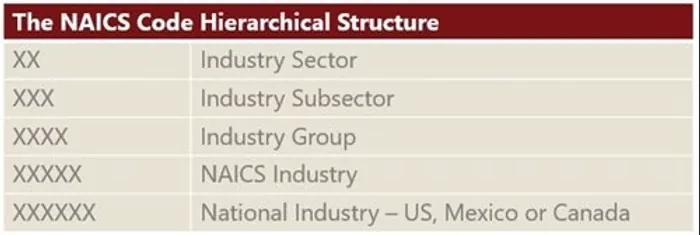

Summary of the data set files we will be using:

1. 15 RTRA (Real-Time Remote Access) CSV files containing employment data by industry at different levels of aggregation, 2-digit NAICS, 3-digit NAICS, and 4-digit NAICS. We will search through rows with 2, 3, or 4 digits NAICS and append employment data each month of each year from 1997 - 2018 Meaning of columns in the files:

- SYEAR: Survey Year
- SMTH: Survey Month
- NAICS: Industry name and associated NAICS code in the bracket
- _EMPLOYMENT_: Employment

LMO Detailed Industries by NAICS: An excel file for mapping the RTRA data to the desired data row. Columns in the file:

- Column 1 lists all 59 industries that are used frequently
- Column 2 lists the industry's NAICS definitions

As part of our data wrangling, we would create a dataset of monthly employment series from 1997 to 2018 for the industries.
One of the guiding principles for our data wrangling is to try to create each series from the highest possible level of aggregation in the raw data files, thus, if an LMO Detailed Industry is defined with a 2-digit NAICS only, we would not use a lower level of aggregation (i.e. 3-digit or 4-digit level NAICS files in the RTRA), similarly, if an LMO Detailed Industry is defined with a 3-digit NAICS only, we would not use the 4-digit NAICS files for that industry.

```python
# Importing the needed libaries

import numpy as npimport pandas as pdimport matplotlib.pyplot as pltimport seaborn as snsimport re
```

```python
# Uploading filesfrom google.colab

import filesuploaded = files.upload()

for fn in uploaded.keys():
    print('User uploaded file "{name}" with length {length}     bytes'.format(name=fn, length=len(uploaded[fn])))
```

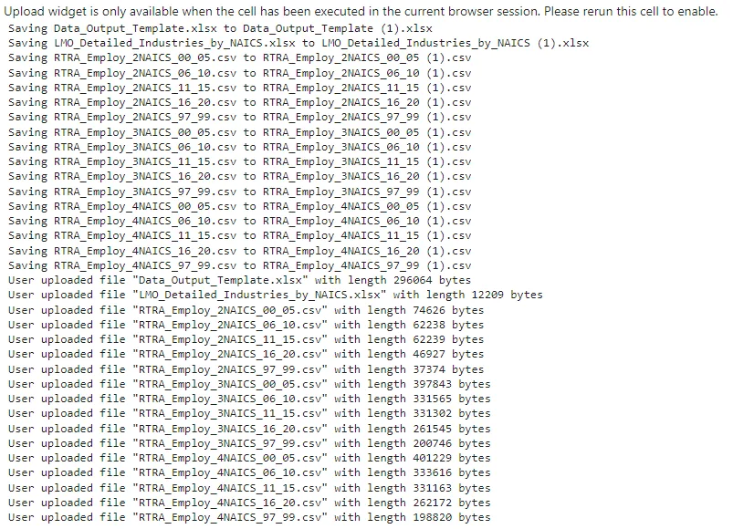

```python
# Reading  LMO_Detailed_Industries_by_NAICS  &

data_outputlmo_detailes = pd.read_excel('LMO_Detailed_Industries_by_NAICS.xlsx')
data_output=pd.read_excel('Data_Output_Template.xlsx')
```

```python
# Clean LMO_Detailed_Industries_by_NAICSCleaned

NAISC=lmo_detailes['NAICS'].astype(str).str.replace(' &',
',').str.split(',')
lmo_detailes['NAICS']=CleanedNAISClmo_detailes.head()
```

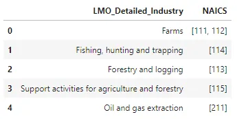

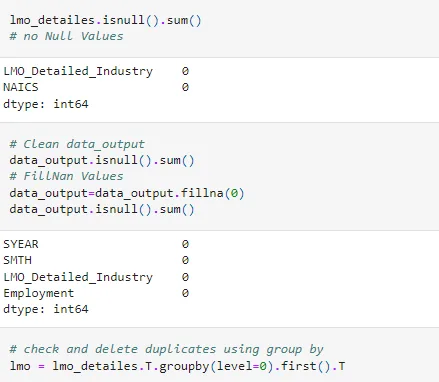

```python
lmo.info()
data_output.info()
```

```python
<class 'pandas.core.frame.DataFrame'>
Int64Index: 59 entries, 0 to 58
Data columns (total 2 columns):
 #   Column                 Non-Null Count  Dtype
---  ------                 --------------  -----
 0   LMO_Detailed_Industry  59 non-null     object
 1   NAICS                  59 non-null     object
dtypes: object(2)
memory usage: 1.4+ KB
<class 'pandas.core.frame.DataFrame'>
RangeIndex: 15576 entries, 0 to 15575
Data columns (total 4 columns):
 #   Column                 Non-Null Count  Dtype
---  ------                 --------------  -----
 0   SYEAR                  15576 non-null  int64
 1   SMTH                   15576 non-null  int64
 2   LMO_Detailed_Industry  15576 non-null  object
 3   Employment             15576 non-null  float64
dtypes: float64(1), int64(2), object(1)
memory usage: 486.9+ KB
```

```python
#clean the RTRA files NAICS column then Create NAIC drop the old one

def Cleaning(df):
                df['NAICS'] = df.NAICS\
                        .map(lambda x:x.split('[' [1].strip(']').replace('-', ','))
                df = df.drop(columns = 'NAICS', axis = 1)[df.SYEAR < 2019]
                return df
```

```python
#clean the RTRA files NAICS column then Create NAIC drop the old one

def Cleaning(df):
                        df['NAICS'] = df.NAICS\
                        .map(lambda x:x.split('[')[1].strip(']').replace('-', ','))
                        df = df.drop(columns = 'NAICS', axis = 1)[df.SYEAR < 2019]
                        return df
```

```python
# loading 2 digit code dataset

df2_naics = pd.read_csv('RTRA_Employ_2NAICS_00_05.csv')
employ_2_naics_files = ['RTRA_Employ_2NAICS_06_10.csv',  'RTRA_Employ_2NAICS_11_15.csv', 'RTRA_Employ_2NAICS_16_20.csv',  'RTRA_Employ_2NAICS_97_99.csv']

for i in employ_2_naics_files:
    df = pd.read_csv(i)
    df2_naics = df2_naics.append(df,ignore_index=True)


df2_naics.head()
```

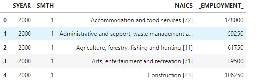

```python
# loading 3 digit code dataset

df3_naics = pd.read_csv('RTRA_Employ_3NAICS_00_05.csv')
employ_3_naics_files = ['RTRA_Employ_3NAICS_06_10.csv',  'RTRA_Employ_3NAICS_11_15.csv', 'RTRA_Employ_3NAICS_16_20.csv',  'RTRA_Employ_3NAICS_97_99.csv']

for i in employ_3_naics_files:
    df = pd.read_csv(i)
    df3_naics = df3_naics.append(df, ignore_index=True)

df3_naics.head()
```

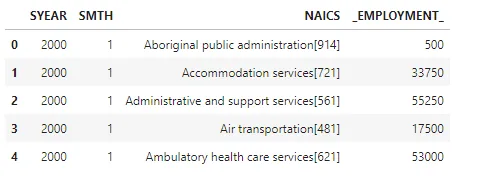

```python
# loading 4 digit code dataset

df4_naics = pd.read_csv('RTRA_Employ_4NAICS_00_05.csv')
employ_4_naics_files = ['RTRA_Employ_4NAICS_06_10.csv', 'RTRA_Employ_4NAICS_11_15.csv', 'RTRA_Employ_4NAICS_16_20.csv', 'RTRA_Employ_4NAICS_97_99.csv']

for i in employ_4_naics_files:
    df = pd.read_csv(i)
    df4_naics = df4_naics.append(df, ignore_index=True)

df4_naics.head()
```

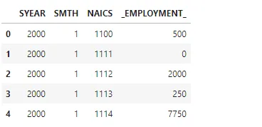

```python
df2_naics.info()
df3_naics.info()
df4_naics.info()
```

```python
<class 'pandas.core.frame.DataFrame'>
RangeIndex: 5472 entries, 0 to 5471
Data columns (total 4 columns):
 #   Column        Non-Null Count  Dtype
---  ------        --------------  -----
 0   SYEAR         5472 non-null   int64
 1   SMTH          5472 non-null   int64
 2   NAICS         5472 non-null   object
 3   _EMPLOYMENT_  5472 non-null   int64
dtypes: int64(3), object(1)
memory usage: 171.1+ KB
<class 'pandas.core.frame.DataFrame'>
RangeIndex: 28140 entries, 0 to 28139
Data columns (total 4 columns):
 #   Column        Non-Null Count  Dtype
---  ------        --------------  -----
 0   SYEAR         28140 non-null  int64
 1   SMTH          28140 non-null  int64
 2   NAICS         28140 non-null  object
 3   _EMPLOYMENT_  28140 non-null  int64
dtypes: int64(3), object(1)
memory usage: 879.5+ KB
<class 'pandas.core.frame.DataFrame'>
RangeIndex: 85572 entries, 0 to 85571
Data columns (total 4 columns):
 #   Column        Non-Null Count  Dtype
---  ------        --------------  -----
 0   SYEAR         85572 non-null  int64
 1   SMTH          85572 non-null  int64
 2   NAICS         85572 non-null  int64
 3   _EMPLOYMENT_  85572 non-null  int64
dtypes: int64(4)
memory usage: 2.6 MB
```

```python
# merge the output template & RTRA final 'data_output' ready for analysis

data_output_merged = pd.merge
(lmo, data_output,on='LMO_Detailed_Industry', how='left')

data_output_merged.NAICS =
data_output_merged.NAICS.astype('str')

data_output_merged.head(25)
```

```python
# merging all datasets [2, 3, 4 digits]

rtra_total = pd.concat([df2_naics, df3_naics, df4_naics], ignore_index=True)rtra_total
```

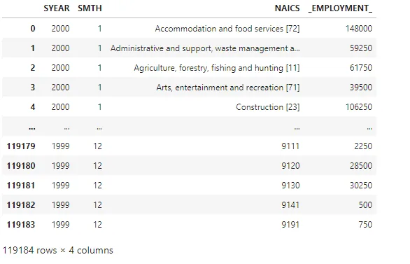

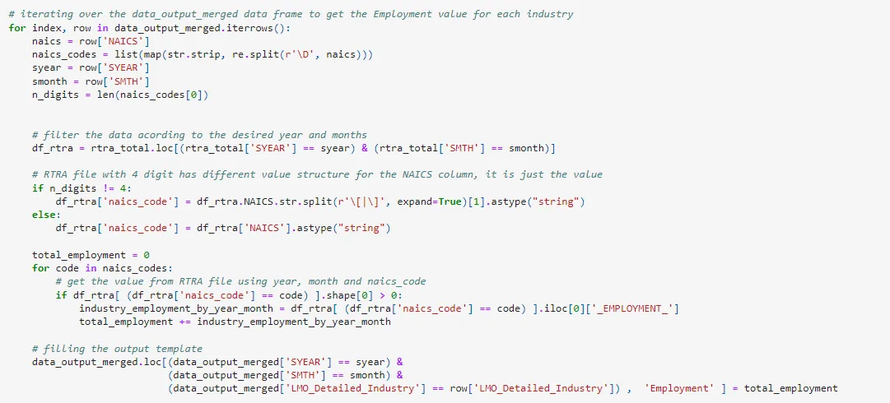

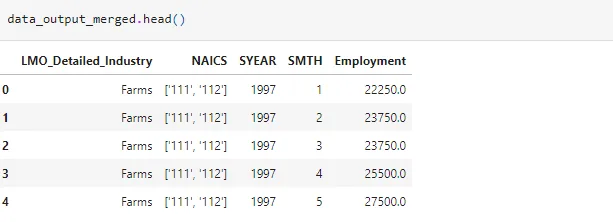

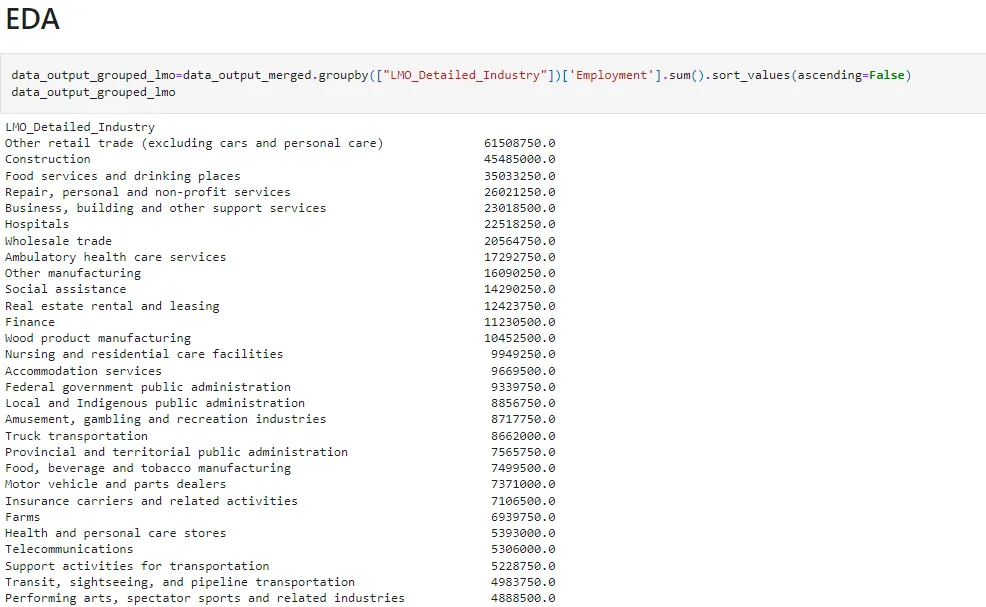

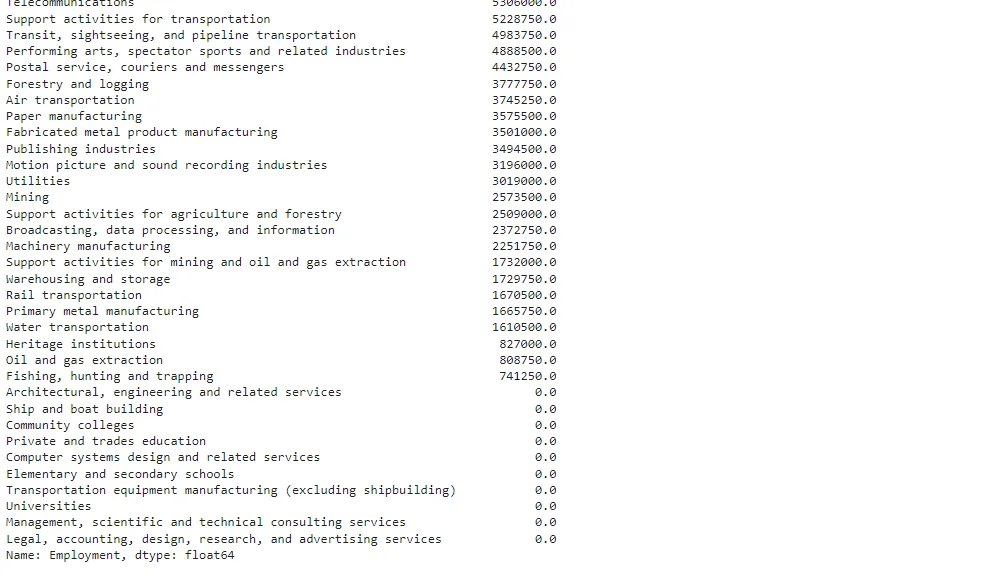

## Now we are ready for Analysis...

## Q1. What's the most Industry corresponding to Employment?

- We get that the Construction had the high number

```python
data_output_grouped_lmo[:16].plot(kind='barh')
plt.xlabel('Employment')
plt.ylabel('Industries')
```


## Q2. What happened to the employment in Construction evolved over time compared to employment in other industries?

```python
construction=data_output_merged.loc[data_output_merged['LMO_Detailed_Industry']=='Construction']

construction_by_year=construction.groupby(['SYEAR'])['Employment'].sum()
construction_by_year
```

```python
SYEAR
1997    1489750.0
1998    1424750.0
1999    1363500.0
2000    1345750.0
2001    1347250.0
2002    1401500.0
2003    1412000.0
2004    1705000.0
2005    1989000.0
2006    2097000.0
2007    2301000.0
2008    2616750.0
2009    2444750.0
2010    2380750.0
2011    2365750.0
2012    2383250.0
2013    2453000.0
2014    2406500.0
2015    2417750.0
2016    2536000.0
2017    2743250.0
2018    2860750.0
Name: Employment, dtype: float64
```

```python
from IPython.core.pylabtools import

figsizeplt.plot(construction_by_year.index,construction_by_year.values)
plt.xticks(range(1997,2019))
plt.title("Employment in Construction evolved overtime")
plt.xlabel("Month and Year")
plt.ylabel("Employment")plt.show(figsize(10,10))
```

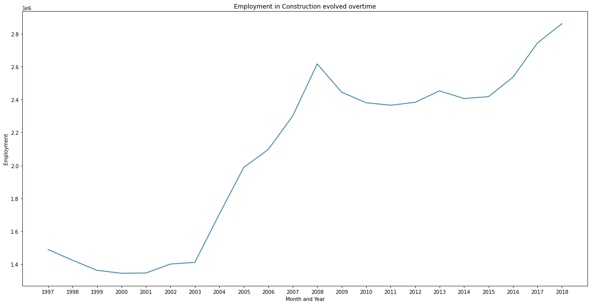

Q3. How has employment in Construction evolved over time compared to employment in other industries?

```python
total_employment=construction.groupby("SMTH")["Employment"].sum()
total_employment =
total_employment.reset_index()plt.figure(figsize=(20,10))
sns.lineplot(x="SMTH", y="Employment", data=total_employment, label="Total Employment")
sns.lineplot(x="SMTH", y="Employment", data=construction, label="Construction Employment")
plt.show()
```

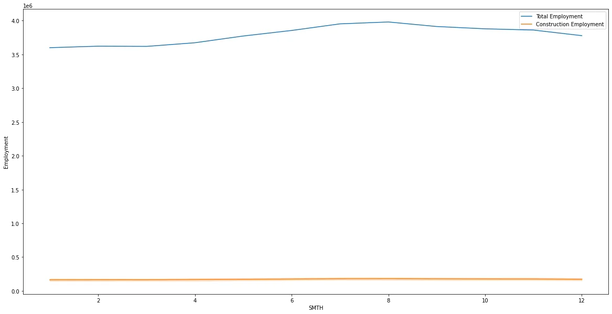

## Q4. How the employment changed every year?

```python
index = data_output_merged.groupby('SYEAR')['Employment'].idxmax()
print(data_output_merged.loc[index].head())
```

```python
                                  LMO_Detailed_Industry  \
5550  Other retail trade (excluding cars and persona...
5567  Other retail trade (excluding cars and persona...
5570  Other retail trade (excluding cars and persona...
5586  Other retail trade (excluding cars and persona...
5602  Other retail trade (excluding cars and persona...

                                                  NAICS  SYEAR  SMTH  \
5550  ['442,443,444,445,446,447,448,451,452,453', '4...   1997     7
5567  ['442,443,444,445,446,447,448,451,452,453', '4...   1998    12
5570  ['442,443,444,445,446,447,448,451,452,453', '4...   1999     3
5586  ['442,443,444,445,446,447,448,451,452,453', '4...   2000     7
5602  ['442,443,444,445,446,447,448,451,452,453', '4...   2001    11

      Employment
5550    211000.0
5567    219750.0
5570    218250.0
5586    219500.0
5602    219250.0
```

```python
sns.lineplot(data=index.pct_change())

Out[ ]:
<matplotlib.axes._subplots.AxesSubplot at 0x7f95f9d10dd0>
```

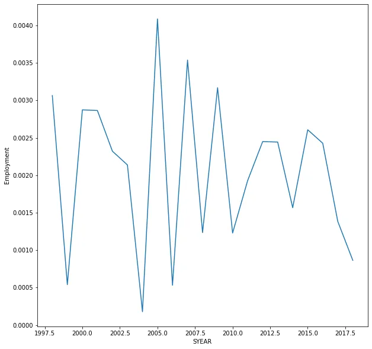

## Q5. What's the average of employment for each industry over time?

```python
fig, ax = plt.subplots(1, 1, figsize=(15,15))
ax.plot(pd.crosstab(data_output_merged
['LMO_Detailed_Industry'], [data_output_merged['SYEAR']], values = data_output_merged['Employment'], aggfunc='mean'))
plt.xticks(rotation='vertical')
plt.show()
```

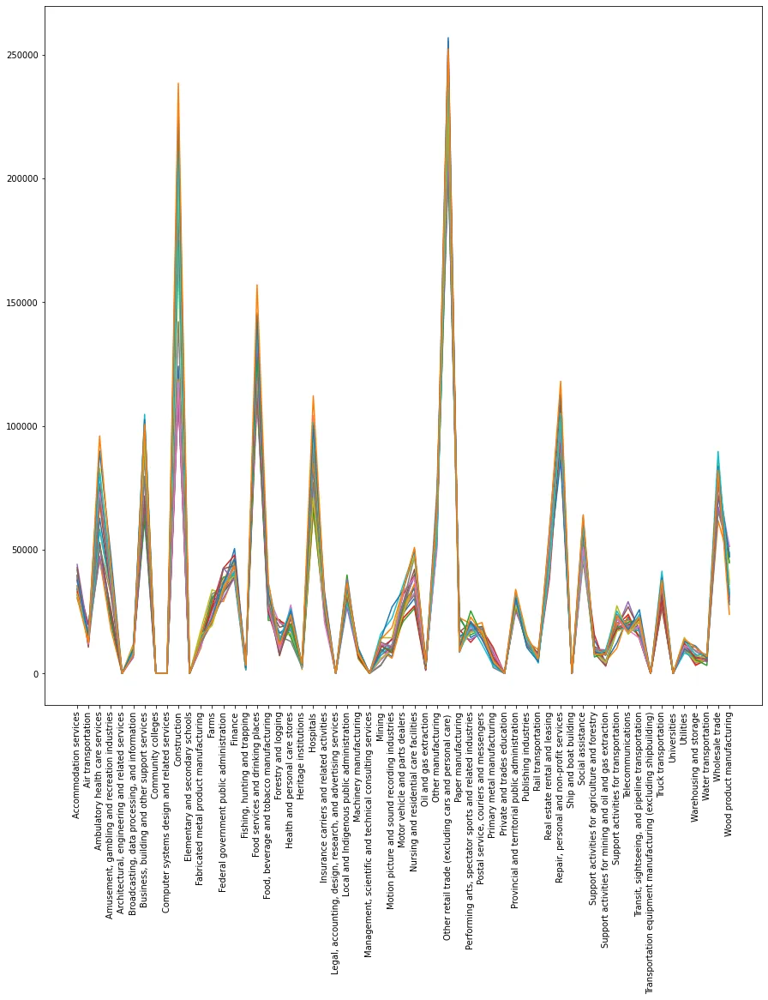

That's it, I hope this article was worth reading and helped you acquire new knowledge no matter how small.

Feel free to check up on the [notebook](https://github.com/MariamAlsaedy/NAICS_Times_Series_Project/). You can find the results of code samples in this post.
