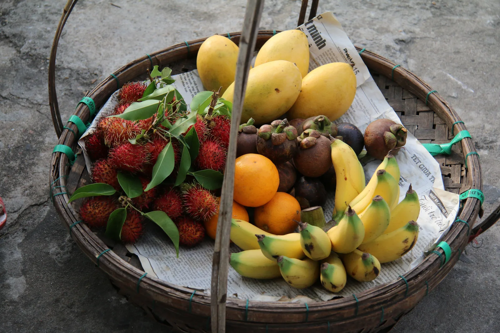

One of the most unique built-in methods to store collections in Python are sets. Other kinds of collections in Python include the well known **lists** as well as **dictionaries** and **tuples**. In this article, we will be focusing on sets, their properties, and how to use them in your programs.

## What are sets?
In mathematics, a set is simply a collection of elements. The elements could be any number or object. In programming languages, more specifically in Python, sets are most commonly used to store elements while ensuring that no element gets repeated more than once. This means that a set is a list where we are sure that every single element is *unique*.

## Why use sets?
Sets provide us with two main advantages: there are no duplicate items in sets; and accessing elements in them is *fast*. This is due to the fact that sets utilize a technique called **Hashing** which allows us to insert, delete, and traverse a collection or an iterable in O(1) on average.

## Sets properties
- No duplicates
- Unordered
- Immutable
- Different data types

### No Duplicates

This is one of the key differences between sets and other collections. For example, in the following set, "apples" has been input twice. However, it shows up only once in the set when you try to print the set. More on how to create sets later.

```python
fruit_basket = {'apples', 'bananas', 'apples','oranges'}
```

### Unordered
This means that elements do not have an index that can be used to refer to them, and thus they have no hierarchy: no element comes before the other. So how can we access items in a set? Using a loop:

```python
for fruit in fruit_basket:
    print(fruit)
```

### Immutable
You cannot change an element that has been added to a set, you can only add to the set or delete from it. In fact, there is no way to change the element: it is not indexed so you cannot access it individually unless by value.

### Different Data Types
A set can contain elements having different data types. For example:

```python
new_set = {1, 'two', 3.0, True}
```

## Creating a Set
To create a new set, you can use curly braces as in the previous examples (not to be confused with dictionaries' curly braces). You can also use the **set()** constructor.

```python
another_set = set(('Hello', 'this', 'is', 'a', 'set'))
```

**Note** the double brackets in the previous example.

However, to create an empty set, you cannot use empty curly braces **{}**, as this will denote an empty dictionary. Instead, use the set constructor.

```python
empty_set = set()
```

## Adding Items to Sets
To add new items to a preexisting set, use **add()** method.

```python
fruit_basket.add('mangoes')
```

To add an entire set to a new set, use **update()** method.

```python
new_fruits = {'strawberries', 'passion fruit'}
fruit_basket.update(new_fruits)
```

**Note**: the update method can be used to add any sort of collections to a set, not just other sets.

```python
fruit_list = ['kiwis', 'cherries']
fruit_basket.update(fruit_list)
```

## Remove Items from Sets
To remove an item from a set, you have to refer to it by value and use either the method **remove()** or **discard()**. The difference between them is that remove() will raise an error if you attempt to remove an item that does not exist in the set, whereas discard() will not raise an error.

```python
if ('bananas' in fruit_basket):
    fruit_basket.remove('bananas')
```

**Note** the use of in keyword to check if an item exists in a set or not.

You can also use **pop()** method, which would typically remove the last item in a list and return it. However, since sets are unordered, you would not know what that last item is.

```python
random_fruit = fruit_basket.pop()
```

Two additional methods are **clear()** which would empty the set, and **del()** which would delete the set from the memory completely so you cannot use its reference name again unless it is reinitialized.

## Other Interesting Methods
Python offers more set methods that relate more directly to its mathematical definition such as **union()** and **intersection()**.

This has been a brief overview to help you start using sets in Python. For a full list of methods check out [this](https://www.w3schools.com/python/python_sets_methods.asp) resource.

To view this article as a Jupyter Notebook, [click here](https://github.com/HebaElwazzan/an-intro-to-python-sets/blob/main/an-intro-to-python-sets.ipynb).
