A Data Analyst is someone who munges information using data analysis tools. The meaningful results they pull from raw data help their employers or clients make important decisions by identifying various facts and trends. The North American Industry Classification System (NAICS) is an industry classification system developed by the statistical agencies of Canada, Mexico, and the United States. NAICS is designed to provide common definitions of the industrial structure of the three countries and a common statistical framework to facilitate the analysis of the three economies.

For this task, consider yourself a Data Analyst, which you definitely are after months of data skill training facilitated by Data Insight. The head of your department at your new company has given you the following instructions:
1. Download zipped files A_NEWLY_HIRED_DATA_ANALYST.zip (PASSCODE>2021DSP)
2. Prepare a data set using the following files:
a. NAICS 2017 – Statistics Canada: Description of the North American Industry Classification System (NAICS). All you would need to understand for this task is, how the NAICS works as a hierarchical structure for defining industries at different levels of aggregation. For example (see page 22),

a. 2-digit NAICS industry (e.g., 23 - Construction) iscomposed of some 3-digit NAICS industries (236 - Construction of buildings, 237 - Heavy and civil engineering construction, and a few more 3-digit NAICS industries). Similarly, a 3-digit NAICS industry (e.g., 236 - Construction of buildings), is composed of 4-digit NAICS industries (2361 - Residential building construction and 2362 - Non-residential building construction).
b. Raw data: 15 CSV files beginning with RTRA. These files contain employment data by industry at different levels of aggregation; 2-digit NAICS, 3-digit NAICS, and 4-digit NAICS. Columns mean as follows:
(i) SYEAR: Survey Year
(ii) SMTH: Survey Month
(iii) NAICS: Industry name and associated NAICS code in the bracket
(iv) _EMPLOYMENT_: Employment

After downloading the zip file to the personal PC, we access the files using the following packages and command

```python
#importing the libraries
import numpy as np
import matplotlib.pyplot as plt
import seaborn as sns
import glob
import pandas as pd
from zipfile import ZipFile # Required module
file_name = "C:/Users/NTANDO/Downloads/A_NEWLY_HIRED_DATA_ANALYST.zip"

with ZipFile(file_name, 'r') as zip:
    zip.printdir()

    # Extract all files now
    print('Extracting all the files now...')
    zip.extractall()

    print('Done!')

data = pd.read_csv("C:/Users/NTANDO/Documents/Data Insight/A_NEWLY_HIRED_DATA_ANALYST/RTRA_Employ_4NAICS_16_20.csv")
```

This produces the following result showing which files are in the zip file. The next task is to access these files.

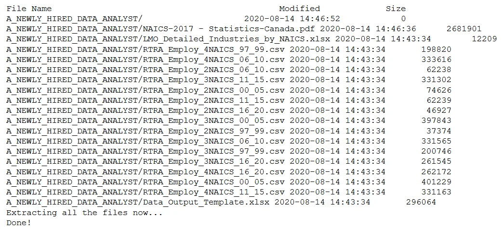

To do so we will use the following code:

```python
#Accessing the files
the_2NAICS = glob.glob('C:/Users/NTANDO/Documents/Data Insight/A_NEWLY_HIRED_DATA_ANALYST/*2NAICS*')
the_3NAICS = glob.glob('C:/Users/NTANDO/Documents/Data Insight/A_NEWLY_HIRED_DATA_ANALYST/*3NAICS*')
the_4NAICS = glob.glob('C:/Users/NTANDO/Documents/Data Insight/A_NEWLY_HIRED_DATA_ANALYST/*4NAICS*')
the_2NAICS # the list of files
```

When executing this code we see in part how the csv files are bundled up. The above command ending with /\*2NAICS\*, filters the list of files in the zip file and only remains with only files containing /\*2NAICS\* like the image below.

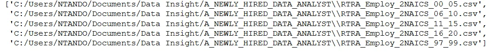

Next we need to merge these files into a file and then manipulate the data. Luckily the /\*2NAICS\* have similar variables and its easy to manipulate the files. This is the same for the /\*3NAICs as well as the /\*4NAICs files

```python
# Accessing the datasets in files
def access_datasets(data_paths):
    df = pd.DataFrame()
    for path_ in data_paths:
        df = pd.concat([df,pd.read_csv(path_)])
    return df

data_2NAICS = access_datasets(the_2NAICS)
data_3NAICS = access_datasets(the_3NAICS)
data_4NAICS = access_datasets(the_4NAICS)
```

The access_datasets() function merges the csv files using the pandas concat function. This function is used on the 3NAICS and 4NAICS files

There is also a LMO Detailed Industries file that needs to be used which has NAIC Codes. We will need to clean this dataset for us to use it

```python
industries_data = pd.ExcelFile("C:/Users/NTANDO/Documents/Data Insight/A_NEWLY_HIRED_DATA_ANALYST/LMO_Detailed_Industries_by_NAICS.xlsx")
industries_data = industries_data.parse(0)
industries_data['NAICS'] = industries_data['NAICS'].replace(regex='&', value=',')
industries_data['NAICS'] = industries_data['NAICS'].astype('str')
industries_data.head()
```

The above code does the trick and the following result is observed.

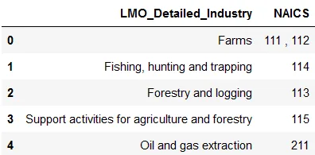

We will need to deal with the 111, 112 kind of scenarios as such scenario are not observed in the 2NAIC, 3NAIC, and 4NAIC files. For us to do so we will use the following code:

```python
for i in range(len(industries_data)):
    industries_data.at[i, 'NAICS'] = industries_data.at[i, 'NAICS'].split(',')

industries_data = industries_data.explode('NAICS')
industries_data.head(4)
industries_data['NAICS'] = industries_data.NAICS.astype(int)
```

This is a for loop that splits all values in the NAIC column, that have a comma. We observe the following result

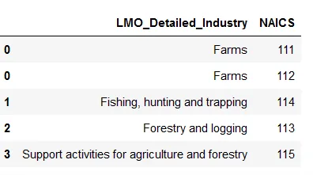

This makes it easy to then merge files as the values in the NAICS column are separate and cane be treated as string or integers.

We then quickily manipulate the 2NAIC and similarly for 3NAIC files as follows

```python
def cut(df):
    df1=pd.DataFrame(df.NAICS.astype('str').str.split('[').to_list(), columns=['NAICS','NAICS_CODE'])
    df1['NAICS_CODE']= df1.NAICS_CODE.astype('str').str.strip(']').str.replace('-',',')
    df['NAICS']=df1['NAICS']
    df['NAICS_CODE']= df1['NAICS_CODE']
    return df

data_2NAICS = cut(data_2NAICS)
data_2NAICS.sort_values(by=["SYEAR", "SMTH"])

#left merging the df_2_naics with lmo_detailed_industries
df1=data_2NAICS.merge(industries_data, left_on='NAICS_CODE',
                     right_on='NAICS', how='left').drop(columns=['NAICS_x','NAICS_y'],axis=1)
df1.tail(10)

def format_date(df):
  df['date'] = pd.to_datetime(df.SYEAR.astype('str') + df.SMTH.astype('str'), format='%Y%m')
  df2 = df.sort_values('date')
  return df2

df1 = format_date(df1).dropna()
df1.head(4)
```

This code merges the files and drops missing values. Remember missing values are a result of a missing value as we merge

The first 4 rows look like this

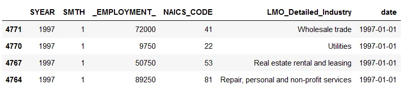

And for the 3 NAICs files the first 4 rows look like this

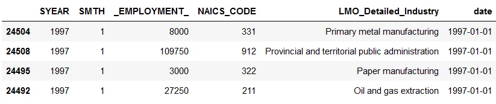

There is a difference when dealing with the 4NAIC files. The challenge is that there are only codes, the industry names are missing. To circumvent this challenge we use the following lines of code

```python
# Merging
df3 = data_4NAICS.merge(industries_data, on="NAICS", how = 'inner')

format_date(df3)
df3.sort_values(by= "date")
df3.columns = ['SYEAR', 'SMTH', 'NAICS_CODE', '_EMPLOYMENT_', 'LMO_Detailed_Industry', 'date']
df3.head()
```

This result to

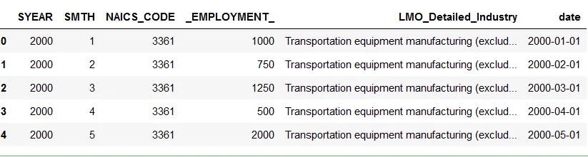

This does well as the NAICS code is a 4 digit as observed. Now to the next step of merging all 3 files, we use the line of code. The analysis requires us to analyze the data between 1997-2018. Therefore, we subset the data after concating the data.

```python
# Merging 3 dataframes
data = pd.concat([df1, df2, df3])
data = data.dropna()
data.sort_values(by= "date")
data.columns = ['SYEAR', 'SMTH', 'EMPLOYMENT', 'NAICS_CODE', 'LMO_Detailed_Industry', 'date']
data = data[data['SYEAR'] <= 2018]
data
```

We then plot data for the construction industry

```python
#Subsetting the construction data
construction = data[data['LMO_Detailed_Industry']== "Construction"]
plt.figure(figsize = (10,6))
ax = sns.lineplot(x = "date", y = "EMPLOYMENT",
             data = construction)
ax.set(xlabel= "Date", ylabel="Employment", title= "Employment in the construction industry 1997-2018")
```

We subset the data by concentrating on the construction industry. The line of code data[data['LMO_Detailed_Industry']== "Construction"], does this for us.

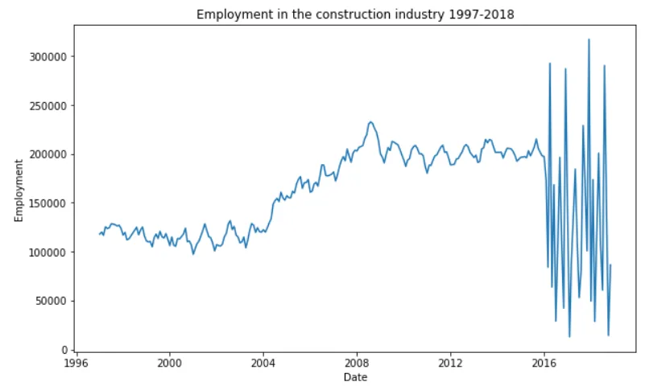

We get this graph of the employment numbers from 1997-2018. Wouldnt it be interesting to also check which months have high employment numbers?

We employ the following code:

```python
# barplot
ax = sns.barplot(y= 'EMPLOYMENT', x= 'SMTH', data= construction)
ax.set(xlabel="Month", ylabel = "Employment", title= "Employment in the construction industry")
```

We observe that September and December are bullish months whereas March is bearish in terms of employment numbers.

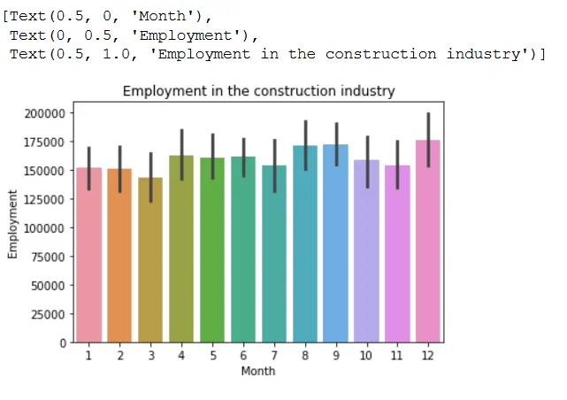

Similarly, we can look at the Water Transportation industry, we subset the data

```python
# Subsetting Water Transport
water_data =data[(data['LMO_Detailed_Industry']== "Water transportation")]
plt.figure(figsize = (15,8))
sns.lineplot(x = "date", y = "EMPLOYMENT", data = water_data)
```

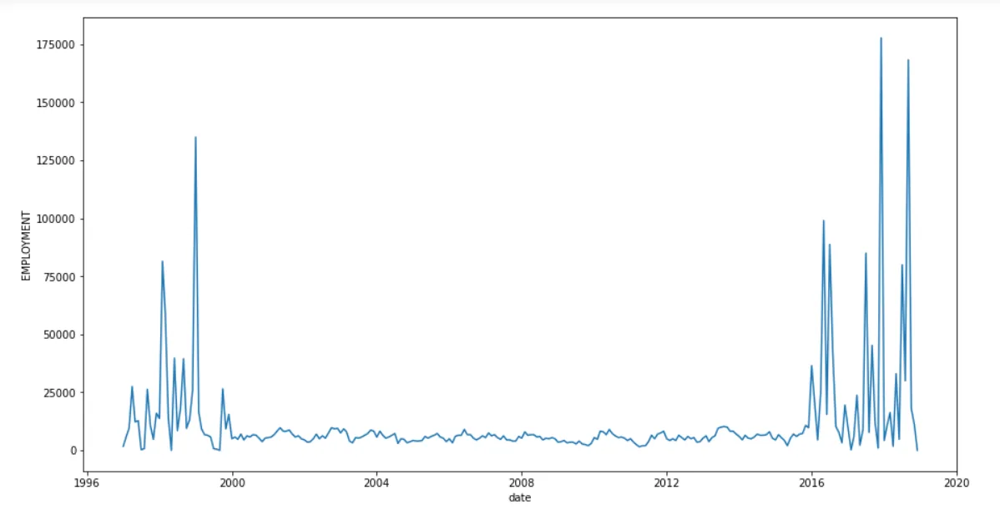

Water transportation was low between 2000-2016 but steady compared to the volatile years prior and after.

Okay, so how do the rest of the industries fair? We will use the following code

```python
# Plot for all industries
grouped_data = data.groupby('LMO_Detailed_Industry').agg(Employment= ('EMPLOYMENT', 'sum'))
grouped_data = pd.DataFrame(grouped_data)
plt.figure(figsize = (25,15))
ax=sns.barplot(x='Employment',y=grouped_data.index,data=grouped_data,orient ='h')
ax.set(xlabel="Total Employment", ylabel = "Industries", title="Employment across industries 1997-2018")
```

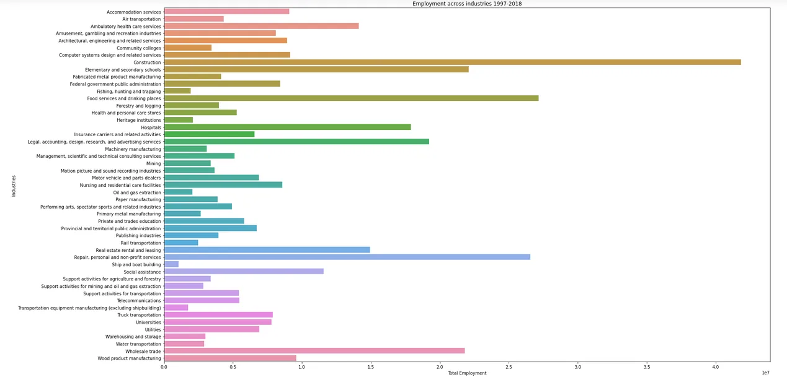

We observe that the construction and the food services industries have high employment numbers as compared to the other industries.

The code to generate the above analysis can be found [here](https://github.com/Matshisela/Time-Series-Analysis-of-NAICS)
