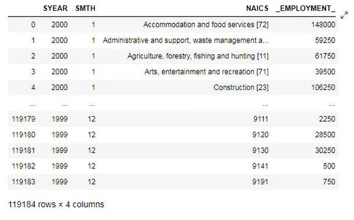
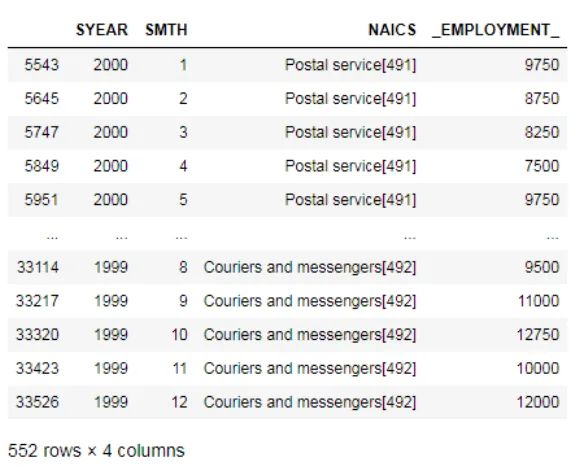
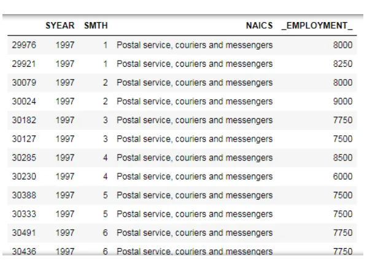
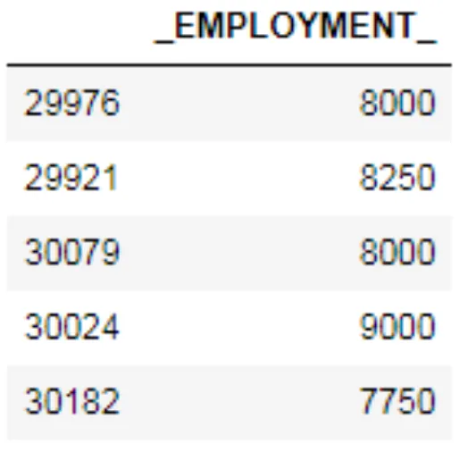
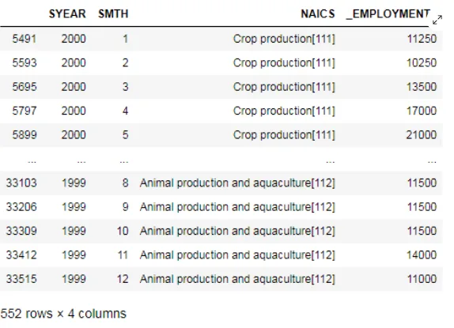
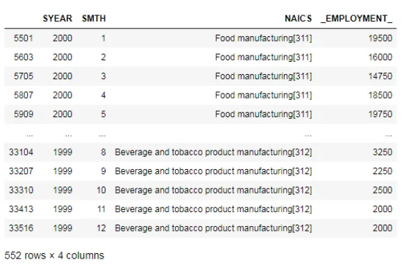
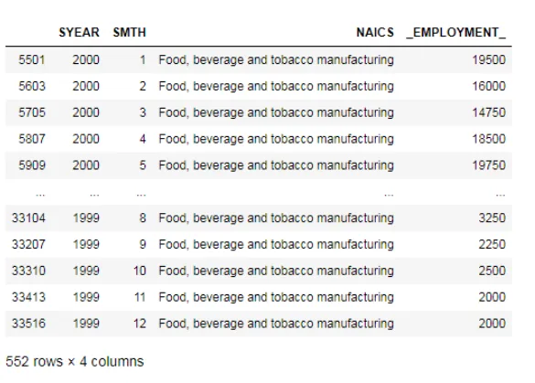
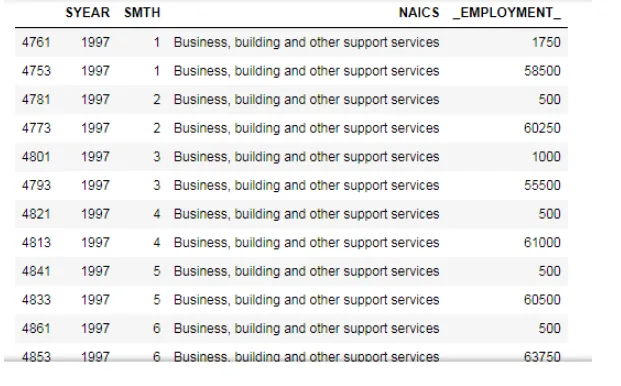
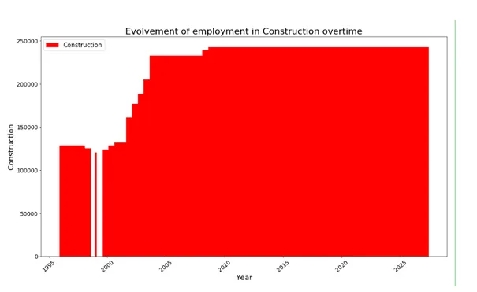

The North American Industry Classification System (NAICS) is an industry classification system developed by the statistical agencies of Canada, Mexico, and the United States. NAICS is designed to provide common definitions of the industrial structure of the three countries and a common statistical framework to facilitate the analysis of the three economies.

Time series analysis is a statistical technique that deals with time-series data, or trend analysis. Time series data means that data is in a series of particular time periods or intervals.

The files from the data set are flat files, Excel (.xlsx), and CSV (.csv) files, we will merge and append data from several files to make a Data Output file. Our first task would be to carry out some data wrangling processes before we can make analysis, ask questions, and gain insights.

**Summary of the data set files we will be using:-**

- 15 RTRA (Real-Time Remote Access) CSV files containing employment data by industry at different levels of aggregation, 2-digit NAICS, 3-digit NAICS, and 4-digit NAICS. *We will search through rows with 2, or 3, or 4 digits NAICS and append employment data each month of each year from 1997 - 2018*

**Meaning of columns in the files:**

- SYEAR: Survey Year

- SMTH: Survey Month

- NAICS: Industry name and associated NAICS code in

the bracket

- _EMPLOYMENT_: Employment

- LMO Detailed Industries by NAICS: An excel file for mapping the RTRA data to the desired data row.

**Columns in the file:**

- Column 1 lists all 59 industries that are used frequently

- Column 2 list the industries NAICS definitions

As part of our data wrangling, we would create a dataset of monthly employment series from 1997 to 2018 for the industries.

One of the guiding principles for our data wrangling is to try to create each series from the highest possible level of aggregation in the raw data files, thus, if an LMO Detailed Industry is defined with a 2-digit NAICS only, we would not use a lower level of aggregation (i.e. 3-digit or 4-digit level NAICS files in the RTRA), similarly, if an LMO Detailed Industry is defined with a 3-digit NAICS only, we would not use the 4-digit NAICS files for that industry.

First we import the necessary libraries to carry out the data analysis.Then import all the 15 csv files.

```python
import pandas as pd
import numpy as np
import glob
import matplotlib.pyplot as plt
import matplotlib.patches as patches
file_path = r'G:\DataScience\Data Insight\NAICS\csv_files' all_csv_files = glob.glob(file_path +'/*.csv')
csv_list =[]for csv_file in all_csv_files:     combined_dataframe = pd.read_csv(csv_file, index_col = None, header =0)
csv_list.append(combined_dataframe)
data = pd.concat(csv_list, axis =0, ignore_index = True) data
```



From the data we will couriers and messengers from postal services which contains 492 and save as Couriers_and_messengers and concat Postal service couriers and messengers.

```python
Couriers_and_messengers = data.loc[data['NAICS'].str.contains('492', na = False)]
Postal_service = data.loc[data['NAICS'].str.contains('491', na = False)]
Postal_service_couriers_and_messengers = pd.concat([Postal_service, Couriers_and_messengers])  Postal_service_couriers_and_messengers
```



After changing all column names to *Postal service, couriers and messengers*, the dataframe is sorted by the **SYEAR and SMTH** columns. Then, the *Employment* column is segregated to add up consecutives even rows to get the sum of empoyments from both [491] and [492]. After that, the dataframe is merged back and the columns names are changed to reflect our *Data Output Template*.

```python
Postal_service_couriers_and_messengers = Postal_service_couriers_and_messengers.replace('Postal service[491]','Postal service, couriers and messengers')      Postal_service_couriers_and_messengers = Postal_service_couriers_and_messengers.replace('Couriers and messengers[492]','Postal service, couriers and messengers')
df1 = Postal_service_couriers_and_messengers.sort_values(['SYEAR','SMTH']) df1.head(50)
```



From df1 we will drop 'SYEAR', 'SMTH', 'NAICS' and save as df.

```python
df = df1.drop(['SYEAR','SMTH','NAICS'], axis =1)
```



Now we add index

```python
df.index = np.arange(1,len(df)+1)
df = df.reset_index()
```

We filter odd and even.

```python
df = df.set_index('index')
df_odd = df.loc[df.index.values %2==1]
df_even = df.loc[df.index.values %2==0]
df_even = df_even.set_index(df_even.index.values -1)
new= df_odd.add(df_even, fill_value =0)
new=new.reset_index().reset_index()
df2 = df1[np.arange(len(df))%2==0] df2 = df2.reset_index().reset_index()
'''We merge df2 and drop the columns level_0, index_x, _EMPLOYMENT__x, index_y from Postal_service_couriers_and_messengers.'''
df3 = pd.merge(df2,new, how ='inner', on ='level_0')
df3=df3.drop(['level_0','index_x','_EMPLOYMENT__x','index_y'], axis =1)
df3.columns=['SYEAR','SMTH','LMO_Detailed_Industry','Employment'] Postal_service_couriers_and_messengers   = df3  Postal_service_couriers_and_messengers = Postal_service_couriers_and_messengers[(Postal_service_couriers_and_messengers.SYEAR!=2019)]
Crop_Production = data.loc[data['NAICS'].str.contains('111', na = False)] Animal_production_and_aquaculture = data.loc[data['NAICS'].str.contains('112', na = False)] Farms = pd.concat([Crop_Production, Animal_production_and_aquaculture])
```



After changing all column names to *Farms*, the dataframe was sorted by the **SYEAR and SMTH** columns. Then, the *Employment* column was segregated to add up consecutives even rows to get the sum of empoyments from both [111] and [112]. After that, the dataframe was merged back and the columns names were changed to reflect *Data Output Template*.

```python
Farms = Farms.replace('Crop production[111]','Farms')
Farms = Farms.replace('Animal production and aquaculture[112]','Farms')
Food_manufacturing = data.loc[data['NAICS'].str.contains('311', na = False)] Beverage_and_tobacco_product_manufacturing = data.loc[data['NAICS'].str.contains('312', na = False)] Food_beverage_and_tobacco_manufacturing = pd.concat([Food_manufacturing, Beverage_and_tobacco_product_manufacturing]) Food_beverage_and_tobacco_manufacturing
```



After changing all column names to *Food, beverage and tobacco manufacturing*, the dataframe was sorted by the **SYEAR and SMTH** columns. Then, the *Employment* column was segregated to add up consecutives even rows to get the sum of empoyments from both [311] and [312].

```python
Food_beverage_and_tobacco_manufacturing = Food_beverage_and_tobacco_manufacturing.replace('Food manufacturing[311]','Food, beverage and tobacco manufacturing') Food_beverage_and_tobacco_manufacturing = Food_beverage_and_tobacco_manufacturing.replace('Beverage and tobacco product manufacturing[312]','Food, beverage and tobacco manufacturing') Food_beverage_and_tobacco_manufacturing
```



The whole process was repeated to obatin the *Business, building and other support services*. After changing all column names to *Business, building and other support services*, the dataframe was sorted by the **SYEAR and SMTH** columns. Then, the *Employment* column was segregated to add up consecutives even rows to get the sum of empoyments from both [55] and [56].

```python
MCE= data[data['NAICS']=='Management of companies and enterprises [55]']MCE.SYEAR.value_counts().sort_values()AWR= data[data['NAICS']=='Administrative and support, waste management and remediation services [56]'] AWR_reduced =AWR[(data['SYEAR']!=2016)&(data['SYEAR']!=2017)&(data['SYEAR']!=2018)&(data['SYEAR']!=2019)] AWR_removed_data =AWR[(data['SYEAR']==2016)|(data['SYEAR']==2017)|(data['SYEAR']==2018)|(data['SYEAR']==2019)]  Business_building_and_other_support_services = pd.concat([MCE, AWR_reduced])
Business_building_and_other_support_services = Business_building_and_other_support_services.replace('Management of companies and enterprises [55]','Business, building and other support services')      Business_building_and_other_support_services = Business_building_and_other_support_services.replace('Administrative and support, waste management and remediation services [56]','Business, building and other support services')      df1 = Business_building_and_other_support_services.sort_values(['SYEAR','SMTH'])
```



Adding removed data and renaming the coulmns

```python
Business_building_and_other_support_services = pd.concat([Business_building_and_other_support_services, AWR_removed_data]) Business_building_and_other_support_services.columns =['SYEAR','SMTH','LMO_Detailed_Industry','Employment']  Business_building_and_other_support_services
```

## Data Visualisation
```python
plt.figure(figsize=(18,10)) plt.bar(Construction['SYEAR'], Construction['Employment'], color ='r')  plt.xlabel('Year', fontsize=18) plt.xticks(rotation=40, fontsize =14) plt.ylabel('Construction', fontsize=18) plt.yticks(fontsize =14) plt.title('Evolvement of employment in Construction overtime', fontsize=22) red = patches.Patch(color='red', label='Construction') plt.legend(handles=[red],
```



prop ={'size':15})
