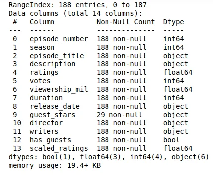

## Introduction

The Office is an American Mockumentary sitcom television series that depicts the everyday lives of office employees in the Scranton, Pennsylvania, branch of the fictional Dunder Mifflin Paper Company. It has been the longest-running, spanning 201 episodes over nine seasons.

In this blog, we are going to investigate and visualize the dataset we are using in this **Data Camp project** and we will learn more coding skills on how to use Python libraries specifically (Pandas and Matplotlib) and how they can be a powerful tool in Data analyzing and vitalizing.

## Dataset

The data is used in this project will be The Office Dataset and it is available on Kaggle [here](https://www.kaggle.com/nehaprabhavalkar/the-office-dataset). The dataset consists of 12 columns and 188 rows scrapped from IMDb. and it’s divided as following below :

- **episode_number:** Canonical episode number.
- **season:** Season in which the episode appeared.
- **episode_title:** Title of the episode.
- **description:** Description of the episode.
- **ratings:** Average IMDB rating.
- **votes:** Number of votes.
- **viewership_mil:** Number of US viewers in millions.
- **duration:** Duration in number of minutes.
- **release_date:** Airdate.
- **guest_stars:** Guest stars in the episode (if any).
- **director:** Director of the episode.
- **writers:** Writers of the episode.
- **has_guests:** True/False column for whether the episode contained guest stars.
- **scaled_ratings:** The ratings scaled from 0 (worst-reviewed) to 1 (best-reviewed).

## Exploring Our Data

First, let's start importing our libraries to read and visualize data to see how our data looks with the following steps in the next code:

```python
import pandas as pd
```

```python
import numpy as np
```

```python
 import matplotlib.pyplot as plt
```

```python
plt.rcParams['figure.figsize'] = [11, 7]

office_df = pd.read_csv('datasets/office_episodes.csv')
office_df.info()
```

this is the output:



here we can see all the sizes and the types of our data in the previous picture.

Second, let's show the Number of guest episodes vs the number of million views as scatter data since figures we will be more able to see how the number of views for each episode.

as in this code here:

```python
fig = plt.figure()

plt.scatter(x=non_guest_df.episode_number, y=non_guest_df.viewership_mil, \
                 # Assign our color list as the colors and set marker and size
                 c=non_guest_df['colors'], s=25)
```

```python
plt.scatter(x=guest_df.episode_number, y=guest_df.viewership_mil, \
                 # Assign our color list as the colors and set marker and size
                 c=guest_df['colors'], marker='*', s=250)
```

the output :


as we see in the figure above the views increased slowly in the first 15 episodes and kept constant growth in the middle of episodes but after episode 100 we can notice it reducing views with each season of the series.

contusion with the end of the TV Show people lost their interest in it due to a large number of episodes.

the code source is [here](https://github.com/tahanijaber/Project-Investigating-Netflix-Movies-and-Guest-Stars-in-The-Office/upload/main).

Reference:

<https://www.kaggle.com/nehaprabhavalkar/the-office-dataset>

<https://projects.datacamp.com/projects/1170>

<https://ourcodingclub.github.io/tutorials/pandas-python-intro/>
