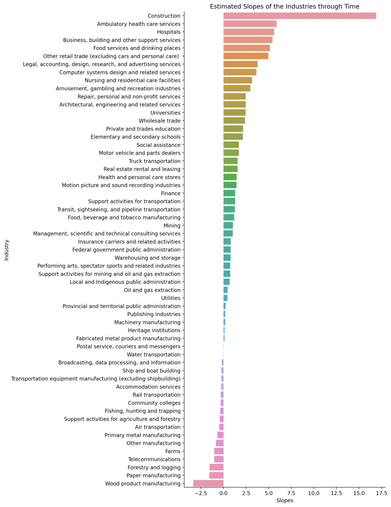
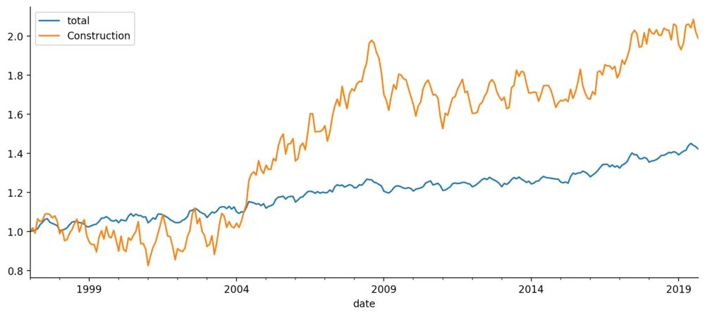
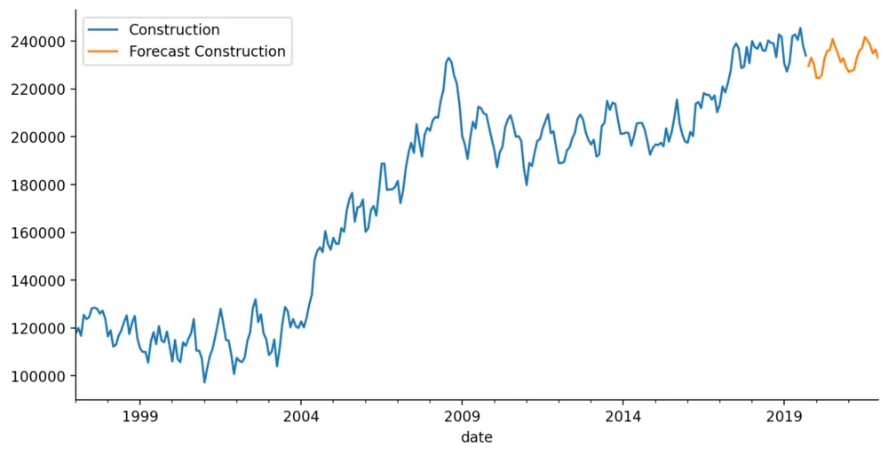
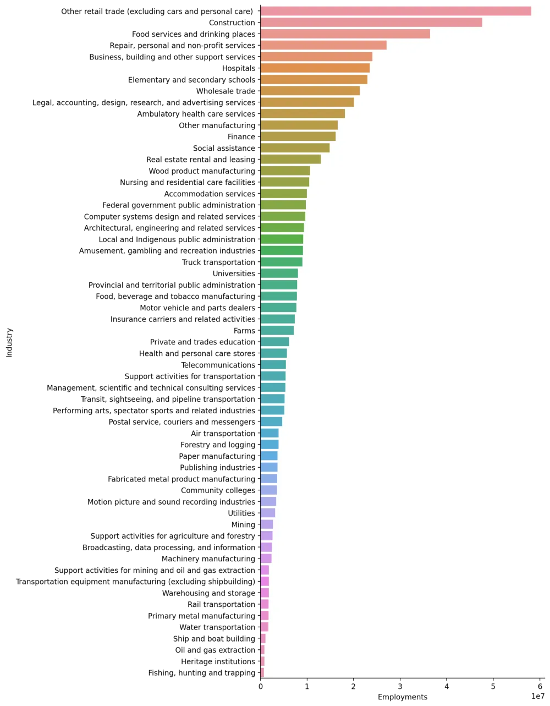
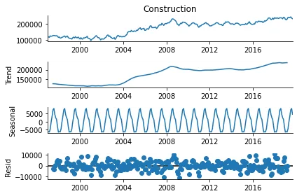
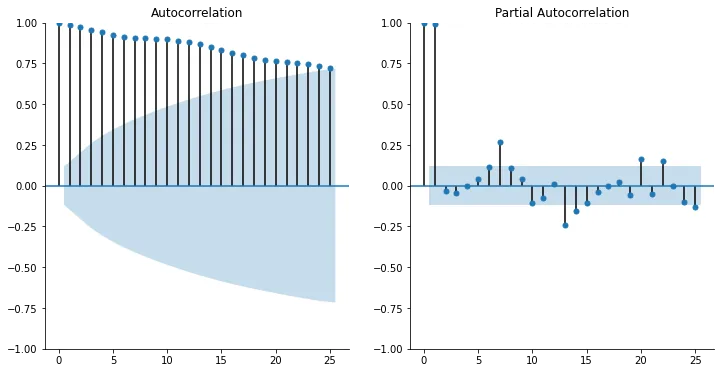
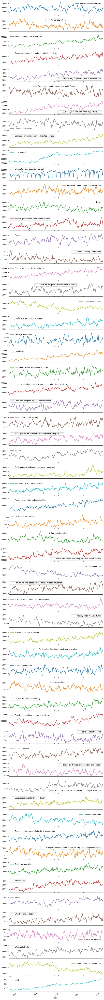

The North American Industry Classification System (NAICS) is an industry classification system developed by the statistical agencies of Canada, Mexico, and the United States. NAICS is designed to provide common definitions of the industrial structure of the three countries and a common statistical framework to facilitate the analysis of the three economies. The dataset contains total employments from January 1997 to September 2019. I made an analysis for the 59 industries and a prediction until December 2021.

Here you can check my [original notebook](https://nbviewer.org/github/thihanaung-thnn/data_insight/blob/main/notebooks/NAICS.ipynb) for complete analysis and forecasting. You can also check [the dashboard](https://naics-employment.herokuapp.com/) for this dataset. There are too many weaknesses in making a dashboard as this is my first dashboard application made by plotly-dash. This blog post will not explain all the steps of my analysis. I will only discuss the key ideas and I hope you are watching my original notebook in a separate window.

### Summary

Approximating the slopes of the total number of employments across the timeline, the highest upward trend is the construction industry.



We can see that construction, ambulatory health care services, hospitals, business, building, and other support services, food and drinking services, retail trade, and advertising services are the highest increasing trends. Wood product manufacturing, paper manufacturing, forestry and logging, telecommunications, and farms are in decreasing trends.

I will put the complete picture of the time series for all industries at the end of the article. It is a long picture, but it is interesting.

After scaling, compared to total industries, the construction industry evolved abruptly started in 2004.



There may be an association between total employment and construction but it is difficult to tell there is an association between total employment and construction by looking at the graph and so, I will use the Granger Causality test to determine. This test shows that we can see the p-values of less than 0.05 starting from lag 2 and above except 4, and 5 and so, there is a relationship between total employment. (I am not sure about this test).

Forecasting the construction industry may be like this.



You can also see the forecasting of the other industries in the dashboard.



This is the total number of employments in all industries from 1997 to 2019. The construction is also the second-highest total employments. This is all about summary. Let’s discuss some coding.

### Importing the data

2-digit data, 3-digit data and 4-digit data contain the same data with different categories. You can see why they contain the same data in my notebook. So, I used only the 4-digit data combining the year and month columns to make the date column. I encoded the industries’ names from LMO Detail Industries file. LMO Detail file contains more than one NAICS code in each row. So, I separated into two, three, and four digits according to each industry name.

```python
industry_dict = {
    'two_digit' : {},
    'three_digit' : {},
    'four_digit' : {}
}
for name, numbers in zip(lookup['LMO_Detailed_Industry'], lookup['NAICS']):
    num_list = numbers.split(',')
    num_list = [x.strip() for x in num_list]
    for i in range(len(num_list)):
        if len(num_list[i]) == 2:
            industry_dict['two_digit'][num_list[i]] = name
        elif len(num_list[i]) == 3:
            industry_dict['three_digit'][num_list[i]] = name
        elif len(num_list[i]) == 4:
            industry_dict['four_digit'][num_list[i]] = name
```

Then, encoded all the codes from the four-digit file. There are also the ‘NaN’ values as code ‘1100’ and ‘2100’ are not contained in the categories and I dropped them as they represent only about 0.1% of the data.

```python
industry_name = []
for code in data_4digit['NAICS']:
    if code[:2] in industry_dict['two_digit'].keys():
        industry_name.append(industry_dict['two_digit'][code[:2]])
    elif code[:3] in industry_dict['three_digit'].keys():
        industry_name.append(industry_dict['three_digit'][code[:3]])
    elif code in industry_dict['four_digit'].keys():
        industry_name.append(industry_dict['four_digit'][code])
    else:
        industry_name.append(np.nan)
```

This is about importing the data.

### Analysis of the Construction Industry

In time series analysis, there are three important terms;

- trend — upward, horizontal/stationary, downward
- seasonality — repeating trends
- cyclical — trends with no set repetition



From the above picture, the trend is the upward trend and there is an annual seasonality. In time series, the term, stationery is important. Stationary means constant mean and constant variance. From the above picture, it is clear to see that there is no stationery. For unclear cases, we can use the Augmented Dickey-Fuller test.

```python
from statsmodels.tsa.stattools import adfuller
```

```python
adfuller(series)
```

For interpretation of the result, you can use the function that I wrote in the notebook (this function is actually from Jose Portilla's lectures).

For other data types, the correlation idea is important. For time-series data, suppose we have time-series data for 10 days (10 numbers). The correlation between data of day 2 to day 10 and data of day 1 to day 9 is the autocorrelation of lag 1. The correlation between data of day 3 to day 10 and data of day 1 to day 8 is the autocorrelation of lag 2 and so on. The partial autocorrelation is more complex. It computes with the residual values. For the construction industry data, the autocorrelation and partial autocorrelation plots can be seen below.



Theoretically, if the autocorrelation plot shows positive autocorrelation at first lag, then it suggests using AR terms in relation to the lag. If the autocorrelation plot shows negative autocorrelation at first lag, it suggests using MA terms. But it is difficult to decide whether to use AR, MA, ARIMA or SARIMA by looking at autocorrelation and partial autocorrelation plots as I am a beginner. So, here, I am searching for the best model by grid search by using `pmdarima` library.

```python
model = pmd.auto_arima(train, seasonal=True, m=12,
 start_p=0, start_q=0, max_p=12, max_q=12, d=1,
 D=1,start_P=0, start_Q=0, max_P=12, max_Q=12, trace=True,
 stepwise=True)
model.summary()
```

According to the pmdarima’s grid search, the best model for total is p=0, d=1, q=0, P=0, D=1, Q=2 and Seasonal=12 with AIC score=5011.

p is the order of the AR term

q is the order of the MA term

d is the number of differencing required to make the time series stationary.

P, D, and Q for seasonal, as here I used the SARIMA model. This is a huge topic and it is difficult to explain in one article. With this model, I got RMSE about 6300. The model is not bad with an error of nearly 6300 employments compared to the average value of 237458. Forecasting the time series data is not an easy task. For me, due to the time constraint and knowledge constraint, I used auto-arima function to forecast all the data. You can check the forecast in the dashboard. Thanks a lot for your time.

Let me know if my concepts are wrong.

Sorry for the wrong dashboard title. I will fix it later.


