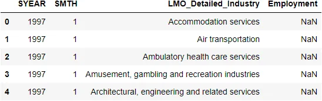
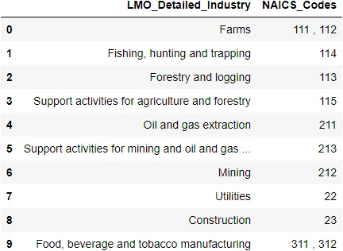
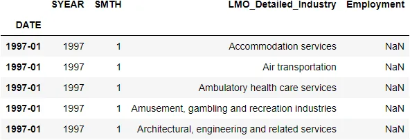
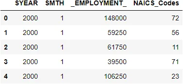
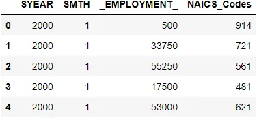
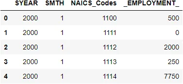
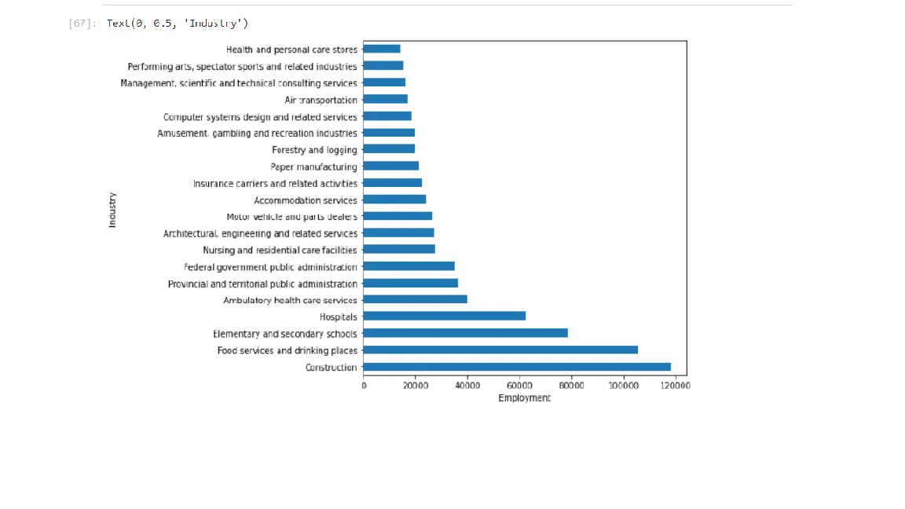
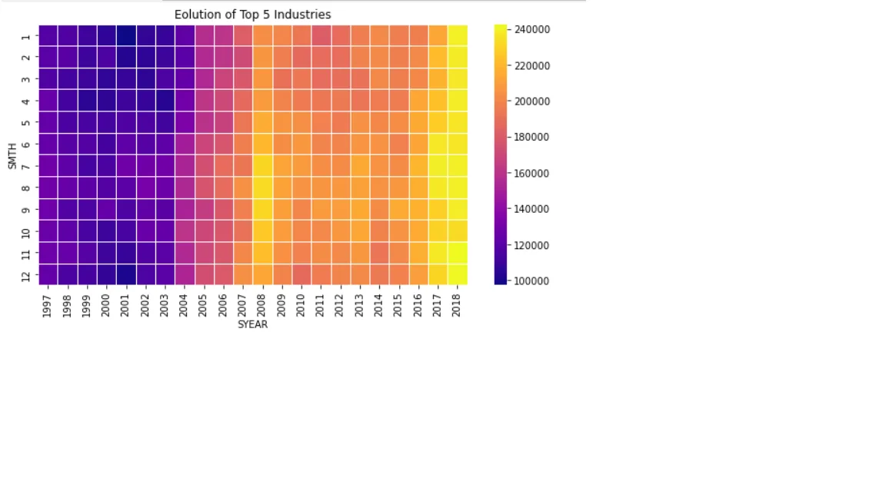

The North American Industry Classification System (NAICS) is an industry classification system developed by the statistical agencies of Canada, Mexico, and the United States. NAICS is designed to provide common definitions of the industrial structure of the three countries and a common statistical framework to facilitate the analysis of the three economies.

The structure of NAICS is hierarchical. The numbering system that has been adopted is a six-digit code, of which the first five digits are used to describe the NAICS levels that will be used by the three countries to produce comparable data. The first two digits designate the sector, the third digit designates the subsector, the fourth digit designates the industry group and the fifth digit designates the industry. The sixth digit is used to designate national industries. A zero as the sixth digit indicates that there is no further national detail. For example (see page 22), a 2-digit NAICS industry (e.g., 23 - Construction) is composed of some 3-digit NAICS industries (236 - Construction of buildings, 237 - Heavy and civil engineering construction, and a few more 3-digit NAICS industries). Similarly, a 3-digit NAICS industry (e.g., 236 - Construction of buildings), is composed of 4-digit NAICS industries (2361 - Residential building construction and 2362 - Non-residential building construction).

In this blog, we take time series data analysis on the Employment data based on the North American Industry Classification System - NAICS . Firstly, we import the data-set, prepare data and clear data. And then we take exploratory data analysis on the previous data-set.

The database file contain -

Raw data: 15 CSV files beginning with RTRA. These files contain employment data by industry at different levels of aggregation; 2-digit NAICS, 3-digit NAICS, and 4-digit NAICS. Columns mean as follows:

(i) SYEAR: Survey Year

(ii) SMTH: Survey Month

(iii) NAICS: Industry name and associated NAICS code in the bracket

(iv) _EMPLOYMENT_: Employment

LMO Detailed Industries by NAICS: An excel file for mapping the RTRA data to the desired data. The first column of this file has a list of 59 industries that are frequently used. The second column has their NAICS definitions.

Data Output Template: An excel file with an empty column for employment

Date Wrangling:

import used libraries

```python
import pandas as pd
import numpy as np
import matplotlib.pyplot as plt
import seaborn as sns
import re
%matplotlib inline
import scipy
```

read output file as csv

```python
df_output = pd.read_csv('Data_Output_Template - Sheet1.csv')
df_output.head(10)
```



Read second file "'LMO_Detailed_Industries_by_NAICS - LMO_Detailed_Industry.csv'"

```python
df_Details = pd.read_csv('LMO_Detailed_Industries_by_NAICS - LMO_Detailed_Industry.csv')
df_Details['NAICS_Codes'] = df_Details.NAICS.astype(str).str.replace('&',',')
df_Details = df_Details.drop(columns = 'NAICS', axis = 1)

df_Details.head(10)
```



create add_data function to help us later

```python
def add_date(df1):
    datetime_str = df1.SYEAR.astype(str) + ' ' + df1.SMTH.astype(str)
    df1['DATE'] = pd.to_datetime(datetime_str).dt.strftime('%Y-%m')
    df1.set_index('DATE', inplace = True)
    return df1
```

```python
df_output = add_date(df_output)
df_output.head()
```



```python
def Clean_Raw_Data(df):
    df['NAICS_Codes'] = df.NAICS\
                        .map(lambda x:x.split('[')[1].strip(']').replace('-', ','))
    df = df.drop(columns = 'NAICS', axis = 1)[df.SYEAR < 2019]
    return df
```

```python
df2 = pd.read_csv('RTRA_Employ_2NAICS_00_05.csv')
#df2
files_2_naics = ['RTRA_Employ_2NAICS_06_10.csv',  'RTRA_Employ_2NAICS_11_15.csv', 'RTRA_Employ_2NAICS_16_20.csv',  'RTRA_Employ_2NAICS_97_99.csv']
for i in files_2_naics:
    df = pd.read_csv(i)
    df2 = df2.append(df, ignore_index=True)
Cleanedd_df2 = Clean_Raw_Data(df2)
Cleanedd_df2 .head()
#df2 = df2[df2.NAICS.map(lambda x: len(re.findall('[0-9][0-9][0-9]', x))>0)]
```



```python
df3 = pd.read_csv('RTRA_Employ_3NAICS_00_05.csv')
df2
files_3_naics = ['RTRA_Employ_3NAICS_06_10.csv',  'RTRA_Employ_3NAICS_11_15.csv', 'RTRA_Employ_3NAICS_16_20.csv',  'RTRA_Employ_3NAICS_97_99.csv']
for i in files_3_naics:
    df3_ = pd.read_csv(i)
    df3 = df3.append(df3_, ignore_index=True)
df3 = df3[df3.NAICS.map(lambda x: len(re.findall('[0-9][0-9][0-9]', x))>0)]

Cleanedd_df3 = Clean_Raw_Data(df3)
Cleanedd_df3.head()
```



```python
df4 = pd.read_csv('RTRA_Employ_4NAICS_00_05.csv')
df4
files_4_naics = ['RTRA_Employ_4NAICS_06_10.csv',  'RTRA_Employ_4NAICS_11_15.csv', 'RTRA_Employ_4NAICS_16_20.csv',  'RTRA_Emply_4NAICS_97_99.csv']
for i in files_4_naics:
    df4_ = pd.read_csv(i)
    df4 = df4.append(df4_, ignore_index=True)
df4.rename(columns = {'NAICS':'NAICS_Codes'},inplace = True)
df4 = df4[df4.SYEAR < 2019]
df4 = df4.astype({'NAICS_Codes':'str'})
df4.head()
```



And now we merge the data frames all together and check our data missing and type,etc

## Exploratory Data Analysis

### What is the top 20 industries?

```python
sumOfEmployeInIndstry = Output_df.groupby('LMO_Detailed_Industry')['EMPLOYMENT'].sum().sort_values(ascending=False);
sumOfEmployeInIndstry2 = sumOfEmployeInIndstry.head(20);

plt.figure(figsize=(7,7));
sumOfEmployeInIndstry2.plot(kind = 'bar');
plt.xlabel('Employment')
plt.ylabel('Industry')
```



### How employment in Construction evolved over time and how this compares to the total employment across all industries?

```python
construction = Output_df[Output_df['LMO_Detailed_Industry'] == 'Construction']
construction_A = pd.crosstab(construction.SMTH, construction.SYEAR, values = construction.EMPLOYMENT, aggfunc = 'sum')

plt.figure(figsize=(10,5))
sns.heatmap(construction_A,  cmap = 'plasma',linewidths = 0.5)
plt.title('Eolution of Top 5 Industries')
construction_A
```



2004 is the center of transformation in employment as before it employment is under 140k and it increase through years to be 240k in 2018

### what is the largest year in number of employeement?

```python
maxAndMinEmp = Output_df['EMPLOYMENT'].agg(['max','min'])

maxv = Output_df['EMPLOYMENT'].max()
maxv
minv = Output_df['EMPLOYMENT'].min()
```

```python
Output_df[Output_df['EMPLOYMENT'] == maxv]
```

Construction industry hase 118000 number of employee in year 1997

Heritage institutions,Oil and gas extraction ,Fishing, hunting and trapping is the minimum in all industries

### What is the average employment for each industry during the years?

```python
fig, ax = plt.subplots(1, 1, figsize=(12,10))
Output_df = Output_df.head(30)
ax.plot(pd.crosstab(Output_df['LMO_Detailed_Industry'], [Output_df['SYEAR']], values = Output_df['EMPLOYMENT'], aggfunc='mean'))

plt.xticks(rotation='vertical')

plt.show()
```

```python
maxAndMinEmp = Output_df['EMPLOYMENT'].agg(['max','min'])
maxAndMinEmp
```

```python
max 118000.0  min      1750.0 Name: EMPLOYMENT, dtype:float64
large number of employee is 118000.0 and min is 1750.0
```

Conclusions :There is a small change in number of employees every year increase and decrease normally

industry of construction is the largest one in number of employees which is up to 120k

and Heritage institutions,Oil and gas extraction ,Fishing, hunting and trapping is the minimum in all industries have small number of employees
