### I consider myself a Data Analyst. The head of my department at my new company has given me the following instructions:

1. Download zipped files A_NEWLY_HIRED_DATA_ANALYST.zip

2. Prepare a data set using the following files:

**a. NAICS 2017 – Statistics Canada:**

Description of the North American Industry Classification System
 (NAICS). All you would need to understand for this task is, how the
 NAICS works as a hierarchical structure for defining industries at
 different levels of aggregation. For example, a 2-digit NAICS industry
 (e.g., 23 - Construction) is composed of some 3-digit NAICS
 industries (236 - Construction of buildings, 237 - Heavy and civil
 engineering construction, and a few more 3-digit NAICS industries).

Similarly, a 3-digit NAICS industry (e.g., 236 - Construction of
 buildings), is composed of 4-digit NAICS industries (2361 -
 Residential building construction and 2362 - Non-residential building
 construction).

**b. Raw data:**

15 CSV files beginning with RTRA. These files contain employment
 data by industry at different levels of aggregation; 2-digit NAICS, 3-
 digit NAICS, and 4-digit NAICS. Columns mean as follows:

(i) SYEAR: Survey Year

(ii) SMTH: Survey Month

(iii) NAICS: Industry name and associated NAICS code in the
 bracket

(iv) _EMPLOYMENT_: Employment

**c. LMO Detailed Industries by NAICS:**

An excel file for mapping the RTRA data to the desired data. The
 first column of this file has a list of 59 industries that are frequently
 used. The second column has their NAICS definitions. Using these
 NAICS definitions and RTRA data, you would create a monthly
 employment data series from 1997 to 2018 for these 59 industries.

**d. Data Output Template:**

An excel file with an empty column for employment. You should fill
 the empty column with the data you prepared from your analysis.

**e. Take note of the following:**

(i) The industry names in the ‘LMO Detailed Industries by NAICS’
 match with the industry names in the ‘Data Output Template’.
 The RTRA data should be used based on the NAICS codes, not
 by industry names.

(ii) Try to create each series from the highest possible level of
 aggregation in the raw data files. For example, if an LMO
 Detailed Industry is defined with a 2-digit NAICS only, do not
 use a lower level of aggregation (i.e., 3-digit or 4-digit level
 NAICS files in the RTRA). Similarly, if an LMO Detailed Industry
 is defined with a 3-digit NAICS only, do not use the 4-digit
 NAICS files for that industry.

(iii) All steps, including merging or appending the data, that would
 generate the requested data should be done using python
 codes.

(iv) The source for the data is: Real-Time Remote Access (RTRA)
 data from the Labour Force Survey (LFS) by Statistics
 Canada.

**3. Highlight at least 5 important questions** that you would like to
 answer in order to provide valuable information to your company so
 that they can make good business decisions. Your questions should
 include how employment in Construction evolved over time and how
 this compares to the total employment across all industries? and at
 least 4 more questions.

### First: fill the empty column in data output file with the data I prepared from my analysis
**We read all RTRA_Employ files**
 *# import pandas*

1. **import** **pandas** **as** **pd**

*# read RTRA_Employ_2NAICS_\* files*

1. rtra_2_97_99 = pd.read_csv('RTRA_Employ_2NAICS_97_99.csv')
2. rtra_2_00_05 = pd.read_csv('RTRA_Employ_2NAICS_00_05.csv')
3. rtra_2_06_10 = pd.read_csv('RTRA_Employ_2NAICS_06_10.csv')
4. rtra_2_11_15 = pd.read_csv('RTRA_Employ_2NAICS_11_15.csv')
5. rtra_2_16_20 = pd.read_csv('RTRA_Employ_2NAICS_16_20.csv')

*# read RTRA_Employ_3NAICS_\* files*

1. rtra_3_97_99 = pd.read_csv('RTRA_Employ_3NAICS_97_99.csv')
2. rtra_3_00_05 = pd.read_csv('RTRA_Employ_3NAICS_00_05.csv')
3. rtra_3_06_10 = pd.read_csv('RTRA_Employ_3NAICS_06_10.csv')
4. rtra_3_11_15 = pd.read_csv('RTRA_Employ_3NAICS_11_15.csv')
5. rtra_3_16_20 = pd.read_csv('RTRA_Employ_3NAICS_16_20.csv')

*# read RTRA_Employ_4NAICS_\* files*

1. rtra_4_97_99 = pd.read_csv('RTRA_Employ_4NAICS_97_99.csv')
2. rtra_4_00_05 = pd.read_csv('RTRA_Employ_4NAICS_00_05.csv')
3. rtra_4_06_10 = pd.read_csv('RTRA_Employ_4NAICS_06_10.csv')
4. rtra_4_11_15 = pd.read_csv('RTRA_Employ_4NAICS_11_15.csv')
5. rtra_4_16_20 = pd.read_csv('RTRA_Employ_4NAICS_16_20.csv')

**appending rtra_2_\* dataframes, rtra_3_\* dataframes, and rtra_4_\* dataframes**

*# appending rtra_2_\* dataframes*

1. rtra_2_all = rtra_2_97_99.append([rtra_2_00_05,
2. rtra_2_06_10,
3. rtra_2_11_15,
4. rtra_2_16_20
5. ])

*# appending rtra_3_\* dataframes*

1. rtra_3_all = rtra_3_97_99.append([rtra_3_00_05,
2. rtra_3_06_10,
3. rtra_3_11_15,
4. rtra_3_16_20
5. ])

*# appending rtra_4_\* dataframes*

1. rtra_4_all = rtra_4_97_99.append([rtra_4_00_05,
2. rtra_4_06_10,
3. rtra_4_11_15,
4. rtra_4_16_20
5. ])

**Explore data frames after appending**

*# explore dataframes by checking their shapes*

1. print(rtra_2_97_99.shape, rtra_2_all.shape,
2. rtra_3_97_99.shape, rtra_3_all.shape,
3. rtra_4_97_99.shape, rtra_4_all.shape)

output:

```python
(720, 4) (5472, 4) (3708, 4) (28140, 4) (11124, 4) (85572, 4)
```

*# explore dataframes by checking their records*

1. rtra_2_all.head(), rtra_3_all.head(), rtra_4_all.head()

output:

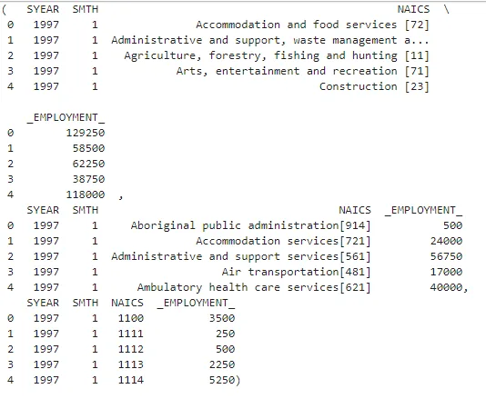

**prepare data in NAICS column in each data frame to append all**

**rtra_\* dataframes**

#### - prepare rtra_2_all:

```python
- extract the code form NAICS column into a new column (naics_code)
```

1. naics_list_2 = rtra_2_all.NAICS.str.replace(']','[').str.split('[')
2. *# naics_list_2_2 = rtra_2_all.NAICS.str.slice(-3, -1)*
3. lst_code_2 = []
5. **for** i **in** naics_list_2:
6. lst_code_2.append(i[1])
8. rtra_2_all['naics_code'] = lst_code_2
9. rtra_2_all.head()

output:

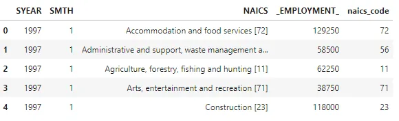

#### - prepare rtra_3_all:

```python
- extract the code form NAICS column into a new column (naics_code)
```

1. naics_list_3 = rtra_3_all.NAICS.str.replace(']','[').str.split('[')
2. lst_code_3 = []
4. **for** i **in** naics_list_3:
5. **if** len(i) == 1:
6. *# for industries that not have code next to them*
7. lst_code_3.append('000')
8. **else**:
9. lst_code_3.append(i[1])
10. rtra_3_all['naics_code'] = lst_code_3
12. rtra_3_all.head()

output:

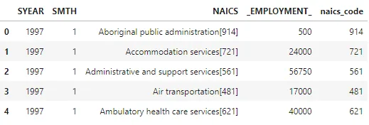

#### - prepare rtra_4_all:

```python
- copy code form NAICS column into a new column (naics_code) just to unified the column name and transfer it to string
```

1. rtra_4_all['naics_code'] = rtra_4_all['NAICS']
2. rtra_4_all['naics_code'] = rtra_4_all['naics_code'].astype(str)
3. rtra_4_all.head()

output:

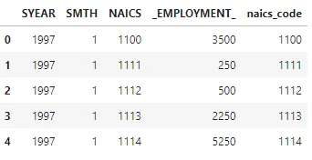

**Append all rtra_\* dataframes into one dataframe**

1. rtra_all = rtra_2_all.append([rtra_3_all, rtra_4_all])
2. rtra_all.head()

output:

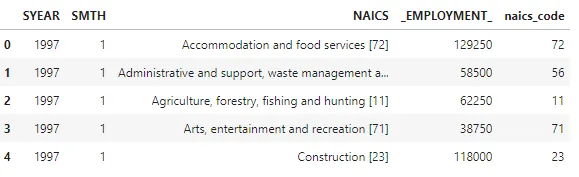

**read the LMO_Detailied_Industries_by_NAICS excel file into dataframe**

1. lmo = pd.read_excel('LMO_Detailed_Industries_by_NAICS.xlsx')
2. lmo.head()

ouput:

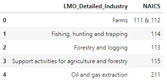

**Prepare NAICS column to use it with rtra_all dataframe to get information**

1. lmo['naics_code'] = lmo.NAICS.replace('&|,', ' ', regex=**True**)
2. lmo.head()

ouput:

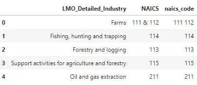

**read Data_Output_Template excel file into dataframe**

1. output_df = pd.read_excel('Data_Output_Template.xlsx')
2. output_df.head()

ouput:

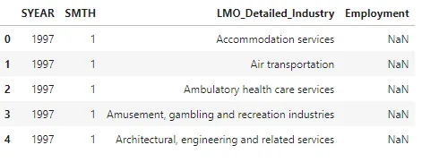

**fill the empty column for employment in output_df dataframe with the data prepared from pervious steps**

1. lst_emp = []
2. **for** index, row **in** output_df.iterrows():
3. current_lmo_row = lmo[lmo['LMO_Detailed_Industry'] == row['LMO_Detailed_Industry']]
4. current_code = str(current_lmo_row['naics_code'].iloc[0]).split()
5. current_month = row['SMTH']
6. current_year = row['SYEAR']
7. current_emp = rtra_all[(rtra_all['naics_code'].isin(current_code)) & (rtra_all['SMTH'] == current_month) & (rtra_all['SYEAR'] == current_year)]['_EMPLOYMENT_'].sum()
8. lst_emp.append(current_emp)
10. output_df['Employment'] = lst_emp
11. output_df.head()

ouput:

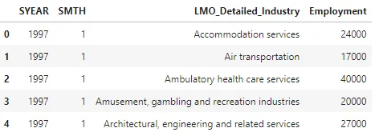

# checking for any null values in the employment column

output_df['Employment'].isna().sum()

output:

0

1. output_df.head()

output:

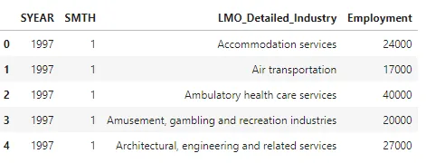

1. *# Save output data frame in excel data file*
2. output_df.to_excel('new_output.xlsx', index=**False**)

**Second: Questions:**

##### 1. how employment in Construction evolved over time and how this compares to the total employment across all industries?

1. output_df.groupby(['LMO_Detailed_Industry']).Employment.agg(['mean', 'max']).sort_values(by='mean', ascending=**False**)

(snippit from output):

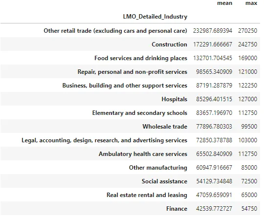

From the above we see that construction is the second maximum average employment industry even if it is not the max employment.

1. const_df = output_df[output_df['LMO_Detailed_Industry'] == 'Construction']
2. const_df.head()

output:

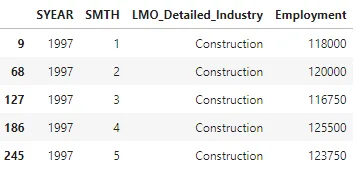

1. other_df = output_df[output_df['LMO_Detailed_Industry'] != 'Construction']
2. other_df.head()

output:

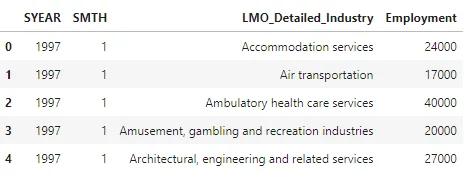

1. **import** **matplotlib.pyplot** **as** **plt**
2. const_df.groupby('SYEAR')['Employment'].mean().plot(x='SYEAR', y='Employment', label='Construction Industry')
3. other_df.groupby('SYEAR')['Employment'].mean().plot(x='SYEAR', y='Employment', label='Other Industries')
4. plt.legend()
5. plt.xlabel('Year')
6. plt.ylabel('Employment')
7. plt.show()

output:

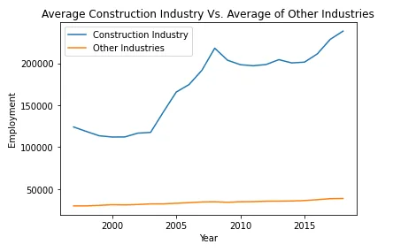

From the above graph, we see a comparison between the average construction industry and the average of all other industries and we see also that construction industry employment is increase over the years.

##### Question 2. What is the industry with maximum** employment **in one month, and what is the industry with the minimum?
1. output_df[output_df['Employment'] == output_df.Employment.max()]

output:

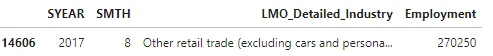

1. output_df[output_df['Employment'] == output_df.Employment.min()]

output:

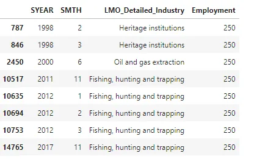

We see that maximum employment is "Other retail trade" in August 2017, and minimum employment is "Fishing hunting and trapping", "Heritage institutions", and "Oil and gas extraction" in February 1998, March 1998, June 2000, November 2011, January/February/March 2012, and November 2017

##### Question 3. What is the average employment for each industry during the years?
1. fig, ax = plt.subplots(1, 1, figsize=(12,10))
2. ax.plot(pd.crosstab(output_df['LMO_Detailed_Industry'], [output_df['SYEAR']], values = output_df['Employment'], aggfunc='mean'))
3. plt.xticks(rotation='vertical')
4. plt.show()

snippit of output:

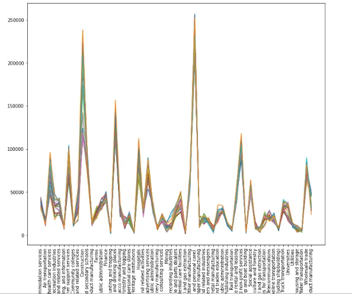

1. pd.crosstab(output_df['LMO_Detailed_Industry'], [output_df['SYEAR']], values = output_df['Employment'], aggfunc='mean')

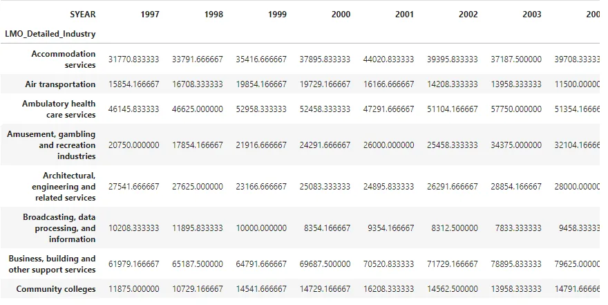

We see above the average of each industry employment ordered by the average descendingly. That shows us that the average employment is almost changed by a constant ratio or in the same range over years in the same industry. In other words, each industry has a range of employment increases or decreases in a limited range.

##### Question 4. What is the year in maximum employment, and the year in minimum?
1. output_df.groupby('SYEAR').Employment.sum().plot()
2. plt.xlabel('Year')
3. plt.ylabel('Employment')

output:

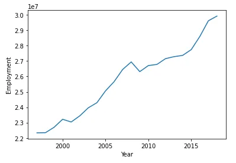

As we see above, overall employment increased over years.

1. output_df.groupby('SYEAR').Employment.sum().sort_values(ascending=**False**)

output:

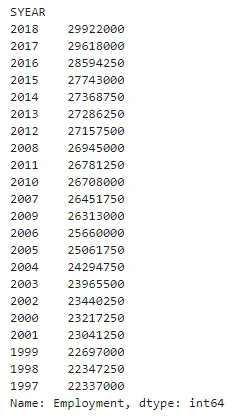

We see above, the ordered list of years from maximum employment to minimum employment in general.

##### Question 5. What is the current status of employment (**the **year 2018)
1. output_2018_df = output_df[output_df['SYEAR'] == 2018]
2. fig, ax = plt.subplots(1, 1, figsize=(15,5))
3. ax.plot(pd.crosstab(output_2018_df['LMO_Detailed_Industry'], [output_2018_df['SYEAR']],
4. values = output_2018_df['Employment'], aggfunc='mean'), label='2018')
5. plt.xticks(rotation='vertical')

8. output_1997_df = output_df[output_df['SYEAR'] == 1997]
10. ax.plot(pd.crosstab(output_1997_df['LMO_Detailed_Industry'], [output_1997_df['SYEAR']],
11. values = output_1997_df['Employment'], aggfunc='mean'), label='1997')
12. plt.xticks(rotation='vertical')
13. plt.legend()
14. plt.show()

output:

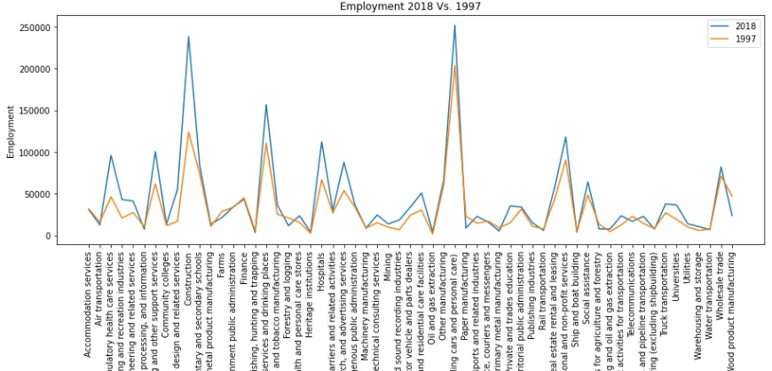

We see that employment in 2018 is increased and I compare it to 1997 which is the first year in our data to show the difference and change to more employment in the current time, and we can also see that the increase is almost in the same ratio, which I mentioned before.
