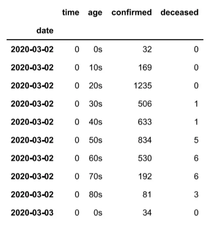
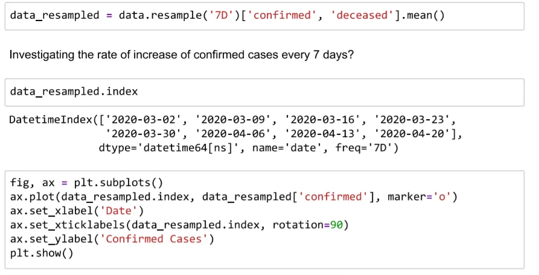
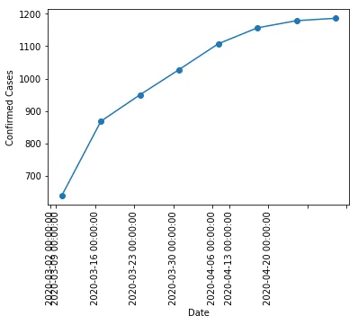
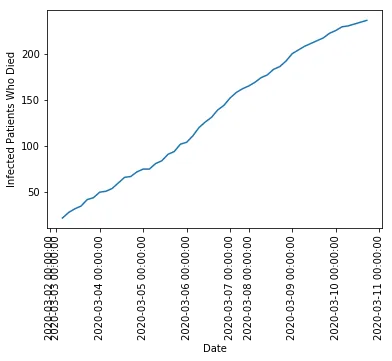
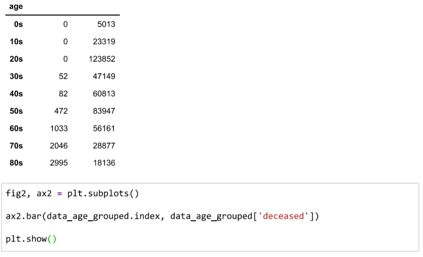
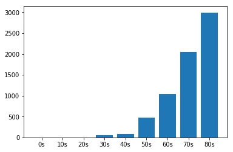

**Source:** Data Science for COVID-19 (DS4C)

The novel COVID-19 virus has been plaguing the entire world since its discovery and wild spread throughout regions and countries in the earth, its effects has been catastrophic, majorly destroying lives, with so many ripple effects including shutting down world economies, wiping out various important population groups of nations responsible for nation-building and development.

SARS-CoV-2 prevalently known as coronavirus is a respiratory virus that is highly contagious, and as confirmed by WHO (World Health Organization) that the virus is airborne, and it proves to be very deadly especially when contracted by the elderly and people with an underlying health condition(s).

The first alert by China to WHO came on December 31, 2019, affirming several cases of unusual pneumonia in Wuhan, a city of 11 million people. Eight days later, on January 7, WHO health officials announced they had identified a new virus. Describing the virus, the novel virus was named 2019-nCoV and was identified as part of the coronavirus family, which included SARS and common cold as symptoms.

Unfortunately, since the beginning of the year, this virus has been ravaging nations, infecting people from almost every country on the earth with almost a quarter of a million lives lost.

In this post, we describe our journey in search of answers and recommendations to the following questions in relation to South Korea:

- The rate of increase in confirmed cases week?

- The rate of fatalities from COVID-19 by the day?

- The most affected age group who were lost to COVID-19?

**Datasets**

**Source**: TimeAge.csv *from* Weather Data for COVID-19 Analysis by Data Science for COVID-19 (DS4C) *from* Kaggle [https://www.kaggle.com/kimjihoo/coronavirusdataset](https://www.kaggle.com/kimjihoo/coronavirusdataset#Weather.csv)

For this analysis, we used the TimeAge.csv file which contains information about confirmed cases and deceased patients in age groups per day.

```python
import pandas as pd
import matplotlib.pyplot as plt
import numpy as np
import seaborn as sns

data = pd.read_csv('TimeAge.csv', index_col='date', parse_dates=True)

data.head()
```



1. **Investigating the rate of increase** in **confirmed cases per week.**

```python
data_resampled = data.resample('7D')['confirmed', 'deceased'].mean()
```

Taking the average of the data resampled into a 7 days interval/frequency to discover the rate of increase of confirmed cases per week starting from the dates 2020-03-02 to 2020-04-20.





The plot clearly shows that new cases were confirmed every new week from 2020-03-02 to 2020-04-20, with the numbers higher than the previous week, therefore it could mean that the spread of the virus was already full-blown among the South Korean populace before it was detected and preventive and control actions were put in place.

2. **Investigating the rate of fatalities by the day between March and April.**

```python
data_deceased_grouped = data.groupby(data.index)['deceased', 'confirmed'].sum()
```

We group the data by dates into columns of deceased and confirmed summing the data for each day from various age groups into one.



The graph indicates an exponential growth in fatalities by the day between March and April 2020, the death rate from COVID-19 increased at an alarming rate.

But we want to know what age group was most affected, this should give us the insight to draw conclusions and hypotheses about the impact of this pandemic on their workforce population.

3. · **Investigating the most affected age group with a higher number of deaths.**

```python
data_age_grouped = data.groupby('age')['deceased', 'confirmed'].sum()
```

We group the data by age into columns of deceased and confirmed summing the data for each day from each date into one.

```python
print(data_age_grouped)
```





The plot shows that infected persons from age 50 and above were the age group who experienced the most fatalities. This is the elderly population of South Korean, and as stated the age group that is more susceptible to the COVID-19 virus are the elderly, this fact is confirmed.

**Conclusion.**

Taking into consideration that the elderly population of South Korea was the most affected age group with the highest number of fatalities, it is now important to discover what the social function by the age distribution of these age groups is in South Korea.

From indexmundi.com ([www.indexmundi.com/south_korea/age_structure.html](http://www.indexmundi.com/south_korea/age_structure.html)) the distribution of the population according to age in South Korea is as follows:

- 0 – 14 years – children

- 15 – 24 years – early working age

- 25 – 54 years – prime working age

- 55 – 64 years – mature working age

- 65 years and over – elderly

It can be clearly seen that the prime and mature working age, as well as the elderly we’re the most affected age group from the COVID-19 pandemic between March and April 2020. It can be concluded that they will require a new workforce population to resuscitate and sustain their dying economy.

**References**

1. Data Science for COVID-19 (DS4C)

2. Indexmundi.com

3. CNN.com
